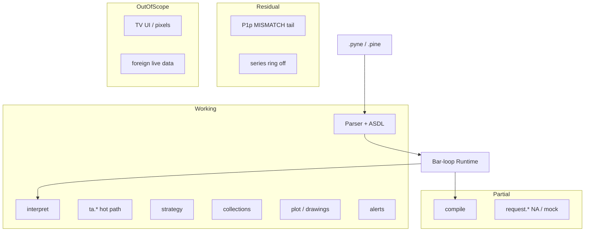

# Compatibility — PYNE grouped map

**hoox-pyne 0.3.17** · import `pynescript` · CLIs `pyne` / `pyne-lsp`

Product page (visual map): [compatibility](https://hoox.sh/pyne/docs/reference/compatibility).

PYNE implements Pine Script™ v5/v6 **language core** (parse → AST → bar-loop). It does **not** claim TradingView® certification, platform identity (chart / proprietary data / editor UI), or bit-identical bars vs the hosted platform.

| Mark | Meaning |
| --- | --- |
| **Working** | Implemented, usable, first-party tests |
| **Partial** | Callable but mock, host-bound, or incomplete vs hosted Pine |
| **Residual** | Known hole on an otherwise landed surface |
| **Out of scope** | Not a TV platform clone |

Dispatch (2026-07-25): **640** callables, **0 missing** vs the public TV v6 function list (434 names). A registered name ≠ hosted semantics.

---

## Implementations

| | **PYNE** | **PyneTS** | **pyne-worker** | **pine-worker** |
|---|---|---|---|---|
| Role | Language SoT | TS / Bun library | Python CF isolate | Legacy TS CF Worker |
| Repo | this repo | [hoox-sh/pynets](https://github.com/hoox-sh/pynets) | [hoox-sh/pyne-worker](https://github.com/hoox-sh/pyne-worker) | [hoox-sh/pine-worker](https://github.com/hoox-sh/pine-worker) |
| In this checkout? | yes | `pynets/` submodule (**v0.2.0** interpret + JS compile) | no | **no** |
| Status | **Working** (oracle) | **Partial** (Python oracle; pin matches npm **0.2.0**) | **Working** (thin wrap; vendor may lag) | **Partial** |

---

## Corpus (set01–04 · 2477 scripts · 2026-08-09)

Not shipped in git. Not a TV platform score.

| Suite | Rate |
| --- | ---: |
| Parse + unparse | **99.96%** (2476 / 2477) |
| Runtime interpret | **100%** excl. EXPECTED_FAIL (2466 OK + 11 listed demos) |
| set01 Runtime | **249 / 249** |

---

## Grouped map

### Working

| Group | What |
| --- | --- |
| **Language** | v5/v6 grammar, round-trip, `var`/`varip`/`:=`, UDTs, enums, libraries, history `[]` → `na` OOB; `timeframe.change` (UTC buckets) |
| **Host** | `pynescript.runtime.Runtime`; series caps on; incremental TA on; derived OHLCV skip; `timeout_seconds` on library/edge/Flask `/run` + `/run/batch` |
| **ta.*** | Incremental MAs, oscillators (incl. `aroon`/`dpo`/`kst`), ATR (Wilder `rma(tr)`), BB, `donchian`, volume `obv`/`wad`/`cmf`/`klinger`/`mfi`/`vwap`/`nvi`/`pvi`; Supertrend mid±factor·ATR locked |
| **Collections** | `array` / `matrix` / `map`; UDT `sort_field` + `binary_search*` |
| **Strategy** | entry/exit/close, OCA, tick `profit`/`loss`, `from_entry`, `qty_percent`, risk cascade, F2 pending-fill, OHLC trail |
| **Draw / plot** | plot*/hline/fill/bgcolor/barcolor; line/box/label/table/polyline/linefill; GC; `force_overlay`; compile drawings geometry-only; key sets match interpret |
| **Alerts** | `alert` / `alertcondition` + L2 webhooks |
| **Compile** | Numba + object mode; warm IR cache; `auto` fallback; **0.3.16–0.3.17** UDT/switch/matrix/drawing/round/color-overload residuals |
| **Surfaces** | CLI `pyne` / `pyne-lsp` / `pyne optimize`; Pro `POST /run` + `/run/batch` + `POST /optimize` |

### Partial

| Group | What |
| --- | --- |
| **request.*** | Same-symbol OHLCV/HTF works (`ta.sma`/`ema`/`rsi`/`atr`/`wma`/`rma`); foreign/complex → **`na`** (locked both hosts); footprint/financial mocks |
| **Compile alerts** | Interpret is the alert oracle |
| **Bid/ask** | `na` unless the host supplies them |
| **PyneTS** | Sister TS library; pin **v0.2.0** matches npm. Python Runtime remains the oracle |

### Residual

| Item | ID |
| --- | --- |
| Interp↔compile value MISMATCH tail (corpus leftovers) | P1p |
| `PYNE_SERIES_RING` default off | flagged |

### Out of scope

| Item | Why |
| --- | --- |
| Pixel chart / editor UX | AXIS / editors |
| Foreign live fundamentals | Needs a feed adapter (B1) |
| TV Supertrend band ratchet | Locked mid±factor·ATR; not TV-identical |
| Tick-path trail / broker | OHLC high/low only |
| Bit-identical TV bars | Numerical bounds, not bits |
| Parallel bars / vectorize whole scripts | Breaks `var` / fills |
| Licensed broker | In-process model only |

---

## Dual-host (interpret ↔ compile)

Same script + OHLCV; nan-aware allclose on plot series.

- `scripts/compare_interp_compile.py`
- `tests/test_interp_compile_parity.py`

Foreign/complex security → `na`. First-party hline/fill/bgcolor/plotshape keys match; harness `--ignore-hline-keys` / `--ignore-fill-keys` remain optional CLI.

---

## See also

- Product map: `docs/pyne/reference/compatibility.mdx`
- Inventory: `docs/pine_v6_full_surface_inventory.md`
- Gaps: `docs/missing_features.md` · `docs/known_divergences.md`
- Roadmap IDs: `docs/ROADMAP.md`
