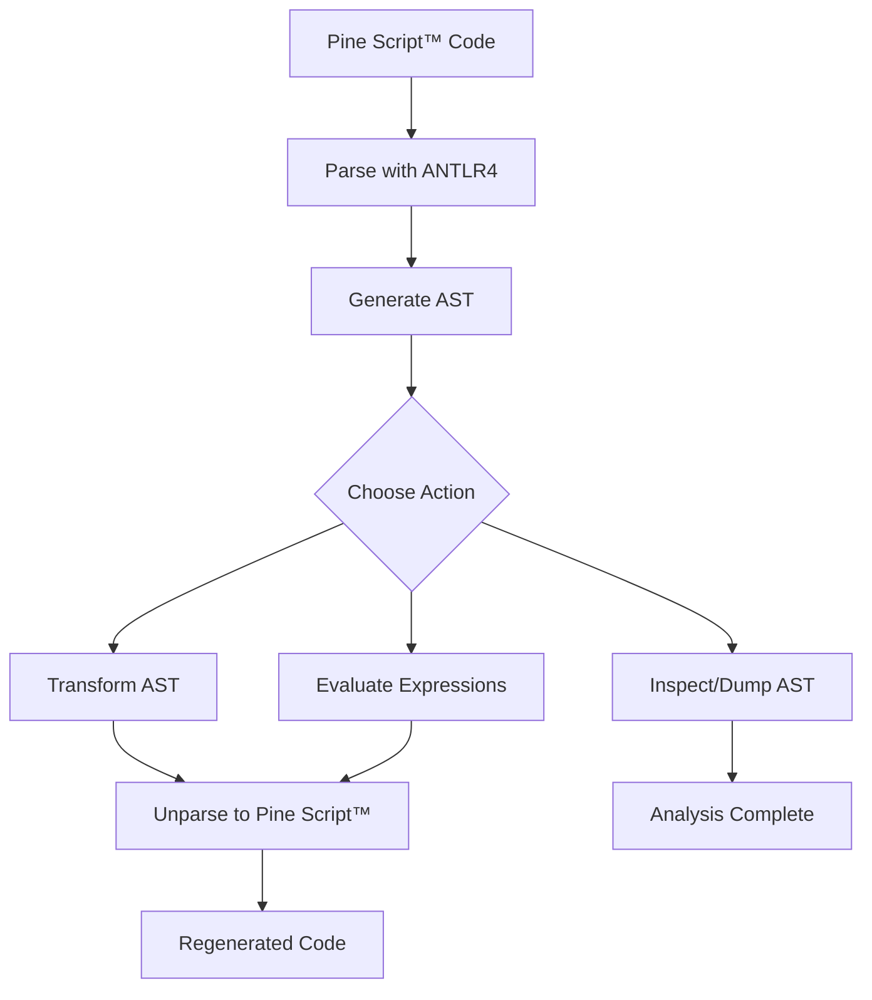

# Pynescript

> Parse, analyse, and regenerate TradingView® Pine Script™ with a modern Python toolchain.

_Pine Script™ and TradingView® are trademarks of TradingView, Inc. This project is an independent effort and is not affiliated with or endorsed by TradingView, Inc._

## Table of Contents

- [Overview](#overview)
- [How It Works](#how-it-works)
- [Features](#features)
- [Installation](#installation)
- [Quickstart](#quickstart)
- [Tool Examples](#tool-examples)
- [CLI Reference](#cli-reference)
- [Library API](#library-api)
- [Project Structure](#project-structure)
- [Documentation](#documentation)
- [Roadmap](#roadmap)

## Overview

Pine Script™ is TradingView®'s powerful scripting language for creating custom indicators, strategies, and alerts directly on charts. It enables traders and analysts to implement complex technical analysis without leaving the platform.

Pynescript brings this power to Python developers by providing a complete toolchain to parse, analyze, transform, and regenerate Pine Script™ code. Whether you're building trading bots, backtesting strategies, or integrating Pine Script™ into your data pipelines, pynescript offers the flexibility and reliability you need.

Built with modern Python practices, pynescript leverages ANTLR4 for robust parsing, delivers a clean AST for manipulation, and ensures round-trip fidelity for seamless integration.

## How It Works

Here's the pynescript workflow in action:



This diagram illustrates the core pipeline: from source code to AST manipulation and back to executable scripts.

## Features

- **🔍 Complete Parsing**: Full support for Pine Script™ v5-v6 grammar with ANTLR4-powered accuracy.
- **📊 224+ Builtin Functions**: Comprehensive implementation of technical analysis, utilities, drawing, and strategy functions.
- **🛠️ AST Manipulation**: Inspect and transform scripts using a rich Python object model.
- **🔄 Round-Trip Fidelity**: Parse and unparse scripts without losing formatting or semantics.
- **💻 CLI Tools**: Command-line utilities for parsing, linting, and data fetching.
- **⚡ Evaluation Engine**: Execute deterministic expressions with 1000+ tests (100% pass rate).
- **📝 Linter**: Built-in Pine Script validation with 7+ rules.
- **📓 Jupyter Support**: Magic commands and helpers for notebook workflows.
- **📊 Data Providers**: Yahoo Finance, Alpha Vantage, CCXT (100+ crypto exchanges).
- **🔧 Extensible Architecture**: Visitor patterns for custom analysis and transformation.
- **🧪 Battle-Tested**: Regression tests against TradingView®'s built-in scripts ensure reliability.
- **🚀 Modern Tooling**: Hatch for environments, Ruff for linting, pytest for testing.

## Installation

Install pynescript from your private repository or source:

```bash
pip install .
```

For development, clone the repo and use Hatch:

```bash
git clone <repository-url>
cd pynescript
pip install -e .
```

## Quickstart

Get started in minutes:

```python
from pynescript.ast.helper import parse, unparse

script = """
//@version=5
indicator("My RSI")
rsi(close, 14)
"""

tree = parse(script)
regenerated = unparse(tree)
print(regenerated)
```

## Tool Examples

### Parsing and Dumping AST

Parse a Pine Script™ file and inspect its AST:

```bash
pynescript parse-and-dump examples/rsi_strategy.pine
```

Output:

```python
Script(
  version=Version(major=5, minor=None),
  statements=[
    Annotation(name='version', value='5'),
    Statement(
      expr=Call(
        func=Name(id='indicator'),
        args=[String(value='My RSI')]
      )
    ),
    Statement(
      expr=Call(
        func=Name(id='rsi'),
        args=[Name(id='close'), Number(value=14)]
      )
    )
  ]
)
```

### Round-Trip Unparsing

Normalize script formatting:

```bash
pynescript parse-and-unparse messy_script.pine > clean_script.pine
```

### Evaluating Expressions

Compute literal values and built-ins:

```python
from pynescript.ast.helper import literal_eval

result = literal_eval("1 + 2 * 3")
print(result)  # 7

# Technical analysis
prices = [100, 102, 101, 103, 105, 104, 106, 108, 107, 110]
rsi = literal_eval(f"ta.rsi({prices}, 9)")
print(rsi)  # ~81.25
```

### Transforming Scripts

Use the transformer to modify ASTs:

```python
from pynescript.ast.helper import parse, unparse
from pynescript.ast.transformer import NodeTransformer

class RenameVariables(NodeTransformer):
    def visit_Name(self, node):
        # Rename 'close' to 'price'
        if node.id == 'close':
            node.id = 'price'
        return node

tree = parse("sma = ta.sma(close, 20)")
transformer = RenameVariables()
new_tree = transformer.visit(tree)
print(unparse(new_tree))  # sma = ta.sma(price, 20)
```

### Linting Pine Script

Check scripts for issues:

```bash
pynescript lint my_script.pine
pynescript lint --fail-on warnings my_script.pine
```

### Fetching Market Data

Get OHLCV data from various providers:

```bash
# Mock data for testing
pynescript data AAPL --provider mock

# Yahoo Finance
pynescript data AAPL --provider yahoo --period 6mo

# Crypto (CCXT)
pynescript data BTC/USDT --provider ccxt --exchange binance
```

### Jupyter Integration

Use in Jupyter notebooks:

```python
from pynescript.ext.jupyter import load_ipython_extension, create_sample_data

load_ipython_extension(ipython)

# Then in a cell:
%%pinescript
//@version=5
indicator("SMA")
plot(ta.sma(close, 14))

# Or generate sample data:
data = create_sample_data(100)
```

## CLI Reference

- `parse-and-dump <file>` — Parse and print the AST structure.
- `parse-and-unparse <file>` — Round-trip and output normalized Pine Script™.
- `lint <file>` — Lint Pine Script for issues (version, deprecated patterns, naming, style).
- `lint --fail-on warnings` — Fail on warnings.
- `data <symbol>` — Fetch market data (use `--provider` for source).
- `download-builtin-scripts [--script-dir DIR]` — Fetch TradingView® built-ins for testing.

## Library API

Core functions in `pynescript.ast.helper`:

- `parse(text: str) -> Script` — Parse Pine Script™ text into an AST.
- `dump(tree: AST) -> str` — Pretty-print the AST for inspection.
- `unparse(tree: AST) -> str` — Regenerate Pine Script™ from AST.
- `literal_eval(expr: str, context: dict) -> Any` — Evaluate expressions with builtins.

Linter in `pynescript.ast.linter`:

- `lint_script(source: str) -> list[LintWarning]` — Lint Pine Script source.
- `lint_file(filepath: str) -> list[LintWarning]` — Lint a Pine Script file.

Data providers in `pynescript.util.data`:

- `get_provider(name: str, **kwargs) -> DataProvider` — Get provider by name.
- `MockDataProvider` — For testing.
- `YahooFinanceProvider` — Via yfinance.
- `AlphaVantageProvider` — Free API.
- `CCXTProvider` — 100+ crypto exchanges.

For advanced use, explore `evaluator.py`, `transformer.py`, and `visitor.py`.

## Project Structure

```text
examples/          # Sample scripts showcasing library usage
src/pynescript/    # Core modules: parser, AST, evaluator, CLI
  ast/             # ANTLR grammar, ASDL nodes, helpers, linter
  ext/             # Extensions: Jupyter, Pygments, Nautilus Trader
  util/            # Utilities: data providers (Yahoo, CCXT, etc.)
tests/             # Comprehensive test suite with fixtures
docs/              # Documentation and roadmap
```

## Documentation

Dive deeper at internal documentation links.

## Roadmap

- **v1.0**: Full Pine Script™ v5 coverage with evaluator expansion.
- **v1.1**: Transformer recipes and community extensions.
- **v2.0**: Multi-version support and performance optimizations.