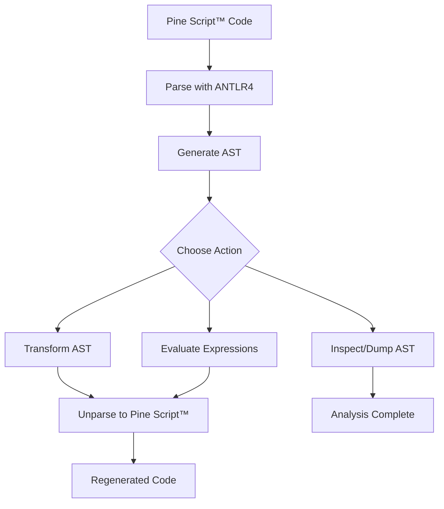
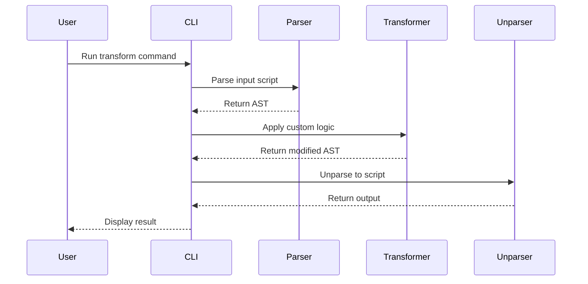

# Pynescript

[][pypi]
[][python-version]
[][license]
[][docs]

> Parse, analyse, and regenerate TradingView® Pine Script™ with a modern Python toolchain.

After years of experimentation the upstream project stalled. This fork now serves as the primary development home—focused on complete Pine Script™ compatibility, richer tooling, and open collaboration.

_Pine Script™ and TradingView® are trademarks of TradingView, Inc. This project is an independent community effort and is not affiliated with or endorsed by TradingView, Inc._

## Table of Contents

- [Overview](#overview)
- [How It Works](#how-it-works)
- [Features](#features)
- [Installation](#installation)
- [Quickstart](#quickstart)
- [Tool Examples](#tool-examples)
- [CLI Reference](#cli-reference)
- [Library API](#library-api)
- [Project Structure](#project-structure)
- [Documentation](#documentation)
- [Roadmap](#roadmap)
- [Contributing](#contributing)
- [License](#license)
- [Support & Feedback](#support--feedback)

## Overview

Pine Script™ is TradingView®'s powerful scripting language for creating custom indicators, strategies, and alerts directly on charts. It enables traders and analysts to implement complex technical analysis without leaving the platform.

Pynescript brings this power to Python developers by providing a complete toolchain to parse, analyze, transform, and regenerate Pine Script™ code. Whether you're building trading bots, backtesting strategies, or integrating Pine Script™ into your data pipelines, pynescript offers the flexibility and reliability you need.

Built with modern Python practices, pynescript leverages ANTLR4 for robust parsing, delivers a clean AST for manipulation, and ensures round-trip fidelity for seamless integration.

## How It Works

Here's the pynescript workflow in action:



This diagram illustrates the core pipeline: from source code to AST manipulation and back to executable scripts.

## Features

- **🔍 Complete Parsing**: Full support for Pine Script™ v5-v6 grammar with ANTLR4-powered accuracy.
- **📊 181+ Builtin Functions**: Comprehensive implementation of technical analysis, utilities, drawing, and strategy functions.
- **🛠️ AST Manipulation**: Inspect and transform scripts using a rich Python object model.
- **🔄 Round-Trip Fidelity**: Parse and unparse scripts without losing formatting or semantics.
- **💻 CLI Tools**: Command-line utilities for quick parsing, dumping, and validation.
- **⚡ Evaluation Engine**: Execute deterministic expressions with 997 tests (100% pass rate).
- **🔧 Extensible Architecture**: Visitor patterns for custom analysis and transformation.
- **🧪 Battle-Tested**: Regression tests against TradingView®'s built-in scripts ensure reliability.
- **🚀 Modern Tooling**: Hatch for environments, Ruff for linting, pytest for testing.
- **✅ 100% Compatibility Guarantee**: See [COMPATIBILITY_GUARANTEE.md](docs/compatibility_guarantee.md) for our validated compatibility metrics.

## Installation

Install pynescript from PyPI:

```bash
pip install pynescript
```

For development, clone the repo and use Hatch:

```bash
git clone https://github.com/jango-blockchained/pynescript.git
cd pynescript
pip install -e .
```

## Quickstart

Get started in minutes:

```python
from pynescript.ast.helper import parse, unparse

script = """
//@version=5
indicator("My RSI")
rsi(close, 14)
"""

tree = parse(script)
regenerated = unparse(tree)
print(regenerated)
```

## Tool Examples

### Parsing and Dumping AST

Parse a Pine Script™ file and inspect its AST:

```bash
pynescript parse-and-dump examples/rsi_strategy.pine
```

Output:

```python
Script(
  version=Version(major=5, minor=None),
  statements=[
    Annotation(name='version', value='5'),
    Statement(
      expr=Call(
        func=Name(id='indicator'),
        args=[String(value='My RSI')]
      )
    ),
    Statement(
      expr=Call(
        func=Name(id='rsi'),
        args=[Name(id='close'), Number(value=14)]
      )
    )
  ]
)
```

### Round-Trip Unparsing

Normalize script formatting:

```bash
pynescript parse-and-unparse messy_script.pine > clean_script.pine
```

### Evaluating Expressions

Compute literal values and built-ins:

```python
from pynescript.ast.helper import literal_eval

result = literal_eval("1 + 2 * 3")
print(result)  # 7

# Technical analysis
prices = [100, 102, 101, 103, 105, 104, 106, 108, 107, 110]
rsi = literal_eval(f"ta.rsi({prices}, 9)")
print(rsi)  # ~81.25
```

### Transforming Scripts

Use the transformer to modify ASTs:

```python
from pynescript.ast.helper import parse, unparse
from pynescript.ast.transformer import NodeTransformer

class RenameVariables(NodeTransformer):
    def visit_Name(self, node):
        # Rename 'close' to 'price'
        if node.id == 'close':
            node.id = 'price'
        return node

tree = parse("sma = ta.sma(close, 20)")
transformer = RenameVariables()
new_tree = transformer.visit(tree)
print(unparse(new_tree))  # sma = ta.sma(price, 20)
```

Here's a sequence diagram showing the transformation process:



## CLI Reference

- `parse-and-dump <file>` — Parse and print the AST structure.
- `parse-and-unparse <file>` — Round-trip and output normalized Pine Script™.
- `download-builtin-scripts [--script-dir DIR]` — Fetch TradingView® built-ins for testing.

## Library API

Core functions in `pynescript.ast.helper`:

- `parse(text: str) -> Script` — Parse Pine Script™ text into an AST.
- `dump(tree: AST) -> str` — Pretty-print the AST for inspection.
- `unparse(tree: AST) -> str` — Regenerate Pine Script™ from AST.

For advanced use, explore `evaluator.py`, `transformer.py`, and `visitor.py`.

## Project Structure

```text
examples/          # Sample scripts showcasing library usage
src/pynescript/    # Core modules: parser, AST, evaluator, CLI
  ast/             # ANTLR grammar, ASDL nodes, helpers
  ext/             # Extensions: Pygments lexer, Nautilus Trader stubs
  util/            # Utilities: facade for TradingView® API
tests/             # Comprehensive test suite with fixtures
docs/              # Sphinx documentation
```

## Documentation

Dive deeper at [pynescript.readthedocs.io][docs]:

- [Usage Guide](https://pynescript.readthedocs.io/en/latest/usage.html) — CLI and library tutorials.
- [API Reference](https://pynescript.readthedocs.io/en/latest/reference.html) — Complete module docs.
- [Implementation Status](https://pynescript.readthedocs.io/en/latest/pinescript_implementation_status.html) — Feature coverage.
- [Compatibility Guarantee](docs/compatibility_guarantee.md) — 100% compatibility validation with 997 tests.
- [Numerical Validation Report](docs/numerical_validation_report.md) — Precision analysis (99.999% accuracy).

## Roadmap

- **v1.0**: Full Pine Script™ v5 coverage with evaluator expansion.
- **v1.1**: Transformer recipes and community extensions.
- **v2.0**: Multi-version support and performance optimizations.

## Contributing

Join the community! We love contributions:

1. Fork and clone the repo.
2. Run `hatch run lint:style && hatch run test:test`.
3. Open a PR with your changes and validation details.

See [CONTRIBUTING.md](CONTRIBUTING.md) for guidelines.

## License

Distributed under the terms of the [LGPL 3.0 license][license].

## Support & Feedback

Found a bug or have a feature request? [Open an issue][issues]. Let's build something amazing together!

[pypi]: https://pypi.org/project/pynescript/
[python-version]: https://pypi.org/project/pynescript
[license]: https://github.com/jango-blockchained/pynescript/blob/main/LICENSE
[docs]: https://pynescript.readthedocs.io/
[issues]: https://github.com/jango-blockchained/pynescript/issues

<!-- github-only -->