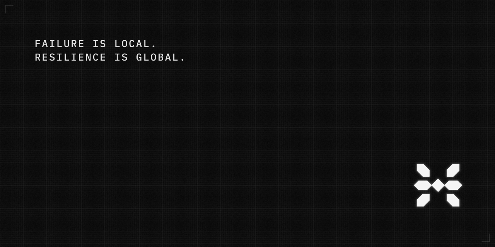

# PYNE

**Independent open toolchain for the Pine Script™ language** — formal grammar, algebraic AST, dual-engine bar-loop runtime, language server, and HTTP evaluation surface. Part of the [HOOX](https://hoox.sh) open trading stack.

**0.3.2** · PyPI [`hoox-pyne`](https://pypi.org/project/hoox-pyne/) · import `pynescript` · CLIs `pyne` · `pyne-lsp` (aliases: `pynescript` · `pynescript-lsp`)

<div align="center">



[](https://www.python.org/)
[](https://pypi.org/project/hoox-pyne/)
[](LICENSE)
[](https://github.com/hoox-sh/pyne/actions/workflows/ci.yml)

**Website:** [hoox.sh/pyne](https://hoox.sh/pyne) · **Docs:** [hoox.sh/pyne/docs](https://hoox.sh/pyne/docs) · **Source:** [github.com/hoox-sh/pyne](https://github.com/hoox-sh/pyne)

</div>

> **Pine Script™** and **TradingView®** are trademarks of [TradingView, Inc.](https://www.tradingview.com/). **Cloudflare®** is a trademark of Cloudflare, Inc.  
> PYNE is an **independent, unofficial** implementation. It is not affiliated with, authorized by, sponsored by, or endorsed by TradingView, Inc. or Cloudflare, Inc., and is not an official TradingView® product, service, or platform substitute.  
> Language references are for interoperability and compatibility documentation only. PYNE does not redistribute proprietary TradingView® platform software, charting UI, or closed data services.

## Abstract

Pine Script™ is commonly executed inside a host charting environment. PYNE models the language as an inspectable pipeline — source text through parse, AST construction, and deterministic bar-loop evaluation — so the same scripts can be analysed and run outside any particular UI.

```text
Source (.pyne / .pine)
  → ANTLR4 lexer / parser
  → ASDL AST
  → bar-loop  (interpret | compile | auto)
  → plots · fills · drawings · strategy events · alerts
  → optional HTTP / edge / editor clients
```

The same pipeline underlies the desk CLI, the Language Server Protocol (LSP) binary, the Pro API, browser Pyodide evaluation (via AXIS), and Cloudflare® Workers that share one evaluate contract.

Coverage and known gaps are documented under [compatibility](https://hoox.sh/pyne/docs/reference/compatibility) and [implementation status](https://hoox.sh/pyne/docs/reference/implementation-status). This repository does **not** ship third-party script corpora or TradingView® builtin downloads.

## Capabilities

### Language front-end

- **Grammar.** Approximate Pine Script™ v5–v6 language surface via ANTLR4 resource grammars.
- **AST.** ASDL-generated nodes with visitor and transformer patterns.
- **Round-trip.** `parse → unparse` with preservation of formatting intent.
- **Linter.** Static checks for common structural and style issues.

### Runtime

- **Bar-loop evaluation.** Deterministic indicator and strategy execution on OHLCV.
- **Dual engine.** Interpret (AST walk) and compile (Numba nopython kernels with object-mode fallback); `mode` ∈ {`auto`, `compile`, `interpret`}.
- **Warm compile.** Disk IR cache, process prewarm, and recovery from corrupt cache state.
- **Plot parity.** Interpret ↔ compile series alignment verified by harness and tests (internal engine consistency, not platform certification).
- **Alerts.** `alert()` / `alertcondition()` with documented frequency semantics (`once_per_bar`, `once_per_bar_close`, `all`); structured export on Pro `/run` and optional L2 webhooks.
- **Strategy surface.** Entries, exits, events, commission/slippage paths, pending-fill behaviour under pyramiding constraints.
- **Drawing GC.** Honour of `max_lines_count`, `max_labels_count`, `max_boxes_count`, `max_polylines_count`.
- **Security policy.** Same-symbol simple OHLCV for `request.security`; foreign or complex security resolves to `na` (no invented foreign closes).

### Surfaces

| Surface | Role |
|---------|------|
| **CLI** (`pynescript`) | Check, format, lint, compile, run, data fetch, prewarm |
| **LSP** (`pyne-lsp`) | Diagnostics, completion (~800+ builtins), hover, navigation, semantic tokens, formatting |
| **VS Code extension** | First-class `.pyne` / `.pine` (and related) associations |
| **Pro API** | HTTP evaluate, batch run, chart preview, quick backtest |
| **Editors** | Configurations for Neovim, Zed, Emacs (see `clients/`) |

## Installation

```bash
pip install hoox-pyne                 # core library + CLI
pip install "hoox-pyne[lsp]"          # language server
pip install "hoox-pyne[compile]"      # Numba compile path
pip install "hoox-pyne[data]"         # market data providers
pip install "hoox-pyne[pro]"          # Flask Pro API stack

# Development install from a clone
pip install -e ".[lsp,pro]"
```

### Container images (GHCR)

Multi-arch (`linux/amd64`, `linux/arm64`) images publish to GitHub Container Registry on `v*` tags (and via Actions → **GHCR** → Run workflow):

```bash
# CLI
docker pull ghcr.io/hoox-sh/pyne/cli:0.3.0
docker run --rm -v "$PWD:/work" -w /work ghcr.io/hoox-sh/pyne/cli:0.3.0 check script.pine

# Pro API
docker pull ghcr.io/hoox-sh/pyne/api:0.3.0
docker run --rm -p 5002:8080 -e ADMIN_TOKEN=… ghcr.io/hoox-sh/pyne/api:0.3.0
```

Packages: [ghcr.io/hoox-sh/pyne](https://github.com/hoox-sh/pyne/pkgs/container/pyne%2Fcli).
## Quickstart

### Parse and unparse

```python
from pynescript.ast.helper import parse, unparse

source = """
//@version=6
indicator("My RSI")
plot(ta.rsi(close, 14))
"""

tree = parse(source)
print(unparse(tree))
```

### Evaluate an expression

```python
from pynescript.ast.helper import literal_eval

literal_eval("1 + 2 * 3")  # 7
literal_eval("ta.rsi([100, 102, 101, 103, 105], 9)")
```

### CLI

```bash
pyne check script.pine
pyne format script.pine -w
pyne lint script.pine
pyne run script.pine --bars 100
pyne compile script.pine --emit
pyne data AAPL --provider yahoo --period 6mo
pyne info
# aliases still work: pynescript check …
```

### Language server

```bash
pip install "hoox-pyne[lsp]"
pyne-lsp
# alias: pynescript-lsp
```

Editor integration: [PYNE for VS Code](./vscode-extension/); Neovim, Zed, and Emacs configs under [`clients/`](./clients/).

## Pro API

Self-hosted (or managed) HTTP surface for script evaluation and previews:

| Endpoint | Description |
|----------|-------------|
| `POST /run` | Execute script (`mode` default `auto`); returns plots, series, events, drawings, **alerts** |
| `POST /run/batch` | Multiple scripts on shared OHLCV |
| `POST /compile/prewarm` | Warm Numba builtins / optional scripts |
| `POST /preview/chart` | Chart thumbnail |
| `POST /preview/indicator` | Indicator chart (SMA, EMA, RSI, MACD, …) |
| `POST /backtest/quick` | Quick backtest with equity curve |

`/run` accepts `mode` ∈ {`auto`, `compile`, `interpret`}, returns structured errors (`error_kind`, `error_type`, `error_bar`), and can forward last-bar alert firings to an optional webhook (`webhook_url` or server `ALERT_WEBHOOK_URL`).

```bash
make run   # :5002

curl -s http://127.0.0.1:5002/run \
  -H 'Content-Type: application/json' \
  -d '{
    "script": "//@version=6\nindicator(\"demo\")\nplot(close)\nalert(close > open, alert.freq_once_per_bar)",
    "data": [{"open":1,"high":2,"low":0.5,"close":1.5,"time":1,"volume":1}],
    "mode": "auto"
  }'
```

Documentation: [POST /run](https://hoox.sh/pyne/docs/api/endpoints/run) · [Alerts](https://hoox.sh/pyne/docs/runtime/alerts) · [API hub](https://hoox.sh/pyne/docs/api)

## Library API (sketch)

```python
from pynescript.ast.helper import parse, unparse, literal_eval
from pynescript.ast.linter import lint_script
from pynescript.ast.transformer import NodeTransformer

tree = parse(source_code)
warnings = lint_script(source_code)
value = literal_eval("ta.sma([100, 102, 101], 3)")

class Renamer(NodeTransformer):
    def visit_Name(self, node):
        if node.id == "close":
            node.id = "price"
        return node
```

## CLI reference

| Command | Purpose |
|---------|---------|
| `check <file>` | Parse-only validation |
| `format <file>` | Format via parse → unparse |
| `lint <file>` | Static analysis |
| `parse-and-dump <file>` | Print AST |
| `parse-and-unparse <file>` | Normalize source |
| `compile <file>` | Numba host pipeline / emit |
| `run <file>` | Execute on synthetic (or provided) OHLCV |
| `prewarm [PATH…]` | Warm compile caches |
| `data <symbol>` | Fetch market data |
| `info` | Version and optional extras |

Language server entry point: **`pyne-lsp`** (alias **`pynescript-lsp`**; separate console script).

## Documentation

Canonical product documentation: **[hoox.sh/pyne/docs](https://hoox.sh/pyne/docs)**

| Topic | Link |
|-------|------|
| Installation · quick start | [Getting started](https://hoox.sh/pyne/docs/enduser/getting-started/installation) |
| Evaluate scripts | [Evaluate guide](https://hoox.sh/pyne/docs/enduser/guides/evaluate-scripts) |
| Alerts & webhooks | [Runtime alerts](https://hoox.sh/pyne/docs/runtime/alerts) |
| Compiler & parity | [Compiler](https://hoox.sh/pyne/docs/runtime/compiler/overview) · [Parity](https://hoox.sh/pyne/docs/runtime/compiler/parity) |
| Pro API | [API](https://hoox.sh/pyne/docs/api) · [Usage](https://hoox.sh/pyne/docs/enduser/guides/pro-api-usage) |
| LSP | [LSP hub](https://hoox.sh/pyne/docs/lsp) · [VS Code](https://hoox.sh/pyne/docs/lsp/vscode-extension) |
| Compatibility | [Compatibility](https://hoox.sh/pyne/docs/reference/compatibility) · [Status](https://hoox.sh/pyne/docs/reference/implementation-status) |

In-repository notes: [Roadmap](./docs/ROADMAP.md) · [Missing features](./docs/missing_features.md) · [Changelog](./CHANGELOG.md)

## Compatibility

PYNE targets practical runtime fidelity verified with first-party fixtures and unit tests. It does **not** claim:

- official TradingView® certification or endorsement  
- complete platform parity (chart host, data model, every edge-case builtin, or closed UI behaviour)  
- that results will match the TradingView® platform on every script or bar  

Prefer the published [compatibility](https://hoox.sh/pyne/docs/reference/compatibility) and [implementation status](https://hoox.sh/pyne/docs/reference/implementation-status) pages for current surface coverage.

Results obtained with PYNE are for research, development, and self-hosted evaluation. They are **not** financial advice and are **not** provided by TradingView, Inc.

## Contributing

See [CONTRIBUTING.md](./CONTRIBUTING.md). Code of conduct: [CODE_OF_CONDUCT.md](./CODE_OF_CONDUCT.md). Security reports: [SECURITY.md](./SECURITY.md).

```bash
make install   # editable install with LSP
make test      # pytest
make lint      # ruff
```

## HOOX Open Trading Stack

**PYNE** is part of the **[HOOX Open Trading Stack](https://hoox.sh)** — three complementary open projects under one product site:

| Product | Role | Repository | Website |
|---------|------|------------|---------|
| **[HOOX](https://hoox.sh)** | Edge trading framework (Cloudflare® Workers) — signal validation and execution at the edge | [hoox-sh/hoox](https://github.com/hoox-sh/hoox) | [hoox.sh](https://hoox.sh) · [docs](https://docs.hoox.sh) |
| **[PYNE](https://hoox.sh/pyne)** | Pine Script™-oriented toolchain, LSP, Pro API, dual-engine runtime (**this repository**) | [hoox-sh/pyne](https://github.com/hoox-sh/pyne) | [hoox.sh/pyne](https://hoox.sh/pyne) · [docs](https://hoox.sh/pyne/docs) |
| **[AXIS](https://hoox.sh/axis)** | Installable charting PWA (Solid + Vite) — optional UI over evaluate contracts | [hoox-sh/axis](https://github.com/hoox-sh/axis) | [hoox.sh/axis](https://hoox.sh/axis) · [docs](https://hoox.sh/axis/docs) |

```text
                    https://hoox.sh
           ┌──────────────┼──────────────┐
           ▼              ▼              ▼
         HOOX            PYNE           AXIS
    (edge execution)  (Pine engine)  (charting UI)
           │              │              │
           └──────────────┴──────────────┘
                    trade signals / eval API
```

**How they relate**

- **PYNE** owns language semantics: parse, evaluate/compile, alerts, strategy events, and the HTTP evaluate surface (`/run`, batch, previews).
- **[AXIS](https://github.com/hoox-sh/axis)** is an optional chart host. It can call PYNE’s Pro API (or edge workers) to plot series, fills, and drawings — evaluation does not require AXIS.
- **[HOOX](https://github.com/hoox-sh/hoox)** is an optional execution mesh. Strategy events and alert webhooks from PYNE can feed edge trade paths; HOOX does not replace the PYNE runtime.

Evaluation never depends on a proprietary chart host. AXIS and HOOX are optional clients of the same open evaluate contract. None of these projects is affiliated with or endorsed by TradingView, Inc.

## License

**SPDX:** `AGPL-3.0-or-later` · **Copyright (C) 2024–2026** jango_blockchained

GNU Affero General Public License v3.0 or later — see [LICENSE](./LICENSE).

🔋 Batteries included.
