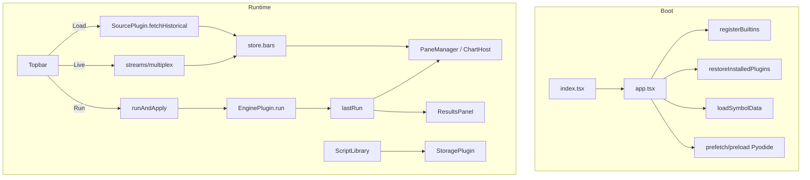

# Architecture overview

## Abstract

AXIS is a **composition host**. The product thesis: own the axes (history, live, calc, library), swap the implementations. Shipping UI is Solid + Vite + lightweight-charts + CodeMirror 6; calculation is never inlined into UI components.

## Conceptual model

## Interface surface (module map)

| Concern | Primary paths |
| --- | --- |
| Entry | `frontend/src/index.tsx`, `app.tsx` |
| State | `frontend/src/store/` |
| Plugins | `frontend/src/plugins/{registry,types,loader,bootstrap,active}.ts` |
| Catalogs | `sources/catalog.ts`, `streams/*`, `engines/catalog.ts`, `storage/*` |
| Chart | `chart/ChartHost.tsx`, `pane-manager.ts`, `drawing-layer.ts` |
| Editor | `editor/*` |
| Run apply | `indicators/runner.ts` |
| Results | `results/*`, `ui/ResultsPanel.tsx` |
| Worker | `frontend/worker/` |

Legacy parallel: `state.js`, `registry.js`, `main.js` — not product path. See repo `frontend/LEGACY.md`.

## Control plane vs data plane

| Plane | What moves | Who owns it |
| --- | --- | --- |
| Control | activePlugins, endpoint, theme, layout | Solid store + localStorage |
| Historical data | Bar arrays | Source plugins → `store.bars` |
| Live data | Bar updates | Stream plugins → multiplex → bars/chart |
| Calculation | script + bars → RunResult | Engine plugins |
| Library | ScriptDocument | Storage plugins |
| Telemetry | plane connectivity / latency / ticks | Ephemeral `store.telemetry` + Connection HUD |

### Transport preference (ADR-014)

| Path | Preferred transport | Notes |
| --- | --- | --- |
| Load (history) | REST / local | Venue kline HTTP, CSV, mock walk |
| Live | **WebSocket** | Venue WSS with reconnect; mock-poll local; DO = brokered |
| Engine server | HTTP | `POST /run` batch; latency in HUD |
| Engine pyodide | Local | Offline-capable after asset cache |

Live pairs with history via `defaultStreamForSource`. Optional `live.preferAfterLoad` auto-starts WS after Load (default **off**).

## Dual engines

| Engine | Transport | Fidelity host |
| --- | --- | --- |
| `server` | HTTP JSON `{ script, data }` → `/run` | Flask or Worker→Flask |
| `pyodide` | In-worker-thread-ish browser Python | Self-hosted wheels + `pynescript_runtime.py` |

Timeout policy in runner scales with bar length (clamped). Live re-runs use shorter silent timeouts.

## Chart apply pipeline

`runAndApply`:

1. `getActiveEngine().run(...)`  
2. `setLastRun`  
3. Optionally open results  
4. **Sync** overlays in place (`syncOverlayLines`) — no blank destroy frame  
5. Markers + strategy report side effects  
6. Atomic Pine script drawings replace  
7. Equity pane when appropriate (skip hide thrash on silent live re-runs)

**History vs live data path:** `loadBars` bumps `chartDataGen` → ChartHost full `setDataToChart` + fit. Live ticks only `manager.appendBar` (never full setData/fitContent).

PaneManager is imperative DOM under a Solid-owned outer shell—**Solid must not reconcile the pane root** (ChartHost invariant).

## Plugin registry

`PluginRegistry` holds ordered maps per kind; events `registered` / `unregistered`. Built-ins register once (`ensureBuiltins` / catalog `ensure*Registered`). Dynamic plugins via `loadPluginFromUrl`. Active selection is **not** inside the registry—it is store state.

Contract namespace conceptually: `pynescript.axis.plugins.v1` (fields: `id`, `name`, `kind`, `configSchema`, `capabilities`, kind-specific methods).

## Edge plane (optional)

Cloudflare project **`pynescript-superchart`**:

- Pages: static `dist/`  
- Worker: `/api/run` proxy, keys/usage KV, scripts D1, stream DO fan-out  
- AXIS still speaks engine/storage plugins—not raw CF APIs in UI components  

## Invariants

1. AXIS ≠ engine  
2. Bars/logs/lastRun not fully persisted  
3. Storage and engine endpoints may coincide (Worker) but remain separate plugin roles  
4. Legacy SuperChart keys migrate forward, never the reverse on write  

## Failure modes (architectural)

| Mode | Manifestation | Mitigation |
| --- | --- | --- |
| God-object UI | Logic in components | Keep runner/registry pure modules |
| Engine leakage | Fetch `/run` from random widgets | Only engine plugins perform calc I/O |
| Registry/store split brain | Flat `engine` ≠ `activePlugins.engine` | `setActivePlugin` keeps alignment |
| SPA asset fallback | Pyodide loads HTML | Assert ZIP magic on assets |

## See also

- [ADRs](/axis/docs/architecture/adrs)
- [Topologies](/axis/docs/architecture/topologies)
- [State namespaces](/axis/docs/architecture/state-namespaces)
- [AXIS store](/axis/docs/ui/store)
