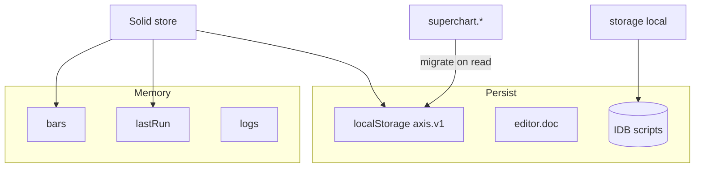

# Copyright (C) 2024-2026 jango_blockchained
#
# This file is part of pynescript.
#
# pynescript is free software: you can redistribute it and/or modify
# it under the terms of the GNU Affero General Public License as published by
# the Free Software Foundation, either version 3 of the License, or
# (at your option) any later version.
#
# pynescript is distributed in the hope that it will be useful,
# but WITHOUT ANY WARRANTY; without even the implied warranty of
# MERCHANTABILITY or FITNESS FOR A PARTICULAR PURPOSE.  See the
# GNU Affero General Public License for more details.
#
# You should have received a copy of the GNU Affero General Public License
# along with pynescript.  If not, see <https://www.gnu.org/licenses/>.
#
# SPDX-License-Identifier: AGPL-3.0-or-later

---
title: "State namespaces"
description: "AXIS persistence keys, SuperChart migration, pluginsConfig, editor docs, library IDB, and URL hash state."
---

# State namespaces

AXIS persistence is multi-homed: **layout/config** in localStorage, **script library** in IndexedDB (or remotes), **ephemeral run data** in memory, optional **URL hash** for shareable slices.

## Abstract

| Namespace | Medium | Purpose |
| --- | --- | --- |
| `pynescript.axis.v1` | localStorage | App shell state |
| `pynescript.axis.editor.doc` | localStorage | Editor document backup |
| `pynescript.axis.storage` | IndexedDB | Local library |
| `pynescript.axis.library.v1` | localStorage fallback | Library if no IDB |
| `pynescript.axis.library.draft` | localStorage | Draft buffer |
| Plugin install list | localStorage | URL plugins restore |
| `store.bars` / `lastRun` / `logs` | memory | Session only |

Contract / product identifiers (not storage keys):

```text
pynescript.axis.plugins.v1   # conceptual plugin contract id
pynescript-superchart        # CF project id (infra)
```

## Conceptual model



## App state key `pynescript.axis.v1`

Solid store (`frontend/src/store/index.ts`):

**Persisted (representative):**

- Market: `symbol`, `interval`, `exchange`, `source`, `engine`, `endpoint`
- `activePlugins` `{ source, stream, engine, storage }`
- `pluginsConfig`
- Layout: `theme`, `editor`, `watchlist`, panel open/width/height
- `panes`, `scripts` (indicator list metadata)
- `live.streamId` (and related live flags carefully)
- `drawings` (user annotations)
- Flat mirrors: `source` / `engine` aligned via `setActivePlugin`

**Explicitly omitted on persist:**

- `bars`
- `lastRun`
- `logs`

Debounced write (~200ms).

### Legacy migration

Read order:

1. `pynescript.axis.v1`
2. else `pynescript.superchart.v2`
3. else `pynescript.superchart.v1`

On legacy hit: copy forward into AXIS key. Editor doc migrates similarly from `pynescript.superchart.editor.doc`.

Legacy vanilla `state.js` uses the same STORAGE_KEY constant for the pre-Solid shell.

## pluginsConfig

Map of configuration objects. Preferred keys:

```text
`${kind}:${id}`   e.g. storage:cloud, storage:git, engine:server
```

Bare ids may still be read for compatibility (`cloud`, `git`). Values feed `configSchema` resolution inside plugins.

**Sensitive fields:** `apiKey`, git `token` — browser-local; treat profile as secret store.

## Editor document

| Key | Role |
| --- | --- |
| `pynescript.axis.editor.doc` | Draft / shared doc |
| Bridge messages | Popout synchronization |

Popout mode uses `editor-bridge` + shared storage so detached windows share source without re-fetching library.

## Local library IDB

| Constant | Value |
| --- | --- |
| DB name | `pynescript.axis.storage` |
| Version | 1 |
| Stores | `scripts`, `kv` |

Migration flags (`pynescript.axis.library.migrated`) prevent re-import loops from SuperChart library keys:

- `pynescript.superchart.library.v1`
- `pynescript.axis.library.legacy`

## Cloud / git (remote namespaces)

Not browser keys—server-side partitions:

| Backend | Partitioning |
| --- | --- |
| cloud | Hash of API key on Worker; D1 table or memory |
| git | `owner/repo@branch` + `basePath` |

Revisions: cloud may expose `revision` / If-Match; git uses blob SHAs via forge APIs.

## URL hash state (legacy helper)

`frontend/src/state-hash.js` (legacy state path):

| Feature | Detail |
| --- | --- |
| Keys | symbol, interval, engine, source, stream, timeRange |
| Script | base64 in hash if short |
| Cap | ~2000 chars |
| API | `applyHashState`, `pushHashState`, `watchHashState` |

Solid-first product may not wire this by default; treat as optional share mechanism. Prefer library export + recipe docs for durable shares.

## Invariants

1. Migration is **read-repair** to AXIS keys.  
2. Never persist full OHLCV in `axis.v1`.  
3. `setActivePlugin` keeps flat fields coherent.  
4. Logs panel open state forced closed on hydrate (noise control).  
5. Drawing tool resets to `cursor` on hydrate; geometries restore.

## Failure modes

| Issue | Effect | Mitigation |
| --- | --- | --- |
| QuotaExceeded | persist no-op | Export library; shrink drawings |
| Poisoned JSON | load defaults | Security tests; clear key |
| Split profiles | “missing” library | Same browser profile |
| Stale activePlugins id | missing plugin | Fall back / reselect built-in |

## Internals

| Path | Role |
| --- | --- |
| `frontend/src/store/index.ts` | Solid persistence |
| `frontend/src/store/types.ts` | `AppState` |
| `frontend/src/state.js` | Legacy state |
| `frontend/src/state-hash.js` | Hash sync |
| `frontend/src/storage/local.ts` | IDB library |
| `frontend/src/plugins/loader.ts` | Installed plugin list |

## See also

- [ADR-011](/axis/docs/architecture/adrs)
- [AXIS store](/axis/docs/ui/store)
- [Script library](/axis/docs/enduser/guides/script-library)
