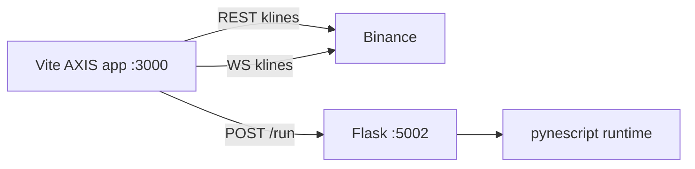
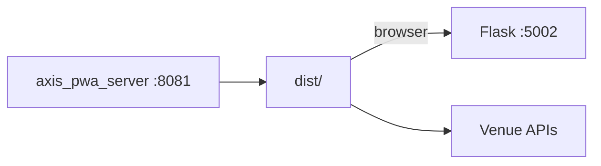
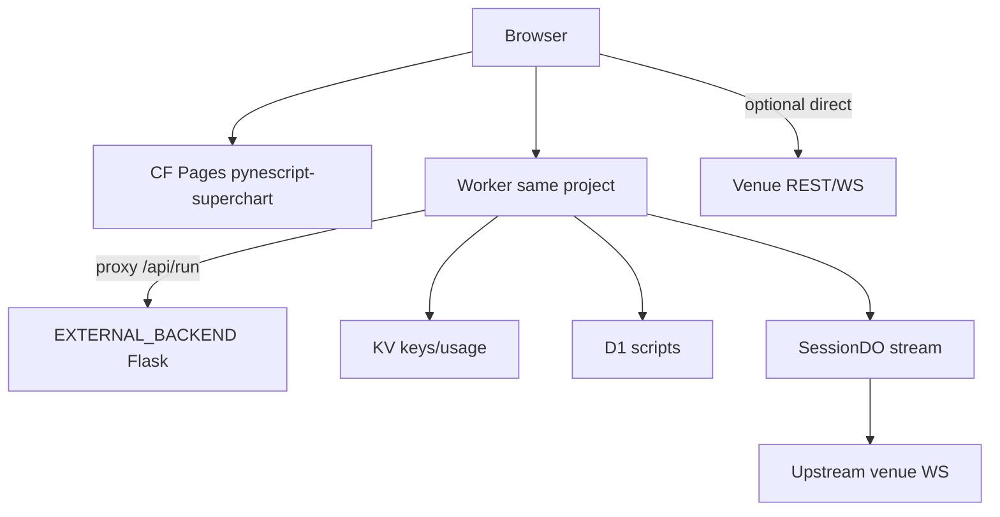
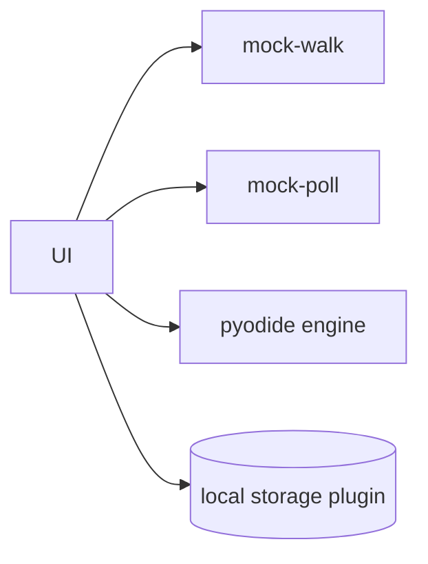

# Copyright (C) 2024-2026 jango_blockchained
#
# This file is part of pynescript.
#
# pynescript is free software: you can redistribute it and/or modify
# it under the terms of the GNU Affero General Public License as published by
# the Free Software Foundation, either version 3 of the License, or
# (at your option) any later version.
#
# pynescript is distributed in the hope that it will be useful,
# but WITHOUT ANY WARRANTY; without even the implied warranty of
# MERCHANTABILITY or FITNESS FOR A PARTICULAR PURPOSE.  See the
# GNU Affero General Public License for more details.
#
# You should have received a copy of the GNU Affero General Public License
# along with pynescript.  If not, see <https://www.gnu.org/licenses/>.
#
# SPDX-License-Identifier: AGPL-3.0-or-later

---
title: "Topologies"
description: "AXIS deploy and dev topologies: Vite+Flask, static PWA, Cloudflare Pages+Worker, and offline Pyodide lab."
---

# Topologies

Concrete process and network shapes for AXIS. Choose a topology; then compose plugins inside it ([recipes](/axis/docs/enduser/getting-started/compose-recipes)).

## Abstract

| Topology | AXIS | Calc | Live | Library |
| --- | --- | --- | --- | --- |
| Dev desk | Vite `:3000` | Flask `:5002` | Binance WS direct | local |
| Static demo | `axis_pwa_server` `:8081` | Flask or remote | venue / mock | local |
| Edge | CF Pages | Worker → Flask | DO fan-out optional | cloud |
| Offline lab | any AXIS | Pyodide | mock-poll | local |

## Topology A — Dev desk



**Bring-up**

```bash
make run
cd frontend && bun install && bun run dev
```

**Notes:** Vite may proxy `/run`; Settings endpoint can still point absolute at `:5002`. CORS must allow Vite origin.

## Topology B — Static PWA + Pro API



```bash
cd frontend && bun run build
python3 axis_pwa_server.py
make run   # separate process
```

**VPS demo pattern:** systemd units for `axis-pwa` and `pynescript-api`; `ALLOWED_ORIGINS` includes AXIS origin.

## Topology C — Cloudflare AXIS at the edge



**Deploy sketch**

```bash
cd frontend/worker && wrangler deploy
cd frontend && bun run build
wrangler pages deploy dist --project-name=pynescript-superchart
```

**Frozen id:** never rename `pynescript-superchart` lightly ([ADR-008](/axis/docs/architecture/adrs)).

AXIS config:

- Engine `server`, endpoint = Worker origin  
- Storage `cloud`, same origin + API key  
- Stream: direct venue or DO-backed plugin  

## Topology D — Offline lab



No Flask, no venue. Requires vendored pyodide + wheels on origin once.

## Topology E — Git-centric research

Any of A–C for calc/data; storage axis = `git`. Forges are orthogonal network peers:

```text
AXIS --storage:git--> api.github.com | gitlab
AXIS --engine:server--> Flask/Worker
AXIS --source--> venue or CSV
```

## Port map (defaults)

| Service | Port |
| --- | --- |
| Vite dev | 3000 |
| Flask Pro API | 5002 |
| Static PWA server | 8081 |
| Wrangler Worker | 8787 |

## Comparison

| Concern | A Dev | B Static | C Edge | D Offline |
| --- | --- | --- | --- | --- |
| HMR | yes | no | no | n/a |
| PWA SW realism | partial | full | full | full |
| Multi-tenant keys | no | no | yes | no |
| Ops complexity | low | medium | high | low |
| Fidelity | high (Flask) | high | high via proxy | engine-dependent |

## Failure modes by topology

| Topology | Typical break |
| --- | --- |
| A | Flask not running; CORS localhost vs 127.0.0.1 mismatch |
| B | Stale SW; missing `dist` pyodide assets |
| C | Unbound KV/D1; wrong project name; EXTERNAL_BACKEND down |
| D | First visit offline; SPA fallback for wheels |

## Internals

| Path | Role |
| --- | --- |
| `frontend/vite.config.ts` | Dev/build |
| `frontend/axis_pwa_server.py` | Static host |
| `frontend/worker/wrangler.toml` | CF name + bindings |
| `frontend/worker/README.md` | Edge ops |

## See also

- [ADR-008, 009, 010, 012](/axis/docs/architecture/adrs)
- [Installation](/axis/docs/enduser/getting-started/installation)
- [Worker](/axis/docs/worker)
- [DevOps](/axis/docs/devops)
