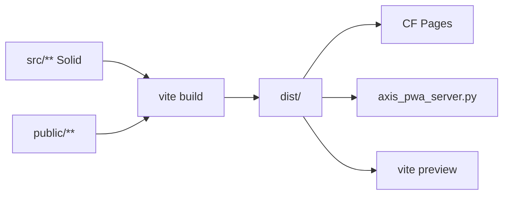

# Build and serve

## Abstract

Production AXIS assets are a **static site** produced by Vite (`bun run build` → `frontend/dist`). Serve them with any static host, Cloudflare Pages, or the repo’s `axis_pwa_server.py` SPA-aware server.

Critical requirement: **real binary assets** for Pyodide (`.wasm`, `.whl`, `.zip`) must not be rewritten to `index.html`.

## Conceptual model



## Interface surface

### package.json scripts

```json
"dev": "vite",
"build": "vite build",
"preview": "vite preview",
"test": "bun test tests/ worker/tests/",
"test:coverage:gate": "bun run test:coverage && bun scripts/check-coverage.mjs 95",
"test:security": "bun test tests/security/",
"test:e2e:smoke": "playwright test --grep @smoke",
"test:all": "bun run test:coverage:gate && bun run test:security"
```

### axis_pwa_server.py

```bash
cd frontend
bun run build
python axis_pwa_server.py
# HOST / PORT env; default 0.0.0.0:8081 → dist/
```

Behavior (`frontend/axis_pwa_server.py`):

| Rule | Detail |
| --- | --- |
| Root | Serves `frontend/dist` |
| Cache | `/assets/*` → `immutable` long cache; else `no-cache` |
| SPA fallback | Unknown paths → `/index.html` |
| **Never rewrite** | `/assets/`, `/plugins/`, `/vendor/`, `/pyodide/`, or extensions including `.js/.css/.whl/.wasm/.zip/.py/.json…` |

This SPA exception list exists because Pyodide + micropip die with opaque `BadZipFile` when HTML is returned for a wheel URL. The engine’s `assertZipAsset` detects that class of failure early.

### Expected public assets

| Path (public → dist) | Purpose |
| --- | --- |
| `/plugins/*.js` | Example dynamic plugins |
| `/vendor/*.whl` | pynescript + antlr wheels |
| `/pyodide/v0.26.2/**` | Self-hosted Pyodide |
| `/pyodide/pynescript_runtime.py` | Browser run bridge |

## Internals

| Path | Role |
| --- | --- |
| `frontend/package.json` | Build scripts |
| `frontend/axis_pwa_server.py` | Threading HTTP SPA server |
| `frontend/src/engines/catalog.ts` | Asset URL expectations |
| `frontend/LEGACY.md` | Product path vs old shell |

### Makefile note

`make pages-deploy` may historically deploy the wrong tree — **prefer**:

```bash
cd frontend && bun run build
wrangler pages deploy dist --project-name=pynescript-superchart
```

## Worked example — static desk demo

```bash
cd frontend
bun install
bun run build
PORT=8081 python axis_pwa_server.py
# another terminal
make run   # Flask :5002
```

Open `http://127.0.0.1:8081`, engine endpoint `http://127.0.0.1:5002`.

## Invariants & edge cases

1. **Service workers / offline** — product path uses Vite PWA assets; legacy root `sw.js` is not the shipping SW.
2. **Relative pyodide index** — resolves against `location.origin`.
3. **Do not hand-edit dist** — regenerate from build.

## Failure modes

| Symptom | Cause |
| --- | --- |
| Blank routes on refresh | Server lacks SPA fallback |
| Pyodide HTML wheel error | Fallback rewriting `.whl` or missing vendor |
| Missing plugins | `public/plugins` not copied (check Vite publicDir) |

## See also

- [Local dev](/axis/docs/devops/local-dev)
- [Cloudflare](/axis/docs/devops/cloudflare)
- [Engines](/axis/docs/plugins/engines)
