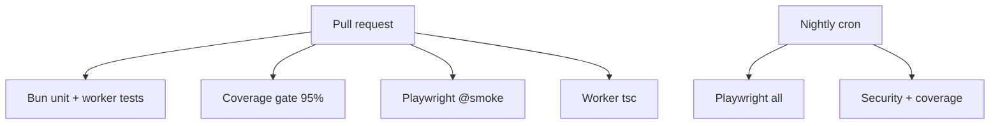

# CI and testing

## Abstract

AXIS quality gates live primarily under `frontend/` (Bun tests) and `frontend/worker/tests/`, orchestrated by GitHub Actions (`.github/workflows/ci.yml`, `axis-nightly.yml`). Deep test conventions are documented in [Testing reference](/axis/docs/reference/testing) and `frontend/TESTING.md`.

## Conceptual model



## Interface surface — local commands

```bash
cd frontend
bun run test                 # tests/ + worker/tests/
bun run test:unit
bun run test:coverage:gate   # lcov + scripts/check-coverage.mjs 95
bun run test:security
bun run test:e2e:smoke
bun run test:e2e:critical
bun run test:e2e
bun run test:all             # gate + security
```

Worker:

```bash
cd frontend/worker
npm run typecheck
```

Repo Makefile:

```bash
make test-frontend
make worker-typecheck
```

## CI workflows

### ci.yml (excerpted jobs)

| Job (names vary) | What |
| --- | --- |
| Frontend tests / coverage | Bun install, coverage, artifact `axis-coverage-lcov` |
| `axis-e2e` | Playwright `@smoke` on PR |
| Worker typecheck | `frontend/worker` tsc |
| Related | Python suite remains for pynescript core |

### axis-nightly.yml

| Job | What |
| --- | --- |
| Playwright full | all e2e specs |
| Security + coverage gate | `test:coverage:gate` + `test:security` |

Schedule: `0 4 * * *` UTC + `workflow_dispatch`.

## Internals

| Path | Role |
| --- | --- |
| `frontend/TESTING.md` | Authoritative testing guide |
| `frontend/scripts/check-coverage.mjs` | Scoped line gate |
| `frontend/playwright.config.ts` | webServer build+preview `:4173` |
| `frontend/e2e/` | Specs with `@smoke` / `@critical` tags |
| `frontend/worker/tests/` | auth, keys, scripts, runtime |
| `.github/workflows/ci.yml` | PR gates |
| `.github/workflows/axis-nightly.yml` | Nightly |

### Coverage policy (summary)

- **Gate:** 95% lines on a **scoped** core (plugins, storage minus idb, store, results, sources, streams, data, selected chart helpers, worker auth/keys/runtime/scripts).
- **Excluded from gate:** heavy chart UI, pyodide boot, legacy JS, Solid `.tsx` surfaces (unit-tested elsewhere or deferred).

### E2E design

- Builds production preview; baseURL `http://127.0.0.1:4173`.
- Mocks `/run` and Binance where possible so smoke does not need live Pro API.
- Selectors use `data-testid` (`axis-btn-load`, `axis-manager`, …).

## Invariants & edge cases

1. **No real network in unit tests** — mock `fetch` / WebSocket.
2. **Import `./setup` first** when touching store/plugins.
3. **CI Bun version** pinned in workflows (e.g. 1.3).
4. **Playwright browsers** installed with `--with-deps` on CI.

## Failure modes

| CI red | Likely |
| --- | --- |
| Coverage gate | New untested code in scoped paths |
| Smoke timeout | Build slow; webServer 180s |
| Worker tsc | Env typing / DO exports |
| Flaky e2e | Missing testid; race without mock |

## See also

- [Testing reference](/axis/docs/reference/testing)
- [Local dev](/axis/docs/devops/local-dev)
