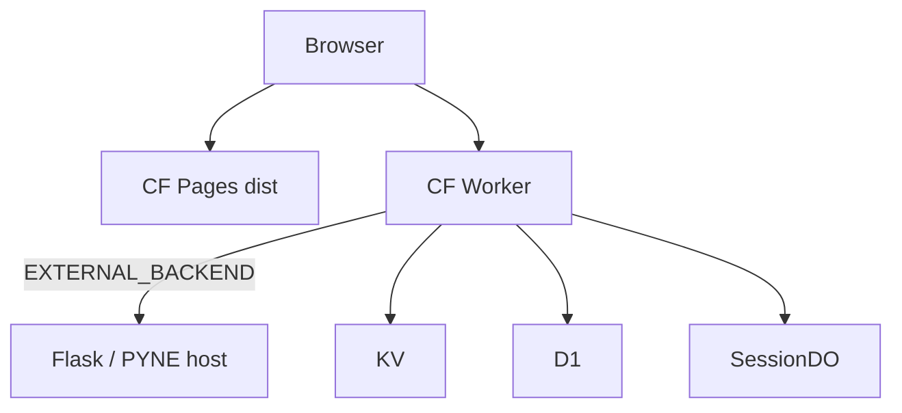

# Copyright (C) 2024-2026 jango_blockchained
#
# This file is part of pynescript.
#
# pynescript is free software: you can redistribute it and/or modify
# it under the terms of the GNU Affero General Public License as published by
# the Free Software Foundation, either version 3 of the License, or
# (at your option) any later version.
#
# pynescript is distributed in the hope that it will be useful,
# but WITHOUT ANY WARRANTY; without even the implied warranty of
# MERCHANTABILITY or FITNESS FOR A PARTICULAR PURPOSE.  See the
# GNU Affero General Public License for more details.
#
# You should have received a copy of the GNU Affero General Public License
# along with pynescript.  If not, see <https://www.gnu.org/licenses/>.
#
# SPDX-License-Identifier: AGPL-3.0-or-later

---
title: "Cloudflare deployment"
description: "Pages + Worker for AXIS: frozen project pynescript-superchart, bindings, deploy order, EXTERNAL_BACKEND reality."
---

# Cloudflare deployment

## Abstract

Production AXIS on Cloudflare is a **split deploy**:

| Piece | Role |
| --- | --- |
| **Pages** | Static PWA (`frontend/dist`) |
| **Worker** | JSON API + WebSocket (`frontend/worker`) |

**Project id:** `pynescript-superchart` — frozen infrastructure name (dashboard, wrangler, CI). Do not rename without a full binding/domain migration.

**Evaluation truth:** Worker `/api/run` **proxies to `EXTERNAL_BACKEND`** unless the gated Pyodide path is fully implemented and enabled. You still need a Python host (VPS Flask, container, etc.) for real Pine fidelity today.

## Conceptual model



## Deploy procedure

### 1. Provision bindings (once)

See [Worker bindings](/axis/docs/worker/bindings):

- KV `API_KEYS`, `USAGE`
- D1 `pynescript` + schema
- Optional R2, Durable Objects

### 2. Configure secrets / vars

Production checklist:

| Setting | Production guidance |
| --- | --- |
| `EXTERNAL_BACKEND` | Public HTTPS URL of Flask/PYNE API |
| `ALLOWED_ORIGIN` | Exact Pages origin (e.g. `https://…pages.dev` or custom) |
| `ADMIN_TOKEN` | Secret, strong |
| `ALLOW_OPEN_KEYS` | `"0"` or unset |
| `PYODIDE_IN_WORKER` | `"disabled"` until wheel pipeline ready |

### 3. Deploy Worker

```bash
cd frontend/worker
npm install
npx wrangler deploy
```

### 4. Build & deploy Pages

```bash
cd frontend
bun install
bun run build
npx wrangler pages deploy dist --project-name=pynescript-superchart
```

Worker package also defines:

```json
"deploy:pages": "wrangler pages deploy ../dist --project-name=pynescript-superchart"
```

### 5. Point the PWA

- Engine endpoint: Worker URL (if path-mapped to `/run`) **or** Flask URL directly
- Cloud storage endpoint: Worker origin
- Ensure CORS allows Pages origin

## Internals

| Path | Role |
| --- | --- |
| `frontend/worker/wrangler.toml` | Worker name + bindings |
| `frontend/worker/README.md` | Ops narrative |
| `frontend/worker/package.json` | deploy scripts |
| Makefile `worker-deploy` / `pages-deploy` | Convenience (verify Pages path) |

### Health check

```bash
curl -sS https://<worker>/health
# service: pynescript-axis-worker
```

## Invariants & edge cases

1. **Pages ≠ Worker host** — CORS required unless same-origin routing via custom domain routes.
2. **Localhost EXTERNAL_BACKEND** is useless from the edge.
3. **DO migrations** apply on deploy when uncommented.
4. **Observability** enabled in wrangler for log tails (`wrangler tail`).

## Failure modes

| Issue | Fix |
| --- | --- |
| 503 NO_BACKEND | Set reachable EXTERNAL_BACKEND |
| CORS blocked | ALLOWED_ORIGIN mismatch |
| SPA HTML for wheels | Pages must serve `/vendor` and `/pyodide` as static files |
| Stream NO_DO | Enable SessionDO bindings |

## See also

- [Worker](/axis/docs/worker)
- [CORS](/axis/docs/devops/cors-and-origins)
- [VPS demo](/axis/docs/devops/vps-demo) (backend co-host)
