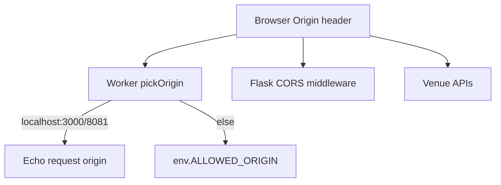

# CORS and origins

## Abstract

AXIS is a browser product that talks to **cross-origin** backends (Flask, Worker, venues). CORS misconfiguration is the #1 local-deploy footgun after missing wheels.

The Worker implements an explicit origin picker; Flask and venue APIs have their own rules.

## Conceptual model



## Worker behavior

From `frontend/worker/src/index.ts`:

**Always echoed (dev allowlist):**

- `http://localhost:8081`
- `http://127.0.0.1:8081`
- `http://localhost:3000`
- `http://127.0.0.1:3000`

**Otherwise:** `env.ALLOWED_ORIGIN` or default `https://pynescript.ai`.

**CORS headers applied:**

```
Access-Control-Allow-Origin: <picked>
Access-Control-Allow-Methods: GET, POST, PUT, DELETE, OPTIONS
Access-Control-Allow-Headers: Content-Type, Authorization, X-Admin-Token, If-Match
Access-Control-Max-Age: 86400
Vary: Origin
```

`OPTIONS` → `204` preflight.

Scripts handler duplicates allow headers for consistency.

### Production implication

If Pages is `https://pynescript-superchart.pages.dev` (example), set:

```
ALLOWED_ORIGIN = "https://pynescript-superchart.pages.dev"
```

or your custom domain. **Exact string match** — no wildcard logic in code.

## Flask / server engine

The **server** engine posts from the browser to the configured endpoint. Flask Pro API must:

1. Answer `OPTIONS` preflight if cross-origin.
2. Reflect or allow the PWA origin.
3. Accept `Content-Type: application/json`.

Same-origin reverse proxy ([VPS demo](/axis/docs/devops/vps-demo)) eliminates CORS for `/run`.

## Venue sources/streams

Public Binance/OKX/etc. REST must send CORS headers usable by browsers. If blocked:

1. Use offline `mock-walk` / `mock-poll`.
2. Add a **same-origin proxy** on Worker/Flask (not a general open proxy — scope carefully).
3. Prefer DO relay only for WS fan-out (WS is not CORS in the XHR sense, but still network-reachable).

## Dynamic plugins

- **Module import** of plugin JS: needs CORS on the **script origin** (same-origin `/plugins/` is safe).
- **fetch inside plugin**: subject to third-party CORS independently.

## Invariants & edge cases

1. **Credentials** — Worker CORS does not set `Allow-Credentials: true`; use Bearer headers, not cookies.
2. **Multiple prod domains** — code picks a single `ALLOWED_ORIGIN`; multi-domain needs code change or edge rewrite.
3. **Vite vs 8081** — both covered for Worker; Flask config must match whichever you use.
4. **Health checks** from curl omit Origin — still work; browser calls need correct ACAO.

## Failure modes

| Browser console | Meaning |
| --- | --- |
| blocked by CORS policy | Origin not allowlisted |
| preflight 404 | Server lacks OPTIONS |
| No ACAO on error body | Some error paths forgot headers (Worker try/catch mostly covered) |

## See also

- [Worker bindings](/axis/docs/worker/bindings)
- [Local dev](/axis/docs/devops/local-dev)
- [Dynamic loader](/axis/docs/plugins/dynamic-loader)
