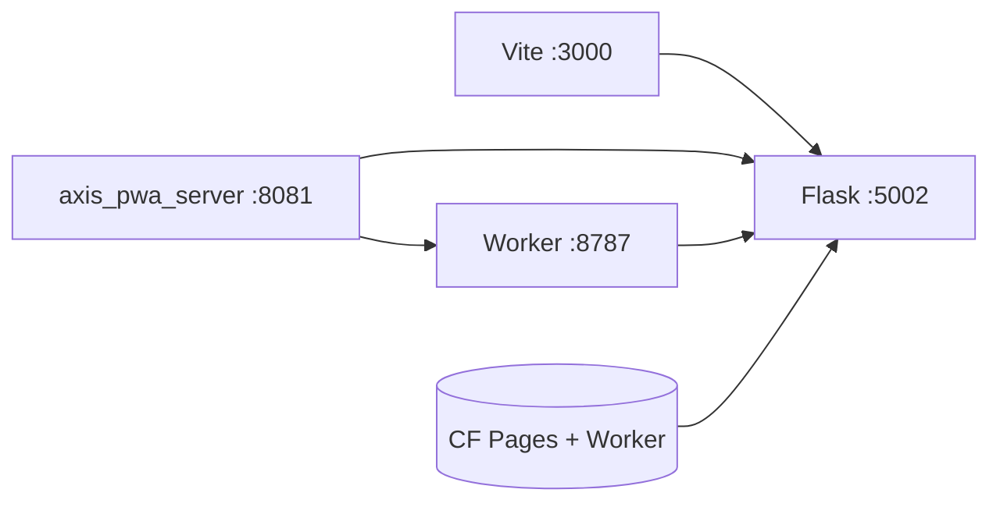

# DevOps

## Abstract

AXIS DevOps spans three runnable surfaces:

1. **Vite + Solid PWA** (`frontend/`) — product UI
2. **Static server** (`axis_pwa_server.py` or Vite preview) — production-like assets
3. **Cloudflare Worker** (`frontend/worker/`) — edge API / WS

Python evaluation for desk workflows still often uses the **Flask Pro API** (`make run` on `:5002`). The Worker proxies there when `EXTERNAL_BACKEND` is set.

## Conceptual model

## Topology cheat sheet

| Mode | Command sketch | Ports |
| --- | --- | --- |
| Dev AXIS | `cd frontend && bun run dev` | Vite (often `:3000`) |
| Dev + Flask | + `make run` | `:5002` |
| Static dist | `bun run build` + `python axis_pwa_server.py` | `:8081` |
| Worker | `cd frontend/worker && npm run dev` | `:8787` |
| CF prod | Pages `pynescript-superchart` + Worker same name family | HTTPS |

## Page map

| Page | Topic |
| --- | --- |
| [Local dev](/axis/docs/devops/local-dev) | Day-to-day loop |
| [Build and serve](/axis/docs/devops/build-and-serve) | Vite build, SPA server, assets |
| [Cloudflare](/axis/docs/devops/cloudflare) | Pages + Worker deploy |
| [VPS demo](/axis/docs/devops/vps-demo) | Single-box static + Flask |
| [CORS and origins](/axis/docs/devops/cors-and-origins) | Allowed origins matrix |
| [CI and testing](/axis/docs/devops/ci-and-testing) | GitHub Actions, coverage, e2e |

## Frozen names

| Surface | Value |
| --- | --- |
| CF project | `pynescript-superchart` |
| Health service | `pynescript-axis-worker` |

## See also

- [Worker](/axis/docs/worker)
- [Testing reference](/axis/docs/reference/testing)
- [AXIS hub](/axis/docs)
