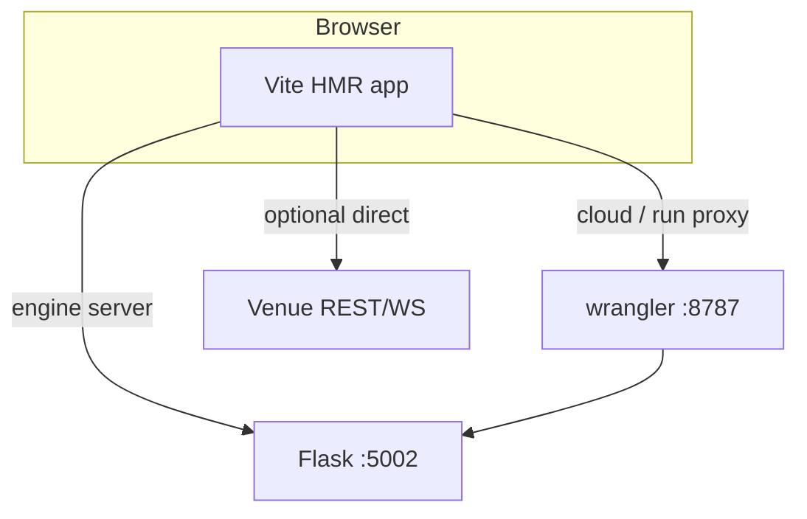

# Copyright (C) 2024-2026 jango_blockchained
#
# This file is part of pynescript.
#
# pynescript is free software: you can redistribute it and/or modify
# it under the terms of the GNU Affero General Public License as published by
# the Free Software Foundation, either version 3 of the License, or
# (at your option) any later version.
#
# pynescript is distributed in the hope that it will be useful,
# but WITHOUT ANY WARRANTY; without even the implied warranty of
# MERCHANTABILITY or FITNESS FOR A PARTICULAR PURPOSE.  See the
# GNU Affero General Public License for more details.
#
# You should have received a copy of the GNU Affero General Public License
# along with pynescript.  If not, see <https://www.gnu.org/licenses/>.
#
# SPDX-License-Identifier: AGPL-3.0-or-later

---
title: "Local development"
description: "Day-to-day AXIS loop: Vite, Flask, Worker wrangler, endpoints, and plugin examples."
---

# Local development

## Abstract

Local AXIS development is a **multi-process** topology. AXIS is a Solid app under Vite; evaluation usually hits Flask; optional cloud/storage/stream features hit the Worker.

## Conceptual model



## Interface surface — commands

### Frontend (preferred product path)

```bash
cd frontend
bun install
bun run dev          # Vite + Solid → typically http://127.0.0.1:3000
```

### Flask Pro API (engine backend)

From repo root:

```bash
make run             # python -m backend.app → :5002
# or hatch / documented backend entry
```

Set PWA endpoint to `http://127.0.0.1:5002` for the **server** engine.

### Worker

```bash
cd frontend/worker
npm install          # or bun
npm run dev          # http://127.0.0.1:8787
```

Point cloud storage / Worker endpoint at `http://127.0.0.1:8787`. For `/api/run` proxy, set Worker `EXTERNAL_BACKEND=http://127.0.0.1:5002` (works on local wrangler; not on CF edge).

### Makefile helpers

| Target | Intent |
| --- | --- |
| `make run-frontend` | Historical Bun static server (`frontend/server.ts`) on `:8081` — **legacy shell path** |
| `make worker-dev` | Wrangler dev |
| `make worker-install` | Install worker deps |
| `make test-frontend` | Bun unit tests under `frontend/tests/` |

For the **Solid** product, prefer `bun run dev` / `bun run build` over the legacy `server.ts` unless you are debugging the old tree ([legacy shell](/axis/docs/reference/legacy-shell)).

## Internals — useful paths

| Path | Role |
| --- | --- |
| `frontend/src/index.tsx` | App entry |
| `frontend/vite.config.*` | Vite / Solid plugin |
| `frontend/src/engines/catalog.ts` | Default engine endpoint |
| `frontend/worker/wrangler.toml` | Local vars |
| `frontend/public/plugins/` | Example modules served at `/plugins/` |

## Worked loop

1. Terminal A: `make run` (Flask).
2. Terminal B: `cd frontend && bun run dev`.
3. Open Vite URL; set engine **Server-Side**, endpoint `http://127.0.0.1:5002`.
4. Load `mock-walk` if venues are blocked.
5. Optional Terminal C: Worker with `ALLOW_OPEN_KEYS=1` for cloud library experiments.

### Load an example plugin

With Vite or static server:

```
http://127.0.0.1:3000/plugins/example-coingecko-source.js
```

Manager → Plugins → Load from URL.

## Invariants & edge cases

1. **CORS** — Flask must allow the Vite origin; Worker `pickOrigin` allows `:3000` and `:8081`.
2. **Pyodide local** — needs vendor wheels under `public/` (copied to dist on build).
3. **Two endpoints** — topbar endpoint for engine vs cloud storage plugin config can differ (Flask vs Worker).
4. **Legacy Makefile message** still mentions SuperChart Lite and `:8081` Bun server.

## Failure modes

| Issue | Fix |
| --- | --- |
| Engine not ready | Flask down / wrong port |
| CORS errors | Align origins; see [CORS](/axis/docs/devops/cors-and-origins) |
| Plugin 404 | File only under `src/plugins/` not `public/plugins/` |
| Worker scripts 401 | Set open keys or mint `pn_` key |

## See also

- [Build and serve](/axis/docs/devops/build-and-serve)
- [Worker local](/axis/docs/worker)
- [Plugin examples](/axis/docs/reference/plugin-examples)
