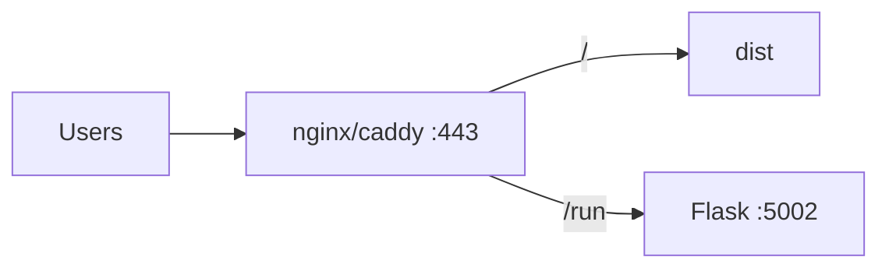

# VPS demo topology

## Abstract

A **VPS demo** is the lowest-surprise production-like setup for Pine evaluation: one machine runs Flask (PYNE) and serves the static AXIS build. Optional nginx/caddy terminates TLS and reverse-proxies `/run` same-origin to avoid CORS.

No Worker required. Cloud storage and DO streams will not work without the Worker.

## Conceptual model



## Interface surface

### Processes

| Process | Command | Port |
| --- | --- | --- |
| Build (CI or once) | `cd frontend && bun run build` | — |
| Static | `PORT=8081 python axis_pwa_server.py` | 8081 |
| API | `make run` / `python -m backend.app` | 5002 |

### Same-origin proxy sketch (Caddy)

```caddy
axis.example.com {
  handle /run* {
    reverse_proxy 127.0.0.1:5002
  }
  handle {
    reverse_proxy 127.0.0.1:8081
  }
}
```

Then PWA endpoint = `https://axis.example.com` and the **server** engine posts to `/run` on the same host.

### Minimal without TLS

- Static `:8081`, Flask `:5002`
- Set endpoint `http://VPS_IP:5002`
- Open firewall; accept CORS from static origin (configure Flask accordingly)

## Internals

| Concern | Notes |
| --- | --- |
| Pyodide offline | Ship full `dist` including `vendor` + `pyodide` |
| Process supervisor | systemd units for flask + axis_pwa_server |
| Updates | Rebuild dist artifact; restart static only |
| Secrets | Flask admin / pro keys separate from Worker |

## Worked example — systemd sketch

```ini
# /etc/systemd/system/axis-pwa.service
[Service]
WorkingDirectory=/opt/axis/frontend
Environment=PORT=8081
ExecStart=/usr/bin/python3 axis_pwa_server.py
Restart=on-failure
```

Pair with an existing `backend` unit for Flask.

## Invariants & edge cases

1. **CPU/RAM** — Pyodide is browser-side; VPS load is Flask evaluate concurrency.
2. **Do not expose open admin tokens**.
3. **Disk** — dist + wheels are tens of MB.
4. Hybrid: VPS Flask as `EXTERNAL_BACKEND` for a CF Worker still works if VPS has a public URL.

## Failure modes

| Issue | Fix |
| --- | --- |
| Mixed content | HTTPS page calling HTTP Flask blocked |
| CORS | Prefer same-origin proxy |
| 502 on /run | Flask crashed; check journalctl |

## See also

- [Build and serve](/axis/docs/devops/build-and-serve)
- [Cloudflare](/axis/docs/devops/cloudflare)
- [CORS](/axis/docs/devops/cors-and-origins)
