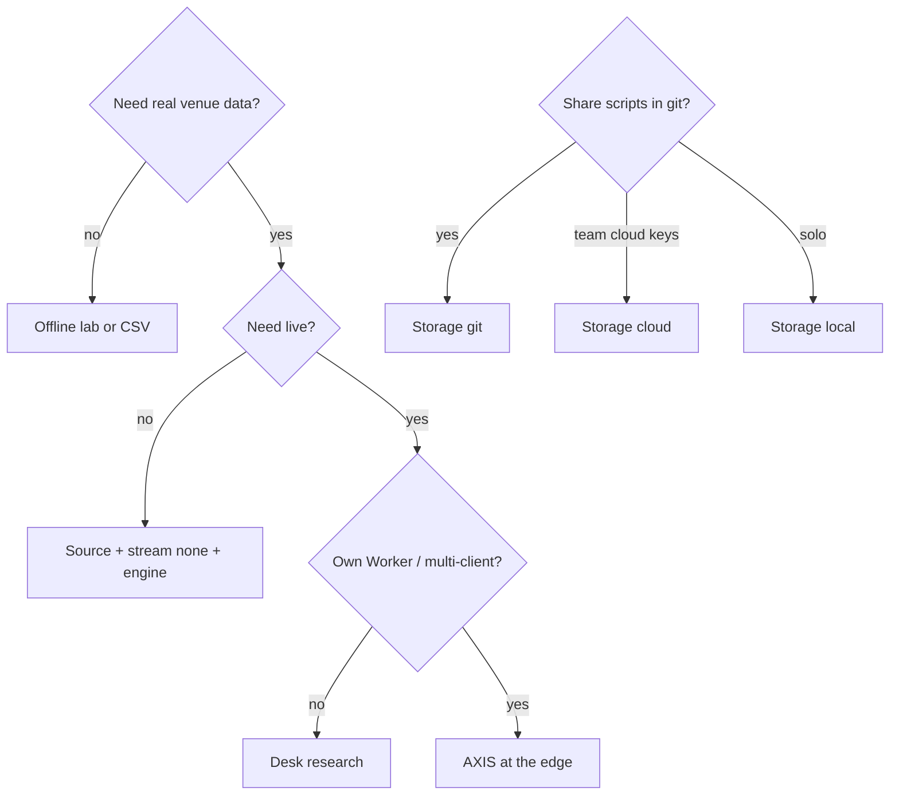

# Copyright (C) 2024-2026 jango_blockchained
#
# This file is part of pynescript.
#
# pynescript is free software: you can redistribute it and/or modify
# it under the terms of the GNU Affero General Public License as published by
# the Free Software Foundation, either version 3 of the License, or
# (at your option) any later version.
#
# pynescript is distributed in the hope that it will be useful,
# but WITHOUT ANY WARRANTY; without even the implied warranty of
# MERCHANTABILITY or FITNESS FOR A PARTICULAR PURPOSE.  See the
# GNU Affero General Public License for more details.
#
# You should have received a copy of the GNU Affero General Public License
# along with pynescript.  If not, see <https://www.gnu.org/licenses/>.
#
# SPDX-License-Identifier: AGPL-3.0-or-later

---
title: "Compose recipes"
description: "Lawful source × stream × engine × storage combinations: offline, desk, multi-venue, CSV, edge, and git library."
---

# Compose recipes

AXIS treats composition as the product. This page lists **recipes**—complete four-tuples with intent, constraints, and failure modes—not marketing tiers.

## Abstract

Formal active set:

```text
Active set = { source, stream, engine, storage }
```

Built-in ids (catalog may grow via URL plugins):

| Kind | Built-ins |
| --- | --- |
| Source | `binance-rest`, `mock-walk`, `csv-upload`, (+ examples e.g. CoinGecko) |
| Stream | `binance-ws`, `mock-poll`, `none`, (+ CF DO example) |
| Engine | `server`, `pyodide` |
| Storage | `local`, `cloud`, `git` |

## Recipe matrix

| Recipe | Source | Stream | Engine | Storage | Needs net | Needs backend |
| --- | --- | --- | --- | --- | --- | --- |
| Offline lab | mock-walk | mock-poll | pyodide | local | first boot only | no |
| Desk research | binance-rest | binance-ws | server → Flask | local | yes | Flask |
| Multi-venue desk | binance-rest + URL sources | binance-ws / none | server | local | yes | Flask |
| CSV desk | csv-upload | none / mock-poll | server or pyodide | local | no* | optional |
| AXIS at the edge | venue REST | venue WS / DO | server → Worker | cloud | yes | Worker (+ optional Flask proxy) |
| Repo library | any | any | any | git | yes (save/list) | git host API |

\*CSV needs local file; engine may still call network if `server`.

---

## Offline lab

**Intent:** airplane mode, demos, CI-less teaching, pure AXIS UX.

| Axis | Id | Why |
| --- | --- | --- |
| Source | `mock-walk` | Synthetic OHLCV in-process |
| Stream | `mock-poll` | Synthetic bar advance |
| Engine | `pyodide` | In-browser `pynescript` via Pyodide |
| Storage | `local` | IndexedDB script library |

**Setup**

1. Install static or dev AXIS with `public/pyodide` + `public/vendor` present.
2. Select the four-tuple in topbar / settings.
3. Load → Run while online once (warm Pyodide).
4. DevTools → Offline; re-run.

**Invariants:** no `POST /run`; no exchange traffic; drawings + library remain local.

**Failure modes:** missing wheels → HTML SPA fallback errors; cold start timeout on huge bar sets.

---

## Desk research

**Intent:** real venue history + live klines + full PYNE server fidelity.

| Axis | Id | Why |
| --- | --- | --- |
| Source | `binance-rest` | Public REST klines |
| Stream | `binance-ws` | Public WS kline stream |
| Engine | `server` | Flask Pro API `POST {endpoint}/run` |
| Storage | `local` | Fast offline library |

**Setup**

```bash
make run                 # :5002
cd frontend && bun run dev
```

Settings → Backend URL `http://localhost:5002` → Test. Symbol like `BTCUSDT`, interval `1h` / `1d`.

**CORS:** AXIS origin must be allowed by Flask `ALLOWED_ORIGINS`.

**Failure modes:** rate limits; symbol not on venue; CORS; engine timeout on long history (AXIS scales timeout with bar count).

---

## Multi-venue / multi-source

**Intent:** compare feeds without forking the AXIS.

| Axis | Pattern |
| --- | --- |
| Source | Built-in `binance-rest` **or** Manager → Install URL plugin (e.g. CoinGecko example) → **Use** |
| Stream | Match venue when available; else `none` for historical-only |
| Engine | Usually `server` for parity |
| Storage | `local` or `git` for shared research |

**Workflow**

1. Manager → Catalog → capability badges (offline / auth / network / proxy).
2. **Use** sets active source.
3. Load and Run as usual.

Dynamic plugins rehydrate from localStorage install list on boot (`restoreInstalledPlugins`).

**Failure modes:** plugin URL not CORS-readable; invalid export shape; built-ins cannot be unregistered without force flags.

---

## CSV desk

**Intent:** proprietary or offline CSV/OHLCV files.

| Axis | Id |
| --- | --- |
| Source | `csv-upload` |
| Stream | `none` (typical) or `mock-poll` for artificial advance |
| Engine | `pyodide` (airgap) or `server` |
| Storage | `local` |

**Workflow**

1. Source → CSV upload (file picker opens if no file yet).
2. AXIS parses via `parseOhlcvFile` into upload store.
3. Load injects bars; symbol field less critical for synthetic series.
4. Run strategies against that tape.

**Invariants:** bars stay in memory/session upload store—not the long-lived app state blob (size).

**Failure modes:** bad headers/time units; empty parse; re-select same file requires clearing input (AXIS resets file input after pick).

---

## AXIS at the edge

**Intent:** browser AXIS + Cloudflare Worker data plane (keys, usage, optional D1 scripts, DO fan-out).

| Axis | Id | Why |
| --- | --- | --- |
| Source | venue REST (built-in or proxy-aware) | History |
| Stream | venue WS **or** DO-backed example stream | Single upstream → N clients |
| Engine | `server` endpoint = Worker | Worker proxies `/api/run` → Flask or future in-worker runtime |
| Storage | `cloud` | `/api/scripts` + Bearer Pro key |

**Setup**

1. `wrangler dev` / deploy Worker project **`pynescript-superchart`** (frozen name).
2. Endpoint → Worker origin.
3. Storage cloud → API key from admin `/api/keys`.
4. Script Library uses cloud list/read/write; If-Match on concurrent writes.

**Invariants:** CF project id is infrastructure, not brand; health JSON may say `pynescript-axis-worker`.

**Failure modes:** missing Bearer key; D1 unbound → memory store (dev only); DO session query params wrong.

---

## Git library

**Intent:** Pine sources as first-class repo files; Save = commit.

| Axis | Id |
| --- | --- |
| Source / Stream / Engine | any research tuple |
| Storage | `git` |

**Config (Manager → Script Library or pluginsConfig)**

| Field | Notes |
| --- | --- |
| provider | `github` \| `gitlab` |
| token | contents:write / api |
| owner, repo | GitHub path; GitLab projectId optional |
| branch | default `main` |
| basePath | default `pine-library` |
| apiBaseUrl | self-hosted forges |

**Invariants:** drafts stay local; only explicit Save/remove hit the remote. Commit message template supports `{{name}}` / `{{iso}}`.

**Failure modes:** 401 token scope; wrong base path; GitLab path vs numeric id confusion.

---

## Choosing a recipe



## Internals

| Concern | Path |
| --- | --- |
| Active selection | `frontend/src/store` `activePlugins` |
| Built-in catalogs | `sources/catalog.ts`, `streams/*`, `engines/catalog.ts`, `storage/catalog.ts` |
| URL plugins | `plugins/loader.ts` |
| Compose UI | `ui/Topbar.tsx`, `ui/PluginManager.tsx`, `ui/SettingsDialog.tsx` |

## See also

- [Plugin contracts](/axis/docs/plugins/contracts)
- [Manager and settings](/axis/docs/enduser/guides/manager-and-settings)
- [Topologies](/axis/docs/architecture/topologies)
- [ADR-001 pluggable registry](/axis/docs/architecture/adrs)
