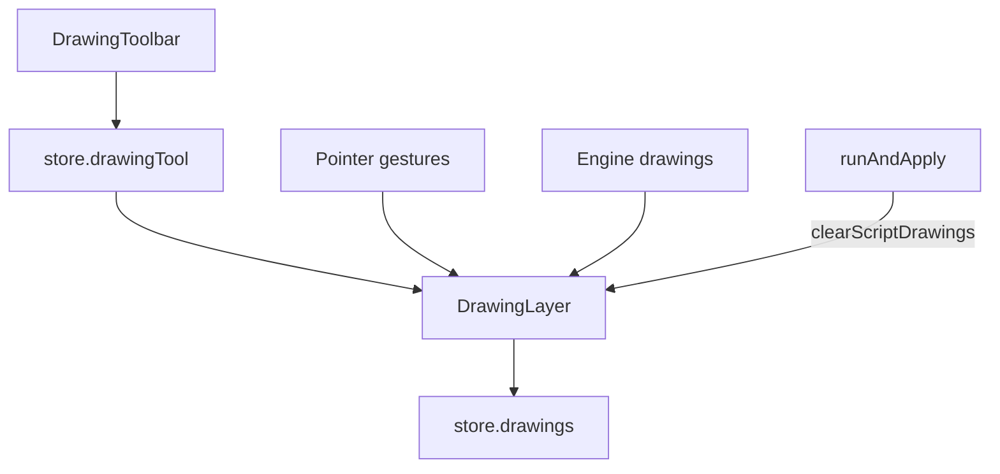

# Drawings

AXIS supports **user drawings** (interactive tools on the chart) and **script drawings** (objects returned by the engine). They share a canvas layer but different lifecycles.

## Abstract

| Class | Origin | Cleared when | Persisted |
| --- | --- | --- | --- |
| User drawings | Drawing toolbar | Explicit delete / clear | Yes (`store.drawings` in `pynescript.axis.v1`) |
| Script drawings | Engine `drawings[]` | Next Run (re-applied) | No (recomputed) |

## Conceptual model

## Tools

| Tool id | Kind | Geometry |
| --- | --- | --- |
| `cursor` | — | Select / pan mode (not a drawable) |
| `hline` | hline | Horizontal price |
| `trend` | trend | Two points |
| `ray` | ray | Two points (extends) |
| `rect` | rect | Two corners |
| `fib` | fib | Two points; levels 0, 0.236, 0.382, 0.5, 0.618, 0.786, 1 |
| `measure` | measure | Two points (delta readout) |
| `text` | text | Anchor + label |

Colors: default accent `#939fff`, up/down/measure variants in `DRAWING_COLORS`.

## Interface surface

- Toolbar on chart host (`DrawingToolbar`)
- Active tool in store; layer sync via `createEffect` on `store.drawingTool`
- Pane manager hosts price chart; drawings bind to time/price coordinates (not pixel-only)

## Workflows

**Annotate a level**

1. Select Horizontal line.  
2. Click price.  
3. Reload page—line remains (persisted drawings array).

**Fibonacci between swing points**

1. Select Fib.  
2. Click swing low → swing high (or reverse).  
3. Levels render from `FIB_LEVELS`.

**After Run with Pine lines/labels**

1. Run script that emits drawings.  
2. Layer clears previous script drawings, then applies new set.  
3. User drawings remain.

## Internals

| Path | Role |
| --- | --- |
| `frontend/src/chart/drawing-types.ts` | Tool ids, types, fib levels |
| `frontend/src/chart/drawing-layer.ts` | Interaction + render |
| `frontend/src/chart/DrawingToolbar.tsx` | UI |
| `frontend/src/chart/pine-drawings.ts` | Map engine drawings → layer |
| `frontend/src/chart/ChartHost.tsx` | Mount / dispose |

## Invariants

1. User drawings ≠ strategy results; deleting drawings does not alter `lastRun`.  
2. Time base is bar time (unix-compatible chart times).  
3. `cursor` never creates geometry.  
4. Persistence omits bars/logs but **includes** drawings—large freehand-less sets only.

## Failure modes

| Symptom | Fix |
| --- | --- |
| Clicks do nothing | Tool is cursor; chart empty (no bars/time scale) |
| Drawings vanish on Run | Those were script drawings—re-run or convert notes to user tools |
| Lost after wipe | Cleared site data / different browser profile |

## See also

- [AXIS — charting](/axis/docs/ui/charting)
- [Strategy and results](/axis/docs/enduser/guides/strategy-and-results)
