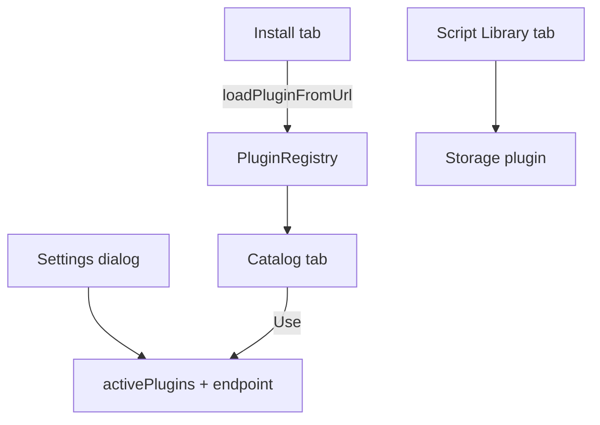

# Copyright (C) 2024-2026 jango_blockchained
#
# This file is part of pynescript.
#
# pynescript is free software: you can redistribute it and/or modify
# it under the terms of the GNU Affero General Public License as published by
# the Free Software Foundation, either version 3 of the License, or
# (at your option) any later version.
#
# pynescript is distributed in the hope that it will be useful,
# but WITHOUT ANY WARRANTY; without even the implied warranty of
# MERCHANTABILITY or FITNESS FOR A PARTICULAR PURPOSE.  See the
# GNU Affero General Public License for more details.
#
# You should have received a copy of the GNU Affero General Public License
# along with pynescript.  If not, see <https://www.gnu.org/licenses/>.
#
# SPDX-License-Identifier: AGPL-3.0-or-later

---
title: "Manager and settings"
description: "Plugin Manager catalog, URL install, capability badges, and Settings dialog for engine, storage, and endpoints."
---

# Manager and settings

Two orthogonal surfaces configure AXIS: the **Plugin Manager** (what exists and is active) and **Settings** (endpoint, engine, storage, interval defaults). Neither embeds language semantics.

## Abstract

| Surface | Opens from | Mutates |
| --- | --- | --- |
| Plugin Manager | Topbar Plugins | Registry membership, active source via Use, library ops |
| Settings | Topbar gear | `endpoint`, active engine/storage, chart interval, watchlist refresh |

Active plugins live in `store.activePlugins`; per-plugin fields in `store.pluginsConfig` keyed by `` `${kind}:${id}` ``.

## Conceptual model

## Plugin Manager

### Catalog

Lists sources, streams, engines, storages from the unified registry.

| Action | Effect |
| --- | --- |
| **Use** | `setActivePlugin(kind, id)` for that row’s kind |
| Capability badges | `offline`, `needsAuth`, `needsNetwork`, `needsProxy` from `plugin.capabilities` |
| Built-in flag | Built-ins resist casual unregister |

Status bar shows active engine id and storage backend after changes.

### Install (URL)

Paste a module URL exporting a default plugin object (`kind`, `id`, `name`, contract methods). AXIS:

1. Fetches and validates export
2. Registers into the TypeScript registry
3. Persists install record so `restoreInstalledPlugins()` reloads next visit

Security notes (operator-level): only https/http schemes suitable for module load; treat third-party URLs as code execution in your browser origin. See security tests under `frontend/tests/security/`.

Example plugins ship in `public/plugins/`:

- `example-coingecko-source.js`
- `example-tiny-pine-engine.js`
- `example-cf-do-stream.js`

### Script Library tab

See [Script library](/axis/docs/enduser/guides/script-library). Manager hosts the panel so library and plugins share one modal.

## Settings dialog

| Field | Behavior |
| --- | --- |
| Backend URL | Shown when engine is `server` or has `configSchema.endpoint` |
| Test / Probe | `GET` health against endpoint; status message |
| Engine | Registry engine list; labels via `engineOptionLabel` |
| Storage | `local` \| `cloud` \| `git` |
| Default interval | Updates store; may reload bars for current symbol |
| Watchlist refresh | Clamp 5–120 seconds |

Save persists via Solid store `persist()` into `pynescript.axis.v1`. Escape closes; Ctrl/Cmd+Enter saves.

**Pyodide engines** hide endpoint—calculation is same-origin assets, not Flask.

## Interface surface (UI map)

| Control | Store field |
| --- | --- |
| Engine select | `activePlugins.engine`, flat `engine` |
| Storage select | `activePlugins.storage` |
| Endpoint | `endpoint` |
| Source/stream topbar | `activePlugins.*`, `source`, `live.streamId` |
| Theme toggle | `theme` + `data-theme` on `<html>` |

## Internals

| Path | Role |
| --- | --- |
| `frontend/src/ui/PluginManager.tsx` | Manager modal |
| `frontend/src/ui/SettingsDialog.tsx` | Settings |
| `frontend/src/ui/plugin-badges.tsx` | Capability badges |
| `frontend/src/plugins/registry.ts` | Unified registry |
| `frontend/src/plugins/loader.ts` | URL load + restore |
| `frontend/src/plugins/bootstrap.ts` | Built-ins |

## Invariants

1. Settings never write script bodies—only layout/config.
2. Catalog **Use** does not auto-Run; Load/Run remain explicit.
3. Source change may re-default stream (`defaultStreamForSource`).
4. API keys for cloud/git belong in `pluginsConfig`, not in git-committed defaults.

## Worked examples

**Point AXIS at local Worker**

1. Settings → Engine Server-Side → Endpoint `http://127.0.0.1:8787`
2. Probe → OK
3. Save → Run

**Install example source**

1. Manager → Install → URL to `.../plugins/example-coingecko-source.js` (served origin)
2. Catalog → Source appears → Use → Load

## Failure modes

| Symptom | Fix |
| --- | --- |
| Empty catalog | Built-ins not registered—hard reload; check console |
| URL install fails | CORS on plugin host; bad export; mixed content |
| Probe fails | Backend down; wrong path; HTTPS mixed content |
| Settings not sticky | localStorage blocked / quota |

## See also

- [Script library](/axis/docs/enduser/guides/script-library)
- [Compose recipes](/axis/docs/enduser/getting-started/compose-recipes)
- [Plugins](/axis/docs/plugins)
