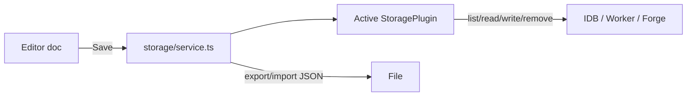

# Copyright (C) 2024-2026 jango_blockchained
#
# This file is part of pynescript.
#
# pynescript is free software: you can redistribute it and/or modify
# it under the terms of the GNU Affero General Public License as published by
# the Free Software Foundation, either version 3 of the License, or
# (at your option) any later version.
#
# pynescript is distributed in the hope that it will be useful,
# but WITHOUT ANY WARRANTY; without even the implied warranty of
# MERCHANTABILITY or FITNESS FOR A PARTICULAR PURPOSE.  See the
# GNU Affero General Public License for more details.
#
# You should have received a copy of the GNU Affero General Public License
# along with pynescript.  If not, see <https://www.gnu.org/licenses/>.
#
# SPDX-License-Identifier: AGPL-3.0-or-later

---
title: "Script library"
description: "Save, load, import/export Pine scripts via local IndexedDB, cloud Worker, or git (GitHub/GitLab)."
---

# Script library

The script library is the operator-facing surface of **storage plugins**. The editor holds the working document; the library is durable, named documents with metadata.

## Abstract

| Backend | Id | Medium | Auth |
| --- | --- | --- | --- |
| Local | `local` | IndexedDB (`pynescript.axis.storage`), LS fallback | none |
| Cloud | `cloud` | Worker `/api/scripts` (D1 or memory) | Bearer Pro API key |
| Git | `git` | GitHub/GitLab Contents API | PAT |

Active backend: `store.activePlugins.storage` (Settings or library picker).

## Conceptual model

Service layer (`listScripts`, `readScript`, `writeScript`, …) never talks to engines.

## Interface surface

Manager → **Script Library**:

| Control | Behavior |
| --- | --- |
| Backend select | `setActivePlugin('storage', id)` |
| Refresh | `list()` |
| Name / description | Metadata for next write |
| Save | Write current editor doc |
| Load | `read` → inject editor (`loadLibraryDoc` / setDoc) |
| Delete | `remove` |
| Export JSON | Full library dump |
| Import JSON | Bulk write |
| Cloud endpoint + key | Saved under `pluginsConfig['storage:cloud']` |
| Git fields | provider, token, owner, repo, branch, basePath, … |

Status line: backend · remote · branch · connected · count.

## Local backend

- DB name `pynescript.axis.storage` v1 stores `scripts` + `kv`
- Legacy SuperChart library keys migrate once
- Drafts: optional `saveDraft` / `loadDraft` without polluting remote backends
- Works fully offline

**Invariant:** browser profile wipe deletes local library—export JSON for backup.

## Cloud backend

- `Authorization: Bearer <api_key>`
- Scripts partitioned by key hash on Worker
- Concurrent updates may use `If-Match` / revision → HTTP 409 on conflict
- Default endpoint falls back to `store.endpoint` or `http://127.0.0.1:8787`

Configure key in library panel or Settings-related config; keys stay in this browser’s localStorage state blob.

## Git backend

| Invariant | Detail |
| --- | --- |
| Save commits | Each write/remove is a commit (+ push via API) |
| Drafts local | No remote commit for draft buffer |
| basePath | Default `pine-library/` |
| Providers | `github`, `gitlab` (+ self-hosted `apiBaseUrl`) |

Token scopes: GitHub `contents:write`; GitLab `api` or `write_repository`.

## Worked examples

### Solo offline library

1. Storage = local  
2. Write indicator in editor  
3. Name `sma-ribbon` → Save  
4. Reload page → Library → Load  

### Team cloud

1. Admin creates key on Worker  
2. Storage = cloud; paste endpoint + key  
3. Save shared strategies  
4. Second browser: same key → list  

### Research monorepo

1. Storage = git; GitHub owner/repo; basePath `research/pine`  
2. Save → commit message from template  
3. PR review on GitHub UI  

## Internals

| Path | Role |
| --- | --- |
| `frontend/src/ui/ScriptLibraryPanel.tsx` | UI |
| `frontend/src/storage/service.ts` | Facade |
| `frontend/src/storage/local.ts` | IDB |
| `frontend/src/storage/cloud.ts` | Worker API |
| `frontend/src/storage/git.ts` | Git plugin |
| `frontend/src/storage/git-github.ts`, `git-gitlab.ts` | Forges |

Contract: [Plugin types](/axis/docs/plugins/contracts) `StoragePlugin`.

## Failure modes

| Symptom | Cause | Mitigation |
| --- | --- | --- |
| Empty list after switch | Wrong backend / auth | Check status line + key |
| 401 cloud | Bad/missing key | Regenerate; re-save config |
| 409 cloud | Revision conflict | Re-read then write |
| Git 404 | Wrong owner/repo/basePath | Fix config |
| Quota local | Huge scripts in LS fallback | Prefer IDB; export prune |

## See also

- [Manager and settings](/axis/docs/enduser/guides/manager-and-settings)
- [Compose recipes — git / edge](/axis/docs/enduser/getting-started/compose-recipes)
- [State namespaces](/axis/docs/architecture/state-namespaces)
