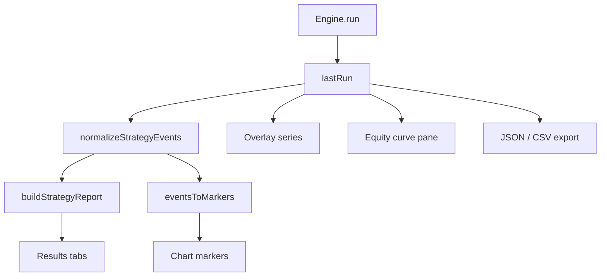

# Strategy and results

After **Run**, the engine returns a structured payload. AXIS **AXIS** normalizes events, pairs trades, paints markers, and exposes a Results drawer. Strategy math here is a **viewer**—not a brokerage.

## Abstract

Engine `RunResult` (simplified):

```text
status: success | error
plots[] | series{}
events[]     — entries, exits, orders, custom
drawings[]   — Pine line/label/box objects
meta{}       — ms, overlay, script_name, plot_meta, …
error?
```

AXIS stores this as `store.lastRun` (in-memory; not fully rehydrated from localStorage).

## Conceptual model



## Results drawer tabs

| Tab | Operator value |
| --- | --- |
| **Events** | Chronological normalized stream (kind, time, price, id, dir) |
| **Strategy** | Closed trades table + summary metrics |
| **Plots** | Series inventory (points, last value) |
| **Metrics** | Runtime, status, engine, source, bars, high-level stats |
| **Raw** | Pretty-printed JSON for support / diffs |

### Strategy metrics

Computed by `buildStrategyReport`:

| Stat | Definition (viewer) |
| --- | --- |
| totalPnl | Sum of closed trade PnL (price units) |
| winRate | % wins among closed trades |
| profitFactor | Gross profit / gross loss |
| avgTrade / avgWin / avgLoss | Means over closed set |
| maxDD | Peak-to-trough on cumulative trade PnL path |
| wins / losses / trades | Counts |

Pairing rules: entry-like kinds open by `id`; exit/close kinds match id or sole open trade. Direction flips short PnL. Missing prices drop the event from pairing (with normalization attempting OHLC fill from bars when available).

### Chart coupling

- Trade markers on price pane (`eventsToMarkers`)
- Scroll-to-time on trade row click
- Equity curve series when strategy events warrant (`buildEquityCurve`)
- Status bar snippet: closed trade count · net PnL when available

## Export

| Export | Content |
| --- | --- |
| JSON | Full `lastRun` |
| CSV | Closed trades (`tradesToCsv`) |
| Clipboard | CSV of trades when supported |

Filenames: `axis-run-<ts>.json`, `axis-trades-<ts>.csv`.

## Interface surface

- Drawer height persisted (`resultsPanel.height`); open state toggled after runs (`openResults` default true for interactive runs)
- Silent live re-runs can skip auto-open
- Equity / indicator panes created on demand when non-overlay or strategy paths need them

## Worked example

1. Load `BTCUSDT` daily history.  
2. Run a crossover strategy (see [Quick start](/axis/docs/enduser/getting-started/quick-start)).  
3. Results → Strategy: inspect win rate.  
4. Click a green trade → chart jumps to entry.  
5. Export CSV for a notebook.

## Internals

| Path | Role |
| --- | --- |
| `frontend/src/ui/ResultsPanel.tsx` | Drawer UI |
| `frontend/src/results/strategy.ts` | Trade pairing + stats |
| `frontend/src/results/events.ts` | Normalize events, markers, equity |
| `frontend/src/indicators/runner.ts` | `runAndApply` orchestration |
| `frontend/src/chart/series-factory.ts` | Plot colors / series |

Language-level strategy semantics: [PYNE runtime](/pyne/docs/runtime).

## Invariants

1. Results are a function of **last successful/error payload + current bars**—changing bars without re-run can desync prices used for fill.
2. Viewer PnL is not currency-normalized; treat as relative tape units.
3. `meta.overlay === false` routes plots to an indicator pane, not price.
4. Pine drawings (script) are distinct from user drawing tools ([Drawings](/axis/docs/enduser/guides/drawings)).

## Failure modes

| Symptom | Explanation |
| --- | --- |
| Events but 0 trades | Only entries, or unpaired ids |
| Empty plots | Series all null / name filtered (`__` prefix hidden) |
| Markers missing | Manager not mounted or events lack times |
| Huge Raw JSON | Many events—export file rather than copy |

## See also

- [Quick start](/axis/docs/enduser/getting-started/quick-start)
- [AXIS — results and strategy](/axis/docs/ui/results-and-strategy)
- [AXIS — indicators](/axis/docs/ui/indicators)
