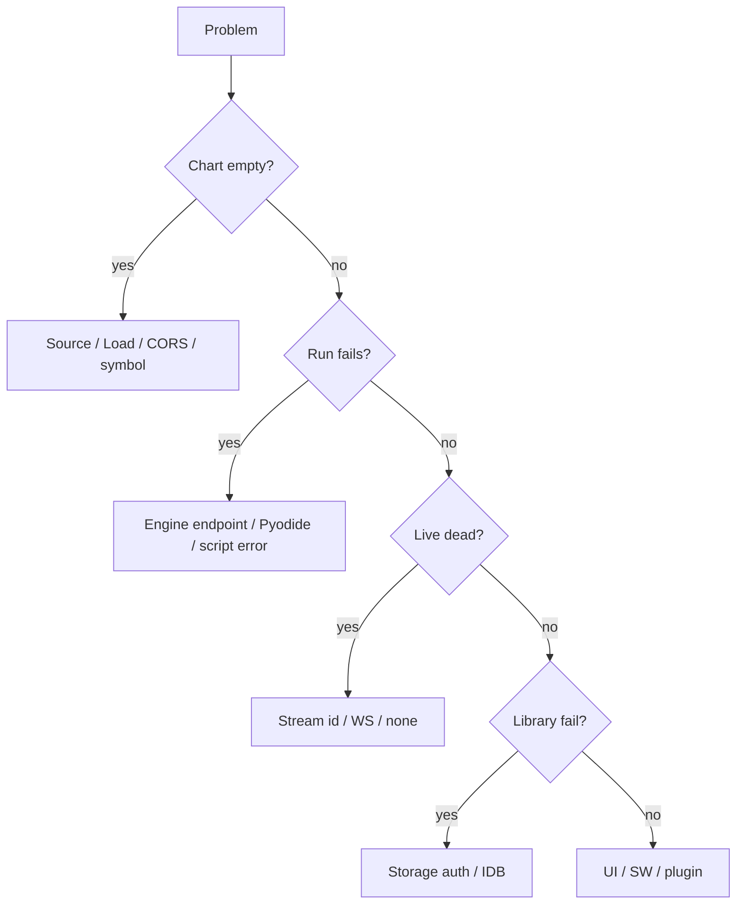

# Copyright (C) 2024-2026 jango_blockchained
#
# This file is part of pynescript.
#
# pynescript is free software: you can redistribute it and/or modify
# it under the terms of the GNU Affero General Public License as published by
# the Free Software Foundation, either version 3 of the License, or
# (at your option) any later version.
#
# pynescript is distributed in the hope that it will be useful,
# but WITHOUT ANY WARRANTY; without even the implied warranty of
# MERCHANTABILITY or FITNESS FOR A PARTICULAR PURPOSE.  See the
# GNU Affero General Public License for more details.
#
# You should have received a copy of the GNU Affero General Public License
# along with pynescript.  If not, see <https://www.gnu.org/licenses/>.
#
# SPDX-License-Identifier: AGPL-3.0-or-later

---
title: "Troubleshooting"
description: "Diagnose empty charts, CORS, engine failures, Pyodide assets, streams, storage, and PWA cache issues in AXIS."
---

# Troubleshooting

Systematic triage for AXIS. Prefer logs drawer + Network tab + status bar before reinstalling.

## Abstract

Failure domains:

1. **Data plane** — source / stream  
2. **Calc plane** — engine / endpoint / Pyodide assets  
3. **Shell plane** — store, SW cache, plugins  
4. **Storage plane** — library backends  

## Decision tree

## Data plane

| Symptom | Checks | Fix |
| --- | --- | --- |
| Infinite loading | Network klines; status message | Correct symbol; try `mock-walk` |
| CORS on REST | Binance/public APIs usually OK; custom sources may fail | Proxy plugin or Worker |
| CSV no bars | Parse error in status | Fix columns/time; re-upload |
| Wrong interval bars | Store interval vs request | Settings interval + Load |

## Calc plane — server engine

| Symptom | Checks | Fix |
| --- | --- | --- |
| Failed fetch `/run` | Endpoint, CORS preflight | `ALLOWED_ORIGINS`; Settings probe |
| HTTP 4xx/5xx | Response JSON `message` | Fix script; backend logs |
| Timeout | Bar count × complexity | Shorter history; raise server resources |
| Plots missing | `status: success` but empty series | Script has no plots; check Raw |

Probe: Settings → Test endpoint (health GET).

## Calc plane — Pyodide

| Symptom | Checks | Fix |
| --- | --- | --- |
| HTML instead of wheel | Content-Type / ZIP magic | Deploy `public/vendor`, `public/pyodide` into `dist/` |
| Slow first run | Cold runtime | Wait; `preloadPyodide` on idle |
| Offline fail first visit | Assets never cached | One online warm-up |
| Interpreter error | Results Raw / logs | Language issue → [PYNE](/pyne/docs) |

## Live streams

| Symptom | Checks | Fix |
| --- | --- | --- |
| Live toggle no effect | Stream = `none`? | Select `binance-ws` or `mock-poll` |
| WS errors | Console; venue symbol format | Uppercase `BTCUSDT` style |
| Reconnect loop | Network flap | Logs drawer; stop/start Live |
| DO stream | Worker session query | Worker docs; example plugin |

## Storage / library

| Symptom | Checks | Fix |
| --- | --- | --- |
| Save no-op | Active storage; errors in panel | Read status line |
| Cloud 401 | Bearer key | Settings/library key field |
| Git denied | Token scopes | PAT permissions |
| Lost local scripts | Cleared site data | Import JSON backup |

## Shell / PWA

| Symptom | Checks | Fix |
| --- | --- | --- |
| Old UI after deploy | Service Worker | Unregister SW; hard reload |
| State weird | `localStorage['pynescript.axis.v1']` | Export scripts; clear key; reload |
| Plugin vanished | URL install list | Re-install URL |
| Theme wrong | `data-theme` | Toggle theme once |

## Logging

- **System logs** drawer: boot, pyodide ready, live re-run errors (`appendLog`)  
- **Status bar**: ready / loading / running / error + short message  
- **Results → Raw**: last engine payload  

## Security-related

- Poisoned localStorage: app should tolerate parse failures (see security tests)  
- Plugin URL schemes restricted  
- Never paste production PATs into shared screen recordings  

## Internals for deeper digs

| Area | Path |
| --- | --- |
| Load history | `data/load-symbol.ts` |
| Run pipeline | `indicators/runner.ts` |
| Streams | `streams/multiplex.ts` |
| Engines | `engines/catalog.ts` |
| Store | `store/index.ts` |

## See also

- [Installation](/axis/docs/enduser/getting-started/installation)
- [FAQ](/axis/docs/enduser/reference/faq)
- [DevOps](/axis/docs/devops)
- [Worker](/axis/docs/worker)
