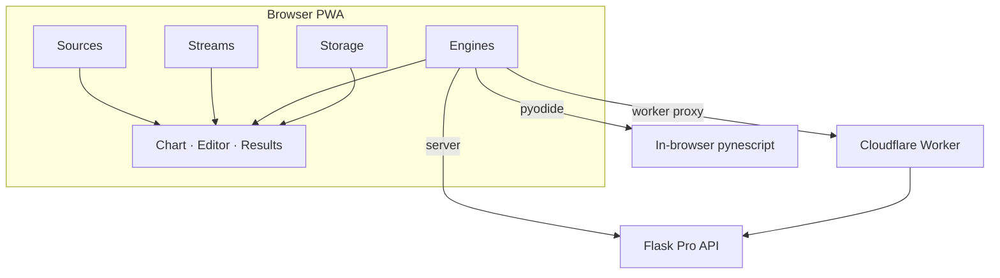

# AXIS Documentation

**AXIS** (formerly SuperChart Lite) is an installable charting PWA that treats **price**, **time**, and **calculation** as separable axes. Sources load history. Streams advance the present. Engines evaluate Pine Script™ via **PYNE**. Storage keeps your script library. Compose any lawful combination without a proprietary charting host.

_Pine Script™ and TradingView® are trademarks of TradingView, Inc. This project is independent and not affiliated with or endorsed by TradingView, Inc._

## Abstract

AXIS is a charting PWA, not a language rewrite. Language fidelity lives in [PYNE](/pyne/docs). The PWA contributes:

1. A **unified plugin registry** (`source | stream | engine | storage`)
2. A **Solid + Vite** product UI (chart, editor, results, manager)
3. Optional backends: local Flask, offline Pyodide, Cloudflare® Worker (+ DO/KV/D1/R2)

**Invariant (AXIS ≠ engine):** the shell never embeds a closed interpreter. Evaluation is always an engine plugin.

## Product map

| Track | Role | Start here |
| --- | --- | --- |
| **End User** | Install, compose recipes, research workflows | [End User hub](/axis/docs/enduser) |
| **Architecture** | ADRs, topologies, state namespaces | [Architecture](/axis/docs/architecture) |
| **Plugins** | Contracts and built-in catalogs | [Plugins](/axis/docs/plugins) |
| **UI** | Chart, editor, panels, store | [UI](/axis/docs/ui) |
| **Worker** | CF Pages + Worker data plane | [Worker](/axis/docs/worker) |
| **DevOps** | Build, VPS, CORS, CI | [DevOps](/axis/docs/devops) |
| **PYNE** (separate) | Grammar & evaluator | [PYNE docs](/pyne/docs) |

## Conceptual model



Formal active set:

```
Active set = { source, stream, engine, storage }
Contract namespace: pynescript.axis.plugins.v1
App state: pynescript.axis.v1  (migrates from pynescript.superchart.*)
```

## Compose in one glance

| Recipe | Source | Stream | Engine | Storage |
| --- | --- | --- | --- | --- |
| Offline lab | `mock-walk` | `mock-poll` | `pyodide` | `local` |
| Desk research | `binance-rest` | `binance-ws` | `server` → Flask | `local` |
| AXIS at the edge | venue REST | venue WS / DO | `server` → Worker | `cloud` |
| Repo library | any | any | any | `git` |

Full recipes: [Compose recipes](/axis/docs/enduser/getting-started/compose-recipes).

## Infrastructure names (do not rename lightly)

| Surface | Value |
| --- | --- |
| CF Wrangler / Pages project | `pynescript-superchart` (frozen) |
| Health JSON service | `pynescript-axis-worker` |
| Product brand | **AXIS** |

## Demo topologies

- Dev: Vite `:3000` + Flask `:5002`
- Static: `bun run build` + `axis_pwa_server.py` `:8081`
- Worker: `wrangler` on `:8787`

See [topologies](/axis/docs/architecture/topologies) and [local dev](/axis/docs/devops/local-dev).

## Offline & agent exports

Auto-generated like HOOX manuals (`bun run docs:exports`):

| Kind | Path |
| --- | --- |
| Full-corpus LLM pack | [`llm.txt`](/axis/docs/llm.txt) |
| LLM site map ([llmstxt.org](https://llmstxt.org/)) | [`llms.txt`](/axis/docs/llms.txt) |
| Track PDFs (A4) | [`/exports/axis-*-manual.pdf`](/exports/manifest.json) |

## See also

- [Quick start](/axis/docs/enduser/getting-started/quick-start)
- [Plugin contracts](/axis/docs/plugins/contracts)
- [ADRs](/axis/docs/architecture/adrs)
- [PYNE runtime](/pyne/docs/runtime)
