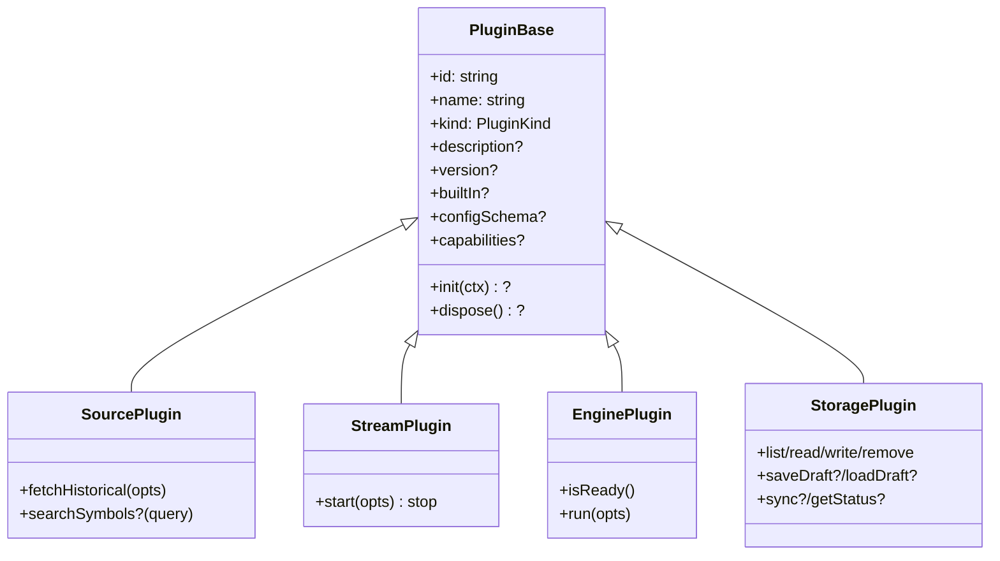

# Copyright (C) 2024-2026 jango_blockchained
#
# This file is part of pynescript.
#
# pynescript is free software: you can redistribute it and/or modify
# it under the terms of the GNU Affero General Public License as published by
# the Free Software Foundation, either version 3 of the License, or
# (at your option) any later version.
#
# pynescript is distributed in the hope that it will be useful,
# but WITHOUT ANY WARRANTY; without even the implied warranty of
# MERCHANTABILITY or FITNESS FOR A PARTICULAR PURPOSE.  See the
# GNU Affero General Public License for more details.
#
# You should have received a copy of the GNU Affero General Public License
# along with pynescript.  If not, see <https://www.gnu.org/licenses/>.
#
# SPDX-License-Identifier: AGPL-3.0-or-later

---
title: "Plugin contracts"
description: "Formal TypeScript interfaces for AXIS source, stream, engine, storage, and component plugins (pynescript.axis.plugins.v1)."
---

# Plugin contracts

## Abstract

All AXIS plugins share `PluginBase` and a discriminant `kind`. Contracts live in `frontend/src/plugins/types.ts`. Catalogs and the dynamic loader assert these shapes before registration; the UI never calls plugins that failed assertion.

Namespace (localStorage / config): **`pynescript.axis.plugins.v1`**.

## Conceptual model



## Interface surface

### PluginKind

```ts
type PluginKind = 'source' | 'stream' | 'engine' | 'storage' | 'component';
```

### PluginBase

| Field | Type | Notes |
| --- | --- | --- |
| `id` | `string` | Stable registry key within kind |
| `name` | `string` | UI label |
| `kind` | `PluginKind` | Discriminant |
| `description?` | `string` | Manager catalog |
| `version?` | `string` | Optional semver |
| `builtIn?` | `boolean` | Protects against unregister |
| `configSchema?` | `ConfigSchema` | Settings form |
| `capabilities?` | `PluginCapabilities` | Badges: offline / needsAuth / needsNetwork / needsProxy |
| `init?` / `dispose?` | lifecycle | Optional host hooks |

### ConfigSchema / FieldSchema

Each config field:

| Field | Values |
| --- | --- |
| `type` | `'string' \| 'number' \| 'boolean' \| 'select'` |
| `default?` | primitive |
| `label?`, `description?`, `placeholder?` | UI |
| `min?`, `max?`, `step?` | numbers |
| `options?` | select strings |

### PluginContext

Passed to `init` when used:

- `getConfig(): Record<string, unknown>`
- `setStatus(msg, level?)`
- `host.fetch?` — injectable fetch for tests / workers

### pluginKey

```ts
pluginKey(kind, id) → `${kind}:${id}`
```

Used for `store.pluginsConfig` lookup (`active.ts`).

---

## SourcePlugin

```ts
interface SourceOpts {
  symbol: string;
  interval: string;
  limit?: number;
  config?: Record<string, unknown>;
}

interface SourcePlugin extends PluginBase {
  kind: 'source';
  fetchHistorical(opts: SourceOpts): Promise<Bar[]>;
  searchSymbols?(query: string, config?: Record<string, unknown>): Promise<string[]>;
}
```

**Bar** shape (from `store/types`): `{ time, open, high, low, close, volume? }` with `time` in **unix seconds**.

Registry asserts: object, `id`, `name`, `kind === 'source'`, `fetchHistorical` is a function.

---

## StreamPlugin

```ts
interface StreamOpts {
  symbol: string;
  interval: string;
  config?: Record<string, unknown>;
  lastBar?: Bar | null;
  onBar: (b: Bar) => void;
  onError: (e: Error) => void;
  onStatus: (s: {
    state: 'open' | 'closed' | 'reconnecting' | string;
    url?: string;
    detail?: string;
  }) => void;
}

interface StreamPlugin extends PluginBase {
  kind: 'stream';
  start(opts: StreamOpts): () => void; // stop
}
```

**Invariant:** `start` must return a **stop** function that closes sockets / clears timers. The AXIS calls stop on symbol change or unmount.

---

## EnginePlugin

```ts
interface EngineOpts {
  script: string;
  bars: Bar[];
  config?: Record<string, unknown>;
  signal?: AbortSignal;
}

interface RunResult {
  status: 'success' | 'error';
  plots: (number | null)[];
  series?: Record<string, (number | null)[]>;
  events: Array<{ time: number; type: string; id?: string; price?: number; dir?: string; [k: string]: unknown }>;
  drawings?: Array<Record<string, unknown>>;
  error?: string;
  meta?: { mode?; script_id?; run_id?; ms?; overlay?; script_name?; [k: string]: unknown };
}

interface EnginePlugin extends PluginBase {
  kind: 'engine';
  isReady(): Promise<boolean>;
  run(opts: EngineOpts): Promise<RunResult>;
}
```

**Notes:**

- `plots` is the primary overlay series; multi-series engines also fill `series`.
- Strategy fills / orders appear in `events`.
- Pine line/label/box objects may appear in `drawings` from the interpret runtime.
- Prefer returning `status: 'error'` with `error` string over throwing for UI-friendly paths (built-in engines do both patterns carefully).

---

## StoragePlugin

```ts
interface ScriptMeta {
  id: string;
  name: string;
  description?: string;
  path?: string;
  updatedAt: number;
  createdAt?: number;
  revision?: string;
  tags?: string[];
}

interface ScriptDocument extends ScriptMeta {
  content: string;
}

interface StoragePlugin extends PluginBase {
  kind: 'storage';
  list(opts?): Promise<ScriptMeta[]>;
  read(id, config?): Promise<ScriptDocument>;
  write(doc, config?): Promise<ScriptMeta>;
  remove(id, config?): Promise<void>;
  saveDraft?(doc, config?): Promise<void>;
  loadDraft?(config?): Promise<{ content: string; name?: string } | null>;
  sync?(direction: 'push' | 'pull' | 'both', config?): Promise<SyncResult>;
  getStatus?(config?): Promise<StorageStatus>;
}
```

Registry requires `list`, `read`, `write`, `remove`. Draft/sync/status are optional.

---

## ComponentPlugin (reserved)

```ts
interface ComponentPlugin extends PluginBase {
  kind: 'component';
  slots: Array<'manager-tab' | 'results-tab' | 'topbar-action' | 'settings-section'>;
  mount(slot: string, el: HTMLElement, api: Record<string, unknown>): () => void;
}
```

Registered in the registry but not yet driven by the Manager UX. Do not rely on slots in production plugins.

---

## Capabilities

```ts
interface PluginCapabilities {
  offline?: boolean;
  needsAuth?: boolean;
  needsNetwork?: boolean;
  needsProxy?: boolean;
}
```

Manager badges (`plugin-badges.tsx`) surface these for composition decisions (e.g. offline lab vs desk research).

## Invariants & edge cases

1. **Export shape for dynamic modules** — default export, named `plugin`, or the module root object (`loader.asPlugin`).
2. **Config merge** — catalogs merge `configSchema` defaults with runtime `config` / `store.pluginsConfig`.
3. **AbortSignal** — `server` engine honors `signal` / adaptive timeouts; custom engines should too for long runs.
4. **Revision / If-Match** — cloud storage uses revision strings for optimistic concurrency (Worker `If-Match`).

## Failure modes

| Error | Contract violation |
| --- | --- |
| `source: fetchHistorical() required` | Missing method on register |
| `Unknown plugin kind` | Typo or future kind not supported by loader |
| `Custom storage plugins via URL are not supported yet` | Dynamic storage blocked by design |

## See also

- [Registry](/axis/docs/plugins/registry)
- [Dynamic loader](/axis/docs/plugins/dynamic-loader)
- [Plugin examples](/axis/docs/reference/plugin-examples)
