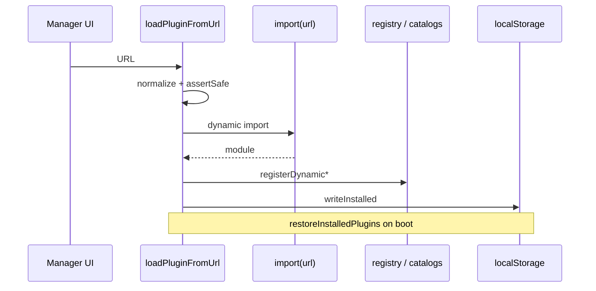

# Copyright (C) 2024-2026 jango_blockchained
#
# This file is part of pynescript.
#
# pynescript is free software: you can redistribute it and/or modify
# it under the terms of the GNU Affero General Public License as published by
# the Free Software Foundation, either version 3 of the License, or
# (at your option) any later version.
#
# pynescript is distributed in the hope that it will be useful,
# but WITHOUT ANY WARRANTY; without even the implied warranty of
# MERCHANTABILITY or FITNESS FOR A PARTICULAR PURPOSE.  See the
# GNU Affero General Public License for more details.
#
# You should have received a copy of the GNU Affero General Public License
# along with pynescript.  If not, see <https://www.gnu.org/licenses/>.
#
# SPDX-License-Identifier: AGPL-3.0-or-later

---
title: "Dynamic plugin loader"
description: "Install ES-module plugins from URL, persist installed list, restore on boot, and URL safety rules."
---

# Dynamic plugin loader

## Abstract

The loader (`frontend/src/plugins/loader.ts`) lets users install **third-party or example** source/stream/engine plugins at runtime via dynamic `import()`. Installed URLs persist in `localStorage` under:

| Key | Role |
| --- | --- |
| `pynescript.axis.plugins.v1` | Current |
| `pynescript.superchart.plugins.v1` | Legacy read fallback |

On boot, `restoreInstalledPlugins()` re-imports every saved URL.

## Conceptual model



## Interface surface

```ts
loadPluginFromUrl(url: string): Promise<InstalledPlugin>
removePlugin(id: string, kind?: string): void
getInstalledPlugins(): InstalledPlugin[]
restoreInstalledPlugins(): Promise<void>
normalizePluginUrl(url: string): string
assertSafePluginUrl(href: string): void
PLUGINS_KEY // 'pynescript.axis.plugins.v1'
```

### InstalledPlugin

```ts
{ url, id, name, kind, description? }
```

### Module export shapes accepted

1. `export default plugin`
2. `export const plugin = …`
3. Module namespace object that *is* the plugin

Must include `id` and `kind`. Required methods:

| kind | Method |
| --- | --- |
| `source` | `fetchHistorical` |
| `stream` | `start` |
| `engine` | `run` |
| `storage` | **Rejected** — “not supported yet” |

## Internals

### URL normalization

```ts
// /src/plugins/foo.js → /plugins/foo.js
href.replace(/(^|\/)src\/plugins\//, '$1plugins/');
```

Dev-only Vite paths never ship in `dist/`; production examples live under `public/plugins/` → `/plugins/…`.

### Safety

`assertSafePluginUrl` rejects:

- `javascript:`
- `vbscript:`
- `data:text/html…`

This is **not** a full sandbox. Dynamic plugins run with the page’s privileges (network, DOM). Treat plugin URLs like executable code supply chain.

### Dedup on install

List filters out same URL **or** same `(kind, id)` before append — reloading an updated module replaces the entry.

### Unregister

`removePlugin` calls `unregisterDynamic*` for the resolved kind (or all kinds if unknown) and rewrites the installed list.

### Bootstrap coupling

`loadPluginFromUrl` / `restoreInstalledPlugins` call `ensureBuiltins()` first so catalogs exist before dynamic ids land.

## Manager UX (product)

From `frontend/src/plugins/README.md`:

1. **Manager → Plugins → Load from URL**
2. Example: `http://localhost:8081/plugins/example-coingecko-source.js`
3. **Export installed** / **Import…** for machine migration
4. Auto-activate patterns for source/stream/engine after install (Manager catalog **Use**)

Shipped examples (also under `public/plugins/`):

| File | Kind |
| --- | --- |
| `example-coingecko-source.js` | source |
| `example-tiny-pine-engine.js` | engine |
| `example-cf-do-stream.js` | stream |

## Invariants & edge cases

1. **CORS on module URL** — the JS file origin must allow module import (same-origin is easiest).
2. **CORS on plugin’s own API** — separate problem; may need proxy (see plugins README).
3. **Partial restore** — one bad URL logs error and continues others.
4. **No code signing** — trust the URL owner.

## Worked example

```bash
# After bun run build + axis_pwa_server.py
# Load:
http://127.0.0.1:8081/plugins/example-coingecko-source.js
```

Then select **CoinGecko** in the source picker (id `coingecko`).

## Failure modes

| Error | Meaning |
| --- | --- |
| `URL required` | Empty input |
| `Plugin URL scheme not allowed` | Dangerous scheme |
| `Module did not export a plugin object` | Wrong export shape |
| `Plugin needs id and kind` | Incomplete object |
| `Source plugin needs fetchHistorical()` | Incomplete source |
| `Unknown plugin kind` | Typo / component |
| Restore log errors | 404, network, syntax error in remote JS |

## See also

- [Plugin examples](/axis/docs/reference/plugin-examples)
- [Registry](/axis/docs/plugins/registry)
- [CORS and origins](/axis/docs/devops/cors-and-origins)
