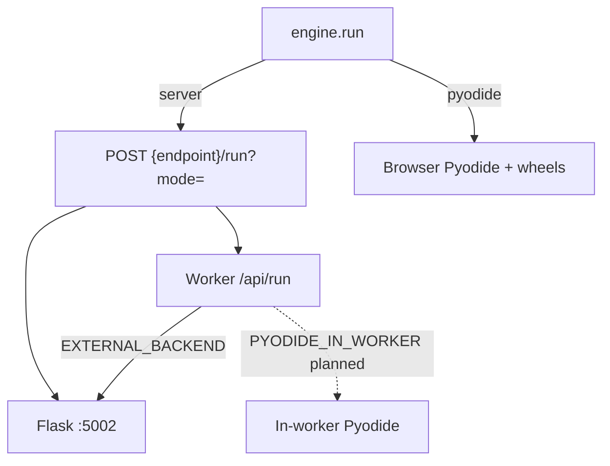

# Engines

## Abstract

An **engine** evaluates a script against bars and returns plots, series, events, and optional drawings. AXIS ships two built-ins in `frontend/src/engines/catalog.ts`:

| id | Name | Where Python runs |
| --- | --- | --- |
| `server` | Server-Side | External Flask Pro API **or** Cloudflare Worker that proxies/evaluates |
| `pyodide` | Client-Side (Pyodide) | Browser WebAssembly via self-hosted Pyodide |

There is **no** third built-in engine in AXIS itself. Worker in-process Pyodide is a **separate**, feature-gated path on the edge (`PYODIDE_IN_WORKER`) and is not production-ready — see [Worker runtime](/axis/docs/worker/runtime).

## Conceptual model



## Interface surface

```ts
isReady(): Promise<boolean>
run({ script, bars, config?, signal? }): Promise<RunResult>
```

`RunResult` is defined in [contracts](/axis/docs/plugins/contracts).

### server engine

**Config schema**

| Key | Default | Notes |
| --- | --- | --- |
| `endpoint` | `http://localhost:5002` | Overridden by topbar / `store.endpoint` |
| `mode` | `interpret` | `interpret` \| `compile` |

**HTTP contract**

- `POST ${endpoint}/run?mode=…`
- Body: `{ script, data: bars }`
- Success JSON: `plots`, `series?`, `events?`, `drawings?`, `meta?`, `mode`, `script_id`, `run_id`
- Error: non-OK status or `status: 'error'` → mapped to `RunResult` with `error`

**WebSocket contract (preferred when available)**

- URL: `ws(s)://host/ws/run` (derived from `endpoint`; requires `flask-sock` on the Pro API)
- Client → `{ type: "run", id, script, data, mode? }`
- Server → `{ type: "result", id, status: "success", plots, series, … }` or `{ type: "error", id, message }`
- AXIS server engine tries WS first (`preferWs`, default true), then REST. Health `GET /` reports `"websocket": true` when the route is mounted.
- `meta.transport` is `"ws"` or `"rest"` so the Connection HUD can show the path used.

**Readiness:** `GET ${endpoint}/` within 8s.

**Timeouts:** adaptive `min(180s, max(60s, 30s + bars×80ms))`.

**Note on Worker path:** the PWA’s `server` engine posts to `/run` on whatever endpoint you set. The Worker exposes **`POST /api/run`**. When pointing the PWA at a Worker, either put a reverse-proxy path rewrite in front, or set the endpoint so the engine path matches your deployment. Worker `handleRun` validates `{ script, data, mode? }` and **today prefers proxying to `EXTERNAL_BACKEND`** (Flask). In-worker Pyodide only if `PYODIDE_IN_WORKER=enabled` and the wheel pipeline works.

### pyodide engine

**Config**

| Key | Default |
| --- | --- |
| `indexUrl` | `/pyodide/v0.26.2/` (self-hosted) |

**Boot pipeline (`_ensure`)**

1. Prefetch assets (`prefetchPyodideAssets`) — wasm, stdlib zip, micropip wheels.
2. `loadPyodide({ indexURL })`.
3. `micropip.install` same-origin `/vendor/pynescript-0.2.0-py3-none-any.whl` and antlr runtime wheel.
4. Fetch `/pyodide/pynescript_runtime.py` and `runPythonAsync` it.
5. `run` calls `run_script(script, bars)` in Python and `JSON.parse`s the result.

**Guards:** `assertZipAsset` rejects HTML SPA fallbacks (classic deploy footgun when `public/vendor` is missing from `dist/`).

**Capabilities:** `{ offline: true, needsNetwork: false }` after assets are cached same-origin.

**Helpers:** `preloadPyodide()`, `LOCAL_PYODIDE_VERSION = '0.26.2'`.

## Internals

| Path | Role |
| --- | --- |
| `frontend/src/engines/catalog.ts` | `serverEngine`, `pyodideEngine`, registration |
| `frontend/src/indicators/runner.ts` | UI run orchestration |
| `frontend/public/vendor/*.whl` | Shipped wheels |
| `frontend/public/pyodide/` | Self-hosted Pyodide + runtime py |
| `frontend/worker/src/runtime.ts` | Edge `/api/run` |
| `frontend/worker/RUNTIME.md` | In-worker Python plan |

## Invariants & edge cases

1. **AXIS never imports pynescript Python** except through engines.
2. **Abort** — pass `signal` from UI cancel; server engine respects it.
3. **Error as data** — both engines often return `status: 'error'` instead of throwing so the Results panel can show messages.
4. **Pyodide size** — ~14MB self-hosted index; first ready can take seconds; preload on idle.

## Worked examples

### Desk research (Flask)

- Active engine: `server`
- Endpoint: `http://127.0.0.1:5002`
- Backend: `make run` (Flask Pro API)

### Offline lab

- Source `mock-walk`, stream `mock-poll`, engine `pyodide`, storage `local`
- Requires `dist/` (or Vite public) to serve `/pyodide/**` and `/vendor/**`

### Tiny non-Python engine

See [plugin examples](/axis/docs/reference/plugin-examples) — `example-tiny-pine-engine.js` implements a JS DSL with `sma` / `ema` / `rsi` for demos without PYNE.

## Failure modes

| Symptom | Cause |
| --- | --- |
| `pynescript wheel returned HTML` | SPA fallback; deploy vendor into dist; static server must not rewrite `.whl` |
| `loadPyodide not available` | Missing pyodide.js / blocked script |
| HTTP error from server | Flask down; wrong endpoint; CORS |
| Worker 503 `NO_BACKEND` | `EXTERNAL_BACKEND` empty and Pyodide path disabled/failed |

## See also

- [Worker runtime](/axis/docs/worker/runtime)
- [Build and serve](/axis/docs/devops/build-and-serve)
- [PYNE runtime](/pyne/docs/runtime)
