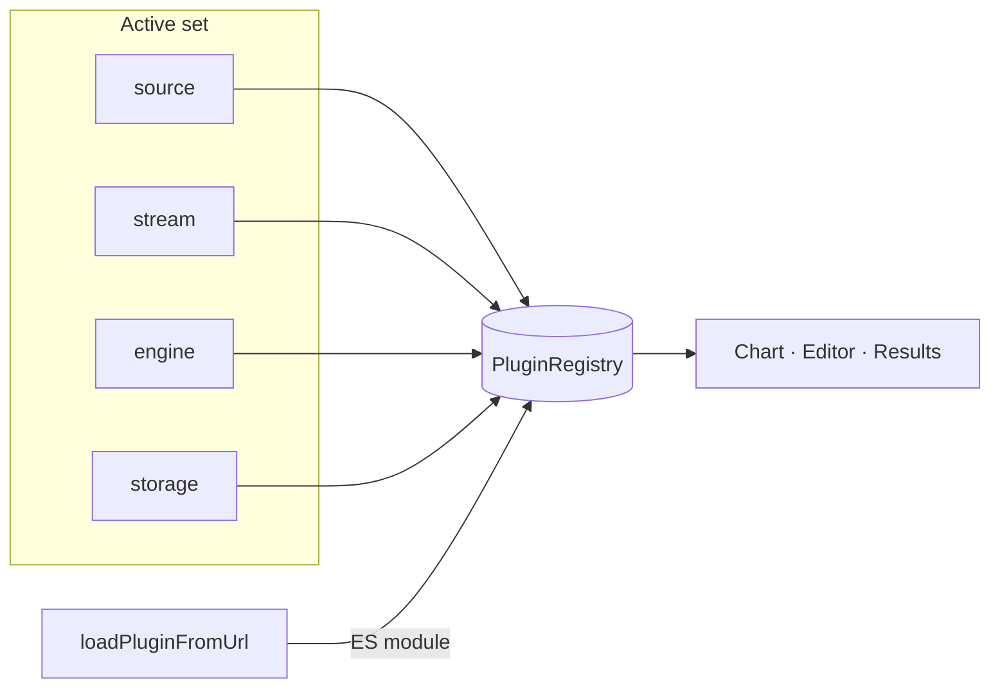

# Plugins

## Abstract

AXIS is a **plugin-composed charting PWA**. Historical bars, live ticks, Pine evaluation, and the script library are not hard-coded product features — they are interchangeable modules that share one contract namespace:

```
pynescript.axis.plugins.v1
```

The shell (AXIS) never embeds a closed interpreter. Evaluation is always an **engine** plugin. Data arrives only through **source** and **stream**. Persistence goes through **storage**. Compose any lawful active set without a proprietary charting host.

## Conceptual model



| Kind | Role | Required surface |
| --- | --- | --- |
| `source` | Historical OHLCV | `fetchHistorical(opts) → Bar[]` |
| `stream` | Live bar updates | `start(opts) → stop()` |
| `engine` | Pine / DSL evaluation | `isReady()`, `run(opts) → RunResult` |
| `storage` | Script library | `list` / `read` / `write` / `remove` |
| `component` | UI slots (phase 2, reserved) | `mount(slot, el, api)` |

Built-ins register at bootstrap (`frontend/src/plugins/bootstrap.ts`). Dynamic plugins install from URL (`loader.ts`) and persist under `localStorage` key `pynescript.axis.plugins.v1`.

## Interface surface

| Module | Path |
| --- | --- |
| Contracts | [`frontend/src/plugins/types.ts`](https://github.com/jango-blockchained/pynescript/blob/main/frontend/src/plugins/types.ts) |
| Registry | [`frontend/src/plugins/registry.ts`](https://github.com/jango-blockchained/pynescript/blob/main/frontend/src/plugins/registry.ts) |
| Bootstrap | [`frontend/src/plugins/bootstrap.ts`](https://github.com/jango-blockchained/pynescript/blob/main/frontend/src/plugins/bootstrap.ts) |
| Active resolution | [`frontend/src/plugins/active.ts`](https://github.com/jango-blockchained/pynescript/blob/main/frontend/src/plugins/active.ts) |
| Dynamic loader | [`frontend/src/plugins/loader.ts`](https://github.com/jango-blockchained/pynescript/blob/main/frontend/src/plugins/loader.ts) |
| Public barrel | [`frontend/src/plugins/index.ts`](https://github.com/jango-blockchained/pynescript/blob/main/frontend/src/plugins/index.ts) |
| Source catalog | [`frontend/src/sources/catalog.ts`](https://github.com/jango-blockchained/pynescript/blob/main/frontend/src/sources/catalog.ts) |
| Stream catalog | [`frontend/src/streams/catalog.ts`](https://github.com/jango-blockchained/pynescript/blob/main/frontend/src/streams/catalog.ts) |
| Engine catalog | [`frontend/src/engines/catalog.ts`](https://github.com/jango-blockchained/pynescript/blob/main/frontend/src/engines/catalog.ts) |
| Storage catalog | [`frontend/src/storage/catalog.ts`](https://github.com/jango-blockchained/pynescript/blob/main/frontend/src/storage/catalog.ts) |

## Built-in inventory (quick)

| Kind | Built-in IDs |
| --- | --- |
| Sources | `binance-rest`, `okx-rest`, `bybit-rest`, `coinbase-rest`, `mock-walk`, `csv-upload` |
| Streams | `binance-ws`, `okx-ws`, `bybit-ws`, `coinbase-ws`, `kraken-ws`, `mock-poll` |
| Engines | `server`, `pyodide` |
| Storage | `local`, `cloud`, `git` |

Defaults when selection is missing (`active.ts`): source `binance-rest`, stream `binance-ws`, engine `server`, storage `local`.

## Invariants

1. **AXIS ≠ engine** — the UI never ships a private Pine runtime; engines are plugins.
2. **Registry is the single source of truth** — catalogs write into `PluginRegistry`; UI lists come from `listSources()` / etc.
3. **Built-ins resist casual unregister** — `unregister*(id)` returns `false` for `builtIn: true` unless `allowBuiltIn: true`.
4. **Config keys** — prefer `pluginKey(kind, id)` → `` `${kind}:${id}` `` (e.g. `engine:server`).
5. **Storage via URL is rejected** — dynamic loader refuses `kind: 'storage'` until a hardened path exists.
6. **Legacy key migration** — installed plugins may still be read from `pynescript.superchart.plugins.v1`.

## Compose recipes (plugin view)

| Recipe | Source | Stream | Engine | Storage |
| --- | --- | --- | --- | --- |
| Offline lab | `mock-walk` | `mock-poll` | `pyodide` | `local` |
| Desk research | `binance-rest` | `binance-ws` | `server` → Flask | `local` |
| AXIS at the edge | venue REST | venue WS / DO | `server` → Worker | `cloud` |
| Repo library | any | any | any | `git` |

## Failure modes

| Symptom | Likely cause |
| --- | --- |
| Empty source dropdown | `ensureBuiltins()` never ran at app entry |
| Dynamic plugin vanishes after reload | URL 404 or CORS; check System Logs (`plugins` channel) |
| Engine “not ready” | Flask/Worker down (`server`) or missing `/vendor/*.whl` / `/pyodide/` (`pyodide`) |
| Cloud library 401 | Missing Bearer `pn_…` key or unbound `API_KEYS` KV in production |

## See also

- [Contracts](/axis/docs/plugins/contracts)
- [Registry](/axis/docs/plugins/registry)
- [Sources](/axis/docs/plugins/sources) · [Streams](/axis/docs/plugins/streams) · [Engines](/axis/docs/plugins/engines) · [Storage](/axis/docs/plugins/storage)
- [Dynamic loader](/axis/docs/plugins/dynamic-loader)
- [Plugin examples](/axis/docs/reference/plugin-examples)
- [Worker](/axis/docs/worker) (cloud storage + stream relay)
