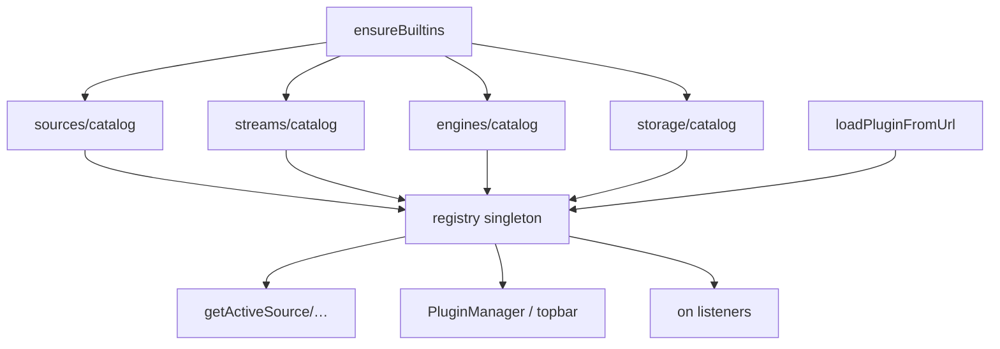

# Copyright (C) 2024-2026 jango_blockchained
#
# This file is part of pynescript.
#
# pynescript is free software: you can redistribute it and/or modify
# it under the terms of the GNU Affero General Public License as published by
# the Free Software Foundation, either version 3 of the License, or
# (at your option) any later version.
#
# pynescript is distributed in the hope that it will be useful,
# but WITHOUT ANY WARRANTY; without even the implied warranty of
# MERCHANTABILITY or FITNESS FOR A PARTICULAR PURPOSE.  See the
# GNU Affero General Public License for more details.
#
# You should have received a copy of the GNU Affero General Public License
# along with pynescript.  If not, see <https://www.gnu.org/licenses/>.
#
# SPDX-License-Identifier: AGPL-3.0-or-later

---
title: "Plugin registry"
description: "PluginRegistry singleton: ordered maps per kind, listeners, built-in protection, and bootstrap wiring."
---

# Plugin registry

## Abstract

`PluginRegistry` (`frontend/src/plugins/registry.ts`) is the **single in-memory source of truth** for every installed plugin of every kind. Catalogs, the dynamic loader, active resolution, and Manager UI all read/write through this class (or thin wrappers that call it).

## Conceptual model



## Interface surface

### Singleton

```ts
import { registry, PluginRegistry } from './plugins/registry';
// or from './plugins' barrel
```

### Per-kind API (pattern)

| Method | Behavior |
| --- | --- |
| `registerSource(p)` | Assert contract; set map; append order if new; emit `registered` |
| `getSource(id)` | Map lookup |
| `listSources()` | Registration **order**, not insertion-hash order |
| `unregisterSource(id, { allowBuiltIn? })` | Refuses `builtIn` unless opted in |
| Same pattern for stream / engine / storage | |
| `registerComponent` / `listComponents` | Phase-2 components (unordered Map values) |

### Bulk

| Method | Behavior |
| --- | --- |
| `register(plugin: AnyPlugin)` | Dispatch on `kind` |
| `unregister(kind, id, opts?)` | Kind switch |
| `clear()` | Wipe all maps and order arrays (tests) |
| `summary()` | `{ sources, streams, engines, storages }` lightweight summaries |
| `on(listener)` | Subscribe to `{ type, kind, id }`; returns unsubscribe |

### Order preservation

Private arrays `_sourceOrder`, `_streamOrder`, `_engineOrder`, `_storageOrder` ensure UI dropdowns stay stable when plugins re-register (idempotent `set` without reordering).

### Built-in protection

```ts
if (p.builtIn && !opts?.allowBuiltIn) return false;
```

Dynamic uninstall paths must never silently delete `binance-rest` / `server` / `local`.

## Internals (repo paths)

| Concern | Path |
| --- | --- |
| Class + singleton | `frontend/src/plugins/registry.ts` |
| Idempotent builtins | `frontend/src/plugins/bootstrap.ts` → `ensureBuiltins()` |
| Active set | `frontend/src/plugins/active.ts` |
| Dynamic register helpers | `sources/catalog.ts` `registerDynamicSource`, etc. |

### Bootstrap

```ts
// bootstrap.ts — once per page lifetime
ensureSourcesRegistered();
ensureStreamsRegistered();
ensureEnginesRegistered();
ensureStoragesRegistered();
```

Safe to call repeatedly: catalogs use a local `registered` flag; bootstrap uses `done`.

### Active resolution defaults

| Slot | Default id |
| --- | --- |
| source | `binance-rest` |
| stream | `binance-ws` |
| engine | `server` |
| storage | `local` |

Fallbacks chain: `store.activePlugins.*` → legacy store fields → default → registry get with hard fallback id → throw if still missing (source/stream/engine). Storage returns `undefined` if nothing registered (should not happen after builtins).

### Engine endpoint surface

`getActiveEngineConfig()` injects `store.endpoint` when the engine has an `endpoint` config field or id is `server` — keeps the topbar Endpoint field and engine config aligned.

## Invariants & edge cases

1. **Re-register same id** — overwrites the plugin object; does **not** duplicate order entry.
2. **Listener errors are swallowed** — one bad subscriber cannot break registration.
3. **`clear()` does not reset bootstrap/catalog flags** — tests use `_resetBootstrapFlag` / `_reset*RegistrationFlag` helpers.
4. **Components** — no order array; `listComponents` is Map iteration order.

## Worked examples

### Register a test source

```ts
import { registry } from '../plugins/registry';

registry.registerSource({
  id: 'fixture',
  name: 'Fixture',
  kind: 'source',
  async fetchHistorical() {
    return [{ time: 1, open: 1, high: 1, low: 1, close: 1 }];
  },
});
```

### Listen for dynamic installs

```ts
const off = registry.on((ev) => {
  if (ev.type === 'registered' && ev.kind === 'engine') {
    console.log('engine ready', ev.id);
  }
});
// later: off()
```

## Failure modes

| Symptom | Cause |
| --- | --- |
| `source: kind must be 'source'` | Wrong discriminant on register |
| Dropdown empty after `clear()` in test | Forgot re-`ensureBuiltins` / reset flags |
| Unregister returns false | Built-in protection |

## See also

- [Contracts](/axis/docs/plugins/contracts)
- [Dynamic loader](/axis/docs/plugins/dynamic-loader)
- [Plugins hub](/axis/docs/plugins)
