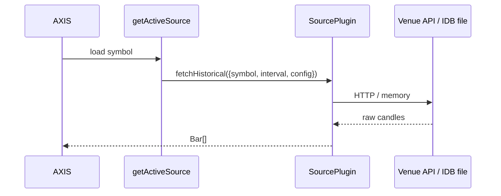

# Sources

## Abstract

A **source** loads a finite window of OHLCV bars for the chart and engine. Sources live in `frontend/src/sources/catalog.ts` and register into the unified registry via `ensureSourcesRegistered()`.

## Conceptual model



## Built-in catalog

| id | Name | Network | Notes |
| --- | --- | --- | --- |
| `binance-rest` | Binance REST | yes | Public klines; **synthetic walk fallback** when `fallback: true` (default) |
| `okx-rest` | OKX REST | yes | Candles; symbol `BTCUSDT` → `BTC-USDT`; max 300 bars |
| `bybit-rest` | Bybit REST | yes | Spot v5 klines; newest-first reversed |
| `coinbase-rest` | Coinbase REST | yes | Exchange candles; `USDT` pair rewritten to `USD` product |
| `mock-walk` | Mock Walk | no | Offline random walk; optional Mulberry-like seed |
| `csv-upload` | CSV / JSON Upload | no | Reads last upload from `upload-store` |

UI order is `BUILTIN_SOURCES` array order (Binance first).

## Interface surface

Every source implements `SourcePlugin` ([contracts](/axis/docs/plugins/contracts)):

```ts
fetchHistorical({ symbol, interval, limit?, config? }): Promise<Bar[]>
```

### Config highlights

**binance-rest**

| Key | Default | Meaning |
| --- | --- | --- |
| `baseUrl` | `https://api.binance.com` | Override for mirrors/proxies |
| `limit` | `500` | 50–1000 |
| `fallback` | `true` | On network error, `synthesizeWalk` |

**mock-walk**

| Key | Default | Meaning |
| --- | --- | --- |
| `seed` | `0` | `0` = non-deterministic; non-zero = deterministic PRNG |
| `startPrice` | `100` | Walk origin |
| `limit` | `500` | Bar count |

**csv-upload**

- No schema fields. User must Upload a CSV (`time,open,high,low,close[,volume]`) or JSON array first; otherwise throws a clear error.

## Internals

| Path | Role |
| --- | --- |
| `frontend/src/sources/catalog.ts` | Definitions + register/list/get |
| `frontend/src/sources/upload-store.ts` | In-memory last upload for `csv-upload` |
| `frontend/src/data/load-symbol.ts` | App pipeline that calls active source |
| `frontend/src/data/parse-bars.ts` | CSV/JSON normalization |

### Interval → venue codes

Helpers map AXIS intervals (`1m`, `5m`, `15m`, `1h`, `4h`, `1d`, `1w`) to OKX `bar`, Bybit interval codes, Coinbase granularity seconds. Unmapped intervals fall back to daily-ish defaults — check venue docs if you add exotic TFs.

### Dynamic registration

```ts
registerDynamicSource(plugin)  // from catalog / loader
unregisterDynamicSource(id)
listDynamicSourceIds()
```

Loader path: `kind === 'source'` + `fetchHistorical` required.

## Invariants & edge cases

1. **Time unit** — always **seconds** unix (Binance ms ÷ 1000).
2. **Binance fallback** — offline demos “work” but are **not** real prices; disable `fallback` for strict desk research.
3. **CORS** — browser → public venue APIs must allow CORS; corporate proxies may require a Worker `/api/proxy` (not shipped as a general proxy today — plan carefully).
4. **Newest-first venues** (OKX, Bybit, Coinbase) — catalog reverses/sorts ascending by `time` for the chart.

## Worked example

```js
// Minimal custom source (ES module for loader)
export default {
  id: 'static-two',
  name: 'Two Bars',
  kind: 'source',
  async fetchHistorical() {
    return [
      { time: 1_700_000_000, open: 1, high: 2, low: 0.5, close: 1.5, volume: 10 },
      { time: 1_700_000_060, open: 1.5, high: 2, low: 1, close: 1.2, volume: 12 },
    ];
  },
};
```

## Failure modes

| Error / symptom | Fix |
| --- | --- |
| `No uploaded file…` | Use Upload before selecting `csv-upload` |
| Empty chart + Binance down | Expected synthetic walk if fallback on |
| OKX `code !== '0'` | Symbol format / region block |
| CORS blocked | Proxy or different source |

## See also

- [Streams](/axis/docs/plugins/streams)
- [Contracts](/axis/docs/plugins/contracts)
- [Plugin examples](/axis/docs/reference/plugin-examples) (CoinGecko)
