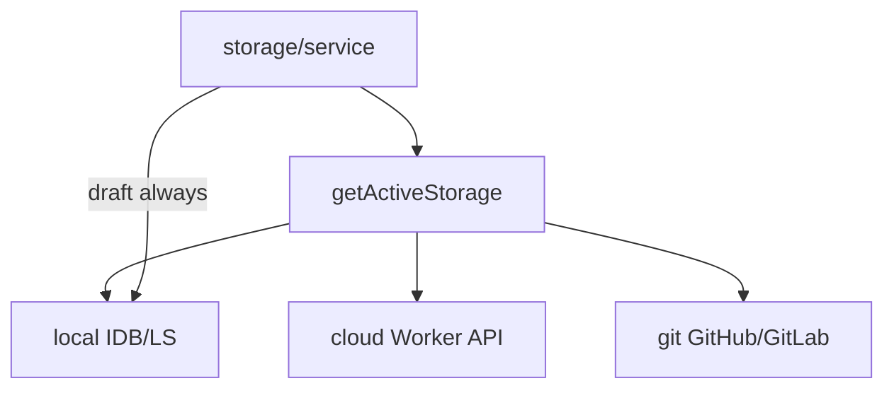

# Storage

## Abstract

**Storage** plugins persist the user’s Pine library and drafts. Built-ins: `local`, `cloud`, `git` — registered from `frontend/src/storage/catalog.ts`. High-level UI/editor APIs go through `frontend/src/storage/service.ts`, which always dual-writes drafts to **local** for crash recovery.

Dynamic `kind: 'storage'` install via URL is **not supported** (`loader.ts` throws).

## Conceptual model



## Built-in plugins

### local (`frontend/src/storage/local.ts`)

| Concern | Detail |
| --- | --- |
| Primary | IndexedDB `pynescript.axis.storage` — stores `scripts`, `kv` |
| Fallback | `localStorage` keys `pynescript.axis.library.v1`, draft keys |
| Migration | Legacy SuperChart keys (`pynescript.superchart.library.v1`, editor docs) |
| Memory | In-process maps when neither IDB nor LS exist (tests/SSR) |
| Capabilities | Offline-friendly |

### cloud (`frontend/src/storage/cloud.ts`)

| Concern | Detail |
| --- | --- |
| Transport | `fetch` to Worker `/api/scripts` |
| Auth | `Authorization: Bearer <api_key>` (`pn_…`) |
| Config | `endpoint` (default `http://127.0.0.1:8787`), `apiKey` |
| Concurrency | `If-Match` revision headers on write |
| Partition | Worker hashes key → `userId`; rows scoped per user |

### git (`frontend/src/storage/git.ts`)

| Concern | Detail |
| --- | --- |
| Providers | GitHub Contents API / GitLab repository files |
| Config | `provider`, `token`, `owner`, `repo`, `branch`, `basePath` (default `pine-library`), commit template |
| Commit boundary | **Explicit Save only** — not every keystroke |
| Drafts | `saveDraft` / `loadDraft` are no-ops; local dual-write handles drafts |
| Capabilities | `needsNetwork`, `needsAuth` |

## Interface surface

Contract: [StoragePlugin](/axis/docs/plugins/contracts).

### service.ts API (UI-facing)

| Function | Behavior |
| --- | --- |
| `listScripts(prefix?)` | Active backend list |
| `readScript` / `writeScript` / `removeScript` | CRUD + log |
| `saveDraft` / `loadDraft` | Local first; also active if supported |
| `exportLibraryJson` / `importLibraryJson` | Portable backup |
| `getStorageStatus` | Connected / dirty / remote hints |

### Catalog helpers

```ts
ensureStoragesRegistered()
getStorage(id)
listStorages()
registerDynamicStorage(plugin)  // in-process only (tests / future)
unregisterDynamicStorage(id)
```

## Internals

| Path | Role |
| --- | --- |
| `storage/catalog.ts` | Registration |
| `storage/local.ts` | IDB + LS |
| `storage/idb.ts` | Promise wrappers for IDB |
| `storage/cloud.ts` | Worker client |
| `storage/git.ts` | Orchestration |
| `storage/git-github.ts` / `git-gitlab.ts` | Provider APIs |
| `storage/git-config.ts` | Config normalize |
| `storage/service.ts` | Facade |
| `worker/src/scripts.ts` | Cloud API implementation |
| `worker/schemas/scripts.sql` | D1 schema |

### D1 schema (cloud)

```sql
PRIMARY KEY (user_id, id)
-- scripts + script_drafts tables
```

Without D1, Worker keeps per-isolate in-memory maps (fine for `wrangler dev`).

## Invariants & edge cases

1. **Draft recovery** — never rely solely on remote drafts; service always hits local.
2. **Git PAT scope** — GitHub `contents:write`; GitLab `api` / `write_repository`.
3. **Revisions** — local uses `local-${timestamp}`; cloud/git use remote revisions for conflict detection.
4. **Active default** — `getActiveStorageId()` → `local` when unset.

## Worked examples

### Export / import

```ts
const docs = await exportLibraryJson();
// …move machine…
await importLibraryJson(docs, { forceNewIds: true });
```

### Point cloud at local Worker

1. `cd frontend/worker && npm run dev` → `:8787`
2. Manager → storage `cloud`
3. Config endpoint `http://127.0.0.1:8787`, key from `/api/keys` or `ALLOW_OPEN_KEYS=1` demo key

## Failure modes

| Error | Cause |
| --- | --- |
| `Cloud storage requires an API key` | Empty `apiKey` |
| 401 `NO_KEY` / `INVALID_KEY` | Auth path; see [Worker auth](/axis/docs/worker/auth) |
| 409 on write | `If-Match` revision conflict |
| Git 401/404 | Token, owner/repo, or basePath wrong |
| Quota errors on localStorage | Large libraries should prefer IDB (automatic when available) |

## See also

- [Worker data plane](/axis/docs/worker/data-plane)
- [Worker auth](/axis/docs/worker/auth)
- [Contracts](/axis/docs/plugins/contracts)
