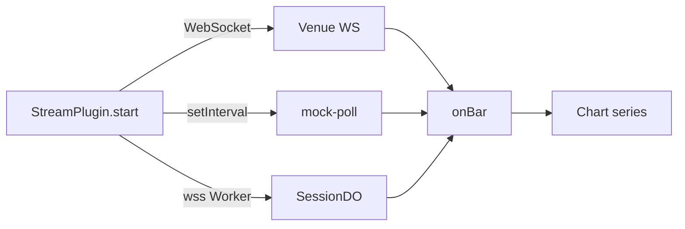

# Copyright (C) 2024-2026 jango_blockchained
#
# This file is part of pynescript.
#
# pynescript is free software: you can redistribute it and/or modify
# it under the terms of the GNU Affero General Public License as published by
# the Free Software Foundation, either version 3 of the License, or
# (at your option) any later version.
#
# pynescript is distributed in the hope that it will be useful,
# but WITHOUT ANY WARRANTY; without even the implied warranty of
# MERCHANTABILITY or FITNESS FOR A PARTICULAR PURPOSE.  See the
# GNU Affero General Public License for more details.
#
# You should have received a copy of the GNU Affero General Public License
# along with pynescript.  If not, see <https://www.gnu.org/licenses/>.
#
# SPDX-License-Identifier: AGPL-3.0-or-later

---
title: "Streams"
description: "Live bar plugins: venue WebSockets, mock poll, and Cloudflare Durable Object relay example."
---

# Streams

## Abstract

A **stream** advances the chart’s present. It opens a connection (or timer), emits `onBar` updates, and returns a **stop** function. Built-ins live in `frontend/src/streams/catalog.ts`. An optional Cloudflare Durable Object relay lives as a loadable example (`example-cf-do-stream.js`) plus Worker `SessionDO`.

## Conceptual model



## Built-in catalog

| id | Name | Offline | Upstream |
| --- | --- | --- | --- |
| `binance-ws` | Binance WebSocket | no | `wss://stream.binance.com:9443/ws/{symbol}@kline_{interval}` |
| `okx-ws` | OKX WebSocket | no | `wss://ws.okx.com:8443/ws/v5/business` candle channels |
| `bybit-ws` | Bybit WebSocket | no | Public linear/spot kline topics |
| `coinbase-ws` | Coinbase WebSocket | no | Exchange WS ticker/candles path |
| `kraken-ws` | Kraken WebSocket | no | Public OHLC channel |
| `mock-poll` | Mock Poll | **yes** | 1s synthetic updates from `lastBar` |

UI order: venues first, `mock-poll` last (`BUILTIN_STREAMS`).

## Interface surface

```ts
start(opts: StreamOpts): () => void
```

Callbacks:

| Callback | Use |
| --- | --- |
| `onBar` | OHLCV update (seconds) |
| `onError` | Hard failure (connect / parse) |
| `onStatus` | `{ state: 'open' \| 'closed' \| …, url?, detail? }` |

Config is usually empty for venue streams; custom streams may declare `configSchema` (e.g. DO endpoint).

## Internals

| Path | Role |
| --- | --- |
| `frontend/src/streams/catalog.ts` | Built-ins + register helpers |
| `frontend/src/streams/binance.ts` | Shared Binance helpers (if split) |
| `frontend/src/streams/multiplex.ts` | Multi-symbol helpers |
| `frontend/worker/src/durable-objects/session.ts` | `SessionDO` fan-out |
| `frontend/public/plugins/example-cf-do-stream.js` | Loadable DO client stream |

### Binance kline mapping

```ts
onBar({
  time: Math.floor(k.t / 1000),
  open: +k.o, high: +k.h, low: +k.l, close: +k.c, volume: +k.v,
});
```

Open bars may update repeatedly for the same `time` until the kline closes — chart series should treat same-time updates as replace, not append-only.

### mock-poll behavior

- Aligns bar `time` to interval slots.
- Updates high/low/close within the open slot; advances on slot change.
- Immediate first tick so live mode feels responsive offline.

### Cloudflare DO stream (example plugin)

Not built-in. After load:

1. Config `endpoint` = Worker origin (`https://…workers.dev` or local `http://127.0.0.1:8787`).
2. Client opens `wss://…/api/stream?session=…&symbol=…&interval=…`.
3. Worker routes to `SessionDO`; DO opens one Binance upstream and broadcasts raw kline JSON.

Requires `SESSIONS` Durable Object binding (often commented in `wrangler.toml` until provisioned).

## Reconnect & status honesty

Built-in venue streams use `openReconnectableWs` (`frontend/src/streams/reconnect-ws.ts`):

- Exponential backoff (1s base, 30s cap, 8 attempts default).
- `onStatus({ state: 'reconnecting', detail })` between attempts.
- Hard `onError` only on construct failure or reconnect exhausted.
- Multiplex keeps stream green **only** after `state: 'open'`; starts as `connecting`.

Optional `Bar.closed` (Binance `k.x`, OKX confirm, Bybit `confirm`) feeds live re-run mode `bar-close` (settings). Multiplex also treats **bar time advance** as a close for venues without a flag.

## Invariants & edge cases

1. **Always return stop** — stop cancels reconnect timers and closes the socket.
2. **Symbol casing** — Binance lowercases stream symbols; OKX uses `BTC-USDT` inst ids.
3. **Browser WS limits** — many tabs × many symbols hit connection caps; DO relay amortizes upstream sockets.
4. **Reconnect is built-in for venue WS** — mock-poll does not reconnect (timer only).

## Failure modes

| Symptom | Cause |
| --- | --- |
| Stream never opens | CORS N/A for WS; check firewall / venue geo blocks |
| DO stream 503 `NO_DO` | `SESSIONS` binding missing |
| Silent no bars | Message shape mismatch (non-kline payloads) |

## See also

- [Sources](/axis/docs/plugins/sources)
- [Worker durable objects](/axis/docs/worker/durable-objects)
- [Plugin examples](/axis/docs/reference/plugin-examples)
