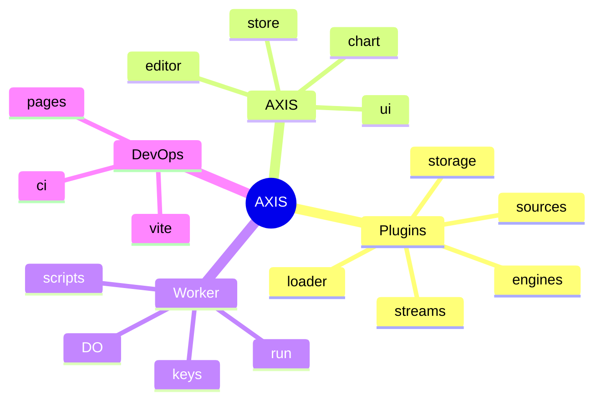

# Feature atlas

## Abstract

This atlas is a **path index** for AXIS. Use it to jump from a product feature to the code that implements it. Prefer Solid product paths over legacy static shell files.

## Conceptual model

## Atlas tables

### Plugin system

| Feature | Primary paths |
| --- | --- |
| Contracts | `frontend/src/plugins/types.ts` |
| Registry | `frontend/src/plugins/registry.ts` |
| Bootstrap | `frontend/src/plugins/bootstrap.ts` |
| Active set | `frontend/src/plugins/active.ts` |
| Dynamic install | `frontend/src/plugins/loader.ts` |
| Barrel | `frontend/src/plugins/index.ts` |
| Manager UI | `frontend/src/ui/PluginManager.tsx`, `plugin-badges.tsx` |
| Docs (in-tree) | `frontend/src/plugins/README.md` |

### Data plugins

| Feature | Primary paths |
| --- | --- |
| Sources | `frontend/src/sources/catalog.ts`, `upload-store.ts` |
| Streams | `frontend/src/streams/catalog.ts`, `multiplex.ts` |
| Engines | `frontend/src/engines/catalog.ts` |
| Load symbol | `frontend/src/data/load-symbol.ts`, `parse-bars.ts` |
| Indicator run | `frontend/src/indicators/runner.ts` |

### Storage / library

| Feature | Primary paths |
| --- | --- |
| Catalog | `frontend/src/storage/catalog.ts` |
| Local IDB | `frontend/src/storage/local.ts`, `idb.ts` |
| Cloud | `frontend/src/storage/cloud.ts` |
| Git | `frontend/src/storage/git.ts`, `git-github.ts`, `git-gitlab.ts` |
| Service façade | `frontend/src/storage/service.ts` |
| Library panel | `frontend/src/ui/ScriptLibraryPanel.tsx` |

### UI (UI)

| Feature | Primary paths |
| --- | --- |
| Entry | `frontend/src/index.tsx`, `app.tsx` |
| Chart host | `frontend/src/chart/ChartHost.tsx`, `manager-access.ts`, `pane-manager.ts`, `series-factory.ts` |
| Drawings | `frontend/src/chart/drawing-layer.ts`, `pine-drawings.ts` |
| Editor | `frontend/src/editor/*` |
| Results | `frontend/src/results/*`, `ui/ResultsPanel.tsx` |
| Store | `frontend/src/store/index.ts`, `types.ts` |
| Topbar / settings | `frontend/src/ui/Topbar.tsx`, `SettingsDialog.tsx` |

### Worker

| Feature | Primary paths |
| --- | --- |
| Router | `frontend/worker/src/index.ts` |
| Run | `frontend/worker/src/runtime.ts`, `pyodide_runtime.ts` |
| Auth / keys | `frontend/worker/src/auth.ts`, `keys.ts` |
| Scripts | `frontend/worker/src/scripts.ts`, `schemas/scripts.sql` |
| Session DO | `frontend/worker/src/durable-objects/session.ts` |
| Config | `frontend/worker/wrangler.toml`, `RUNTIME.md`, `README.md` |

### Build / ops

| Feature | Primary paths |
| --- | --- |
| Package scripts | `frontend/package.json` (`test:*`, `build`, `dev`) |
| Static server | `frontend/axis_pwa_server.py` |
| Public assets | `frontend/public/plugins`, `public/vendor`, `public/pyodide` |
| Makefile | `run-axis` (Vite), `pages-deploy` → `dist/`, `test-frontend` |
| CI | `.github/workflows/ci.yml` (coverage + e2e smoke), `axis-nightly.yml` |
| Coverage gate | `frontend/scripts/check-coverage.mjs` (scoped core ≥95%) |

### Examples & tests

| Feature | Primary paths |
| --- | --- |
| Example plugins | `frontend/public/plugins/*.js`, `src/plugins/example-*.js` |
| Unit tests | `frontend/tests/**` |
| Worker tests | `frontend/worker/tests/**` |
| E2E | `frontend/e2e/**`, `playwright.config.ts` |
| Testing guide | `frontend/TESTING.md` |
| Legacy notes | `frontend/LEGACY.md` |

## Namespaces & keys

| Key / namespace | Use |
| --- | --- |
| `pynescript.axis.plugins.v1` | Installed dynamic plugins |
| `pynescript.axis.library.v1` | Local library LS fallback |
| `pynescript.axis.storage` | IDB database name |
| `pynescript.axis.v1` | App state (target; migrates from superchart) |
| `pynescript.superchart.*` | Legacy keys still read for migration |
| Contract ns | `pynescript.axis.plugins.v1` (conceptual) |

## Infrastructure constants

| Name | Value |
| --- | --- |
| CF project | `pynescript-superchart` |
| Health service | `pynescript-axis-worker` |
| Pyodide version | `0.26.2` (self-hosted path) |

## See also

- [Plugins](/axis/docs/plugins)
- [Worker](/axis/docs/worker)
- [Legacy shell](/axis/docs/reference/legacy-shell)
