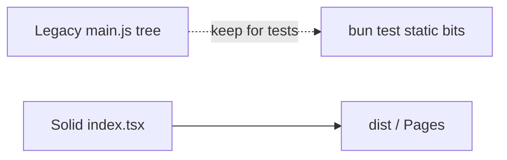

# Legacy shell

## Abstract

AXIS’s shipping product path is **Solid + Vite**. An older **static shell** remains in the repo for historical scripts and some Bun tests. Do not document or extend the legacy shell as the primary UI.

Source of truth: `frontend/LEGACY.md`.

## Conceptual model

## What is legacy

| Path | Role |
| --- | --- |
| `frontend/src/main.js` | Old bootstrap (chart.js, topbar.js, …) |
| `frontend/style.css` | TV-blue-era tokens |
| `frontend/pine-editor.js` | Pre-Solid CM6 wiring |
| `frontend/server.ts` | Bun static server for old tree |
| Root / frontend `sw.js` (static shell SW) | Service worker for old shell |

Makefile `make run-frontend` still prints SuperChart Lite and runs `bun run frontend/server.ts` on `:8081` — useful for legacy debugging, **not** the Solid product path.

## What is current

| Path | Role |
| --- | --- |
| `frontend/src/index.tsx`, `app.tsx` | Solid app |
| `frontend/src/chart/ChartHost.tsx` | LWC panes |
| `frontend/src/ui/*` | Topbar, Settings, Results, Manager, … |
| `frontend/public/` + `bun run build` | Production PWA assets |
| `frontend/axis_pwa_server.py` | Serve **dist** for demos |

## Migration residue

| Residue | Handling |
| --- | --- |
| `pynescript.superchart.plugins.v1` | Loader still reads |
| `pynescript.superchart.library.v1` | Local storage migrates |
| `pynescript.superchart.editor.doc` | Draft migration |
| CF project `pynescript-superchart` | **Frozen** name despite product rebrand |
| Some docs/Makefile strings | Still say SuperChart Lite |

App state target namespace: `pynescript.axis.v1` (migrates from `pynescript.superchart.*`).

## Invariants

1. **Do not port new features into `main.js`.**
2. **Prefer Solid store** (`src/store`) over `state.js`.
3. **Plugin registry** is the Solid path (`src/plugins/registry.ts`); dual registries in old JS should be treated as dead ends.
4. **Pages deploy** should use Vite `dist/`, not the repo root static tree.

## Failure modes

| Confusion | Clarification |
| --- | --- |
| “UI doesn’t match docs” | You may be serving the legacy shell |
| Plugin manager missing | Legacy topbar lacks Solid Manager |
| Tests pass, UI wrong | Unit tests may still import legacy helpers |

## See also

- [Feature atlas](/axis/docs/reference/feature-atlas)
- [Build and serve](/axis/docs/devops/build-and-serve)
- [AXIS hub](/axis/docs)
