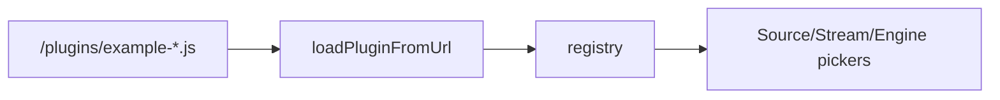

# Copyright (C) 2024-2026 jango_blockchained
#
# This file is part of pynescript.
#
# pynescript is free software: you can redistribute it and/or modify
# it under the terms of the GNU Affero General Public License as published by
# the Free Software Foundation, either version 3 of the License, or
# (at your option) any later version.
#
# pynescript is distributed in the hope that it will be useful,
# but WITHOUT ANY WARRANTY; without even the implied warranty of
# MERCHANTABILITY or FITNESS FOR A PARTICULAR PURPOSE.  See the
# GNU Affero General Public License for more details.
#
# You should have received a copy of the GNU Affero General Public License
# along with pynescript.  If not, see <https://www.gnu.org/licenses/>.
#
# SPDX-License-Identifier: AGPL-3.0-or-later

---
title: "Plugin examples"
description: "Worked AXIS example plugins: CoinGecko source, Tiny Pine engine, Cloudflare DO stream — load paths and contracts."
---

# Plugin examples

## Abstract

AXIS ships three **loadable example plugins** as ES modules under `frontend/public/plugins/` (also mirrored for reference under `frontend/src/plugins/example-*.js`). They are not built-ins; install via Manager → Plugins → **Load from URL**.

Full narrative: `frontend/src/plugins/README.md`.

## Conceptual model



## Loading

1. Serve the PWA (Vite dev, preview, or `axis_pwa_server.py` on `dist`).
2. Open **Manager → Plugins**.
3. Paste a same-origin URL, for example:

```
http://127.0.0.1:8081/plugins/example-coingecko-source.js
http://127.0.0.1:3000/plugins/example-tiny-pine-engine.js
http://127.0.0.1:8081/plugins/example-cf-do-stream.js
```

4. **Load** — registry updates; pickers show the new plugin.
5. Persistence: `localStorage` `pynescript.axis.plugins.v1` restores on next visit.

You may host modules on any origin that allows **module** CORS (same-origin is simplest).

## Example catalog

| File | id | kind | Purpose |
| --- | --- | --- | --- |
| `example-coingecko-source.js` | `coingecko` | source | Public CoinGecko market_chart → synthetic OHLC |
| `example-tiny-pine-engine.js` | `tiny-pine` | engine | In-browser JS DSL: sma/ema/rsi/plot/strategy |
| `example-cf-do-stream.js` | `cf-do` | stream | WS to Worker `/api/stream` SessionDO |

Paths:

- Served: `frontend/public/plugins/`
- Source copies: `frontend/src/plugins/example-*.js`

---

## CoinGecko source

**Contract:** `kind: 'source'`, `fetchHistorical`.

**Config:** `baseUrl` (default CoinGecko v3), `vsCurrency` (default `usd`).

**Behavior:**

- Maps common symbols (`BTC` → `bitcoin`, …).
- Requests `market_chart` for a day window derived from interval × bar budget.
- Synthesizes OHLC from consecutive price points (API is not full candles).

**Limits:** public rate limits (~10–30 calls/min); CORS depends on CoinGecko policy.

**Use when:** demo custom source without a key.

---

## Tiny Pine engine

**Contract:** `kind: 'engine'`, `isReady`, `run`.

**Behavior:**

- Tokenizes a tiny expression language.
- Built-ins: `close`, `open`, `high`, `low`, `volume`, `sma`, `ema`, `rsi`, `plot`, `strategy.entry` / `strategy.close`.
- Returns `RunResult` with plots/events — **not** full PYNE fidelity.

**Use when:** offline demos without loading ~14MB Pyodide or hitting Flask.

---

## Cloudflare DO stream

**Contract:** `kind: 'stream'`, `start` → stop.

**Config:** `endpoint` — Worker base URL (`https://…` or `http://127.0.0.1:8787`). Empty → error.

**URL built:**

```
{endpoint as wss}/api/stream?session={symbol}@{interval}&symbol=…&interval=…
```

**Requires:** Worker with `SESSIONS` Durable Object bound and deployed ([durable objects](/axis/docs/worker/durable-objects)).

**Use when:** many tabs share one upstream Binance kline subscription.

---

## Minimal authoring templates

### Source

```js
export default {
  id: 'my-source',
  name: 'My Source',
  kind: 'source',
  description: 'Shown in Manager',
  configSchema: {
    baseUrl: { type: 'string', default: 'https://example.com', label: 'Base URL' },
  },
  async fetchHistorical({ symbol, interval, config }) {
    const res = await fetch(`${config.baseUrl}/bars?symbol=${symbol}&interval=${interval}`);
    return res.json(); // Bar[]
  },
};
```

### Stream

```js
export default {
  id: 'my-stream',
  name: 'My Stream',
  kind: 'stream',
  start({ symbol, interval, onBar, onError, onStatus }) {
    const ws = new WebSocket('wss://example.com/stream');
    ws.onopen = () => onStatus({ state: 'open' });
    ws.onmessage = (ev) => {
      const b = JSON.parse(ev.data);
      onBar({ time: b.t, open: b.o, high: b.h, low: b.l, close: b.c, volume: b.v });
    };
    ws.onerror = () => onError(new Error('ws error'));
    return () => ws.close();
  },
};
```

### Engine

```js
export default {
  id: 'my-engine',
  name: 'My Engine',
  kind: 'engine',
  async isReady() { return true; },
  async run({ script, bars }) {
    return { status: 'success', plots: bars.map((b) => b.close), events: [], series: {}, meta: {} };
  },
};
```

Storage plugins **cannot** be loaded from URL yet.

## Invariants & edge cases

1. Treat plugin URLs as **executable code**.
2. `normalizePluginUrl` rewrites `/src/plugins/` → `/plugins/` for production.
3. Dangerous schemes rejected (`javascript:`, `vbscript:`, `data:text/html`).
4. After load, window may emit product-specific events (see README) for UI extensions.

## Failure modes

| Issue | Fix |
| --- | --- |
| Failed to restore URL | 404 after deploy path change |
| CORS on CoinGecko | Offline mock or proxy |
| DO stream errors | Bind SessionDO; set endpoint |
| Tiny engine parse errors | Unsupported DSL constructs |

## See also

- [Dynamic loader](/axis/docs/plugins/dynamic-loader)
- [Contracts](/axis/docs/plugins/contracts)
- [Worker durable objects](/axis/docs/worker/durable-objects)
