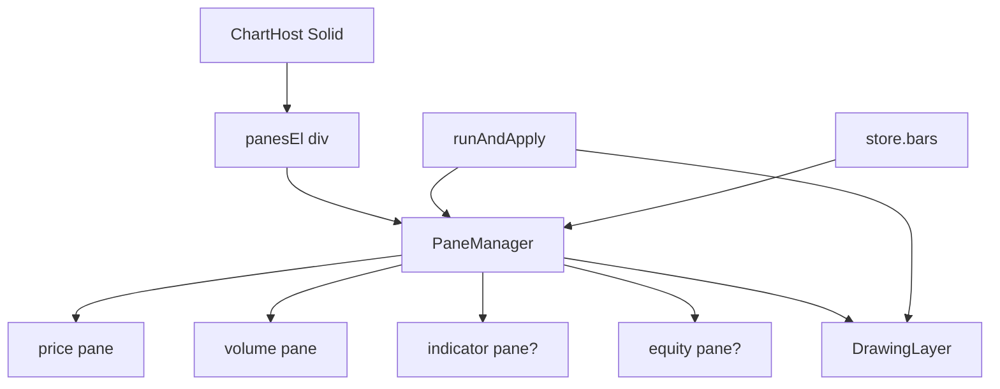

# Copyright (C) 2024-2026 jango_blockchained
#
# This file is part of pynescript.
#
# pynescript is free software: you can redistribute it and/or modify
# it under the terms of the GNU Affero General Public License as published by
# the Free Software Foundation, either version 3 of the License, or
# (at your option) any later version.
#
# pynescript is distributed in the hope that it will be useful,
# but WITHOUT ANY WARRANTY; without even the implied warranty of
# MERCHANTABILITY or FITNESS FOR A PARTICULAR PURPOSE.  See the
# GNU Affero General Public License for more details.
#
# You should have received a copy of the GNU Affero General Public License
# along with pynescript.  If not, see <https://www.gnu.org/licenses/>.
#
# SPDX-License-Identifier: AGPL-3.0-or-later

---
title: "Charting"
description: "AXIS chart: ChartHost, PaneManager, series factory, drawings, crosshair sync, and trade markers."
---

# Charting

Charting is the spatial surface for OHLCV, overlays, and annotations. Implementation is **imperative** under a Solid shell so lightweight-charts owns its DOM subtree.

## Abstract

| Module | Role |
| --- | --- |
| `ChartHost.tsx` | Solid mount; empty-state overlay; lifecycle |
| `pane-manager.ts` | Multi-pane LWC charts, time sync |
| `series-factory.ts` | Candle/volume/line series helpers + palette |
| `drawing-layer.ts` | User + script drawings |
| `crosshair-sync.ts` | Cross-pane crosshair |
| `pine-drawings.ts` | Engine drawing objects → layer |
| `manager-access.ts` | Process-wide manager/layer getters |

## Conceptual model



## Interface surface

### Panes

`store.panes`: `{ id, type, height, order, visible, label }`.

| type | Typical series |
| --- | --- |
| `price` | Candles + overlay lines + markers + drawings |
| `volume` | Histogram |
| `indicator` | Non-overlay plots |
| `equity` | Strategy equity curve |

Defaults: price + volume. Indicator/equity created on demand.

### Empty / status overlay

When `bars.length === 0`, ChartHost shows contextual title/sub from `store.status` (loading, error, running, or “Load data to begin”).

### Drawings toolbar

See operator guide [Drawings](/axis/docs/enduser/guides/drawings). Tools: cursor, hline, trend, ray, rect, fib, measure, text.

### Crosshair & time

`syncTimeScales` / `syncCrosshair` keep multi-pane navigation coherent. `scrollToTime` used from Results trade clicks.

## Internals

### Solid vs imperative boundary

```text
// ChartHost — Solid owns outer shell
// PaneManager only mutates panesEl — never put Solid children inside panesEl
```

On cleanup: destroy drawing layer, dispose manager, clear accessors.

### Data path

`setDataToChart(bars)` applies OHLCV; `createEffect` on `store.bars` re-applies if bars change outside load helper.

### Run apply (chart side)

From `runAndApply` (indicators):

- `syncOverlayLines` — update existing overlay series in place (avoids destroy→blank→add flash on live re-runs)
- Markers from normalized events (set in place)
- Script drawings atomic replace via DrawingLayer (`setScriptDrawings` without empty frame)
- Equity series when strategy report warrants (silent live runs skip hide thrash)

### History vs live bars

- Full loads: `loadBars` → `chartDataGen++` → `setDataToChart` + fitContent  
- Live: `multiplex` → `appendBar` + `manager.appendBar` only (no fitContent, no full setData)

### series-factory

Centralizes series construction options and color palette so Results plot summary and chart stay chromatically related.

## Invariants

1. Solid reconciliation must not rewrite pane roots.  
2. Script drawings ephemeral per run; user drawings store-backed.  
3. Overlay default true unless `meta.overlay === false`.  
4. Manager may be null before mount—runner no-ops chart apply safely.

## Failure modes

| Symptom | Cause |
| --- | --- |
| Blank panes after hot reload | Manager disposed; full remount |
| Overlays stack forever | Old path skipped removeOverlays |
| Fib/tools ignore clicks | No bars / time scale; wrong tool |
| Markers at t=0 | Event times not bar-aligned |

## Worked example (dev)

```ts
import { getManager } from './chart/manager-access';
getManager()?.scrollToTime(barTime);
```

## See also

- [Indicators](/axis/docs/ui/indicators)
- [Results and strategy](/axis/docs/ui/results-and-strategy)
- [End-user drawings](/axis/docs/enduser/guides/drawings)
