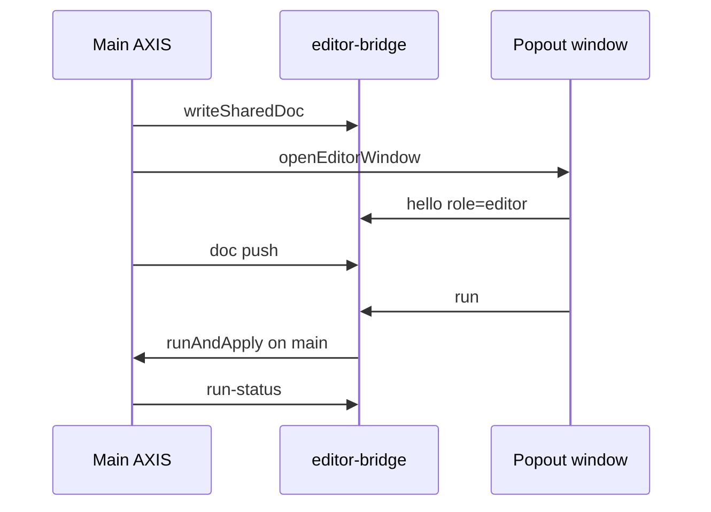

# Editor

The editor is the **source axis of intent**: Pine text the operator authorizes the engine to run. It is not a language server host by default in the PWA path (LSP lives in the broader pynescript project).

## Abstract

| Module | Role |
| --- | --- |
| `EditorPane.tsx` | Docked/standalone chrome, resize, detach |
| `tabbed-editor.tsx` | Multi-tab document UX |
| `PineEditor.tsx` | CM6 mount |
| `pine-language.ts` | StreamLanguage / highlighting |
| `editor-bridge.ts` | Cross-window doc + run messages |
| `cm-void.ts` | Void-theme CM styling |

## Conceptual model

**Why run on main?** Chart, bars, and pane manager live in the main window. Popout is a pure editing surface.

## Interface surface

### Docked mode

- Right column in `app.tsx` when `editor.open && mode === 'docked'`
- Resize via `ResizeHandle` → `editor.width`
- Hide chevron → `setEditorOpen(false)`
- Detach → popup or tab (`openEditorWindow`)

### Popout mode

- Main shows “Editor detached” chip + **Reattach**
- Shared doc key + bridge messages: `hello`, `doc`, `run`, `run-status`, `reattach`, `popout-opened`, `popout-closed`
- Stale popout mode after reload: main waits for editor hello

### Run entry points

- Editor Run control → `onRun(doc)` → `runAndApply`
- Topbar Run uses same `editorRef.getDoc()`
- Popout Run → bridge → main executes

### Library load

`loadLibraryDoc(doc, name)` (when provided on ref) injects storage reads without fighting CM transaction history poorly—panel calls through App wiring.

## Internals

### editorRef pattern

App holds a mutable ref object `{ getDoc, setDoc?, loadLibraryDoc? }` populated by child mount—avoids over-reactive store writes on every keystroke for the full document (doc also optionally mirrored to `EDITOR_DOC_KEY`).

### Language package

`pine-language.ts` supplies CM language support sufficient for editing comfort; **semantic diagnostics** are not a substitute for engine errors (Results / status).

### Persistence

- Layout: `store.editor` in `pynescript.axis.v1`
- Text: `pynescript.axis.editor.doc` (+ legacy migration)

## Invariants

1. Empty doc Run is no-op at topbar/editor handlers.  
2. Popout does not own PaneManager.  
3. Reattach restores shared doc into docked CM.  
4. AXIS ≠ engine: editor never evaluates Pine itself.

## Failure modes

| Symptom | Mitigation |
| --- | --- |
| Two editors diverge | Prefer bridge doc events; reattach |
| Detached but no window | Popup blocked; allow popups; reattach |
| Lost text on crash | editor.doc localStorage; library Save |

## See also

- [UI shell](/axis/docs/ui/ui-shell)
- [Indicators](/axis/docs/ui/indicators)
- [Script library](/axis/docs/enduser/guides/script-library)
