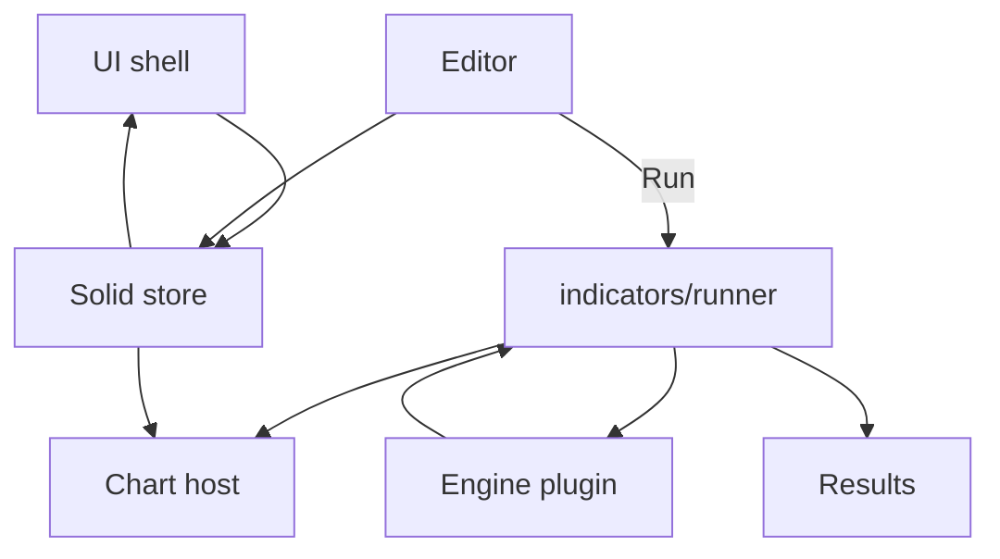

# Copyright (C) 2024-2026 jango_blockchained
#
# This file is part of pynescript.
#
# pynescript is free software: you can redistribute it and/or modify
# it under the terms of the GNU Affero General Public License as published by
# the Free Software Foundation, either version 3 of the License, or
# (at your option) any later version.
#
# pynescript is distributed in the hope that it will be useful,
# but WITHOUT ANY WARRANTY; without even the implied warranty of
# MERCHANTABILITY or FITNESS FOR A PARTICULAR PURPOSE.  See the
# GNU Affero General Public License for more details.
#
# You should have received a copy of the GNU Affero General Public License
# along with pynescript.  If not, see <https://www.gnu.org/licenses/>.
#
# SPDX-License-Identifier: AGPL-3.0-or-later

---
title: "UI"
description: "AXIS UI subsystem: chart host, editor, UI shell, indicators, results, and Solid store—presentation without a closed engine."
---

# UI

**UI** is the AXIS browser presentation layer: everything the operator sees and clicks that is *not* language evaluation. Engines are plugins; AXIS applies their outputs to panes, markers, and drawers.

## Abstract

| Subsystem | Responsibility |
| --- | --- |
| [Charting](/axis/docs/ui/charting) | lightweight-charts panes, drawings, crosshair |
| [Editor](/axis/docs/ui/editor) | CodeMirror 6 Pine surface, dock/popout |
| [UI shell](/axis/docs/ui/ui-shell) | Topbar, watchlist, status, manager chrome |
| [Indicators](/axis/docs/ui/indicators) | Run pipeline, overlay apply, indicator list |
| [Results & strategy](/axis/docs/ui/results-and-strategy) | Event normalize, trades, export |
| [Store](/axis/docs/ui/store) | Solid store, persistence, active plugins |

## Conceptual model



**Invariant (AXIS ≠ engine):** no Solid component imports PYNE directly; only engine modules talk to Python/HTTP runtimes.

## Interface surface (visual map)

```text
┌─ Topbar ──────────────────────────────────────────────┐
├─ Watchlist ─┬─ ChartHost + drawings ─┬─ Indicators ─┬─ Editor ─┤
├─ Results drawer ──────────────────────────────────────┤
├─ System logs ─────────────────────────────────────────┤
└─ StatusBar ───────────────────────────────────────────┘
   + Settings modal + Plugin Manager modal
```

Implemented in `frontend/src/app.tsx`.

## Stack

| Concern | Choice |
| --- | --- |
| Framework | SolidJS 1.9 |
| Bundler | Vite 6 + `vite-plugin-solid` |
| Charts | lightweight-charts 5 |
| Editor | CodeMirror 6 |
| Icons | lucide-solid |
| Style | Tailwind 4 + void tokens (`data-theme`) |

## Relation to other tracks

- Operators: [End User](/axis/docs/enduser)  
- Structure: [Architecture](/axis/docs/architecture)  
- Contracts: [Plugins](/axis/docs/plugins)  
- Language: [PYNE runtime](/pyne/docs/runtime)  

## See also

- `frontend/LEGACY.md` — what is *not* the AXIS product path  
- `frontend/TESTING.md` — unit/e2e around UI modules  
