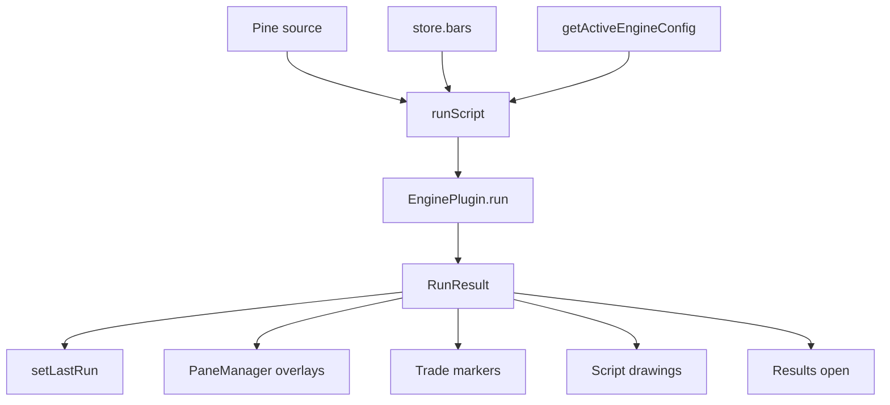

# Copyright (C) 2024-2026 jango_blockchained
#
# This file is part of pynescript.
#
# pynescript is free software: you can redistribute it and/or modify
# it under the terms of the GNU Affero General Public License as published by
# the Free Software Foundation, either version 3 of the License, or
# (at your option) any later version.
#
# pynescript is distributed in the hope that it will be useful,
# but WITHOUT ANY WARRANTY; without even the implied warranty of
# MERCHANTABILITY or FITNESS FOR A PARTICULAR PURPOSE.  See the
# GNU Affero General Public License for more details.
#
# You should have received a copy of the GNU Affero General Public License
# along with pynescript.  If not, see <https://www.gnu.org/licenses/>.
#
# SPDX-License-Identifier: AGPL-3.0-or-later

---
title: "Indicators"
description: "AXIS indicator UI: runAndApply pipeline, active engine binding, overlay routing, and IndicatorPanel."
---

# Indicators

“Indicators” in AXIS terms means **scripts applied to the chart**, whether `indicator()` or `strategy()` in Pine. The module boundary is `indicators/runner.ts` plus list UI—not the PYNE evaluator.

## Abstract

| Piece | Role |
| --- | --- |
| `runScript` | Engine invocation + status/timeouts |
| `runAndApply` | Chart + lastRun + results open |
| `probeEndpoint` | Settings health check helper |
| `IndicatorPanel` | List/toggle scripts in store |
| `IndicatorCard` | Per-script UI chrome |

Language semantics: [PYNE runtime](/pyne/docs/runtime).

## Conceptual model



## Interface surface

### runScript options

| Option | Default | Meaning |
| --- | --- | --- |
| `silent` | false | Quiet status; live re-run logging |
| timeout | derived | Interactive: scales with bars (60–180s); silent 45s |

### runAndApply options

| Option | Default | Meaning |
| --- | --- | --- |
| `openResults` | `!silent` | Open results drawer |
| `indicatorId` | optional | Update existing store indicator |

### Overlay routing

```text
overlay = result.meta.overlay !== false
paneId  = overlay ? 'price' : 'indicator'
```

Non-overlay creates indicator pane if missing (`addPane` + manager `createPane`).

### Series selection

Prefer `result.series` entries whose keys do not start with `_` / `__`. Fallback: single `plots[]` array as one line named from `script_name`.

Colors: `plot_meta[k].color` or `PLOT_PALETTE[i]`.

### Indicator panel

Side list of `store.scripts` (`Indicator`: id, name, code, paneId, visible, plots). Visibility toggles affect display intent; re-run still engine-driven.

## Active engine binding

```ts
// plugins/active.ts pattern
getActiveEngine()        // registry lookup by activePlugins.engine
getActiveEngineConfig()  // pluginsConfig + store.endpoint merge
```

Switching engines mid-session does not auto-rerun; operator hits Run.

## Live re-run coupling

Streams may set `live.needsRerun`; multiplex/runner path can call `runAndApply` with `silent: true` so the status bar is not spammed. Failures go to logs.

## Internals

| Path | Role |
| --- | --- |
| `frontend/src/indicators/runner.ts` | Pipeline |
| `frontend/src/indicators/IndicatorPanel.tsx` | List UI |
| `frontend/src/plugins/active.ts` | Active engine/source helpers |
| `frontend/src/engines/catalog.ts` | Built-in engines |

## Invariants

1. Runner is the **only** chart-facing calc orchestrator (avoid duplicate apply logic in components).  
2. Errors still `setLastRun` with `status: 'error'` when possible.  
3. Clearing overlays happens before re-adding—no unbounded series leak.  
4. AXIS does not interpret Pine; it only maps `RunResult`.

## Failure modes

| Symptom | Layer |
| --- | --- |
| Engine exception | Results error + status |
| Success empty plots | Script/meta—not runner |
| Manager null | Chart not mounted; run still sets lastRun |
| AbortError | Timeout—reduce bars or optimize script |

## See also

- [Charting](/axis/docs/ui/charting)
- [Results and strategy](/axis/docs/ui/results-and-strategy)
- [ADR-002 / ADR-004](/axis/docs/architecture/adrs)
