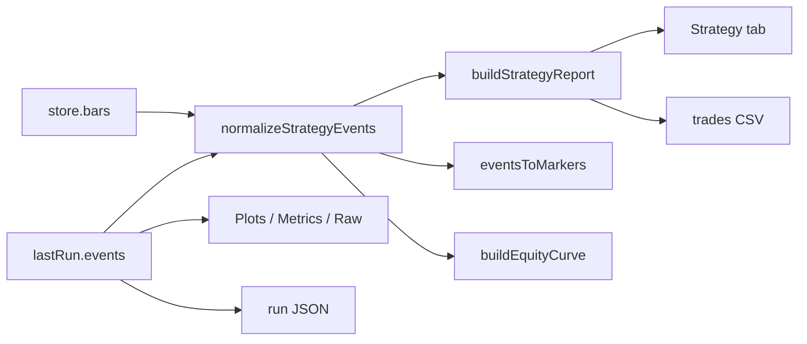

# Results and strategy

Results UI turns opaque engine payloads into **operator-consumable tables, metrics, and files**. It is a pure-ish viewer layer over `lastRun` + `bars`.

## Abstract

| Module | Role |
| --- | --- |
| `results/events.ts` | Normalize heterogeneous event shapes; markers; equity series |
| `results/strategy.ts` | Pair trades; stats; CSV helpers |
| `ui/ResultsPanel.tsx` | Tabs, export, jump-to-time |
| `ui/StatusBar.tsx` | Compact trade summary |

## Conceptual model

## Event normalization

Engines may emit Pro API parity fields (`kind`, `bar_time`, `direction`, `ohlc`) or legacy UI fields (`type`, `time`, `dir`, `price`). Normalizer:

- Unifies time/price/dir/id  
- Optionally fills price from bars when OHLC present/empty  
- Can include order-like events for the Events tab  

## Trade pairing algorithm

Sketch (`buildStrategyReport`):

1. Sort by time.  
2. On entry-like kind → open map by `id`.  
3. On exit/close-like → match id, else sole open trade.  
4. PnL = Δprice × long/short sign.  
5. Aggregate win rate, profit factor, max DD on cumulative PnL.

**Not modeled:** fees, funding, partial fills, portfolio multi-symbol—viewer honesty.

## ResultsPanel tabs

| Tab | Data source |
| --- | --- |
| Events | `normalizedEvents` |
| Strategy | `report.trades` + `report.stats` |
| Plots | `series` / `plots` summary |
| Metrics | meta + context + stats subset |
| Raw | `JSON.stringify(lastRun)` |

Interactions: copy, export, `scrollToTime` on trade rows.

## Equity

`buildEquityCurve` feeds chart equity pane when runner/strategy path requests it—derived series, not engine-native unless also provided.

## Export (ADR-013)

| Artifact | Function |
| --- | --- |
| `axis-run-*.json` | Full payload |
| `axis-trades-*.csv` | `tradesToCsv` |
| Clipboard | CSV when permitted |

## Invariants

1. Results recompute from `lastRun` reactively; they do not re-query engines.  
2. Changing bars without re-run can change normalization fills—re-run after Load.  
3. `lastRun` not rehydrated from localStorage (session artifact).  
4. Infinite profit factor when no losses but profits exist—display must tolerate non-finite.

## Failure modes

| Symptom | AXIS explanation |
| --- | --- |
| Events > 0, trades = 0 | Unpaired or missing prices |
| CSV disabled | No closed trades |
| Jump no-ops | Manager unmounted / invalid time |

## Internals cross-links

Operator narrative: [Strategy and results](/axis/docs/enduser/guides/strategy-and-results).  
Architecture: [ADR-013](/axis/docs/architecture/adrs).

## See also

- [Indicators](/axis/docs/ui/indicators)
- [Charting](/axis/docs/ui/charting)
