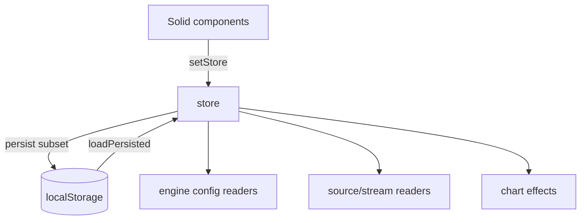

# Copyright (C) 2024-2026 jango_blockchained
#
# This file is part of pynescript.
#
# pynescript is free software: you can redistribute it and/or modify
# it under the terms of the GNU Affero General Public License as published by
# the Free Software Foundation, either version 3 of the License, or
# (at your option) any later version.
#
# pynescript is distributed in the hope that it will be useful,
# but WITHOUT ANY WARRANTY; without even the implied warranty of
# MERCHANTABILITY or FITNESS FOR A PARTICULAR PURPOSE.  See the
# GNU Affero General Public License for more details.
#
# You should have received a copy of the GNU Affero General Public License
# along with pynescript.  If not, see <https://www.gnu.org/licenses/>.
#
# SPDX-License-Identifier: AGPL-3.0-or-later

---
title: "Store"
description: "AXIS Solid store: AppState shape, activePlugins, persistence rules, logging, and alignment helpers."
---

# Store

The Solid store is the **control-plane nexus** of AXIS. Plugins read configuration from it; UI binds reactively; persistence snapshots a safe subset to `pynescript.axis.v1`.

## Abstract

| Export | Role |
| --- | --- |
| `store` / `setStore` | `createStore<AppState>` |
| `persist` | Debounced localStorage write |
| `setActivePlugin` | Kinded selection + flat field mirrors |
| `appendLog` / status helpers | Operator-visible telemetry |
| `STORAGE_KEY` | `pynescript.axis.v1` |

Types: `frontend/src/store/types.ts`.

## Conceptual model



## AppState map

| Field | Persistence | Notes |
| --- | --- | --- |
| `bars` | no | Session history |
| `symbol`, `interval`, `exchange` | yes | Market context |
| `source`, `engine` | yes | Flat mirrors |
| `endpoint` | yes | Server engine base URL |
| `activePlugins` | yes | Canonical four-tuple |
| `pluginsConfig` | yes | Per-plugin fields |
| `scripts`, `panes` | yes | Indicator list + layout |
| `live` | partial | streamId important |
| `theme` | yes | dark/light |
| `editor`, `watchlist`, panels | yes | Chrome geometry |
| `stream.status` | yes/volatile | Connection hint |
| `status`, `statusMessage`, `lastRunMs` | yes* | UX; ok to restore |
| `lastRun` | **no** | Forced null on hydrate |
| `logs` | **no** | Forced empty |
| `drawingTool` | reset cursor | On hydrate |
| `drawings` | yes | User annotations |

\*Status fields may restore but boot also appends fresh logs.

## Defaults (product)

Representative defaults from store:

| Key | Default |
| --- | --- |
| symbol | `BTCUSDT` |
| interval | `1d` |
| source / active source | `binance-rest` |
| stream | `binance-ws` |
| engine | `server` |
| storage | `local` |
| endpoint | demo/API host or localhost depending on build era |
| editor width | 460 docked open |
| watchlist | majors, 15s refresh |

Treat demo endpoints as **overridable**—operators should set local URLs in desk topology.

## setActivePlugin

```text
setActivePlugin(kind, id):
  activePlugins[kind] = id
  if source → source = id
  if engine → engine = id
  if stream → live.streamId = id
  persist()
```

Prevents registry/store split brain ([architecture overview](/axis/docs/architecture/overview)).

## Logging

```text
appendLog(level, message, source?)
levels: info | ok | warn | error
MAX_LOGS = 500
```

`setStatus` maps app status to log levels for important transitions.

## Legacy dual path

Vanilla `state.js` remains for legacy shell with the same storage key family. Product AXIS uses Solid store only—do not dual-write new features to `state.js` unless maintaining legacy.

## Invariants

1. Hydrate never restores `lastRun` or `logs`.  
2. Persist strips `bars`.  
3. Migration from SuperChart keys is read-repair ([state namespaces](/axis/docs/architecture/state-namespaces)).  
4. `pluginsConfig` keys prefer `` `${kind}:${id}` ``.  
5. Store is not a plugin registry—ids must exist in registry to function at runtime.

## Failure modes

| Mode | Behavior |
| --- | --- |
| JSON parse fail | Defaults |
| localStorage throws | No-op persist |
| Unknown plugin id | UI may show id; run/load fails at getActive* |
| Oversized drawings | Quota risk—export/clear |

## Testing notes

- Import `tests/setup.ts` for localStorage stubs  
- Unit coverage includes store + migration patterns  
- Do not require real IDB in pure store tests  

## See also

- [State namespaces](/axis/docs/architecture/state-namespaces)
- [ADR-011](/axis/docs/architecture/adrs)
- [UI shell](/axis/docs/ui/ui-shell)
