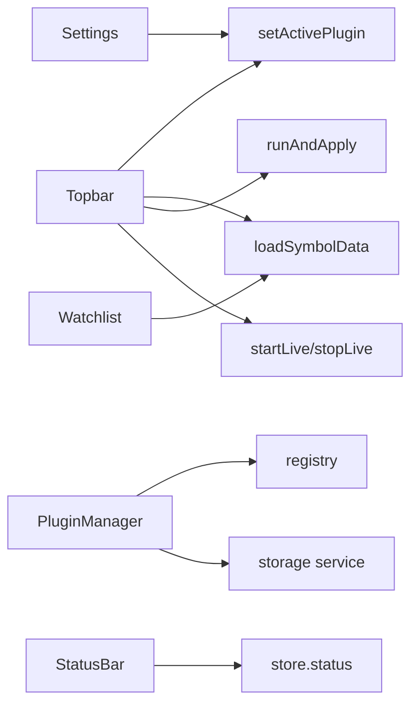

# Copyright (C) 2024-2026 jango_blockchained
#
# This file is part of pynescript.
#
# pynescript is free software: you can redistribute it and/or modify
# it under the terms of the GNU Affero General Public License as published by
# the Free Software Foundation, either version 3 of the License, or
# (at your option) any later version.
#
# pynescript is distributed in the hope that it will be useful,
# but WITHOUT ANY WARRANTY; without even the implied warranty of
# MERCHANTABILITY or FITNESS FOR A PARTICULAR PURPOSE.  See the
# GNU Affero General Public License for more details.
#
# You should have received a copy of the GNU Affero General Public License
# along with pynescript.  If not, see <https://www.gnu.org/licenses/>.
#
# SPDX-License-Identifier: AGPL-3.0-or-later

---
title: "UI shell"
description: "AXIS chrome: topbar, watchlist, status bar, settings, plugin manager, logs, and layout chrome around the chart."
---

# UI shell

The shell is the non-canvas chrome: navigation of axes, market selection, modals, and status. It binds human gestures to store + plugins without owning calculation.

## Abstract

| Component | Path | Role |
| --- | --- | --- |
| Topbar | `ui/Topbar.tsx` | Axes pickers, Load/Run/Live, theme, modals |
| Watchlist | `ui/Watchlist.tsx` | Symbols, quotes, click-to-load |
| StatusBar | `ui/StatusBar.tsx` | Status, engine/storage badges, trade snippet |
| SettingsDialog | `ui/SettingsDialog.tsx` | Endpoint, engine, storage, intervals |
| PluginManager | `ui/PluginManager.tsx` | Catalog / install / library |
| SystemLogs | `ui/SystemLogs.tsx` | Ring buffer of `store.logs` |
| ResultsPanel | `ui/ResultsPanel.tsx` | Bottom drawer (see results doc) |
| Icons | `ui/icons.tsx` | Lucide wrappers |
| ResizeHandle | `ui/ResizeHandle.tsx` | Panel widths/heights |

## Conceptual model

## Topbar responsibilities

| Control | Effect |
| --- | --- |
| Symbol / interval | Store + Load |
| Source select | `setActivePlugin('source')` + default stream |
| Stream select | `live.streamId` / active stream |
| Engine select | Active engine (+ pyodide preload side effects) |
| CSV file | `parseOhlcvFile` → upload-store → load |
| Load | Historical fetch |
| Run | Editor doc → runAndApply |
| Live | multiplex start/stop |
| Editor / watchlist toggles | Layout flags |
| Settings / Plugins | Modal open |
| Detach editor | Bridge + popout |

`catalogTick` forces memo re-list when plugins install/remove.

## Watchlist

- Default universe includes majors (`BTCUSDT`, …)
- `refreshSec` clamped 5–120
- Source-aware labels (e.g. CSV mode)
- Click sets symbol and loads through active source

## Status bar

Single row:

- **Left — Connection HUD** (`ConnectionHud`, `data-testid="axis-connection-hud"`)
  - LIVE badge (off / connecting / live / err)
  - Tick pulse (fixed-width price + age; ping does not resize layout)
  - Engine chip (id · interpret/compile · latency)
  - Plane chips SRC / STR / ENG / STO with transport badges **WS / REST / LOCAL / BROKER**
  - Source↔stream pairing warning when mismatched
- **Right** — `status` / `statusMessage`, strategy snippet, log toggle, bar/ind/pane counts

Telemetry is ephemeral (`store.telemetry`); HUD compact mode and live prefs persist via settings.

### Live settings (Settings dialog)

| Setting | Default | Effect |
| --- | --- | --- |
| Auto-start live after Load | off | `live.preferAfterLoad` → multiplex after successful Load |
| Indicator re-run | every-tick | or `bar-close` only |
| Compact connection HUD | off | hide plane chips |

## Logs

- `appendLog(level, message, source)`
- Cap `MAX_LOGS` (500)
- Not persisted
- Boot messages, pyodide ready, live errors

## Theming

`store.theme` → `document.documentElement data-theme` (`dark` \| `light`). Void dark is default product aesthetic.

## Accessibility / test hooks

E2E selectors use `data-testid` on critical controls (`axis-btn-load`, `axis-manager`, …) per `TESTING.md`.

## Invariants

1. Shell never calls Python.  
2. Plugin lists always come from registry facades (`listSources`, …).  
3. Modal settings persist only on Save (not on every keystroke of endpoint field until save).  
4. Live off leaves historical bars intact.

## Failure modes

| Symptom | Shell-side check |
| --- | --- |
| Pickers empty | Builtins not registered at boot |
| Live ignores click | Stream `none` or multiplex error in logs |
| Settings probe fails | Network / CORS—not topbar bug |

## See also

- [Manager and settings](/axis/docs/enduser/guides/manager-and-settings)
- [Store](/axis/docs/ui/store)
- [Architecture overview](/axis/docs/architecture/overview)
