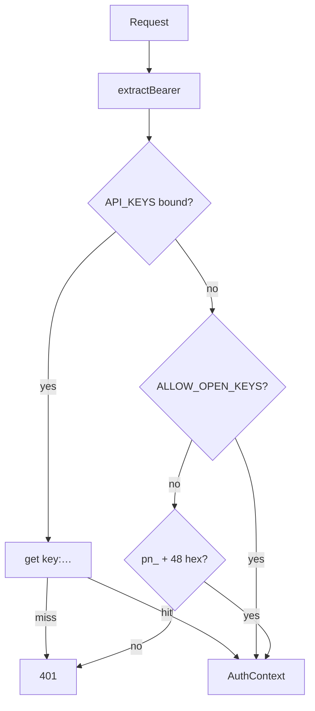

# Worker auth

## Abstract

AXIS Worker auth is **API-key based**, not session cookies. Keys are created by admins (`X-Admin-Token`), validated via KV when bound, and used as `Authorization: Bearer` on script library and optionally on `/api/run` (usage metering).

Core helpers: `frontend/worker/src/auth.ts`. Key CRUD: `frontend/worker/src/keys.ts`.

## Conceptual model



## Interface surface

### AuthContext

```ts
{ key: string; userId: string; tier: string }
```

`userId` is a truncated SHA-256 of the key (stable partition id).

### extractBearer

1. `Authorization: Bearer <token>`
2. Else query `?key=`

### requireApiKey

Returns either `{ ok: true, ctx }` or `{ ok: false, status, code, message }`.

| Code | HTTP | When |
| --- | --- | --- |
| `NO_KEY` | 401 | Empty |
| `INVALID_KEY` | 401 | Unknown in KV / malformed |

### Admin keys API (`/api/keys`)

| Action | Auth | Behavior |
| --- | --- | --- |
| create (`POST` or `?action=create`) | `X-Admin-Token` === `env.ADMIN_TOKEN` | Mint `pn_` + 48 hex, store `key:{key}` in KV (1y TTL) with tier |
| validate (`GET` or `?action=validate`) | Bearer or `?key=` | Tier + created_at if known |

Tiers: `free` \| `hobby` \| `pro` \| `team` \| `enterprise`.

Without `ADMIN_TOKEN` set, **create always fails** (`isAdmin` false).

Without KV on validate: accepts well-formed `pn_[a-f0-9]{48}` as hobby (dev).

### ALLOW_OPEN_KEYS

`wrangler.toml` defaults local demos to `"1"`:

> accept any non-empty Bearer key for `/api/scripts`

**Never leave open in production.** Prefer bound `API_KEYS` + real admin-minted keys.

## Internals

| Path | Role |
| --- | --- |
| `src/auth.ts` | Bearer, hash, requireApiKey |
| `src/keys.ts` | Admin create / validate |
| `src/runtime.ts` | Optional usage increment by Bearer |
| `src/scripts.ts` | requireApiKey gate |

### Key format

```ts
'pn_' + 24 random bytes as hex  // 48 hex chars
```

## Invariants & edge cases

1. **Admin token is a shared secret** — rotate via wrangler secrets in production, not committed vars.
2. **KV record shape** — JSON `{ key, tier, createdAt }` under `key:${apiKey}`.
3. **No OAuth / cookies** — PWA stores the key in plugin config (`storage:cloud`).
4. **Stream DO unauthenticated** — public market data only.

## Worked examples

### Create a key (admin)

```bash
curl -sS -X POST 'http://127.0.0.1:8787/api/keys?action=create' \
  -H "X-Admin-Token: $ADMIN_TOKEN" \
  -H 'content-type: application/json' \
  -d '{"tier":"hobby"}'
```

### Validate

```bash
curl -sS 'http://127.0.0.1:8787/api/keys?action=validate' \
  -H "Authorization: Bearer pn_…"
```

## Failure modes

| Symptom | Cause |
| --- | --- |
| 403 create | Wrong/missing admin token |
| 401 scripts | Open keys off + no KV + bad shape |
| Cross-user leakage tests fail | Partition hash regression |

## See also

- [Data plane](/axis/docs/worker/data-plane)
- [Bindings](/axis/docs/worker/bindings)
- [Security tests](/axis/docs/reference/testing)
