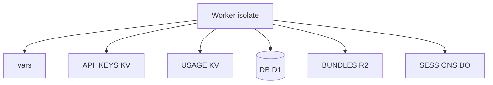

# Copyright (C) 2024-2026 jango_blockchained
#
# This file is part of pynescript.
#
# pynescript is free software: you can redistribute it and/or modify
# it under the terms of the GNU Affero General Public License as published by
# the Free Software Foundation, either version 3 of the License, or
# (at your option) any later version.
#
# pynescript is distributed in the hope that it will be useful,
# but WITHOUT ANY WARRANTY; without even the implied warranty of
# MERCHANTABILITY or FITNESS FOR A PARTICULAR PURPOSE.  See the
# GNU Affero General Public License for more details.
#
# You should have received a copy of the GNU Affero General Public License
# along with pynescript.  If not, see <https://www.gnu.org/licenses/>.
#
# SPDX-License-Identifier: AGPL-3.0-or-later

---
title: "Worker bindings"
description: "wrangler.toml vars, KV, D1, R2, Durable Objects — provision once, paste IDs, frozen project name."
---

# Worker bindings

## Abstract

Bindings and vars for the AXIS Worker are declared in `frontend/worker/wrangler.toml`. Many production bindings ship **commented** so clone-and-dev does not require Cloudflare resources; `wrangler dev` synthesizes local substitutes where possible.

**Project name is frozen:** `name = "pynescript-superchart"`.

## Conceptual model



## Interface surface — Env

From `src/index.ts`:

```ts
interface Env {
  API_KEYS?: KVNamespace;
  USAGE?: KVNamespace;
  DB?: D1Database;
  BUNDLES?: R2Bucket;
  SESSIONS?: DurableObjectNamespace;

  EXTERNAL_BACKEND?: string;
  ALLOWED_ORIGIN?: string;
  ADMIN_TOKEN?: string;
  PYODIDE_IN_WORKER?: string;
  ALLOW_OPEN_KEYS?: string;
}
```

## Vars (`[vars]`)

| Var | Default (repo) | Role |
| --- | --- | --- |
| `EXTERNAL_BACKEND` | `""` | Flask (or other) base URL for `/api/run` proxy |
| `ALLOWED_ORIGIN` | `https://pynescript.ai` | CORS allow when Origin not local |
| `ADMIN_TOKEN` | `""` | Shared secret for key minting |
| `PYODIDE_IN_WORKER` | `"disabled"` | Gate in-worker Python |
| `ALLOW_OPEN_KEYS` | `"1"` | Local demos; set `"0"` in prod |

Prefer **secrets** for `ADMIN_TOKEN` and production backends:

```bash
wrangler secret put ADMIN_TOKEN
wrangler secret put EXTERNAL_BACKEND
```

## Provision recipes

### KV

```bash
wrangler kv namespace create API_KEYS
wrangler kv namespace create USAGE
# paste ids into wrangler.toml [[kv_namespaces]]
```

### D1

```bash
wrangler d1 create pynescript
# [[d1_databases]] binding = "DB"  (name MUST be DB)
wrangler d1 execute pynescript --remote --file=schemas/scripts.sql
```

Repo may already contain a `database_id` for the project’s D1 — treat IDs as environment-specific when forking.

### R2 (optional)

```bash
wrangler r2 bucket create indicator-bundles
# binding BUNDLES
```

### Durable Objects

Uncomment bindings + migrations in `wrangler.toml`, then:

```bash
wrangler deploy
```

Class: `SessionDO` exported from `src/index.ts`.

## Other wrangler settings

| Setting | Value |
| --- | --- |
| `main` | `src/index.ts` |
| `compatibility_date` | `2024-11-01` |
| `compatibility_flags` | `nodejs_compat` |
| `[observability]` | `enabled = true` |

Static PWA assets are **not** served by this Worker in the documented split: **Pages** serves `dist/`, Worker serves API/WS. Project name for Pages deploy remains `pynescript-superchart`.

## Deploy commands

```bash
cd frontend/worker
wrangler deploy

# Pages (from frontend/)
bun run build
wrangler pages deploy dist --project-name=pynescript-superchart
# or npm run deploy:pages from worker package
```

Makefile: `make worker-deploy`, `make pages-deploy` (note: some Makefile targets still point at legacy tree — prefer `dist/` from Vite build; see [build and serve](/axis/docs/devops/build-and-serve)).

## Invariants & edge cases

1. **Do not rename** CF project without migrating all binding IDs, custom domains, and CI.
2. **Local wrangler** auto-provisions mock KV/D1; production needs real IDs.
3. **`EXTERNAL_BACKEND=localhost` on CF** cannot reach your laptop — use a public tunnel or co-located VPS.
4. **Health** reports which optional bindings are present.

## Failure modes

| Deploy / runtime issue | Fix |
| --- | --- |
| Deploy fails placeholder KV | Uncomment only after create, or leave commented |
| Scripts empty | Apply SQL schema |
| Stream 503 | Enable DO binding + migration |
| CORS fails prod origin | Set `ALLOWED_ORIGIN` to exact Pages origin |

## See also

- [Cloudflare DevOps](/axis/docs/devops/cloudflare)
- [Runtime](/axis/docs/worker/runtime)
- [CORS](/axis/docs/devops/cors-and-origins)
