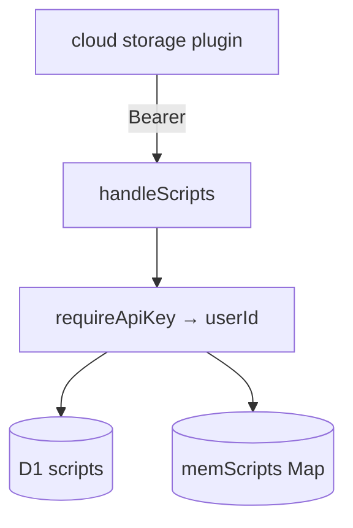

# Worker data plane

## Abstract

The Worker **data plane** for user scripts is `frontend/worker/src/scripts.ts` — REST under `/api/scripts` with Bearer auth ([auth](/axis/docs/worker/auth)). Persistence prefers **D1** (`env.DB`); without D1, per-isolate **in-memory** maps support local `wrangler dev`.

The PWA **cloud** storage plugin is the primary client.

## Conceptual model



## Interface surface

All routes require valid API key unless noted.

| Path | Methods | Behavior |
| --- | --- | --- |
| `/api/scripts` | GET | List meta for `userId` |
| `/api/scripts` | POST | Create script |
| `/api/scripts/:id` | GET | Read full document |
| `/api/scripts/:id` | PUT | Upsert; honors `If-Match` revision |
| `/api/scripts/:id` | DELETE | Remove |
| `/api/scripts/_draft` | GET/PUT | Per-user draft buffer |

### Document fields

| Field | Notes |
| --- | --- |
| `id` | Client or server assigned |
| `name`, `description`, `path` | Meta |
| `content` | Pine source |
| `revision` | Opaque string (`rev_…`) for concurrency |
| `created_at` / `updated_at` | ms epochs (API may camelCase in JSON) |

### Concurrency

PUT with `If-Match: <revision>` rejects mismatched revisions (409 path covered in security tests). Fresh writes mint `newRevision()`.

## Internals

### D1 schema (`schemas/scripts.sql`)

```sql
CREATE TABLE scripts (
  user_id TEXT NOT NULL,
  id TEXT NOT NULL,
  name TEXT NOT NULL,
  description TEXT,
  path TEXT,
  content TEXT NOT NULL,
  revision TEXT NOT NULL,
  created_at INTEGER NOT NULL,
  updated_at INTEGER NOT NULL,
  PRIMARY KEY (user_id, id)
);

CREATE TABLE script_drafts (
  user_id TEXT PRIMARY KEY,
  content TEXT NOT NULL,
  name TEXT,
  updated_at INTEGER NOT NULL
);
```

Apply:

```bash
wrangler d1 execute pynescript --remote --file=schemas/scripts.sql
wrangler d1 execute pynescript --local  --file=schemas/scripts.sql
```

Binding name in `wrangler.toml` **must** be `DB` (code uses `env.DB`). Database name can be `pynescript`.

### Partitioning

`userId = SHA-256(api_key).hex.slice(0, 32)` — raw keys are not stored as D1 partition ids.

### Health feature flags

```json
{
  "status": "healthy",
  "service": "pynescript-axis-worker",
  "features": { "scripts": true, "d1": true/false, "keys": true/false }
}
```

### Optional R2

`BUNDLES` R2 is reserved for indicator / pynescript wheels (`RUNTIME.md`). Not required for scripts CRUD.

## Invariants & edge cases

1. **Memory store is not multi-isolate durable** — production needs D1.
2. **Drafts ≠ commits** — drafts are crash buffers; library list is separate.
3. **CORS** — scripts handler sets allow headers including `If-Match`.
4. **Cloud plugin dual-write** — browser still saves drafts to local storage.

## Failure modes

| Code / symptom | Meaning |
| --- | --- |
| 401 | Missing/invalid Bearer |
| 404 | Unknown script id for user |
| 409 | Revision conflict |
| Empty list after deploy | Schema not applied / wrong DB id |

## See also

- [Storage plugins](/axis/docs/plugins/storage)
- [Auth](/axis/docs/worker/auth)
- [Bindings](/axis/docs/worker/bindings)
