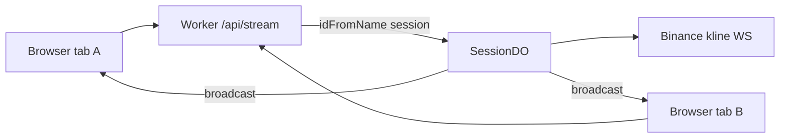

# Copyright (C) 2024-2026 jango_blockchained
#
# This file is part of pynescript.
#
# pynescript is free software: you can redistribute it and/or modify
# it under the terms of the GNU Affero General Public License as published by
# the Free Software Foundation, either version 3 of the License, or
# (at your option) any later version.
#
# pynescript is distributed in the hope that it will be useful,
# but WITHOUT ANY WARRANTY; without even the implied warranty of
# MERCHANTABILITY or FITNESS FOR A PARTICULAR PURPOSE.  See the
# GNU Affero General Public License for more details.
#
# You should have received a copy of the GNU Affero General Public License
# along with pynescript.  If not, see <https://www.gnu.org/licenses/>.
#
# SPDX-License-Identifier: AGPL-3.0-or-later

---
title: "Durable Objects"
description: "SessionDO WebSocket relay: one Binance upstream per session, fan-out to browser clients."
---

# Durable Objects

## Abstract

`SessionDO` (`frontend/worker/src/durable-objects/session.ts`) is a **per-session WebSocket relay**. Browsers connect to the Worker at `/api/stream`; the Worker pins a Durable Object by session name and the DO opens **one** upstream Binance kline socket, broadcasting payloads to connected clients.

Goal: survive browser per-origin WebSocket connection limits and share upstream subscriptions.

## Conceptual model



## Interface surface

### Client → Worker

```
wss://<worker>/api/stream?session=<name>&symbol=BTCUSDT&interval=1m
```

`frontend/worker/src/index.ts`:

- Requires `env.SESSIONS` binding; else `503` `NO_DO`.
- `idFromName(session || 'default')`.
- Rewrites request to DO path `/ws?…` and returns upgrade response.

### DO HTTP surface

| Path | Role |
| --- | --- |
| `/ws` | Only path; requires `Upgrade: websocket` (else 426) |

Query: `symbol` (default `BTCUSDT`), `interval` (default `1m`).

### Client → DO messages (JSON)

| Message | Effect |
| --- | --- |
| `{ "action": "subscribe", "symbol", "interval" }` | Rebind upstream if changed |
| `{ "action": "ping" }` | `{ action: "pong", t }` |

### DO → client

- Raw Binance kline JSON (same as direct venue WS).
- Status: `{ type: 'status', state: 'open'|'closed', url? }`
- Errors: `{ type: 'error', message }`

### Example plugin

`frontend/public/plugins/example-cf-do-stream.js` maps kline fields to `Bar` and builds the Worker URL from config `endpoint`.

## Internals

| Topic | Detail |
| --- | --- |
| Upstream URL | `wss://stream.binance.com:9443/ws/{symbol}@kline_{interval}` |
| Client lifecycle | `acceptWebSocket`; on last client close → `closeUpstream` |
| Hibernation | Comment intent: hibernate when empty; implementation uses explicit close |
| Fan-out | `broadcast` to all `clients` |

### wrangler binding (often commented until ready)

```toml
# [[durable_objects.bindings]]
# name = "SESSIONS"
# class_name = "SessionDO"

# [[migrations]]
# tag = "v1"
# new_sqlite_classes = ["SessionDO"]
```

`SessionDO` is re-exported from `src/index.ts` for the Workers runtime class registry.

## Invariants & edge cases

1. **Session key** — example plugin uses `symbol@interval` as session name so like-minded tabs share one DO.
2. **No auth on stream today** — treat as public relay of public market data; do not put secrets in query strings.
3. **Upstream hard-coded Binance** — not a generic multiprovider DO yet.
4. **Binding optional in local** — without `SESSIONS`, stream API fails closed with `NO_DO`.

## Failure modes

| Symptom | Cause |
| --- | --- |
| 503 `NO_DO` | Binding commented / not deployed |
| 426 expected websocket | Non-upgrade GET |
| No bars | Upstream block or wrong interval string |
| Stale symbol | Client did not send `subscribe` after change |

## See also

- [Streams](/axis/docs/plugins/streams)
- [Bindings](/axis/docs/worker/bindings)
- [Plugin examples](/axis/docs/reference/plugin-examples)
