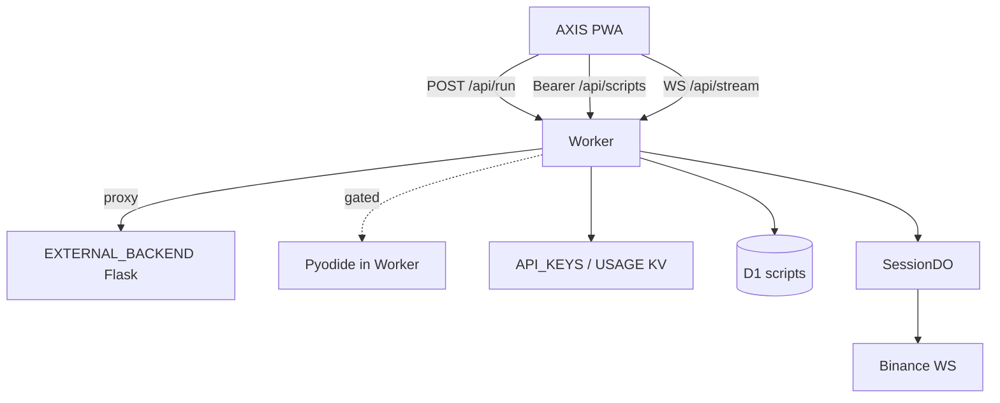

# Worker

## Abstract

The AXIS Cloudflare Worker (`frontend/worker/`) is the **edge data plane** for the PWA: JSON APIs, optional script library (D1), API keys (KV), usage meters, and a WebSocket session relay (Durable Objects). It is **not** a full Pine interpreter in production today.

**Honest runtime fact:** `POST /api/run` **proxies to `EXTERNAL_BACKEND`** (typically Flask) unless `PYODIDE_IN_WORKER=enabled` and the in-worker path succeeds. In-worker Pyodide is **planned / feature-gated** — see [Runtime](/axis/docs/worker/runtime) and `frontend/worker/RUNTIME.md`.

## Conceptual model



## Infrastructure names (frozen)

| Surface | Value |
| --- | --- |
| Wrangler / Pages project | **`pynescript-superchart`** — **do not rename** lightly |
| npm package | `pynescript-superchart-worker` |
| Health JSON `service` | `pynescript-axis-worker` |
| Product brand | **AXIS** |

Custom domains / aliases may say `axis.*`; leave the CF project id stable so KV/D1 IDs and CI stay valid.

## Interface surface

| Path | Method | Role |
| --- | --- | --- |
| `/`, `/health` | GET | Health + feature flags (`scripts`, `d1`, `keys`) |
| `/api/run` | POST | Run script (proxy / gated Pyodide) |
| `/api/keys` | GET/POST | Validate / create keys (`X-Admin-Token` for create) |
| `/api/usage` | GET | Usage stub / KV-backed counters |
| `/api/scripts`… | CRUD | Script library (Bearer) |
| `/api/stream` | WS | Session DO relay |

Entry: `frontend/worker/src/index.ts`.

## Local entrypoints

```bash
cd frontend/worker
npm install   # or bun install
npm run dev   # wrangler dev → http://127.0.0.1:8787
```

Makefile: `make worker-dev`, `make worker-deploy`.

## Implementation status

| Feature | Status |
| --- | --- |
| `/api/run` → `EXTERNAL_BACKEND` | **Works today** |
| Admin `/api/keys` | Works (KV or shape-check) |
| Usage KV increment on run | Works when `USAGE` bound |
| `SessionDO` + `/api/stream` | Implemented; binding often commented until provisioned |
| `/api/scripts` + D1 schema | Implemented; memory fallback without D1 |
| Pyodide scaffold | `pyodide_runtime.ts` + flag; **wheel pipeline incomplete** |
| Response cache for `/api/run` | Deferred |

## Page map

| Page | Topic |
| --- | --- |
| [Runtime](/axis/docs/worker/runtime) | `/api/run`, proxy, Pyodide plan |
| [Durable Objects](/axis/docs/worker/durable-objects) | Stream fan-out |
| [Data plane](/axis/docs/worker/data-plane) | Scripts, D1, drafts |
| [Auth](/axis/docs/worker/auth) | Bearer keys, admin token |
| [Bindings](/axis/docs/worker/bindings) | wrangler.toml, vars, provision |

## See also

- [Cloudflare deploy](/axis/docs/devops/cloudflare)
- [Engines](/axis/docs/plugins/engines)
- Worker README: `frontend/worker/README.md`
