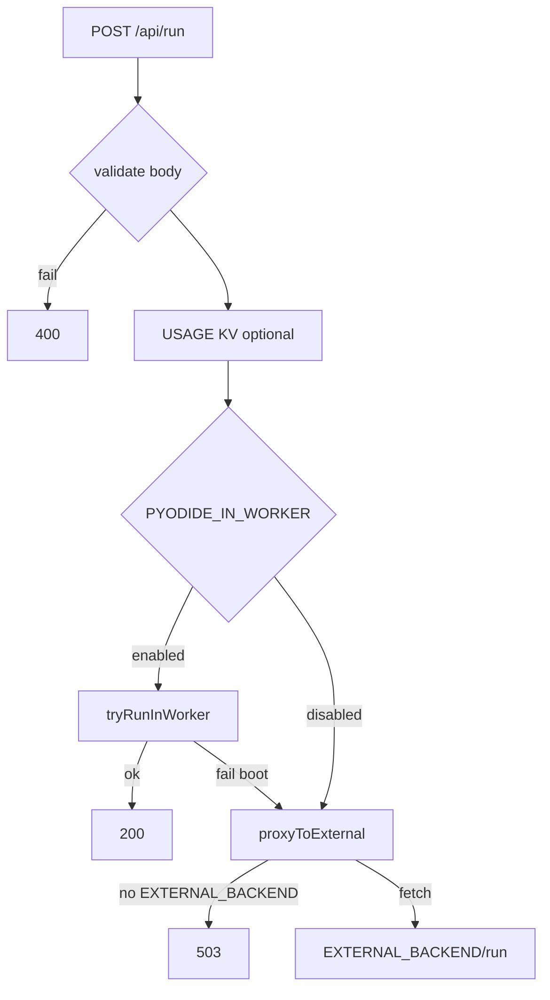

# Copyright (C) 2024-2026 jango_blockchained
#
# This file is part of pynescript.
#
# pynescript is free software: you can redistribute it and/or modify
# it under the terms of the GNU Affero General Public License as published by
# the Free Software Foundation, either version 3 of the License, or
# (at your option) any later version.
#
# pynescript is distributed in the hope that it will be useful,
# but WITHOUT ANY WARRANTY; without even the implied warranty of
# MERCHANTABILITY or FITNESS FOR A PARTICULAR PURPOSE.  See the
# GNU Affero General Public License for more details.
#
# You should have received a copy of the GNU Affero General Public License
# along with pynescript.  If not, see <https://www.gnu.org/licenses/>.
#
# SPDX-License-Identifier: AGPL-3.0-or-later

---
title: "Worker runtime"
description: "POST /api/run execution modes: EXTERNAL_BACKEND proxy today, feature-gated in-worker Pyodide planned."
---

# Worker runtime

## Abstract

`frontend/worker/src/runtime.ts` implements `handleRun` for **`POST /api/run`**. Execution preference is documented in-file:

1. **`PYODIDE_IN_WORKER=enabled`** → `tryRunInWorker` (`pyodide_runtime.ts`)
2. Else **`EXTERNAL_BACKEND`** set → HTTP proxy to `${EXTERNAL_BACKEND}/run`
3. Else **503** `NO_BACKEND` with a pointer at env vars and `RUNTIME.md`

**Production reality:** ships as a **proxy** to Flask (or another Python host). In-worker Pyodide is a **scaffold**, not a complete wheel-upload pipeline.

## Conceptual model



## Interface surface

### Request body

```ts
{
  script: string;           // required non-empty
  data: Bar[];              // required non-empty OHLCV array
  mode?: 'interpret' | 'compile';
}
```

Invalid bodies → `400` `{ status: 'error', code: 'BAD_REQUEST', message }`.

### Success / upstream

Proxy returns upstream status and body verbatim (JSON content-type, CORS origin header). Flask Pro API is the usual upstream.

### Error codes (Worker-originated)

| Code | HTTP | Meaning |
| --- | --- | --- |
| `BAD_REQUEST` | 400 | Validation |
| `NO_BACKEND` | 503 | No external backend and Pyodide path off/failed path to proxy |
| (Pyodide) | 200 body error | `tryRunInWorker` may return `{ status: 'error', error }` JSON |

### Usage metering

If `Authorization: Bearer …` and `USAGE` KV bound:

```
usage:{key} → count++, TTL 30 days
```

## Internals

| Path | Role |
| --- | --- |
| `src/runtime.ts` | validate, meter, dispatch |
| `src/pyodide_runtime.ts` | gated boot + `run_script` stub path |
| `RUNTIME.md` | architecture plan for wheels / R2 / cold start |
| `wrangler.toml` `[vars]` | `EXTERNAL_BACKEND`, `PYODIDE_IN_WORKER` |

### pyodide_runtime scaffold

When enabled:

- Lazy-loads Pyodide from jsDelivr `v0.26.2` (dev fallback).
- Production intent: R2 wheels + module-level cache (`RUNTIME.md`).
- Calls `run_script(script, bars)` via `runPythonAsync` — requires runtime bootstrap that is **not fully wired** like the browser engine’s `pynescript_runtime.py` + micropip install.

**Do not enable in production** without completing the wheel pipeline and load testing CPU/memory limits.

### Constraints (from RUNTIME.md)

| Resource | Budget |
| --- | --- |
| CPU (paid) | 30s limit; typical 500 bars ≪ 1s target |
| Memory | 128 MB; Pyodide ~30 MB + wheel ~5 MB |
| Cold start | ~3s first Pyodide boot (plan) |

### Roll-out flag

`RUNTIME.md` also mentions `RUNTIME_MODE=in-worker` as product language; **code checks `PYODIDE_IN_WORKER === 'enabled'`**. Prefer the code flag when configuring.

## Invariants & edge cases

1. **Body stream** — request body is consumed once; proxy re-serializes the already-parsed object.
2. **CORS** — run responses set `Access-Control-Allow-Origin` from `pickOrigin` (see [CORS](/axis/docs/devops/cors-and-origins)).
3. **PWA path mismatch** — browser `server` engine posts to `{endpoint}/run`; Worker route is `/api/run`. Align via gateway rewrite or endpoint base path convention.
4. **No response caching yet** — README lists cache for identical `(script, data_hash)` as deferred.

## Worked examples

### Local proxy to Flask

```toml
# wrangler.toml [vars]
EXTERNAL_BACKEND = "http://127.0.0.1:5002"
PYODIDE_IN_WORKER = "disabled"
```

```bash
curl -sS -X POST http://127.0.0.1:8787/api/run \
  -H 'content-type: application/json' \
  -d '{"script":"//@version=5\nindicator(\"t\")\nplot(close)","data":[{"time":1,"open":1,"high":1,"low":1,"close":1}]}'
```

### Force 503 for missing backend

Unset `EXTERNAL_BACKEND`, keep Pyodide disabled → expect `NO_BACKEND` message referencing `RUNTIME.md`.

## Failure modes

| Symptom | Fix |
| --- | --- |
| 503 `NO_BACKEND` | Set `EXTERNAL_BACKEND` or finish Pyodide path |
| Proxy 502/connection refused | Flask not listening; wrong URL from Worker (use tunnel/public URL in CF, not localhost) |
| Pyodide enabled but errors | Wheel missing; CDN blocked; incomplete `run_script` bootstrap |

## See also

- [Bindings](/axis/docs/worker/bindings)
- [Engines](/axis/docs/plugins/engines)
- [Auth](/axis/docs/worker/auth) (Bearer on run for metering)
