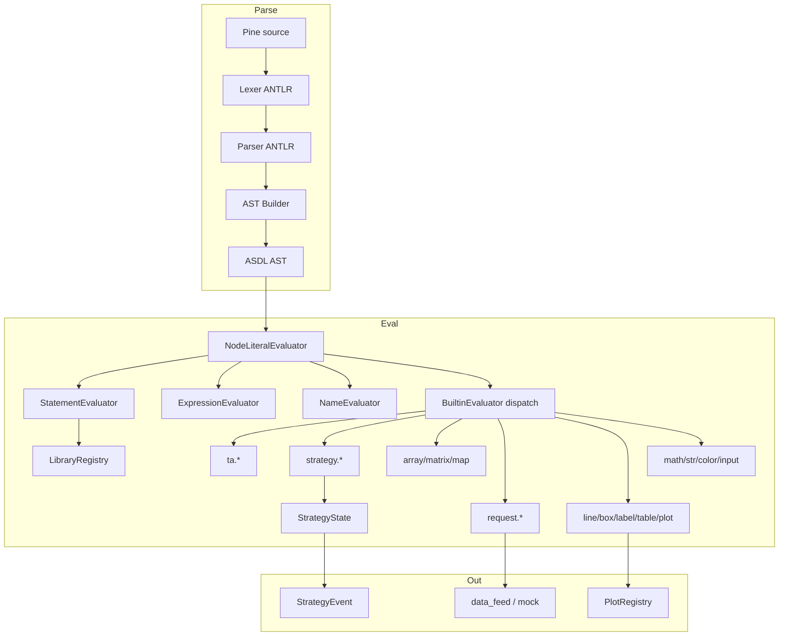
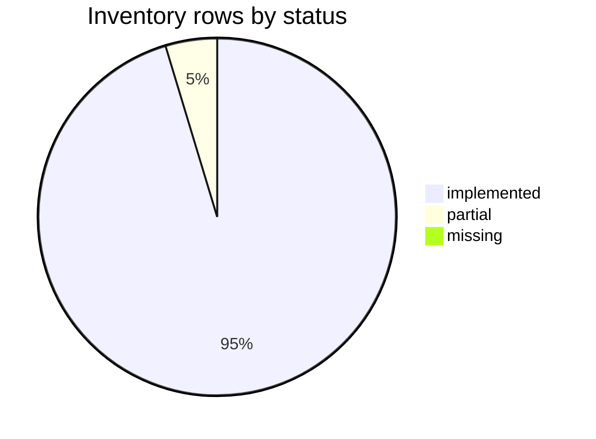
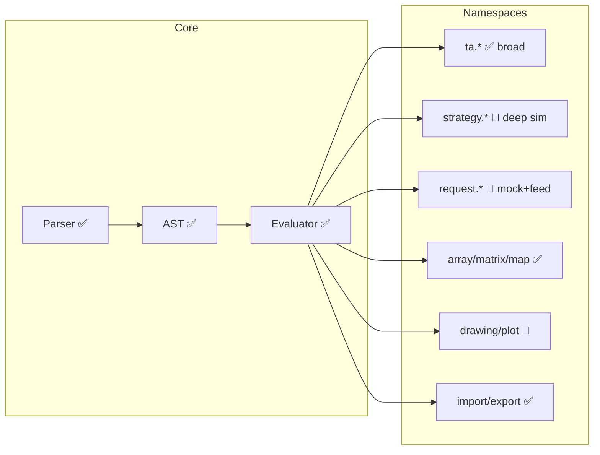

# Pine Script v6 — Full Surface Inventory (pynescript)

**Generated:** 2026-07-25  
**Scope:** Every registered evaluator builtin, major series/variables, language constructs, and known gaps.  
**Sources:** live `NodeLiteralEvaluator` dispatch map, `builtin_metadata.json`, base context constants, design docs.

## Schema

This inventory adopts a fixed tabular schema so that status claims remain comparable across namespaces and over time. Each row is a single language surface element—builtin function, series variable, constant, or syntactic construct—annotated with discovery source and implementation judgment.

| Column | Meaning |
|--------|---------|
| **Name** | Fully qualified Pine identifier or construct |
| **Namespace** | Logical group (`ta`, `strategy`, `array`, …) |
| **Kind** | `function` · `series/var` · `constant` · `declaration` · `control` · `operator` · `type system` · `literal` · `semantics` · `export` · `import` |
| **Status** | ✅ implemented · 🔄 partial/stub/mock · ❌ missing · ⚙️ by design / out of scope · ⬜ N/A (platform) |
| **Metadata** | Present in LSP `builtin_metadata.json` |
| **Source** | How row was discovered (`dispatch` = callable handler registered) |
| **Notes** | Caveats |

### Status definitions

Status values are intentionally coarse. They distinguish fully usable paths from stubs, known absences, and items that this library deliberately leaves to the TradingView platform or to editor-only tooling. A single row is never split across statuses: when a symbol accepts calls but only partially implements Pine semantics, it is recorded as partial even if a happy-path script appears to work.

| Status | Definition |
|--------|------------|
| ✅ implemented | Handler or parser path exists and is exercised / usable |
| 🔄 partial | Accepts calls but mock/stub, incomplete semantics, or metadata-only effects |
| ❌ missing | Expected on TV v6 surface; not registered or not resolving |
| ⚙️ by design | Intentionally not full TV platform (e.g. real market data) |
| ⬜ N/A | Editor/UI-only or outside this runtime |

## Summary counts

Regenerated from live `NodeLiteralEvaluator._build_builtin_map()` on 2026-07-25.

| Metric | Count |
|--------|------:|
| Dispatch builtins (callable) | 640 |
| Dispatch partial-heuristic (docstring stub/mock) | 8 |
| Namespaces (top-level prefixes) | 60 |

### By namespace (dispatch keys)

| Namespace | Count |
|-----------|------:|
| `ta` | 159 |
| `matrix` | 74 |
| `strategy` | 70 |
| `array` | 56 |
| `box` | 31 |
| `label` | 28 |
| `table` | 26 |
| `math` | 24 |
| `line` | 22 |
| `str` | 19 |
| `input` | 14 |
| `map` | 11 |
| `request` | 11 |
| `footprint` | 9 |
| `ticker` | 9 |
| `color` | 8 |
| `volume_row` | 8 |
| `linefill` | 6 |
| `chart` | 5 |
| `plot` | 4 |
| `log` | 3 |
| `polyline` | 3 |
| `timeframe` | 3 |
| `abs` | 1 |
| `alert` | 1 |

### Official TV v6 reference coverage

Against the public Pine v6 function reference list (434 symbols): **0 missing** in dispatch (verified 2026-07-25).

Strategy performance series, matrix linear algebra, linefill, table/box/label setters, and risk builtins are registered.


## Architecture graph

The diagrams below situate the inventory against the runtime architecture: parse → AST → evaluator mixins and registries, plus a coarse status pie. They are illustrative rather than exhaustive—intended to orient readers before the tabular detail, not to specify every edge in the implementation graph.







## Language & syntax surface

Beyond named builtins, Pine v6 compatibility depends on grammar and semantic rules—declarations, control flow, type formers, and migration-sensitive operators. This section records those constructs independently of the dispatch map.

| Name | Kind | Status | Notes |
|------|------|--------|-------|
| `//@version` | directive | ✅ implemented | Parser accepts version comments |
| `indicator()` | declaration | ✅ implemented | Script declaration + kwargs |
| `strategy()` | declaration | ✅ implemented | Script declaration + kwargs |
| `library()` | declaration | ✅ implemented | Script declaration + title fix |
| `import ns/name/ver [as alias]` | import | ✅ implemented | In-process registry + lazy source |
| `export f() =>` | export | ✅ implemented | Functions registered on library module |
| `export const T name =` | export | ✅ implemented | June 2025; parse+runtime |
| `export type` | export | ✅ implemented | UDT via import alias + .new |
| `export enum` | export | ✅ implemented | Enum dict via import alias |
| `export method` | export | 🔄 partial | Methods on types; full library method export less exercised |
| `var / varip` | declaration mode | ✅ implemented | First-bar only assign |
| `const (type qualifier)` | declaration mode | ✅ implemented | const float x = ... |
| `:= reassignment` | operator | ✅ implemented | ReAssign |
| `if / else / else if` | control | ✅ implemented |  |
| `for x = a to b by c` | control | ✅ implemented | Dynamic to_num re-eval each iter (v6) |
| `for x in collection` | control | ✅ implemented |  |
| `while` | control | ✅ implemented |  |
| `switch / default` | control | ✅ implemented | default required rule not fully enforced |
| `ternary ?: ` | operator | ✅ implemented |  |
| `and / or short-circuit` | operator | ✅ implemented | v6 strict bool |
| `[] history` | operator | ✅ implemented | Series history |
| `type UDT` | type system | ✅ implemented |  |
| `enum` | type system | ✅ implemented |  |
| `method` | type system | ✅ implemented |  |
| `""" / ''' multiline string` | literal | ✅ implemented | April 2026 |
| `string interpolation` | literal | 🔄 partial | Depends on str.format patterns |
| `bool never na` | semantics | 🔄 partial | Core paths; edge cases may remain |
| `explicit bool() cast` | semantics | 🔄 partial | bool() exists; implicit cast not fully banned |
| `int/int division float` | semantics | ✅ implemented | truediv 5/2=2.5 |
| `negative array index` | semantics | ✅ implemented |  |
| `matrix/array sort_field UDT` | semantics | ✅ implemented | April 2026 |
| `when= on strategy.*` | semantics | 🔄 partial | v6 removed; may still accept kwargs silently |
| `transp= on drawings` | semantics | 🔄 partial | v6 removed; prefer color.new |

## Known gaps & platform limits

Some absences are intentional product boundaries rather than incomplete ports: this library is an offline parser–evaluator toolchain, not a full TradingView host. Others remain genuine surface gaps or simplified simulations.

| Item | Status | Notes |
|------|--------|-------|
| request.* real market data | ⚙️ by design | Mock/synthetic + data_feed hooks |
| strategy.* full broker sim | 🔄 partial | Open/close/equity depth improved; not full TV tester |
| strategy percent / avg series | ✅ improved | Wired as zero-arg series builtins (2026-07); inventory snapshot may lag |
| Pine Profiler | ⬜ n/a | Editor-only |
| Live TradingView libraries network | ❌ missing | In-process registry only |
| chart rendering | ⬜ n/a | Out of scope |
| Compile mode strategy orders | ✅ implemented | Object-mode `CompileStrategyBroker`; events via Runtime `mode="compile"` |

## Full function & identifier inventory

The tables that follow enumerate identifiers by namespace. **Status** for dispatch rows uses a lightweight heuristic (docstrings mentioning `stub` or `mock` are marked partial). Series catalog rows without a registered handler may still be supplied via evaluation context in some hosts; where neither exists, the row is marked missing. Namespace prefaces summarize intent and fidelity; the rows remain the authoritative per-symbol record.

### `ta` (154)

Technical-analysis builtins dominate the dispatch surface—moving averages, oscillators, volatility measures, pivots, and a long tail of composite helpers. Coverage is broad; residual partials, if any, usually reflect simplified series math or research-oriented indicators rather than absent symbols. The numeric compile path reimplements a subset (`sma`, `ema`, `rsi`, range extremes) under Numba; remaining `ta.*` calls stay on the interpreter or object-mode path until mirrored in `numba_builtins`.

| Name | Kind | Status | Metadata | Source | Notes |
|------|------|--------|----------|--------|-------|
| `ta.accdist` | function | ✅ implemented | yes | dispatch |  |
| `ta.acceleration_factor` | function | ✅ implemented | yes | dispatch |  |
| `ta.advanced_breakout_detector` | function | ✅ implemented | yes | dispatch |  |
| `ta.adx` | function | ✅ implemented | yes | dispatch |  |
| `ta.apo` | function | ✅ implemented | yes | dispatch |  |
| `ta.atr` | function | ✅ implemented | yes | dispatch |  |
| `ta.atr_normalized` | function | ✅ implemented | yes | dispatch |  |
| `ta.atr_stop` | function | ✅ implemented | yes | dispatch |  |
| `ta.barssince` | function | ✅ implemented | yes | dispatch |  |
| `ta.bb` | function | ✅ implemented | yes | dispatch |  |
| `ta.bb_pct` | function | ✅ implemented | yes | dispatch |  |
| `ta.beta` | function | ✅ implemented | yes | dispatch |  |
| `ta.bid_ask_imbalance` | function | ✅ implemented | yes | dispatch |  |
| `ta.breakeven_level` | function | ✅ implemented | yes | dispatch |  |
| `ta.breakout_detection` | function | ✅ implemented | yes | dispatch |  |
| `ta.cci` | function | ✅ implemented | yes | dispatch |  |
| `ta.change` | function | ✅ implemented | yes | dispatch |  |
| `ta.cmf` | function | ✅ implemented | yes | dispatch |  |
| `ta.cog` | function | ✅ implemented | yes | dispatch |  |
| `ta.comovement` | function | ✅ implemented | yes | dispatch |  |
| `ta.contrarian_signal` | function | ✅ implemented | yes | dispatch |  |
| `ta.correlation_filter` | function | ✅ implemented | yes | dispatch |  |
| `ta.cross` | function | ✅ implemented | yes | dispatch |  |
| `ta.crossover` | function | ✅ implemented | yes | dispatch |  |
| `ta.crossunder` | function | ✅ implemented | yes | dispatch |  |
| `ta.crowd_sentiment` | function | ✅ implemented | yes | dispatch |  |
| `ta.cum` | function | ✅ implemented | yes | dispatch |  |
| `ta.cumulative_delta` | function | ✅ implemented | yes | dispatch |  |
| `ta.dema` | function | ✅ implemented | yes | dispatch |  |
| `ta.dev` | function | ✅ implemented | yes | dispatch |  |
| `ta.divergence_detector` | function | ✅ implemented | yes | dispatch |  |
| `ta.dmi` | function | ✅ implemented | yes | dispatch |  |
| `ta.donchian` | function | ✅ implemented | yes | dispatch |  |
| `ta.double_top_bottom` | function | ✅ implemented | yes | dispatch |  |
| `ta.dpo` | function | ✅ implemented | yes | dispatch |  |
| `ta.drawdown_recovery_level` | function | ✅ implemented | yes | dispatch |  |
| `ta.economic_impact_score` | function | ✅ implemented | yes | dispatch |  |
| `ta.ema` | function | ✅ implemented | yes | dispatch |  |
| `ta.ema_cross_signal` | function | ✅ implemented | yes | dispatch |  |
| `ta.employment_cycle_indicator` | function | ✅ implemented | yes | dispatch |  |
| `ta.emv` | function | ✅ implemented | yes | dispatch |  |
| `ta.engulfing` | function | ✅ implemented | yes | dispatch |  |
| `ta.expected_value` | function | ✅ implemented | yes | dispatch |  |
| `ta.falling` | function | ✅ implemented | yes | dispatch |  |
| `ta.fear_greed_index` | function | ✅ implemented | yes | dispatch |  |
| `ta.fractal` | function | ✅ implemented | yes | dispatch |  |
| `ta.gamma_levels` | function | ✅ implemented | yes | dispatch |  |
| `ta.gap_detector` | function | ✅ implemented | yes | dispatch |  |
| `ta.garman_klass` | function | ✅ implemented | yes | dispatch |  |
| `ta.gdp_growth_proxy` | function | ✅ implemented | yes | dispatch |  |
| `ta.hammer` | function | ✅ implemented | yes | dispatch |  |
| `ta.highest` | function | ✅ implemented | yes | dispatch |  |
| `ta.highestbars` | function | ✅ implemented | yes | dispatch |  |
| `ta.hma` | function | ✅ implemented | yes | dispatch |  |
| `ta.ichimoku` | function | ✅ implemented | yes | dispatch |  |
| `ta.iii` | function | ✅ implemented | yes | dispatch |  |
| `ta.inflation_proxy_indicator` | function | ✅ implemented | yes | dispatch |  |
| `ta.inside_bar_pattern` | function | ✅ implemented | yes | dispatch |  |
| `ta.intelligent_strategy_synthesizer` | function | ✅ implemented | yes | dispatch |  |
| `ta.kama` | function | ✅ implemented | yes | dispatch |  |
| `ta.kc` | function | ✅ implemented | yes | dispatch |  |
| `ta.kcw` | function | ✅ implemented | yes | dispatch |  |
| `ta.kelly_criterion` | function | ✅ implemented | yes | dispatch |  |
| `ta.klinger` | function | ✅ implemented | yes | dispatch |  |
| `ta.kst` | function | ✅ implemented | yes | dispatch |  |
| `ta.kurtosis` | function | ✅ implemented | yes | dispatch |  |
| `ta.linreg` | function | ✅ implemented | yes | dispatch |  |
| `ta.liquidity_score` | function | ✅ implemented | yes | dispatch |  |
| `ta.lowest` | function | ✅ implemented | yes | dispatch |  |
| `ta.lowestbars` | function | ✅ implemented | yes | dispatch |  |
| `ta.macd` | function | ✅ implemented | yes | dispatch |  |
| `ta.macd_signal` | function | ✅ implemented | yes | dispatch |  |
| `ta.market_condition` | function | ✅ implemented | yes | dispatch |  |
| `ta.market_structure_pivot` | function | ✅ implemented | yes | dispatch |  |
| `ta.market_timing_index` | function | ✅ implemented | yes | dispatch |  |
| `ta.max` | function | ✅ implemented | yes | dispatch |  |
| `ta.max_loss_level` | function | ✅ implemented | yes | dispatch |  |
| `ta.mean_reversion_entry` | function | ✅ implemented | yes | dispatch |  |
| `ta.mean_reversion_score` | function | ✅ implemented | yes | dispatch |  |
| `ta.median` | function | ✅ implemented | yes | dispatch |  |
| `ta.mfi` | function | ✅ implemented | yes | dispatch |  |
| `ta.min` | function | ✅ implemented | yes | dispatch |  |
| `ta.mode` | function | ✅ implemented | yes | dispatch |  |
| `ta.mom` | function | ✅ implemented | yes | dispatch |  |
| `ta.momentum_divergence` | function | ✅ implemented | yes | dispatch |  |
| `ta.momentum_filter` | function | ✅ implemented | yes | dispatch |  |
| `ta.multi_timeframe_signal` | function | ✅ implemented | yes | dispatch |  |
| `ta.nvi` | function | ✅ implemented | yes | dispatch |  |
| `ta.obv` | function | ✅ implemented | yes | dispatch |  |
| `ta.optimal_entry_zone` | function | ✅ implemented | yes | dispatch |  |
| `ta.order_flow_imbalance` | function | ✅ implemented | yes | dispatch |  |
| `ta.parkinson` | function | ✅ implemented | yes | dispatch |  |
| `ta.percentrank` | function | ✅ implemented | yes | dispatch |  |
| `ta.pivot_point_levels` | function | ✅ implemented | yes | dispatch |  |
| `ta.pivothigh` | function | ✅ implemented | yes | dispatch |  |
| `ta.pivotlow` | function | ✅ implemented | yes | dispatch |  |
| `ta.position_sizing` | function | ✅ implemented | yes | dispatch |  |
| `ta.position_sizing_score` | function | ✅ implemented | yes | dispatch |  |
| `ta.probability_of_movement` | function | ✅ implemented | yes | dispatch |  |
| `ta.profit_lock_level` | function | ✅ implemented | yes | dispatch |  |
| `ta.pullback_bounce_level` | function | ✅ implemented | yes | dispatch |  |
| `ta.pvi` | function | ✅ implemented | yes | dispatch |  |
| `ta.pvt` | series/var | ✅ implemented | no | series_catalog |  |
| `ta.r_squared` | function | ✅ implemented | yes | dispatch |  |
| `ta.range` | function | ✅ implemented | yes | dispatch |  |
| `ta.rci` | function | ✅ implemented | yes | dispatch |  |
| `ta.regime_adaptive_signal` | function | ✅ implemented | yes | dispatch |  |
| `ta.rising` | function | ✅ implemented | yes | dispatch |  |
| `ta.risk_reward_asymmetry` | function | ✅ implemented | yes | dispatch |  |
| `ta.risk_reward_ratio` | function | ✅ implemented | yes | dispatch |  |
| `ta.rma` | function | ✅ implemented | yes | dispatch |  |
| `ta.roc` | function | ✅ implemented | yes | dispatch |  |
| `ta.rsi` | function | ✅ implemented | yes | dispatch |  |
| `ta.rsi_divergence` | function | ✅ implemented | yes | dispatch |  |
| `ta.rsi_oversold_overbought` | function | ✅ implemented | yes | dispatch |  |
| `ta.sar` | function | ✅ implemented | yes | dispatch |  |
| `ta.signal_confluence` | function | ✅ implemented | yes | dispatch |  |
| `ta.skewness` | function | ✅ implemented | yes | dispatch |  |
| `ta.sma` | function | ✅ implemented | yes | dispatch |  |
| `ta.sma_weighted` | function | ✅ implemented | yes | dispatch |  |
| `ta.smart_money_flow` | function | ✅ implemented | yes | dispatch |  |
| `ta.spread_analysis` | function | ✅ implemented | yes | dispatch |  |
| `ta.stdev` | function | ✅ implemented | yes | dispatch |  |
| `ta.stoch` | function | ✅ implemented | yes | dispatch |  |
| `ta.stoch_smooth` | function | ✅ implemented | yes | dispatch |  |
| `ta.stochrsi` | function | ✅ implemented | yes | dispatch |  |
| `ta.strategy_score` | function | ✅ implemented | yes | dispatch |  |
| `ta.supertrend` | function | ✅ implemented | yes | dispatch |  |
| `ta.swma` | function | ✅ implemented | yes | dispatch |  |
| `ta.tema` | function | ✅ implemented | yes | dispatch |  |
| `ta.tr` | function | ✅ implemented | yes | dispatch |  |
| `ta.trailing_exit_level` | function | ✅ implemented | yes | dispatch |  |
| `ta.trend_confirmation_score` | function | ✅ implemented | yes | dispatch |  |
| `ta.trend_strength` | function | ✅ implemented | yes | dispatch |  |
| `ta.tsi` | function | ✅ implemented | yes | dispatch |  |
| `ta.uo` | function | ✅ implemented | yes | dispatch |  |
| `ta.valuewhen` | function | ✅ implemented | yes | dispatch |  |
| `ta.variance` | function | ✅ implemented | yes | dispatch |  |
| `ta.voi` | function | ✅ implemented | yes | dispatch |  |
| `ta.volatility_regime` | function | ✅ implemented | yes | dispatch |  |
| `ta.volatility_regime_score` | function | ✅ implemented | yes | dispatch |  |
| `ta.volume_momentum` | function | ✅ implemented | yes | dispatch |  |
| `ta.volume_profile_high` | function | ✅ implemented | yes | dispatch |  |
| `ta.volume_profile_low` | function | ✅ implemented | yes | dispatch |  |
| `ta.volume_thrust` | function | ✅ implemented | yes | dispatch |  |
| `ta.volume_weighted_momentum` | function | ✅ implemented | yes | dispatch |  |
| `ta.vpt` | function | ✅ implemented | yes | dispatch |  |
| `ta.vwap` | function | ✅ implemented | yes | dispatch |  |
| `ta.vwma` | function | ✅ implemented | yes | dispatch |  |
| `ta.wad` | function | ✅ implemented | yes | dispatch |  |
| `ta.wma` | function | ✅ implemented | yes | dispatch |  |
| `ta.wpr` | function | ✅ implemented | yes | dispatch |  |
| `ta.wvad` | function | ✅ implemented | yes | dispatch |  |
| `ta.zigzag` | function | ✅ implemented | yes | dispatch |  |

### `strategy` (66)

Strategy order handlers, risk helpers, and performance series (position, equity, trade averages, win/loss counts). Entry, exit, and cancel paths maintain a `StrategyState` with open/closed trades and emit structured events for backends. Several average and percent series were promoted to dispatch-backed zero-arg builtins in the 2026-07 runtime work; strategy performance series are dispatch-backed (2026-07). Full broker-grade simulation (margin calls, partial fills across sessions) remains partial by design.

| Name | Kind | Status | Metadata | Source | Notes |
|------|------|--------|----------|--------|-------|
| `strategy.account_currency` | series/var | ✅ implemented | no | series_catalog | not in dispatch; may be context-injected elsewhere |
| `strategy.avg_losing_trade` | series/var | ✅ implemented | no | series_catalog | not in dispatch; may be context-injected elsewhere |
| `strategy.avg_losing_trade_percent` | series/var | ✅ implemented | no | series_catalog | not in dispatch; may be context-injected elsewhere |
| `strategy.avg_trade` | series/var | ✅ implemented | no | series_catalog | not in dispatch; may be context-injected elsewhere |
| `strategy.avg_trade_percent` | series/var | ✅ implemented | no | series_catalog | not in dispatch; may be context-injected elsewhere |
| `strategy.avg_winning_trade` | series/var | ✅ implemented | no | series_catalog | not in dispatch; may be context-injected elsewhere |
| `strategy.avg_winning_trade_percent` | series/var | ✅ implemented | no | series_catalog | not in dispatch; may be context-injected elsewhere |
| `strategy.cancel` | function | ✅ implemented | yes | dispatch |  |
| `strategy.cancel_all` | function | ✅ implemented | yes | dispatch |  |
| `strategy.cash` | series/var | ✅ implemented | no | series_catalog | not in dispatch; may be context-injected elsewhere |
| `strategy.close` | function | ✅ implemented | yes | dispatch |  |
| `strategy.close_all` | function | ✅ implemented | yes | dispatch |  |
| `strategy.closedtrades` | series/var | ✅ implemented | no | dispatch | Count (zero-arg); methods via strategy.closedtrades.* |
| `strategy.closedtrades.commission` | function | ✅ implemented | yes | dispatch |  |
| `strategy.closedtrades.entry_bar_index` | function | ✅ implemented | yes | dispatch |  |
| `strategy.closedtrades.entry_price` | function | ✅ implemented | yes | dispatch |  |
| `strategy.closedtrades.entry_time` | function | ✅ implemented | yes | dispatch |  |
| `strategy.closedtrades.exit_bar_index` | function | ✅ implemented | yes | dispatch |  |
| `strategy.closedtrades.exit_price` | function | ✅ implemented | yes | dispatch |  |
| `strategy.closedtrades.exit_time` | function | ✅ implemented | yes | dispatch |  |
| `strategy.closedtrades.first_index` | series/var | ✅ implemented | no | series_catalog | not in dispatch; may be context-injected elsewhere |
| `strategy.closedtrades.profit` | function | ✅ implemented | yes | dispatch |  |
| `strategy.closedtrades.size` | function | ✅ implemented | yes | dispatch |  |
| `strategy.convert_to_account` | function | ✅ implemented | yes | dispatch |  |
| `strategy.convert_to_symbol` | function | ✅ implemented | yes | dispatch |  |
| `strategy.default_entry_qty` | function | ✅ implemented | yes | dispatch |  |
| `strategy.entry` | function | ✅ implemented | yes | dispatch | Fills at close; emits StrategyEvent; open_trades |
| `strategy.equity` | series/var | ✅ implemented | no | dispatch |  |
| `strategy.eventrades` | series/var | ✅ implemented | no | series_catalog | not in dispatch; may be context-injected elsewhere |
| `strategy.exit` | function | ✅ implemented | yes | dispatch | v6 limit/profit + stop/loss pair eval |
| `strategy.grossloss` | series/var | ✅ implemented | no | dispatch |  |
| `strategy.grossloss_percent` | series/var | ✅ implemented | no | series_catalog | not in dispatch; may be context-injected elsewhere |
| `strategy.grossprofit` | series/var | ✅ implemented | no | dispatch |  |
| `strategy.grossprofit_percent` | series/var | ✅ implemented | no | series_catalog | not in dispatch; may be context-injected elsewhere |
| `strategy.initial_capital` | series/var | ✅ implemented | no | dispatch |  |
| `strategy.long` | constant | ✅ implemented | no | dispatch |  |
| `strategy.losstrades` | series/var | ✅ implemented | no | dispatch |  |
| `strategy.margin_liquidation_price` | series/var | ✅ implemented | no | series_catalog | not in dispatch; may be context-injected elsewhere |
| `strategy.max_contracts_held_all` | series/var | ✅ implemented | no | series_catalog | not in dispatch; may be context-injected elsewhere |
| `strategy.max_contracts_held_long` | series/var | ✅ implemented | no | series_catalog | not in dispatch; may be context-injected elsewhere |
| `strategy.max_contracts_held_short` | series/var | ✅ implemented | no | series_catalog | not in dispatch; may be context-injected elsewhere |
| `strategy.max_drawdown` | series/var | ✅ implemented | no | series_catalog | not in dispatch; may be context-injected elsewhere |
| `strategy.max_drawdown_percent` | series/var | ✅ implemented | no | series_catalog | not in dispatch; may be context-injected elsewhere |
| `strategy.max_runup` | series/var | ✅ implemented | no | series_catalog | not in dispatch; may be context-injected elsewhere |
| `strategy.max_runup_percent` | series/var | ✅ implemented | no | series_catalog | not in dispatch; may be context-injected elsewhere |
| `strategy.netprofit` | series/var | ✅ implemented | no | dispatch |  |
| `strategy.netprofit_percent` | series/var | ✅ implemented | no | series_catalog | not in dispatch; may be context-injected elsewhere |
| `strategy.openprofit` | series/var | ✅ implemented | no | dispatch |  |
| `strategy.openprofit_percent` | series/var | ✅ implemented | no | series_catalog | not in dispatch; may be context-injected elsewhere |
| `strategy.opentrades` | series/var | ✅ implemented | no | dispatch | Count (zero-arg); methods via strategy.opentrades.* |
| `strategy.opentrades.capital_held` | series/var | ✅ implemented | no | series_catalog | not in dispatch; may be context-injected elsewhere |
| `strategy.opentrades.commission` | function | ✅ implemented | yes | dispatch |  |
| `strategy.opentrades.entry_bar_index` | function | ✅ implemented | yes | dispatch |  |
| `strategy.opentrades.entry_price` | function | ✅ implemented | yes | dispatch |  |
| `strategy.opentrades.entry_time` | function | ✅ implemented | yes | dispatch |  |
| `strategy.opentrades.profit` | function | ✅ implemented | yes | dispatch |  |
| `strategy.opentrades.size` | function | ✅ implemented | yes | dispatch |  |
| `strategy.order` | function | ✅ implemented | yes | dispatch |  |
| `strategy.position_avg_price` | series/var | ✅ implemented | no | dispatch |  |
| `strategy.position_entry_name` | series/var | ✅ implemented | no | series_catalog | not in dispatch; may be context-injected elsewhere |
| `strategy.position_size` | series/var | ✅ implemented | no | dispatch | Signed: +long / -short |
| `strategy.risk.max_intraday_filled_orders` | function | ✅ implemented | no | dispatch |  |
| `strategy.risk.max_intraday_loss` | function | ✅ implemented | yes | dispatch |  |
| `strategy.risk.max_position_size` | function | 🔄 partial | yes | dispatch | stub/mock/limited semantics |
| `strategy.short` | constant | ✅ implemented | no | dispatch |  |
| `strategy.wintrades` | series/var | ✅ implemented | no | dispatch |  |

### `array` (56)

Array construction, mutation, search, and statistics. Python lists are the runtime representation; negative indices and UDT `sort_field` follow Pine v6 rules where implemented. Statistical helpers (`avg`, `stdev`, covariance, and related functions) operate element-wise over the collection without requiring a separate series type.

| Name | Kind | Status | Metadata | Source | Notes |
|------|------|--------|----------|--------|-------|
| `array.abs` | function | ✅ implemented | yes | dispatch |  |
| `array.avg` | function | ✅ implemented | yes | dispatch |  |
| `array.binary_search` | function | ✅ implemented | yes | dispatch |  |
| `array.binary_search_leftmost` | function | ✅ implemented | yes | dispatch |  |
| `array.binary_search_rightmost` | function | ✅ implemented | yes | dispatch |  |
| `array.clear` | function | ✅ implemented | yes | dispatch |  |
| `array.concat` | function | ✅ implemented | yes | dispatch |  |
| `array.copy` | function | ✅ implemented | yes | dispatch |  |
| `array.covariance` | function | ✅ implemented | yes | dispatch |  |
| `array.every` | function | ✅ implemented | yes | dispatch |  |
| `array.fill` | function | ✅ implemented | yes | dispatch |  |
| `array.first` | function | ✅ implemented | yes | dispatch |  |
| `array.from` | function | ✅ implemented | yes | dispatch |  |
| `array.get` | function | ✅ implemented | yes | dispatch |  |
| `array.includes` | function | ✅ implemented | yes | dispatch |  |
| `array.indexof` | function | ✅ implemented | yes | dispatch |  |
| `array.insert` | function | ✅ implemented | yes | dispatch |  |
| `array.join` | function | ✅ implemented | yes | dispatch |  |
| `array.last` | function | ✅ implemented | yes | dispatch |  |
| `array.lastindexof` | function | ✅ implemented | yes | dispatch |  |
| `array.max` | function | ✅ implemented | yes | dispatch |  |
| `array.median` | function | ✅ implemented | yes | dispatch |  |
| `array.min` | function | ✅ implemented | yes | dispatch |  |
| `array.mode` | function | ✅ implemented | yes | dispatch |  |
| `array.new_bool` | function | ✅ implemented | yes | dispatch |  |
| `array.new_box` | function | ✅ implemented | yes | dispatch |  |
| `array.new_chart.point` | function | ✅ implemented | yes | dispatch |  |
| `array.new_color` | function | ✅ implemented | yes | dispatch |  |
| `array.new_float` | function | ✅ implemented | yes | dispatch |  |
| `array.new_int` | function | ✅ implemented | yes | dispatch |  |
| `array.new_label` | function | ✅ implemented | yes | dispatch |  |
| `array.new_line` | function | ✅ implemented | yes | dispatch |  |
| `array.new_linefill` | function | ✅ implemented | yes | dispatch |  |
| `array.new_polyline` | function | ✅ implemented | yes | dispatch |  |
| `array.new_string` | function | ✅ implemented | yes | dispatch |  |
| `array.new_table` | function | ✅ implemented | yes | dispatch |  |
| `array.percentile_linear_interpolation` | function | ✅ implemented | yes | dispatch |  |
| `array.percentile_nearest_rank` | function | ✅ implemented | yes | dispatch |  |
| `array.percentrank` | function | ✅ implemented | yes | dispatch |  |
| `array.pop` | function | ✅ implemented | yes | dispatch |  |
| `array.push` | function | ✅ implemented | yes | dispatch |  |
| `array.range` | function | ✅ implemented | yes | dispatch |  |
| `array.remove` | function | ✅ implemented | yes | dispatch |  |
| `array.reverse` | function | ✅ implemented | yes | dispatch |  |
| `array.set` | function | ✅ implemented | yes | dispatch |  |
| `array.shift` | function | ✅ implemented | yes | dispatch |  |
| `array.size` | function | ✅ implemented | yes | dispatch |  |
| `array.slice` | function | ✅ implemented | yes | dispatch |  |
| `array.some` | function | ✅ implemented | yes | dispatch |  |
| `array.sort` | function | ✅ implemented | yes | dispatch | sort_field for UDT |
| `array.sort_indices` | function | ✅ implemented | yes | dispatch |  |
| `array.standardize` | function | ✅ implemented | yes | dispatch |  |
| `array.stdev` | function | ✅ implemented | yes | dispatch |  |
| `array.sum` | function | ✅ implemented | yes | dispatch |  |
| `array.unshift` | function | ✅ implemented | yes | dispatch |  |
| `array.variance` | function | ✅ implemented | yes | dispatch |  |

### `syminfo` (44)

Symbol metadata exposed as series and constants (`syminfo.ticker`, mintick, currency, and related identifiers). Values are typically injected from the host context rather than computed bar-by-bar; absent fields remain catalogued so consumers can see which symbols the runtime may still leave unset.

| Name | Kind | Status | Metadata | Source | Notes |
|------|------|--------|----------|--------|-------|
| `syminfo.basecurrency` | series/var | ✅ implemented | no | series_catalog |  |
| `syminfo.country` | series/var | ✅ implemented | no | series_catalog |  |
| `syminfo.currency` | series/var | ✅ implemented | no | series_catalog |  |
| `syminfo.current_contract` | series/var | ✅ implemented | no | series_catalog |  |
| `syminfo.description` | series/var | ✅ implemented | no | series_catalog |  |
| `syminfo.dividends_per_share` | series/var | ✅ implemented | no | series_catalog |  |
| `syminfo.earnings_per_share` | series/var | ✅ implemented | no | series_catalog |  |
| `syminfo.employees` | series/var | ✅ implemented | no | series_catalog |  |
| `syminfo.expiration_date` | series/var | ✅ implemented | no | series_catalog |  |
| `syminfo.industry` | series/var | ✅ implemented | no | series_catalog |  |
| `syminfo.isin` | series/var | ✅ implemented | no | series_catalog |  |
| `syminfo.main_tickerid` | series/var | ✅ implemented | no | series_catalog |  |
| `syminfo.market_capitalization` | series/var | ✅ implemented | no | series_catalog |  |
| `syminfo.mincontract` | series/var | ✅ implemented | no | series_catalog |  |
| `syminfo.minmove` | series/var | ✅ implemented | no | series_catalog |  |
| `syminfo.mintick` | series/var | ✅ implemented | no | series_catalog |  |
| `syminfo.pointvalue` | series/var | ✅ implemented | no | series_catalog |  |
| `syminfo.prefix` | series/var | ✅ implemented | no | series_catalog |  |
| `syminfo.pricescale` | series/var | ✅ implemented | no | series_catalog |  |
| `syminfo.recommendations_buy` | series/var | ✅ implemented | no | series_catalog |  |
| `syminfo.recommendations_buy_strong` | series/var | ✅ implemented | no | series_catalog |  |
| `syminfo.recommendations_date` | series/var | ✅ implemented | no | series_catalog |  |
| `syminfo.recommendations_hold` | series/var | ✅ implemented | no | series_catalog |  |
| `syminfo.recommendations_sell` | series/var | ✅ implemented | no | series_catalog |  |
| `syminfo.recommendations_sell_strong` | series/var | ✅ implemented | no | series_catalog |  |
| `syminfo.recommendations_total` | series/var | ✅ implemented | no | series_catalog |  |
| `syminfo.root` | series/var | ✅ implemented | no | series_catalog |  |
| `syminfo.sector` | series/var | ✅ implemented | no | series_catalog |  |
| `syminfo.session` | series/var | ✅ implemented | no | series_catalog |  |
| `syminfo.shareholders` | series/var | ✅ implemented | no | series_catalog |  |
| `syminfo.shares_outstanding_float` | series/var | ✅ implemented | no | series_catalog |  |
| `syminfo.shares_outstanding_total` | series/var | ✅ implemented | no | series_catalog |  |
| `syminfo.suffix` | series/var | ✅ implemented | no | series_catalog |  |
| `syminfo.target_price_average` | series/var | ✅ implemented | no | series_catalog |  |
| `syminfo.target_price_date` | series/var | ✅ implemented | no | series_catalog |  |
| `syminfo.target_price_estimates` | series/var | ✅ implemented | no | series_catalog |  |
| `syminfo.target_price_high` | series/var | ✅ implemented | no | series_catalog |  |
| `syminfo.target_price_low` | series/var | ✅ implemented | no | series_catalog |  |
| `syminfo.target_price_median` | series/var | ✅ implemented | no | series_catalog |  |
| `syminfo.ticker` | series/var | ✅ implemented | no | series_catalog |  |
| `syminfo.tickerid` | series/var | ✅ implemented | no | series_catalog |  |
| `syminfo.timezone` | series/var | ✅ implemented | no | series_catalog |  |
| `syminfo.type` | series/var | ✅ implemented | no | series_catalog |  |
| `syminfo.volumetype` | series/var | ✅ implemented | no | series_catalog |  |

### `matrix` (37)

Two-dimensional collections with arithmetic, row/column operations, and sorting. The evaluator implements a dedicated `Matrix` type; Pine v6 `sort_field` support for UDT elements follows the same rules as arrays where keys are int indices or field names.

| Name | Kind | Status | Metadata | Source | Notes |
|------|------|--------|----------|--------|-------|
| `matrix.add_col` | function | ✅ implemented | yes | dispatch |  |
| `matrix.add_row` | function | ✅ implemented | yes | dispatch |  |
| `matrix.avg_all` | function | ✅ implemented | yes | dispatch |  |
| `matrix.avg_col` | function | ✅ implemented | yes | dispatch |  |
| `matrix.avg_row` | function | ✅ implemented | yes | dispatch |  |
| `matrix.columns` | function | ✅ implemented | yes | dispatch |  |
| `matrix.concat` | function | ✅ implemented | yes | dispatch |  |
| `matrix.copy` | function | ✅ implemented | yes | dispatch |  |
| `matrix.copy_col` | function | ✅ implemented | yes | dispatch |  |
| `matrix.copy_row` | function | ✅ implemented | yes | dispatch |  |
| `matrix.elements_count` | function | ✅ implemented | yes | dispatch |  |
| `matrix.fill` | function | ✅ implemented | yes | dispatch |  |
| `matrix.fill_col` | function | ✅ implemented | yes | dispatch |  |
| `matrix.fill_diagonal` | function | ✅ implemented | yes | dispatch |  |
| `matrix.fill_row` | function | ✅ implemented | yes | dispatch |  |
| `matrix.get` | function | ✅ implemented | yes | dispatch |  |
| `matrix.max_all` | function | ✅ implemented | yes | dispatch |  |
| `matrix.max_col` | function | ✅ implemented | yes | dispatch |  |
| `matrix.max_row` | function | ✅ implemented | yes | dispatch |  |
| `matrix.min_all` | function | ✅ implemented | yes | dispatch |  |
| `matrix.min_col` | function | ✅ implemented | yes | dispatch |  |
| `matrix.min_row` | function | ✅ implemented | yes | dispatch |  |
| `matrix.mode_all` | function | ✅ implemented | yes | dispatch |  |
| `matrix.mode_col` | function | ✅ implemented | yes | dispatch |  |
| `matrix.mode_row` | function | ✅ implemented | yes | dispatch |  |
| `matrix.new` | function | ✅ implemented | yes | dispatch |  |
| `matrix.remove_col` | function | ✅ implemented | yes | dispatch |  |
| `matrix.remove_row` | function | ✅ implemented | yes | dispatch |  |
| `matrix.reshape` | function | ✅ implemented | yes | dispatch |  |
| `matrix.reverse_cols` | function | ✅ implemented | yes | dispatch |  |
| `matrix.reverse_rows` | function | ✅ implemented | yes | dispatch |  |
| `matrix.rows` | function | ✅ implemented | yes | dispatch |  |
| `matrix.set` | function | ✅ implemented | yes | dispatch |  |
| `matrix.sum_all` | function | ✅ implemented | yes | dispatch |  |
| `matrix.sum_col` | function | ✅ implemented | yes | dispatch |  |
| `matrix.sum_row` | function | ✅ implemented | yes | dispatch |  |
| `matrix.transpose` | function | ✅ implemented | yes | dispatch |  |

### `label` (25)

Chart labels and the `label.all` collection. Constructors and mutators are registered on the drawing surface; style arguments such as integer `text_size` and `text_formatting` are accepted for parity with recent Pine releases, while visual rendering remains out of scope.

| Name | Kind | Status | Metadata | Source | Notes |
|------|------|--------|----------|--------|-------|
| `label.all` | series/var | 🔄 partial | no | series_catalog | stub/mock/limited semantics |
| `label.copy` | function | ✅ implemented | yes | dispatch |  |
| `label.delete` | function | ✅ implemented | yes | dispatch |  |
| `label.get_text` | function | ✅ implemented | yes | dispatch |  |
| `label.get_x` | function | ✅ implemented | yes | dispatch |  |
| `label.get_y` | function | ✅ implemented | yes | dispatch |  |
| `label.new` | function | ✅ implemented | yes | dispatch |  |
| `label.set_border_color` | function | ✅ implemented | yes | dispatch |  |
| `label.set_border_style` | function | ✅ implemented | yes | dispatch |  |
| `label.set_border_width` | function | ✅ implemented | yes | dispatch |  |
| `label.set_color` | function | ✅ implemented | yes | dispatch |  |
| `label.set_style` | function | ✅ implemented | yes | dispatch |  |
| `label.set_text` | function | ✅ implemented | yes | dispatch |  |
| `label.set_text_font_family` | function | ✅ implemented | yes | dispatch |  |
| `label.set_text_formatting` | function | ✅ implemented | no | dispatch |  |
| `label.set_text_halign` | function | ✅ implemented | yes | dispatch |  |
| `label.set_text_size` | function | ✅ implemented | yes | dispatch |  |
| `label.set_text_valign` | function | ✅ implemented | yes | dispatch |  |
| `label.set_textcolor` | function | ✅ implemented | yes | dispatch |  |
| `label.set_tooltip` | function | ✅ implemented | yes | dispatch |  |
| `label.set_x` | function | ✅ implemented | yes | dispatch |  |
| `label.set_xloc` | function | ✅ implemented | yes | dispatch |  |
| `label.set_xy` | function | ✅ implemented | yes | dispatch |  |
| `label.set_y` | function | ✅ implemented | yes | dispatch |  |
| `label.set_yloc` | function | ✅ implemented | yes | dispatch |  |

### `math` (25)

Scalar and series-friendly mathematical primitives (`math.abs`, `math.log`, rounding, trigonometry, and related helpers). These form the numeric core shared by indicators and are mirrored, where needed, by Numba equivalents on the compile path.

| Name | Kind | Status | Metadata | Source | Notes |
|------|------|--------|----------|--------|-------|
| `abs` | function | ✅ implemented | yes | dispatch |  |
| `math.abs` | function | ✅ implemented | yes | dispatch |  |
| `math.acos` | function | ✅ implemented | yes | dispatch |  |
| `math.asin` | function | ✅ implemented | yes | dispatch |  |
| `math.atan` | function | ✅ implemented | yes | dispatch |  |
| `math.avg` | function | ✅ implemented | yes | dispatch |  |
| `math.ceil` | function | ✅ implemented | yes | dispatch |  |
| `math.cos` | function | ✅ implemented | yes | dispatch |  |
| `math.exp` | function | ✅ implemented | yes | dispatch |  |
| `math.floor` | function | ✅ implemented | yes | dispatch |  |
| `math.log` | function | ✅ implemented | yes | dispatch |  |
| `math.log10` | function | ✅ implemented | yes | dispatch |  |
| `math.max` | function | ✅ implemented | yes | dispatch |  |
| `math.min` | function | ✅ implemented | yes | dispatch |  |
| `math.pow` | function | ✅ implemented | yes | dispatch |  |
| `math.random` | function | ✅ implemented | yes | dispatch |  |
| `math.round` | function | ✅ implemented | yes | dispatch |  |
| `math.round_to_mintick` | function | ✅ implemented | yes | dispatch |  |
| `math.sign` | function | ✅ implemented | yes | dispatch |  |
| `math.sin` | function | ✅ implemented | yes | dispatch |  |
| `math.sqrt` | function | ✅ implemented | yes | dispatch |  |
| `math.sum` | function | ✅ implemented | yes | dispatch |  |
| `math.tan` | function | ✅ implemented | yes | dispatch |  |
| `math.todegrees` | function | ✅ implemented | yes | dispatch |  |
| `math.toradians` | function | ✅ implemented | yes | dispatch |  |

### `color` (24)

Color construction and channel accessors (`color.new`, `color.r`/`g`/`b`/`t`, named constants). Transparency is expressed via `color.new` rather than the removed `transp=` drawing argument; handlers return structured color values consumable by plots and drawings.

| Name | Kind | Status | Metadata | Source | Notes |
|------|------|--------|----------|--------|-------|
| `color.aqua` | constant | ✅ implemented | no | constants |  |
| `color.b` | function | ✅ implemented | yes | dispatch |  |
| `color.black` | constant | ✅ implemented | no | constants |  |
| `color.blue` | constant | ✅ implemented | no | constants |  |
| `color.from_gradient` | function | ✅ implemented | yes | dispatch |  |
| `color.fuchsia` | constant | ✅ implemented | no | constants |  |
| `color.g` | function | ✅ implemented | yes | dispatch |  |
| `color.gray` | constant | ✅ implemented | no | constants |  |
| `color.green` | constant | ✅ implemented | no | constants |  |
| `color.lime` | constant | ✅ implemented | no | constants |  |
| `color.maroon` | constant | ✅ implemented | no | constants |  |
| `color.navy` | constant | ✅ implemented | no | constants |  |
| `color.new` | function | ✅ implemented | yes | dispatch |  |
| `color.olive` | constant | ✅ implemented | no | constants |  |
| `color.orange` | constant | ✅ implemented | no | constants |  |
| `color.purple` | constant | ✅ implemented | no | constants |  |
| `color.r` | function | ✅ implemented | yes | dispatch |  |
| `color.red` | constant | ✅ implemented | no | constants |  |
| `color.rgb` | function | ✅ implemented | yes | dispatch |  |
| `color.silver` | constant | ✅ implemented | no | constants |  |
| `color.t` | function | ✅ implemented | yes | dispatch |  |
| `color.teal` | constant | ✅ implemented | no | constants |  |
| `color.white` | constant | ✅ implemented | no | constants |  |
| `color.yellow` | constant | ✅ implemented | no | constants |  |

### `box` (19)

Rectangular drawing objects and the `box.all` collection. Creation, coordinate updates, and deletion are dispatch-backed; force-overlay and style kwargs are captured in object metadata for hosts that render them.

| Name | Kind | Status | Metadata | Source | Notes |
|------|------|--------|----------|--------|-------|
| `box.all` | series/var | 🔄 partial | no | series_catalog | stub/mock/limited semantics |
| `box.copy` | function | ✅ implemented | yes | dispatch |  |
| `box.delete` | function | ✅ implemented | yes | dispatch |  |
| `box.get_bottom` | function | ✅ implemented | yes | dispatch |  |
| `box.get_left` | function | ✅ implemented | yes | dispatch |  |
| `box.get_right` | function | ✅ implemented | yes | dispatch |  |
| `box.get_top` | function | ✅ implemented | yes | dispatch |  |
| `box.new` | function | ✅ implemented | yes | dispatch |  |
| `box.set_bgcolor` | function | ✅ implemented | yes | dispatch |  |
| `box.set_border_color` | function | ✅ implemented | yes | dispatch |  |
| `box.set_border_style` | function | ✅ implemented | yes | dispatch |  |
| `box.set_border_width` | function | ✅ implemented | yes | dispatch |  |
| `box.set_bottom` | function | ✅ implemented | yes | dispatch |  |
| `box.set_closed` | function | ✅ implemented | yes | dispatch |  |
| `box.set_extend` | function | ✅ implemented | yes | dispatch |  |
| `box.set_left` | function | ✅ implemented | yes | dispatch |  |
| `box.set_right` | function | ✅ implemented | yes | dispatch |  |
| `box.set_top` | function | ✅ implemented | yes | dispatch |  |
| `box.set_xloc` | function | ✅ implemented | yes | dispatch |  |

### `str` (19)

String construction, formatting, and inspection. Coverage includes length, substring, replace, and format helpers; interpolation beyond `str.format`-style patterns remains partial relative to full editor-side template sugar.

| Name | Kind | Status | Metadata | Source | Notes |
|------|------|--------|----------|--------|-------|
| `str.contains` | function | ✅ implemented | yes | dispatch |  |
| `str.endswith` | function | ✅ implemented | yes | dispatch |  |
| `str.format` | function | ✅ implemented | yes | dispatch |  |
| `str.format_time` | function | ✅ implemented | yes | dispatch |  |
| `str.join` | function | ✅ implemented | yes | dispatch |  |
| `str.length` | function | ✅ implemented | yes | dispatch |  |
| `str.lower` | function | ✅ implemented | yes | dispatch |  |
| `str.match` | function | ✅ implemented | yes | dispatch |  |
| `str.pos` | function | ✅ implemented | yes | dispatch |  |
| `str.repeat` | function | ✅ implemented | yes | dispatch |  |
| `str.replace` | function | ✅ implemented | yes | dispatch |  |
| `str.replace_all` | function | ✅ implemented | yes | dispatch |  |
| `str.split` | function | ✅ implemented | yes | dispatch |  |
| `str.startswith` | function | ✅ implemented | yes | dispatch |  |
| `str.substring` | function | ✅ implemented | yes | dispatch |  |
| `str.tonumber` | function | ✅ implemented | yes | dispatch |  |
| `str.tostring` | function | ✅ implemented | yes | dispatch |  |
| `str.trim` | function | ✅ implemented | yes | dispatch |  |
| `str.upper` | function | ✅ implemented | yes | dispatch |  |

### `line` (17)

Line drawings and `line.all`. As with other drawing namespaces, the runtime records structured objects rather than painting pixels; extend, style, and delete operations update those objects for backends and tests.

| Name | Kind | Status | Metadata | Source | Notes |
|------|------|--------|----------|--------|-------|
| `line.all` | series/var | 🔄 partial | no | series_catalog | stub/mock/limited semantics |
| `line.copy` | function | ✅ implemented | yes | dispatch |  |
| `line.delete` | function | ✅ implemented | yes | dispatch |  |
| `line.get_x1` | function | ✅ implemented | yes | dispatch |  |
| `line.get_x2` | function | ✅ implemented | yes | dispatch |  |
| `line.get_y1` | function | ✅ implemented | yes | dispatch |  |
| `line.get_y2` | function | ✅ implemented | yes | dispatch |  |
| `line.new` | function | ✅ implemented | yes | dispatch |  |
| `line.set_color` | function | ✅ implemented | yes | dispatch |  |
| `line.set_extend` | function | ✅ implemented | yes | dispatch |  |
| `line.set_style` | function | ✅ implemented | yes | dispatch |  |
| `line.set_width` | function | ✅ implemented | yes | dispatch |  |
| `line.set_x1` | function | ✅ implemented | yes | dispatch |  |
| `line.set_x2` | function | ✅ implemented | yes | dispatch |  |
| `line.set_xloc` | function | ✅ implemented | yes | dispatch |  |
| `line.set_y1` | function | ✅ implemented | yes | dispatch |  |
| `line.set_y2` | function | ✅ implemented | yes | dispatch |  |

### `chart` (16)

Chart-level identifiers and helpers (for example `chart.point` and related accessors). These bridge script logic and host chart geometry; several entries are constants or lightweight constructors rather than bar series.

| Name | Kind | Status | Metadata | Source | Notes |
|------|------|--------|----------|--------|-------|
| `chart.bg_color` | series/var | ✅ implemented | no | series_catalog |  |
| `chart.fg_color` | series/var | ✅ implemented | no | series_catalog |  |
| `chart.is_heikinashi` | series/var | ✅ implemented | no | series_catalog |  |
| `chart.is_kagi` | series/var | ✅ implemented | no | series_catalog |  |
| `chart.is_linebreak` | series/var | ✅ implemented | no | series_catalog |  |
| `chart.is_pnf` | series/var | ✅ implemented | no | series_catalog |  |
| `chart.is_range` | series/var | ✅ implemented | no | series_catalog |  |
| `chart.is_renko` | series/var | ✅ implemented | no | series_catalog |  |
| `chart.is_standard` | series/var | ✅ implemented | no | series_catalog |  |
| `chart.left_visible_bar_time` | series/var | ✅ implemented | no | series_catalog |  |
| `chart.point.copy` | function | ✅ implemented | yes | dispatch |  |
| `chart.point.from_index` | function | ✅ implemented | yes | dispatch |  |
| `chart.point.from_time` | function | ✅ implemented | yes | dispatch |  |
| `chart.point.new` | function | ✅ implemented | yes | dispatch |  |
| `chart.point.now` | function | ✅ implemented | yes | dispatch |  |
| `chart.right_visible_bar_time` | series/var | ✅ implemented | no | series_catalog |  |

### `series` (15)

Core price, volume, and bar-index series (`open`, `high`, `low`, `close`, `volume`, `time`, and related globals). They are supplied by the evaluation context and, on the compile path, mapped onto contiguous numpy arrays for the bar loop.

| Name | Kind | Status | Metadata | Source | Notes |
|------|------|--------|----------|--------|-------|
| `ask` | series/var | ✅ implemented | no | series_catalog |  |
| `bar_index` | series/var | ✅ implemented | no | series_catalog |  |
| `bid` | series/var | ✅ implemented | no | series_catalog |  |
| `close` | series/var | ✅ implemented | no | series_catalog |  |
| `high` | series/var | ✅ implemented | no | series_catalog |  |
| `hl2` | series/var | ✅ implemented | no | series_catalog |  |
| `hlc3` | series/var | ✅ implemented | no | series_catalog |  |
| `hlcc4` | series/var | ✅ implemented | no | series_catalog |  |
| `last_bar_index` | series/var | 🔄 partial | no | series_catalog | stub/mock/limited semantics |
| `last_bar_time` | series/var | 🔄 partial | no | series_catalog | stub/mock/limited semantics |
| `low` | series/var | ✅ implemented | no | series_catalog |  |
| `ohlc4` | series/var | ✅ implemented | no | series_catalog |  |
| `open` | series/var | ✅ implemented | no | series_catalog |  |
| `timenow` | series/var | ✅ implemented | no | series_catalog |  |
| `volume` | series/var | ✅ implemented | no | series_catalog |  |

### `timeframe` (14)

Timeframe inspection and conversion (`timeframe.period`, multipliers, and related helpers). Used heavily by multi-timeframe scripts and by `request.*` resolution when symbols or periods are dynamic series strings.

| Name | Kind | Status | Metadata | Source | Notes |
|------|------|--------|----------|--------|-------|
| `timeframe.change` | function | 🔄 partial | yes | dispatch | stub/mock/limited semantics |
| `timeframe.from_seconds` | function | ✅ implemented | yes | dispatch |  |
| `timeframe.in_seconds` | function | ✅ implemented | yes | dispatch |  |
| `timeframe.isdaily` | series/var | ✅ implemented | no | series_catalog |  |
| `timeframe.isdwm` | series/var | ✅ implemented | no | series_catalog |  |
| `timeframe.isintraday` | series/var | ✅ implemented | no | series_catalog |  |
| `timeframe.isminutes` | series/var | ✅ implemented | no | series_catalog |  |
| `timeframe.ismonthly` | series/var | ✅ implemented | no | series_catalog |  |
| `timeframe.isseconds` | series/var | ✅ implemented | no | series_catalog |  |
| `timeframe.isticks` | series/var | ✅ implemented | no | series_catalog |  |
| `timeframe.isweekly` | series/var | ✅ implemented | no | series_catalog |  |
| `timeframe.main_period` | series/var | ✅ implemented | no | series_catalog |  |
| `timeframe.multiplier` | series/var | ✅ implemented | no | series_catalog |  |
| `timeframe.period` | series/var | ✅ implemented | no | series_catalog |  |

### `input` (12)

User inputs declared at script load (`input.int`, `input.float`, `input.bool`, and typed variants including `input.enum` and `input.color`). Handlers return defaults and store metadata—including the `active` flag—for settings UIs and LSP consumers.

| Name | Kind | Status | Metadata | Source | Notes |
|------|------|--------|----------|--------|-------|
| `input.bool` | function | ✅ implemented | yes | dispatch |  |
| `input.color` | function | ✅ implemented | yes | dispatch |  |
| `input.enum` | function | ✅ implemented | yes | dispatch |  |
| `input.float` | function | ✅ implemented | yes | dispatch |  |
| `input.int` | function | ✅ implemented | yes | dispatch |  |
| `input.price` | function | ✅ implemented | yes | dispatch |  |
| `input.session` | function | ✅ implemented | yes | dispatch |  |
| `input.source` | function | ✅ implemented | yes | dispatch |  |
| `input.string` | function | ✅ implemented | yes | dispatch |  |
| `input.symbol` | function | ✅ implemented | yes | dispatch |  |
| `input.time` | function | ✅ implemented | yes | dispatch |  |
| `input.timeframe` | function | ✅ implemented | yes | dispatch |  |

### `table` (12)

On-chart tables for tabular annotation. Cell and style updates are registered through the drawing/table surface; layout is metadata-driven rather than rendered in-process.

| Name | Kind | Status | Metadata | Source | Notes |
|------|------|--------|----------|--------|-------|
| `table.all` | series/var | 🔄 partial | no | series_catalog | stub/mock/limited semantics |
| `table.cell` | function | ✅ implemented | yes | dispatch |  |
| `table.cell_get_text` | function | ✅ implemented | yes | dispatch |  |
| `table.cell_set_bgcolor` | function | ✅ implemented | yes | dispatch |  |
| `table.cell_set_border_color` | function | ✅ implemented | yes | dispatch |  |
| `table.cell_set_border_width` | function | ✅ implemented | yes | dispatch |  |
| `table.cell_set_text` | function | ✅ implemented | yes | dispatch |  |
| `table.cell_set_text_color` | function | ✅ implemented | yes | dispatch |  |
| `table.clear` | function | ✅ implemented | yes | dispatch |  |
| `table.delete` | function | ✅ implemented | yes | dispatch |  |
| `table.merge_cells` | function | 🔄 partial | yes | dispatch | stub/mock/limited semantics |
| `table.new` | function | ✅ implemented | yes | dispatch |  |

### `time` (12)

Calendar and clock helpers (`year`, `month`, `dayofweek`, `timestamp`, trading-day boundaries). Values derive from bar timestamps in the evaluation context and support session-aware scripts without a live exchange clock.

| Name | Kind | Status | Metadata | Source | Notes |
|------|------|--------|----------|--------|-------|
| `dayofmonth` | function | ✅ implemented | yes | dispatch |  |
| `dayofweek` | function | ✅ implemented | yes | dispatch |  |
| `hour` | function | ✅ implemented | yes | dispatch |  |
| `minute` | function | ✅ implemented | yes | dispatch |  |
| `month` | function | ✅ implemented | yes | dispatch |  |
| `second` | function | ✅ implemented | yes | dispatch |  |
| `time` | function | 🔄 partial | yes | dispatch | stub/mock/limited semantics |
| `time_close` | function | 🔄 partial | yes | dispatch | stub/mock/limited semantics |
| `time_tradingday` | function | ✅ implemented | yes | dispatch |  |
| `timestamp` | function | ✅ implemented | yes | dispatch |  |
| `weekofyear` | function | ✅ implemented | yes | dispatch |  |
| `year` | function | ✅ implemented | yes | dispatch |  |

### `map` (11)

Key–value maps for associative state within a script. The interpreter uses ordinary Python dictionaries; compile object mode lowers the same operations (`map.new`, `put`, `get`, `contains`, `keys`, `values`, and related mutators) into dictionary operations inside the generated bar loop so maps remain available outside Numba’s typed container model.

| Name | Kind | Status | Metadata | Source | Notes |
|------|------|--------|----------|--------|-------|
| `map.clear` | function | ✅ implemented | yes | dispatch |  |
| `map.contains` | function | ✅ implemented | yes | dispatch |  |
| `map.copy` | function | ✅ implemented | yes | dispatch |  |
| `map.get` | function | ✅ implemented | yes | dispatch |  |
| `map.keys` | function | ✅ implemented | yes | dispatch |  |
| `map.new` | function | ✅ implemented | yes | dispatch |  |
| `map.put` | function | ✅ implemented | yes | dispatch |  |
| `map.put_all` | function | ✅ implemented | yes | dispatch |  |
| `map.remove` | function | ✅ implemented | yes | dispatch |  |
| `map.size` | function | ✅ implemented | yes | dispatch |  |
| `map.values` | function | ✅ implemented | yes | dispatch |  |

### `request` (11)

Cross-symbol, multi-timeframe, and fundamental data requests. Dynamic symbol and timeframe arguments are resolved per call; live values depend on an injected `data_feed` or `data_provider`. Without either, handlers return deterministic mock series so scripts remain evaluable offline. Real broker/market feeds are intentionally out of scope for this library.

| Name | Kind | Status | Metadata | Source | Notes |
|------|------|--------|----------|--------|-------|
| `request.currency_rate` | function | 🔄 partial | yes | dispatch | stub/mock/limited semantics |
| `request.dividends` | function | 🔄 partial | yes | dispatch | stub/mock/limited semantics |
| `request.earnings` | function | 🔄 partial | yes | dispatch | stub/mock/limited semantics |
| `request.economic` | function | 🔄 partial | yes | dispatch | stub/mock/limited semantics |
| `request.financial` | function | 🔄 partial | yes | dispatch | stub/mock/limited semantics |
| `request.footprint` | function | ✅ implemented | yes | dispatch | Mock footprint + volume_row methods |
| `request.quandl` | function | 🔄 partial | yes | dispatch | stub/mock/limited semantics |
| `request.security` | function | ✅ implemented | yes | dispatch | Dynamic symbol/tf; data_feed or mock series |
| `request.security_lower_tf` | function | ✅ implemented | yes | dispatch |  |
| `request.seed` | function | 🔄 partial | yes | dispatch | stub/mock/limited semantics |
| `request.splits` | function | 🔄 partial | yes | dispatch | stub/mock/limited semantics |

### `plotting` (10)

Chart output functions (`plot`, `plotshape`, `hline`, `bgcolor`, and related helpers). The evaluator’s `PlotRegistry` records real side-effect objects for backends and tests even without a UI; several styling paths remain partial relative to full TradingView visual fidelity. Compile object mode captures the same calls as structured drawing events.

| Name | Kind | Status | Metadata | Source | Notes |
|------|------|--------|----------|--------|-------|
| `barcolor` | function | 🔄 partial | yes | dispatch | stub/mock/limited semantics |
| `bgcolor` | function | 🔄 partial | yes | dispatch | stub/mock/limited semantics |
| `fill` | function | 🔄 partial | yes | dispatch | stub/mock/limited semantics |
| `hline` | function | 🔄 partial | yes | dispatch | Lightweight/stub styling |
| `plot` | function | ✅ implemented | yes | dispatch | PlotRegistry real object; linestyle v6 |
| `plotarrow` | function | 🔄 partial | yes | dispatch | stub/mock/limited semantics |
| `plotbar` | function | 🔄 partial | yes | dispatch | stub/mock/limited semantics |
| `plotcandle` | function | 🔄 partial | yes | dispatch | stub/mock/limited semantics |
| `plotchar` | function | 🔄 partial | yes | dispatch | stub/mock/limited semantics |
| `plotshape` | function | 🔄 partial | yes | dispatch | stub/mock/limited semantics |

### `session` (9)

Session flags and identifiers (`session.ismarket`, pre/post market, first/last bar of session). Values are context series; correctness depends on the host supplying session boundaries consistent with the symbol’s trading calendar.

| Name | Kind | Status | Metadata | Source | Notes |
|------|------|--------|----------|--------|-------|
| `session.extended` | series/var | ✅ implemented | no | series_catalog |  |
| `session.isfirstbar` | series/var | ✅ implemented | no | series_catalog |  |
| `session.isfirstbar_regular` | series/var | ✅ implemented | no | series_catalog |  |
| `session.islastbar` | series/var | ✅ implemented | no | series_catalog |  |
| `session.islastbar_regular` | series/var | ✅ implemented | no | series_catalog |  |
| `session.ismarket` | series/var | ✅ implemented | no | series_catalog |  |
| `session.ispostmarket` | series/var | ✅ implemented | no | series_catalog |  |
| `session.ispremarket` | series/var | ✅ implemented | no | series_catalog |  |
| `session.regular` | series/var | ✅ implemented | no | series_catalog |  |

### `utility` (9)

Cross-cutting helpers: type casts (`int`, `float`, `bool`, `string`), missing-value utilities (`na`, `nz`, `fixnan`), and alert APIs. These appear frequently in real scripts and are treated as first-class builtins on both interpretive and numeric compile paths where types allow.

| Name | Kind | Status | Metadata | Source | Notes |
|------|------|--------|----------|--------|-------|
| `alert` | function | ✅ implemented | yes | dispatch |  |
| `alertcondition` | function | ✅ implemented | yes | dispatch |  |
| `bool` | function | ✅ implemented | yes | dispatch |  |
| `fixnan` | function | ✅ implemented | yes | dispatch |  |
| `float` | function | ✅ implemented | yes | dispatch |  |
| `int` | function | ✅ implemented | yes | dispatch |  |
| `na` | function | ✅ implemented | yes | dispatch |  |
| `nz` | function | ✅ implemented | yes | dispatch |  |
| `string` | function | ✅ implemented | yes | dispatch |  |

### `ticker` (8)

Synthetic and modified ticker constructors (`ticker.new`, Heikin Ashi, Renko, Kagi, point-and-figure, and related variants). They produce ticker identifiers consumable by `request.security` rather than transforming OHLCV in place.

| Name | Kind | Status | Metadata | Source | Notes |
|------|------|--------|----------|--------|-------|
| `ticker.heikinashi` | function | ✅ implemented | yes | dispatch |  |
| `ticker.kagi` | function | ✅ implemented | yes | dispatch |  |
| `ticker.linebreak` | function | ✅ implemented | yes | dispatch |  |
| `ticker.modify` | function | ✅ implemented | yes | dispatch |  |
| `ticker.new` | function | ✅ implemented | yes | dispatch |  |
| `ticker.pointfigure` | function | ✅ implemented | yes | dispatch |  |
| `ticker.renko` | function | ✅ implemented | yes | dispatch |  |
| `ticker.standard` | function | ✅ implemented | yes | dispatch |  |

### `barstate` (7)

Bar lifecycle flags (`barstate.isfirst`, `islast`, `isrealtime`, confirmation, and related predicates). Hosts inject these per bar; strategies and realtime-sensitive scripts branch on them to separate historical fill semantics from live updates.

| Name | Kind | Status | Metadata | Source | Notes |
|------|------|--------|----------|--------|-------|
| `barstate.isconfirmed` | series/var | ✅ implemented | no | series_catalog |  |
| `barstate.isfirst` | series/var | ✅ implemented | no | series_catalog |  |
| `barstate.ishistory` | series/var | ✅ implemented | no | series_catalog |  |
| `barstate.islast` | series/var | ✅ implemented | no | series_catalog |  |
| `barstate.islastconfirmedhistory` | series/var | ✅ implemented | no | series_catalog |  |
| `barstate.isnew` | series/var | ✅ implemented | no | series_catalog |  |
| `barstate.isrealtime` | series/var | ✅ implemented | no | series_catalog |  |

### `earnings` (7)

Earnings-related series fields used with `request.earnings` results (actuals, estimates, and future-period placeholders). Without a fundamentals provider they remain catalogued context series or mock-backed values rather than live corporate data.

| Name | Kind | Status | Metadata | Source | Notes |
|------|------|--------|----------|--------|-------|
| `earnings.actual` | series/var | ✅ implemented | no | series_catalog |  |
| `earnings.estimate` | series/var | ✅ implemented | no | series_catalog |  |
| `earnings.future_eps` | series/var | ✅ implemented | no | series_catalog |  |
| `earnings.future_period_end_time` | series/var | ✅ implemented | no | series_catalog |  |
| `earnings.future_revenue` | series/var | ✅ implemented | no | series_catalog |  |
| `earnings.future_time` | series/var | ✅ implemented | no | series_catalog |  |
| `earnings.standardized` | series/var | ✅ implemented | no | series_catalog |  |

### `footprint` (6)

Methods on footprint objects returned by `request.footprint` (volume, delta, POC, value-area bounds). Implementation uses structured mock footprints with optional volume scaling from a data feed; exchange-native order-flow feeds are not required.

| Name | Kind | Status | Metadata | Source | Notes |
|------|------|--------|----------|--------|-------|
| `footprint.buy_volume` | function | ✅ implemented | yes | dispatch |  |
| `footprint.delta` | function | ✅ implemented | yes | dispatch |  |
| `footprint.poc` | function | ✅ implemented | yes | dispatch |  |
| `footprint.sell_volume` | function | ✅ implemented | yes | dispatch |  |
| `footprint.vah` | function | ✅ implemented | yes | dispatch |  |
| `footprint.val` | function | ✅ implemented | yes | dispatch |  |

### `dividends` (5)

Dividend series fields associated with `request.dividends` (gross/net amounts and future date placeholders). As with other fundamental namespaces, offline evaluation relies on mock or injected context rather than a market data subscription.

| Name | Kind | Status | Metadata | Source | Notes |
|------|------|--------|----------|--------|-------|
| `dividends.future_amount` | series/var | ✅ implemented | no | series_catalog |  |
| `dividends.future_ex_date` | series/var | ✅ implemented | no | series_catalog |  |
| `dividends.future_pay_date` | series/var | ✅ implemented | no | series_catalog |  |
| `dividends.gross` | series/var | ✅ implemented | no | series_catalog |  |
| `dividends.net` | series/var | ✅ implemented | no | series_catalog |  |

### `declaration` (3)

Top-level script declarations (`indicator`, `strategy`, `library`). They establish script kind, title, and options metadata and, for libraries, participate in export registration for in-process `import` resolution.

| Name | Kind | Status | Metadata | Source | Notes |
|------|------|--------|----------|--------|-------|
| `indicator` | function | ✅ implemented | yes | dispatch | Declaration metadata |
| `library` | function | ✅ implemented | yes | dispatch | Declaration; export registry on evaluate |
| `strategy` | function | ✅ implemented | yes | dispatch |  |

### `log` (3)

Runtime logging (`log.info`, `log.warning`, `log.error`). Messages are captured for host diagnostics; severity levels mirror Pine’s logging API without requiring the TradingView editor console.

| Name | Kind | Status | Metadata | Source | Notes |
|------|------|--------|----------|--------|-------|
| `log.error` | function | ✅ implemented | yes | dispatch |  |
| `log.info` | function | ✅ implemented | yes | dispatch |  |
| `log.warning` | function | ✅ implemented | yes | dispatch |  |

### `plot` (3)

Plot linestyle constants (`plot.linestyle_solid`, dashed, dotted) used as arguments to `plot` and related output functions. They are dispatch-visible constants rather than series producers.

| Name | Kind | Status | Metadata | Source | Notes |
|------|------|--------|----------|--------|-------|
| `plot.linestyle_dashed` | constant | ✅ implemented | yes | dispatch |  |
| `plot.linestyle_dotted` | constant | ✅ implemented | yes | dispatch |  |
| `plot.linestyle_solid` | constant | ✅ implemented | yes | dispatch |  |

### `polyline` (3)

Multi-segment polylines (`polyline.new`, `delete`, and the `polyline.all` collection). Creation is dispatch-backed; the collection series may still be partial relative to full host-managed lifetime semantics.

| Name | Kind | Status | Metadata | Source | Notes |
|------|------|--------|----------|--------|-------|
| `polyline.all` | series/var | 🔄 partial | no | series_catalog | stub/mock/limited semantics |
| `polyline.delete` | function | ✅ implemented | yes | dispatch |  |
| `polyline.new` | function | ✅ implemented | yes | dispatch |  |

### `global` (2)

Bare global callables that double as namespaces in Pine surface usage—most notably `color(...)` and `input(...)` entry points alongside their dotted specializations.

| Name | Kind | Status | Metadata | Source | Notes |
|------|------|--------|----------|--------|-------|
| `color` | function | ✅ implemented | yes | dispatch |  |
| `input` | function | ✅ implemented | yes | dispatch | active= metadata supported |

### `volume_row` (2)

Accessors on footprint volume-row objects (`up_price`, `down_price`). Used together with `request.footprint` mock or feed-backed structures when scripts inspect price levels within a volume profile row.

| Name | Kind | Status | Metadata | Source | Notes |
|------|------|--------|----------|--------|-------|
| `volume_row.down_price` | function | ✅ implemented | yes | dispatch |  |
| `volume_row.up_price` | function | ✅ implemented | yes | dispatch |  |

### `linefill` (1)

Fill regions between lines. The inventory currently catalogues `linefill.all`; fuller constructor and style parity with TradingView’s linefill API remains limited compared to `line`/`box`/`label`.

| Name | Kind | Status | Metadata | Source | Notes |
|------|------|--------|----------|--------|-------|
| `linefill.all` | series/var | 🔄 partial | no | series_catalog | stub/mock/limited semantics |

## Appendix A — Flat master table (all inventory rows)

A denormalized listing of every inventory row, suitable for sorting and diffing across regenerations. Prefer the namespaced tables above for reading; use this appendix for bulk comparison.

| Name | Namespace | Kind | Status | Metadata | Source |
|------|-----------|------|--------|----------|--------|
| `array.abs` | `array` | function | ✅ implemented | yes | dispatch |
| `array.avg` | `array` | function | ✅ implemented | yes | dispatch |
| `array.binary_search` | `array` | function | ✅ implemented | yes | dispatch |
| `array.binary_search_leftmost` | `array` | function | ✅ implemented | yes | dispatch |
| `array.binary_search_rightmost` | `array` | function | ✅ implemented | yes | dispatch |
| `array.clear` | `array` | function | ✅ implemented | yes | dispatch |
| `array.concat` | `array` | function | ✅ implemented | yes | dispatch |
| `array.copy` | `array` | function | ✅ implemented | yes | dispatch |
| `array.covariance` | `array` | function | ✅ implemented | yes | dispatch |
| `array.every` | `array` | function | ✅ implemented | yes | dispatch |
| `array.fill` | `array` | function | ✅ implemented | yes | dispatch |
| `array.first` | `array` | function | ✅ implemented | yes | dispatch |
| `array.from` | `array` | function | ✅ implemented | yes | dispatch |
| `array.get` | `array` | function | ✅ implemented | yes | dispatch |
| `array.includes` | `array` | function | ✅ implemented | yes | dispatch |
| `array.indexof` | `array` | function | ✅ implemented | yes | dispatch |
| `array.insert` | `array` | function | ✅ implemented | yes | dispatch |
| `array.join` | `array` | function | ✅ implemented | yes | dispatch |
| `array.last` | `array` | function | ✅ implemented | yes | dispatch |
| `array.lastindexof` | `array` | function | ✅ implemented | yes | dispatch |
| `array.max` | `array` | function | ✅ implemented | yes | dispatch |
| `array.median` | `array` | function | ✅ implemented | yes | dispatch |
| `array.min` | `array` | function | ✅ implemented | yes | dispatch |
| `array.mode` | `array` | function | ✅ implemented | yes | dispatch |
| `array.new_bool` | `array` | function | ✅ implemented | yes | dispatch |
| `array.new_box` | `array` | function | ✅ implemented | yes | dispatch |
| `array.new_chart.point` | `array` | function | ✅ implemented | yes | dispatch |
| `array.new_color` | `array` | function | ✅ implemented | yes | dispatch |
| `array.new_float` | `array` | function | ✅ implemented | yes | dispatch |
| `array.new_int` | `array` | function | ✅ implemented | yes | dispatch |
| `array.new_label` | `array` | function | ✅ implemented | yes | dispatch |
| `array.new_line` | `array` | function | ✅ implemented | yes | dispatch |
| `array.new_linefill` | `array` | function | ✅ implemented | yes | dispatch |
| `array.new_polyline` | `array` | function | ✅ implemented | yes | dispatch |
| `array.new_string` | `array` | function | ✅ implemented | yes | dispatch |
| `array.new_table` | `array` | function | ✅ implemented | yes | dispatch |
| `array.percentile_linear_interpolation` | `array` | function | ✅ implemented | yes | dispatch |
| `array.percentile_nearest_rank` | `array` | function | ✅ implemented | yes | dispatch |
| `array.percentrank` | `array` | function | ✅ implemented | yes | dispatch |
| `array.pop` | `array` | function | ✅ implemented | yes | dispatch |
| `array.push` | `array` | function | ✅ implemented | yes | dispatch |
| `array.range` | `array` | function | ✅ implemented | yes | dispatch |
| `array.remove` | `array` | function | ✅ implemented | yes | dispatch |
| `array.reverse` | `array` | function | ✅ implemented | yes | dispatch |
| `array.set` | `array` | function | ✅ implemented | yes | dispatch |
| `array.shift` | `array` | function | ✅ implemented | yes | dispatch |
| `array.size` | `array` | function | ✅ implemented | yes | dispatch |
| `array.slice` | `array` | function | ✅ implemented | yes | dispatch |
| `array.some` | `array` | function | ✅ implemented | yes | dispatch |
| `array.sort` | `array` | function | ✅ implemented | yes | dispatch |
| `array.sort_indices` | `array` | function | ✅ implemented | yes | dispatch |
| `array.standardize` | `array` | function | ✅ implemented | yes | dispatch |
| `array.stdev` | `array` | function | ✅ implemented | yes | dispatch |
| `array.sum` | `array` | function | ✅ implemented | yes | dispatch |
| `array.unshift` | `array` | function | ✅ implemented | yes | dispatch |
| `array.variance` | `array` | function | ✅ implemented | yes | dispatch |
| `barstate.isconfirmed` | `barstate` | series/var | ✅ implemented | no | series_catalog |
| `barstate.isfirst` | `barstate` | series/var | ✅ implemented | no | series_catalog |
| `barstate.ishistory` | `barstate` | series/var | ✅ implemented | no | series_catalog |
| `barstate.islast` | `barstate` | series/var | ✅ implemented | no | series_catalog |
| `barstate.islastconfirmedhistory` | `barstate` | series/var | ✅ implemented | no | series_catalog |
| `barstate.isnew` | `barstate` | series/var | ✅ implemented | no | series_catalog |
| `barstate.isrealtime` | `barstate` | series/var | ✅ implemented | no | series_catalog |
| `box.all` | `box` | series/var | 🔄 partial | no | series_catalog |
| `box.copy` | `box` | function | ✅ implemented | yes | dispatch |
| `box.delete` | `box` | function | ✅ implemented | yes | dispatch |
| `box.get_bottom` | `box` | function | ✅ implemented | yes | dispatch |
| `box.get_left` | `box` | function | ✅ implemented | yes | dispatch |
| `box.get_right` | `box` | function | ✅ implemented | yes | dispatch |
| `box.get_top` | `box` | function | ✅ implemented | yes | dispatch |
| `box.new` | `box` | function | ✅ implemented | yes | dispatch |
| `box.set_bgcolor` | `box` | function | ✅ implemented | yes | dispatch |
| `box.set_border_color` | `box` | function | ✅ implemented | yes | dispatch |
| `box.set_border_style` | `box` | function | ✅ implemented | yes | dispatch |
| `box.set_border_width` | `box` | function | ✅ implemented | yes | dispatch |
| `box.set_bottom` | `box` | function | ✅ implemented | yes | dispatch |
| `box.set_closed` | `box` | function | ✅ implemented | yes | dispatch |
| `box.set_extend` | `box` | function | ✅ implemented | yes | dispatch |
| `box.set_left` | `box` | function | ✅ implemented | yes | dispatch |
| `box.set_right` | `box` | function | ✅ implemented | yes | dispatch |
| `box.set_top` | `box` | function | ✅ implemented | yes | dispatch |
| `box.set_xloc` | `box` | function | ✅ implemented | yes | dispatch |
| `chart.bg_color` | `chart` | series/var | ✅ implemented | no | series_catalog |
| `chart.fg_color` | `chart` | series/var | ✅ implemented | no | series_catalog |
| `chart.is_heikinashi` | `chart` | series/var | ✅ implemented | no | series_catalog |
| `chart.is_kagi` | `chart` | series/var | ✅ implemented | no | series_catalog |
| `chart.is_linebreak` | `chart` | series/var | ✅ implemented | no | series_catalog |
| `chart.is_pnf` | `chart` | series/var | ✅ implemented | no | series_catalog |
| `chart.is_range` | `chart` | series/var | ✅ implemented | no | series_catalog |
| `chart.is_renko` | `chart` | series/var | ✅ implemented | no | series_catalog |
| `chart.is_standard` | `chart` | series/var | ✅ implemented | no | series_catalog |
| `chart.left_visible_bar_time` | `chart` | series/var | ✅ implemented | no | series_catalog |
| `chart.point.copy` | `chart` | function | ✅ implemented | yes | dispatch |
| `chart.point.from_index` | `chart` | function | ✅ implemented | yes | dispatch |
| `chart.point.from_time` | `chart` | function | ✅ implemented | yes | dispatch |
| `chart.point.new` | `chart` | function | ✅ implemented | yes | dispatch |
| `chart.point.now` | `chart` | function | ✅ implemented | yes | dispatch |
| `chart.right_visible_bar_time` | `chart` | series/var | ✅ implemented | no | series_catalog |
| `color.aqua` | `color` | constant | ✅ implemented | no | constants |
| `color.b` | `color` | function | ✅ implemented | yes | dispatch |
| `color.black` | `color` | constant | ✅ implemented | no | constants |
| `color.blue` | `color` | constant | ✅ implemented | no | constants |
| `color.from_gradient` | `color` | function | ✅ implemented | yes | dispatch |
| `color.fuchsia` | `color` | constant | ✅ implemented | no | constants |
| `color.g` | `color` | function | ✅ implemented | yes | dispatch |
| `color.gray` | `color` | constant | ✅ implemented | no | constants |
| `color.green` | `color` | constant | ✅ implemented | no | constants |
| `color.lime` | `color` | constant | ✅ implemented | no | constants |
| `color.maroon` | `color` | constant | ✅ implemented | no | constants |
| `color.navy` | `color` | constant | ✅ implemented | no | constants |
| `color.new` | `color` | function | ✅ implemented | yes | dispatch |
| `color.olive` | `color` | constant | ✅ implemented | no | constants |
| `color.orange` | `color` | constant | ✅ implemented | no | constants |
| `color.purple` | `color` | constant | ✅ implemented | no | constants |
| `color.r` | `color` | function | ✅ implemented | yes | dispatch |
| `color.red` | `color` | constant | ✅ implemented | no | constants |
| `color.rgb` | `color` | function | ✅ implemented | yes | dispatch |
| `color.silver` | `color` | constant | ✅ implemented | no | constants |
| `color.t` | `color` | function | ✅ implemented | yes | dispatch |
| `color.teal` | `color` | constant | ✅ implemented | no | constants |
| `color.white` | `color` | constant | ✅ implemented | no | constants |
| `color.yellow` | `color` | constant | ✅ implemented | no | constants |
| `indicator` | `declaration` | function | ✅ implemented | yes | dispatch |
| `library` | `declaration` | function | ✅ implemented | yes | dispatch |
| `strategy` | `declaration` | function | ✅ implemented | yes | dispatch |
| `dividends.future_amount` | `dividends` | series/var | ✅ implemented | no | series_catalog |
| `dividends.future_ex_date` | `dividends` | series/var | ✅ implemented | no | series_catalog |
| `dividends.future_pay_date` | `dividends` | series/var | ✅ implemented | no | series_catalog |
| `dividends.gross` | `dividends` | series/var | ✅ implemented | no | series_catalog |
| `dividends.net` | `dividends` | series/var | ✅ implemented | no | series_catalog |
| `earnings.actual` | `earnings` | series/var | ✅ implemented | no | series_catalog |
| `earnings.estimate` | `earnings` | series/var | ✅ implemented | no | series_catalog |
| `earnings.future_eps` | `earnings` | series/var | ✅ implemented | no | series_catalog |
| `earnings.future_period_end_time` | `earnings` | series/var | ✅ implemented | no | series_catalog |
| `earnings.future_revenue` | `earnings` | series/var | ✅ implemented | no | series_catalog |
| `earnings.future_time` | `earnings` | series/var | ✅ implemented | no | series_catalog |
| `earnings.standardized` | `earnings` | series/var | ✅ implemented | no | series_catalog |
| `footprint.buy_volume` | `footprint` | function | ✅ implemented | yes | dispatch |
| `footprint.delta` | `footprint` | function | ✅ implemented | yes | dispatch |
| `footprint.poc` | `footprint` | function | ✅ implemented | yes | dispatch |
| `footprint.sell_volume` | `footprint` | function | ✅ implemented | yes | dispatch |
| `footprint.vah` | `footprint` | function | ✅ implemented | yes | dispatch |
| `footprint.val` | `footprint` | function | ✅ implemented | yes | dispatch |
| `color` | `global` | function | ✅ implemented | yes | dispatch |
| `input` | `global` | function | ✅ implemented | yes | dispatch |
| `input.bool` | `input` | function | ✅ implemented | yes | dispatch |
| `input.color` | `input` | function | ✅ implemented | yes | dispatch |
| `input.enum` | `input` | function | ✅ implemented | yes | dispatch |
| `input.float` | `input` | function | ✅ implemented | yes | dispatch |
| `input.int` | `input` | function | ✅ implemented | yes | dispatch |
| `input.price` | `input` | function | ✅ implemented | yes | dispatch |
| `input.session` | `input` | function | ✅ implemented | yes | dispatch |
| `input.source` | `input` | function | ✅ implemented | yes | dispatch |
| `input.string` | `input` | function | ✅ implemented | yes | dispatch |
| `input.symbol` | `input` | function | ✅ implemented | yes | dispatch |
| `input.time` | `input` | function | ✅ implemented | yes | dispatch |
| `input.timeframe` | `input` | function | ✅ implemented | yes | dispatch |
| `label.all` | `label` | series/var | 🔄 partial | no | series_catalog |
| `label.copy` | `label` | function | ✅ implemented | yes | dispatch |
| `label.delete` | `label` | function | ✅ implemented | yes | dispatch |
| `label.get_text` | `label` | function | ✅ implemented | yes | dispatch |
| `label.get_x` | `label` | function | ✅ implemented | yes | dispatch |
| `label.get_y` | `label` | function | ✅ implemented | yes | dispatch |
| `label.new` | `label` | function | ✅ implemented | yes | dispatch |
| `label.set_border_color` | `label` | function | ✅ implemented | yes | dispatch |
| `label.set_border_style` | `label` | function | ✅ implemented | yes | dispatch |
| `label.set_border_width` | `label` | function | ✅ implemented | yes | dispatch |
| `label.set_color` | `label` | function | ✅ implemented | yes | dispatch |
| `label.set_style` | `label` | function | ✅ implemented | yes | dispatch |
| `label.set_text` | `label` | function | ✅ implemented | yes | dispatch |
| `label.set_text_font_family` | `label` | function | ✅ implemented | yes | dispatch |
| `label.set_text_formatting` | `label` | function | ✅ implemented | no | dispatch |
| `label.set_text_halign` | `label` | function | ✅ implemented | yes | dispatch |
| `label.set_text_size` | `label` | function | ✅ implemented | yes | dispatch |
| `label.set_text_valign` | `label` | function | ✅ implemented | yes | dispatch |
| `label.set_textcolor` | `label` | function | ✅ implemented | yes | dispatch |
| `label.set_tooltip` | `label` | function | ✅ implemented | yes | dispatch |
| `label.set_x` | `label` | function | ✅ implemented | yes | dispatch |
| `label.set_xloc` | `label` | function | ✅ implemented | yes | dispatch |
| `label.set_xy` | `label` | function | ✅ implemented | yes | dispatch |
| `label.set_y` | `label` | function | ✅ implemented | yes | dispatch |
| `label.set_yloc` | `label` | function | ✅ implemented | yes | dispatch |
| `line.all` | `line` | series/var | 🔄 partial | no | series_catalog |
| `line.copy` | `line` | function | ✅ implemented | yes | dispatch |
| `line.delete` | `line` | function | ✅ implemented | yes | dispatch |
| `line.get_x1` | `line` | function | ✅ implemented | yes | dispatch |
| `line.get_x2` | `line` | function | ✅ implemented | yes | dispatch |
| `line.get_y1` | `line` | function | ✅ implemented | yes | dispatch |
| `line.get_y2` | `line` | function | ✅ implemented | yes | dispatch |
| `line.new` | `line` | function | ✅ implemented | yes | dispatch |
| `line.set_color` | `line` | function | ✅ implemented | yes | dispatch |
| `line.set_extend` | `line` | function | ✅ implemented | yes | dispatch |
| `line.set_style` | `line` | function | ✅ implemented | yes | dispatch |
| `line.set_width` | `line` | function | ✅ implemented | yes | dispatch |
| `line.set_x1` | `line` | function | ✅ implemented | yes | dispatch |
| `line.set_x2` | `line` | function | ✅ implemented | yes | dispatch |
| `line.set_xloc` | `line` | function | ✅ implemented | yes | dispatch |
| `line.set_y1` | `line` | function | ✅ implemented | yes | dispatch |
| `line.set_y2` | `line` | function | ✅ implemented | yes | dispatch |
| `linefill.all` | `linefill` | series/var | 🔄 partial | no | series_catalog |
| `log.error` | `log` | function | ✅ implemented | yes | dispatch |
| `log.info` | `log` | function | ✅ implemented | yes | dispatch |
| `log.warning` | `log` | function | ✅ implemented | yes | dispatch |
| `map.clear` | `map` | function | ✅ implemented | yes | dispatch |
| `map.contains` | `map` | function | ✅ implemented | yes | dispatch |
| `map.copy` | `map` | function | ✅ implemented | yes | dispatch |
| `map.get` | `map` | function | ✅ implemented | yes | dispatch |
| `map.keys` | `map` | function | ✅ implemented | yes | dispatch |
| `map.new` | `map` | function | ✅ implemented | yes | dispatch |
| `map.put` | `map` | function | ✅ implemented | yes | dispatch |
| `map.put_all` | `map` | function | ✅ implemented | yes | dispatch |
| `map.remove` | `map` | function | ✅ implemented | yes | dispatch |
| `map.size` | `map` | function | ✅ implemented | yes | dispatch |
| `map.values` | `map` | function | ✅ implemented | yes | dispatch |
| `abs` | `math` | function | ✅ implemented | yes | dispatch |
| `math.abs` | `math` | function | ✅ implemented | yes | dispatch |
| `math.acos` | `math` | function | ✅ implemented | yes | dispatch |
| `math.asin` | `math` | function | ✅ implemented | yes | dispatch |
| `math.atan` | `math` | function | ✅ implemented | yes | dispatch |
| `math.avg` | `math` | function | ✅ implemented | yes | dispatch |
| `math.ceil` | `math` | function | ✅ implemented | yes | dispatch |
| `math.cos` | `math` | function | ✅ implemented | yes | dispatch |
| `math.exp` | `math` | function | ✅ implemented | yes | dispatch |
| `math.floor` | `math` | function | ✅ implemented | yes | dispatch |
| `math.log` | `math` | function | ✅ implemented | yes | dispatch |
| `math.log10` | `math` | function | ✅ implemented | yes | dispatch |
| `math.max` | `math` | function | ✅ implemented | yes | dispatch |
| `math.min` | `math` | function | ✅ implemented | yes | dispatch |
| `math.pow` | `math` | function | ✅ implemented | yes | dispatch |
| `math.random` | `math` | function | ✅ implemented | yes | dispatch |
| `math.round` | `math` | function | ✅ implemented | yes | dispatch |
| `math.round_to_mintick` | `math` | function | ✅ implemented | yes | dispatch |
| `math.sign` | `math` | function | ✅ implemented | yes | dispatch |
| `math.sin` | `math` | function | ✅ implemented | yes | dispatch |
| `math.sqrt` | `math` | function | ✅ implemented | yes | dispatch |
| `math.sum` | `math` | function | ✅ implemented | yes | dispatch |
| `math.tan` | `math` | function | ✅ implemented | yes | dispatch |
| `math.todegrees` | `math` | function | ✅ implemented | yes | dispatch |
| `math.toradians` | `math` | function | ✅ implemented | yes | dispatch |
| `matrix.add_col` | `matrix` | function | ✅ implemented | yes | dispatch |
| `matrix.add_row` | `matrix` | function | ✅ implemented | yes | dispatch |
| `matrix.avg_all` | `matrix` | function | ✅ implemented | yes | dispatch |
| `matrix.avg_col` | `matrix` | function | ✅ implemented | yes | dispatch |
| `matrix.avg_row` | `matrix` | function | ✅ implemented | yes | dispatch |
| `matrix.columns` | `matrix` | function | ✅ implemented | yes | dispatch |
| `matrix.concat` | `matrix` | function | ✅ implemented | yes | dispatch |
| `matrix.copy` | `matrix` | function | ✅ implemented | yes | dispatch |
| `matrix.copy_col` | `matrix` | function | ✅ implemented | yes | dispatch |
| `matrix.copy_row` | `matrix` | function | ✅ implemented | yes | dispatch |
| `matrix.elements_count` | `matrix` | function | ✅ implemented | yes | dispatch |
| `matrix.fill` | `matrix` | function | ✅ implemented | yes | dispatch |
| `matrix.fill_col` | `matrix` | function | ✅ implemented | yes | dispatch |
| `matrix.fill_diagonal` | `matrix` | function | ✅ implemented | yes | dispatch |
| `matrix.fill_row` | `matrix` | function | ✅ implemented | yes | dispatch |
| `matrix.get` | `matrix` | function | ✅ implemented | yes | dispatch |
| `matrix.max_all` | `matrix` | function | ✅ implemented | yes | dispatch |
| `matrix.max_col` | `matrix` | function | ✅ implemented | yes | dispatch |
| `matrix.max_row` | `matrix` | function | ✅ implemented | yes | dispatch |
| `matrix.min_all` | `matrix` | function | ✅ implemented | yes | dispatch |
| `matrix.min_col` | `matrix` | function | ✅ implemented | yes | dispatch |
| `matrix.min_row` | `matrix` | function | ✅ implemented | yes | dispatch |
| `matrix.mode_all` | `matrix` | function | ✅ implemented | yes | dispatch |
| `matrix.mode_col` | `matrix` | function | ✅ implemented | yes | dispatch |
| `matrix.mode_row` | `matrix` | function | ✅ implemented | yes | dispatch |
| `matrix.new` | `matrix` | function | ✅ implemented | yes | dispatch |
| `matrix.remove_col` | `matrix` | function | ✅ implemented | yes | dispatch |
| `matrix.remove_row` | `matrix` | function | ✅ implemented | yes | dispatch |
| `matrix.reshape` | `matrix` | function | ✅ implemented | yes | dispatch |
| `matrix.reverse_cols` | `matrix` | function | ✅ implemented | yes | dispatch |
| `matrix.reverse_rows` | `matrix` | function | ✅ implemented | yes | dispatch |
| `matrix.rows` | `matrix` | function | ✅ implemented | yes | dispatch |
| `matrix.set` | `matrix` | function | ✅ implemented | yes | dispatch |
| `matrix.sum_all` | `matrix` | function | ✅ implemented | yes | dispatch |
| `matrix.sum_col` | `matrix` | function | ✅ implemented | yes | dispatch |
| `matrix.sum_row` | `matrix` | function | ✅ implemented | yes | dispatch |
| `matrix.transpose` | `matrix` | function | ✅ implemented | yes | dispatch |
| `plot.linestyle_dashed` | `plot` | constant | ✅ implemented | yes | dispatch |
| `plot.linestyle_dotted` | `plot` | constant | ✅ implemented | yes | dispatch |
| `plot.linestyle_solid` | `plot` | constant | ✅ implemented | yes | dispatch |
| `barcolor` | `plotting` | function | 🔄 partial | yes | dispatch |
| `bgcolor` | `plotting` | function | 🔄 partial | yes | dispatch |
| `fill` | `plotting` | function | 🔄 partial | yes | dispatch |
| `hline` | `plotting` | function | 🔄 partial | yes | dispatch |
| `plot` | `plotting` | function | ✅ implemented | yes | dispatch |
| `plotarrow` | `plotting` | function | 🔄 partial | yes | dispatch |
| `plotbar` | `plotting` | function | 🔄 partial | yes | dispatch |
| `plotcandle` | `plotting` | function | 🔄 partial | yes | dispatch |
| `plotchar` | `plotting` | function | 🔄 partial | yes | dispatch |
| `plotshape` | `plotting` | function | 🔄 partial | yes | dispatch |
| `polyline.all` | `polyline` | series/var | 🔄 partial | no | series_catalog |
| `polyline.delete` | `polyline` | function | ✅ implemented | yes | dispatch |
| `polyline.new` | `polyline` | function | ✅ implemented | yes | dispatch |
| `request.currency_rate` | `request` | function | 🔄 partial | yes | dispatch |
| `request.dividends` | `request` | function | 🔄 partial | yes | dispatch |
| `request.earnings` | `request` | function | 🔄 partial | yes | dispatch |
| `request.economic` | `request` | function | 🔄 partial | yes | dispatch |
| `request.financial` | `request` | function | 🔄 partial | yes | dispatch |
| `request.footprint` | `request` | function | ✅ implemented | yes | dispatch |
| `request.quandl` | `request` | function | 🔄 partial | yes | dispatch |
| `request.security` | `request` | function | ✅ implemented | yes | dispatch |
| `request.security_lower_tf` | `request` | function | ✅ implemented | yes | dispatch |
| `request.seed` | `request` | function | 🔄 partial | yes | dispatch |
| `request.splits` | `request` | function | 🔄 partial | yes | dispatch |
| `ask` | `series` | series/var | ✅ implemented | no | series_catalog |
| `bar_index` | `series` | series/var | ✅ implemented | no | series_catalog |
| `bid` | `series` | series/var | ✅ implemented | no | series_catalog |
| `close` | `series` | series/var | ✅ implemented | no | series_catalog |
| `high` | `series` | series/var | ✅ implemented | no | series_catalog |
| `hl2` | `series` | series/var | ✅ implemented | no | series_catalog |
| `hlc3` | `series` | series/var | ✅ implemented | no | series_catalog |
| `hlcc4` | `series` | series/var | ✅ implemented | no | series_catalog |
| `last_bar_index` | `series` | series/var | 🔄 partial | no | series_catalog |
| `last_bar_time` | `series` | series/var | 🔄 partial | no | series_catalog |
| `low` | `series` | series/var | ✅ implemented | no | series_catalog |
| `ohlc4` | `series` | series/var | ✅ implemented | no | series_catalog |
| `open` | `series` | series/var | ✅ implemented | no | series_catalog |
| `timenow` | `series` | series/var | ✅ implemented | no | series_catalog |
| `volume` | `series` | series/var | ✅ implemented | no | series_catalog |
| `session.extended` | `session` | series/var | ✅ implemented | no | series_catalog |
| `session.isfirstbar` | `session` | series/var | ✅ implemented | no | series_catalog |
| `session.isfirstbar_regular` | `session` | series/var | ✅ implemented | no | series_catalog |
| `session.islastbar` | `session` | series/var | ✅ implemented | no | series_catalog |
| `session.islastbar_regular` | `session` | series/var | ✅ implemented | no | series_catalog |
| `session.ismarket` | `session` | series/var | ✅ implemented | no | series_catalog |
| `session.ispostmarket` | `session` | series/var | ✅ implemented | no | series_catalog |
| `session.ispremarket` | `session` | series/var | ✅ implemented | no | series_catalog |
| `session.regular` | `session` | series/var | ✅ implemented | no | series_catalog |
| `str.contains` | `str` | function | ✅ implemented | yes | dispatch |
| `str.endswith` | `str` | function | ✅ implemented | yes | dispatch |
| `str.format` | `str` | function | ✅ implemented | yes | dispatch |
| `str.format_time` | `str` | function | ✅ implemented | yes | dispatch |
| `str.join` | `str` | function | ✅ implemented | yes | dispatch |
| `str.length` | `str` | function | ✅ implemented | yes | dispatch |
| `str.lower` | `str` | function | ✅ implemented | yes | dispatch |
| `str.match` | `str` | function | ✅ implemented | yes | dispatch |
| `str.pos` | `str` | function | ✅ implemented | yes | dispatch |
| `str.repeat` | `str` | function | ✅ implemented | yes | dispatch |
| `str.replace` | `str` | function | ✅ implemented | yes | dispatch |
| `str.replace_all` | `str` | function | ✅ implemented | yes | dispatch |
| `str.split` | `str` | function | ✅ implemented | yes | dispatch |
| `str.startswith` | `str` | function | ✅ implemented | yes | dispatch |
| `str.substring` | `str` | function | ✅ implemented | yes | dispatch |
| `str.tonumber` | `str` | function | ✅ implemented | yes | dispatch |
| `str.tostring` | `str` | function | ✅ implemented | yes | dispatch |
| `str.trim` | `str` | function | ✅ implemented | yes | dispatch |
| `str.upper` | `str` | function | ✅ implemented | yes | dispatch |
| `strategy.account_currency` | `strategy` | series/var | ✅ implemented | no | series_catalog |
| `strategy.avg_losing_trade` | `strategy` | series/var | ✅ implemented | no | series_catalog |
| `strategy.avg_losing_trade_percent` | `strategy` | series/var | ✅ implemented | no | series_catalog |
| `strategy.avg_trade` | `strategy` | series/var | ✅ implemented | no | series_catalog |
| `strategy.avg_trade_percent` | `strategy` | series/var | ✅ implemented | no | series_catalog |
| `strategy.avg_winning_trade` | `strategy` | series/var | ✅ implemented | no | series_catalog |
| `strategy.avg_winning_trade_percent` | `strategy` | series/var | ✅ implemented | no | series_catalog |
| `strategy.cancel` | `strategy` | function | ✅ implemented | yes | dispatch |
| `strategy.cancel_all` | `strategy` | function | ✅ implemented | yes | dispatch |
| `strategy.cash` | `strategy` | series/var | ✅ implemented | no | series_catalog |
| `strategy.close` | `strategy` | function | ✅ implemented | yes | dispatch |
| `strategy.close_all` | `strategy` | function | ✅ implemented | yes | dispatch |
| `strategy.closedtrades` | `strategy` | series/var | ✅ implemented | no | dispatch |
| `strategy.closedtrades.commission` | `strategy` | function | ✅ implemented | yes | dispatch |
| `strategy.closedtrades.entry_bar_index` | `strategy` | function | ✅ implemented | yes | dispatch |
| `strategy.closedtrades.entry_price` | `strategy` | function | ✅ implemented | yes | dispatch |
| `strategy.closedtrades.entry_time` | `strategy` | function | ✅ implemented | yes | dispatch |
| `strategy.closedtrades.exit_bar_index` | `strategy` | function | ✅ implemented | yes | dispatch |
| `strategy.closedtrades.exit_price` | `strategy` | function | ✅ implemented | yes | dispatch |
| `strategy.closedtrades.exit_time` | `strategy` | function | ✅ implemented | yes | dispatch |
| `strategy.closedtrades.first_index` | `strategy` | series/var | ✅ implemented | no | series_catalog |
| `strategy.closedtrades.profit` | `strategy` | function | ✅ implemented | yes | dispatch |
| `strategy.closedtrades.size` | `strategy` | function | ✅ implemented | yes | dispatch |
| `strategy.convert_to_account` | `strategy` | function | ✅ implemented | yes | dispatch |
| `strategy.convert_to_symbol` | `strategy` | function | ✅ implemented | yes | dispatch |
| `strategy.default_entry_qty` | `strategy` | function | ✅ implemented | yes | dispatch |
| `strategy.entry` | `strategy` | function | ✅ implemented | yes | dispatch |
| `strategy.equity` | `strategy` | series/var | ✅ implemented | no | dispatch |
| `strategy.eventrades` | `strategy` | series/var | ✅ implemented | no | series_catalog |
| `strategy.exit` | `strategy` | function | ✅ implemented | yes | dispatch |
| `strategy.grossloss` | `strategy` | series/var | ✅ implemented | no | dispatch |
| `strategy.grossloss_percent` | `strategy` | series/var | ✅ implemented | no | series_catalog |
| `strategy.grossprofit` | `strategy` | series/var | ✅ implemented | no | dispatch |
| `strategy.grossprofit_percent` | `strategy` | series/var | ✅ implemented | no | series_catalog |
| `strategy.initial_capital` | `strategy` | series/var | ✅ implemented | no | dispatch |
| `strategy.long` | `strategy` | constant | ✅ implemented | no | dispatch |
| `strategy.losstrades` | `strategy` | series/var | ✅ implemented | no | dispatch |
| `strategy.margin_liquidation_price` | `strategy` | series/var | ✅ implemented | no | series_catalog |
| `strategy.max_contracts_held_all` | `strategy` | series/var | ✅ implemented | no | series_catalog |
| `strategy.max_contracts_held_long` | `strategy` | series/var | ✅ implemented | no | series_catalog |
| `strategy.max_contracts_held_short` | `strategy` | series/var | ✅ implemented | no | series_catalog |
| `strategy.max_drawdown` | `strategy` | series/var | ✅ implemented | no | series_catalog |
| `strategy.max_drawdown_percent` | `strategy` | series/var | ✅ implemented | no | series_catalog |
| `strategy.max_runup` | `strategy` | series/var | ✅ implemented | no | series_catalog |
| `strategy.max_runup_percent` | `strategy` | series/var | ✅ implemented | no | series_catalog |
| `strategy.netprofit` | `strategy` | series/var | ✅ implemented | no | dispatch |
| `strategy.netprofit_percent` | `strategy` | series/var | ✅ implemented | no | series_catalog |
| `strategy.openprofit` | `strategy` | series/var | ✅ implemented | no | dispatch |
| `strategy.openprofit_percent` | `strategy` | series/var | ✅ implemented | no | series_catalog |
| `strategy.opentrades` | `strategy` | series/var | ✅ implemented | no | dispatch |
| `strategy.opentrades.capital_held` | `strategy` | series/var | ✅ implemented | no | series_catalog |
| `strategy.opentrades.commission` | `strategy` | function | ✅ implemented | yes | dispatch |
| `strategy.opentrades.entry_bar_index` | `strategy` | function | ✅ implemented | yes | dispatch |
| `strategy.opentrades.entry_price` | `strategy` | function | ✅ implemented | yes | dispatch |
| `strategy.opentrades.entry_time` | `strategy` | function | ✅ implemented | yes | dispatch |
| `strategy.opentrades.profit` | `strategy` | function | ✅ implemented | yes | dispatch |
| `strategy.opentrades.size` | `strategy` | function | ✅ implemented | yes | dispatch |
| `strategy.order` | `strategy` | function | ✅ implemented | yes | dispatch |
| `strategy.position_avg_price` | `strategy` | series/var | ✅ implemented | no | dispatch |
| `strategy.position_entry_name` | `strategy` | series/var | ✅ implemented | no | series_catalog |
| `strategy.position_size` | `strategy` | series/var | ✅ implemented | no | dispatch |
| `strategy.risk.max_intraday_filled_orders` | `strategy` | function | ✅ implemented | no | dispatch |
| `strategy.risk.max_intraday_loss` | `strategy` | function | ✅ implemented | yes | dispatch |
| `strategy.risk.max_position_size` | `strategy` | function | 🔄 partial | yes | dispatch |
| `strategy.short` | `strategy` | constant | ✅ implemented | no | dispatch |
| `strategy.wintrades` | `strategy` | series/var | ✅ implemented | no | dispatch |
| `syminfo.basecurrency` | `syminfo` | series/var | ✅ implemented | no | series_catalog |
| `syminfo.country` | `syminfo` | series/var | ✅ implemented | no | series_catalog |
| `syminfo.currency` | `syminfo` | series/var | ✅ implemented | no | series_catalog |
| `syminfo.current_contract` | `syminfo` | series/var | ✅ implemented | no | series_catalog |
| `syminfo.description` | `syminfo` | series/var | ✅ implemented | no | series_catalog |
| `syminfo.dividends_per_share` | `syminfo` | series/var | ✅ implemented | no | series_catalog |
| `syminfo.earnings_per_share` | `syminfo` | series/var | ✅ implemented | no | series_catalog |
| `syminfo.employees` | `syminfo` | series/var | ✅ implemented | no | series_catalog |
| `syminfo.expiration_date` | `syminfo` | series/var | ✅ implemented | no | series_catalog |
| `syminfo.industry` | `syminfo` | series/var | ✅ implemented | no | series_catalog |
| `syminfo.isin` | `syminfo` | series/var | ✅ implemented | no | series_catalog |
| `syminfo.main_tickerid` | `syminfo` | series/var | ✅ implemented | no | series_catalog |
| `syminfo.market_capitalization` | `syminfo` | series/var | ✅ implemented | no | series_catalog |
| `syminfo.mincontract` | `syminfo` | series/var | ✅ implemented | no | series_catalog |
| `syminfo.minmove` | `syminfo` | series/var | ✅ implemented | no | series_catalog |
| `syminfo.mintick` | `syminfo` | series/var | ✅ implemented | no | series_catalog |
| `syminfo.pointvalue` | `syminfo` | series/var | ✅ implemented | no | series_catalog |
| `syminfo.prefix` | `syminfo` | series/var | ✅ implemented | no | series_catalog |
| `syminfo.pricescale` | `syminfo` | series/var | ✅ implemented | no | series_catalog |
| `syminfo.recommendations_buy` | `syminfo` | series/var | ✅ implemented | no | series_catalog |
| `syminfo.recommendations_buy_strong` | `syminfo` | series/var | ✅ implemented | no | series_catalog |
| `syminfo.recommendations_date` | `syminfo` | series/var | ✅ implemented | no | series_catalog |
| `syminfo.recommendations_hold` | `syminfo` | series/var | ✅ implemented | no | series_catalog |
| `syminfo.recommendations_sell` | `syminfo` | series/var | ✅ implemented | no | series_catalog |
| `syminfo.recommendations_sell_strong` | `syminfo` | series/var | ✅ implemented | no | series_catalog |
| `syminfo.recommendations_total` | `syminfo` | series/var | ✅ implemented | no | series_catalog |
| `syminfo.root` | `syminfo` | series/var | ✅ implemented | no | series_catalog |
| `syminfo.sector` | `syminfo` | series/var | ✅ implemented | no | series_catalog |
| `syminfo.session` | `syminfo` | series/var | ✅ implemented | no | series_catalog |
| `syminfo.shareholders` | `syminfo` | series/var | ✅ implemented | no | series_catalog |
| `syminfo.shares_outstanding_float` | `syminfo` | series/var | ✅ implemented | no | series_catalog |
| `syminfo.shares_outstanding_total` | `syminfo` | series/var | ✅ implemented | no | series_catalog |
| `syminfo.suffix` | `syminfo` | series/var | ✅ implemented | no | series_catalog |
| `syminfo.target_price_average` | `syminfo` | series/var | ✅ implemented | no | series_catalog |
| `syminfo.target_price_date` | `syminfo` | series/var | ✅ implemented | no | series_catalog |
| `syminfo.target_price_estimates` | `syminfo` | series/var | ✅ implemented | no | series_catalog |
| `syminfo.target_price_high` | `syminfo` | series/var | ✅ implemented | no | series_catalog |
| `syminfo.target_price_low` | `syminfo` | series/var | ✅ implemented | no | series_catalog |
| `syminfo.target_price_median` | `syminfo` | series/var | ✅ implemented | no | series_catalog |
| `syminfo.ticker` | `syminfo` | series/var | ✅ implemented | no | series_catalog |
| `syminfo.tickerid` | `syminfo` | series/var | ✅ implemented | no | series_catalog |
| `syminfo.timezone` | `syminfo` | series/var | ✅ implemented | no | series_catalog |
| `syminfo.type` | `syminfo` | series/var | ✅ implemented | no | series_catalog |
| `syminfo.volumetype` | `syminfo` | series/var | ✅ implemented | no | series_catalog |
| `ta.accdist` | `ta` | function | ✅ implemented | yes | dispatch |
| `ta.acceleration_factor` | `ta` | function | ✅ implemented | yes | dispatch |
| `ta.advanced_breakout_detector` | `ta` | function | ✅ implemented | yes | dispatch |
| `ta.adx` | `ta` | function | ✅ implemented | yes | dispatch |
| `ta.apo` | `ta` | function | ✅ implemented | yes | dispatch |
| `ta.atr` | `ta` | function | ✅ implemented | yes | dispatch |
| `ta.atr_normalized` | `ta` | function | ✅ implemented | yes | dispatch |
| `ta.atr_stop` | `ta` | function | ✅ implemented | yes | dispatch |
| `ta.barssince` | `ta` | function | ✅ implemented | yes | dispatch |
| `ta.bb` | `ta` | function | ✅ implemented | yes | dispatch |
| `ta.bb_pct` | `ta` | function | ✅ implemented | yes | dispatch |
| `ta.beta` | `ta` | function | ✅ implemented | yes | dispatch |
| `ta.bid_ask_imbalance` | `ta` | function | ✅ implemented | yes | dispatch |
| `ta.breakeven_level` | `ta` | function | ✅ implemented | yes | dispatch |
| `ta.breakout_detection` | `ta` | function | ✅ implemented | yes | dispatch |
| `ta.cci` | `ta` | function | ✅ implemented | yes | dispatch |
| `ta.change` | `ta` | function | ✅ implemented | yes | dispatch |
| `ta.cmf` | `ta` | function | ✅ implemented | yes | dispatch |
| `ta.cog` | `ta` | function | ✅ implemented | yes | dispatch |
| `ta.comovement` | `ta` | function | ✅ implemented | yes | dispatch |
| `ta.contrarian_signal` | `ta` | function | ✅ implemented | yes | dispatch |
| `ta.correlation_filter` | `ta` | function | ✅ implemented | yes | dispatch |
| `ta.cross` | `ta` | function | ✅ implemented | yes | dispatch |
| `ta.crossover` | `ta` | function | ✅ implemented | yes | dispatch |
| `ta.crossunder` | `ta` | function | ✅ implemented | yes | dispatch |
| `ta.crowd_sentiment` | `ta` | function | ✅ implemented | yes | dispatch |
| `ta.cum` | `ta` | function | ✅ implemented | yes | dispatch |
| `ta.cumulative_delta` | `ta` | function | ✅ implemented | yes | dispatch |
| `ta.dema` | `ta` | function | ✅ implemented | yes | dispatch |
| `ta.dev` | `ta` | function | ✅ implemented | yes | dispatch |
| `ta.divergence_detector` | `ta` | function | ✅ implemented | yes | dispatch |
| `ta.dmi` | `ta` | function | ✅ implemented | yes | dispatch |
| `ta.donchian` | `ta` | function | ✅ implemented | yes | dispatch |
| `ta.double_top_bottom` | `ta` | function | ✅ implemented | yes | dispatch |
| `ta.dpo` | `ta` | function | ✅ implemented | yes | dispatch |
| `ta.drawdown_recovery_level` | `ta` | function | ✅ implemented | yes | dispatch |
| `ta.economic_impact_score` | `ta` | function | ✅ implemented | yes | dispatch |
| `ta.ema` | `ta` | function | ✅ implemented | yes | dispatch |
| `ta.ema_cross_signal` | `ta` | function | ✅ implemented | yes | dispatch |
| `ta.employment_cycle_indicator` | `ta` | function | ✅ implemented | yes | dispatch |
| `ta.emv` | `ta` | function | ✅ implemented | yes | dispatch |
| `ta.engulfing` | `ta` | function | ✅ implemented | yes | dispatch |
| `ta.expected_value` | `ta` | function | ✅ implemented | yes | dispatch |
| `ta.falling` | `ta` | function | ✅ implemented | yes | dispatch |
| `ta.fear_greed_index` | `ta` | function | ✅ implemented | yes | dispatch |
| `ta.fractal` | `ta` | function | ✅ implemented | yes | dispatch |
| `ta.gamma_levels` | `ta` | function | ✅ implemented | yes | dispatch |
| `ta.gap_detector` | `ta` | function | ✅ implemented | yes | dispatch |
| `ta.garman_klass` | `ta` | function | ✅ implemented | yes | dispatch |
| `ta.gdp_growth_proxy` | `ta` | function | ✅ implemented | yes | dispatch |
| `ta.hammer` | `ta` | function | ✅ implemented | yes | dispatch |
| `ta.highest` | `ta` | function | ✅ implemented | yes | dispatch |
| `ta.highestbars` | `ta` | function | ✅ implemented | yes | dispatch |
| `ta.hma` | `ta` | function | ✅ implemented | yes | dispatch |
| `ta.ichimoku` | `ta` | function | ✅ implemented | yes | dispatch |
| `ta.iii` | `ta` | function | ✅ implemented | yes | dispatch |
| `ta.inflation_proxy_indicator` | `ta` | function | ✅ implemented | yes | dispatch |
| `ta.inside_bar_pattern` | `ta` | function | ✅ implemented | yes | dispatch |
| `ta.intelligent_strategy_synthesizer` | `ta` | function | ✅ implemented | yes | dispatch |
| `ta.kama` | `ta` | function | ✅ implemented | yes | dispatch |
| `ta.kc` | `ta` | function | ✅ implemented | yes | dispatch |
| `ta.kcw` | `ta` | function | ✅ implemented | yes | dispatch |
| `ta.kelly_criterion` | `ta` | function | ✅ implemented | yes | dispatch |
| `ta.klinger` | `ta` | function | ✅ implemented | yes | dispatch |
| `ta.kst` | `ta` | function | ✅ implemented | yes | dispatch |
| `ta.kurtosis` | `ta` | function | ✅ implemented | yes | dispatch |
| `ta.linreg` | `ta` | function | ✅ implemented | yes | dispatch |
| `ta.liquidity_score` | `ta` | function | ✅ implemented | yes | dispatch |
| `ta.lowest` | `ta` | function | ✅ implemented | yes | dispatch |
| `ta.lowestbars` | `ta` | function | ✅ implemented | yes | dispatch |
| `ta.macd` | `ta` | function | ✅ implemented | yes | dispatch |
| `ta.macd_signal` | `ta` | function | ✅ implemented | yes | dispatch |
| `ta.market_condition` | `ta` | function | ✅ implemented | yes | dispatch |
| `ta.market_structure_pivot` | `ta` | function | ✅ implemented | yes | dispatch |
| `ta.market_timing_index` | `ta` | function | ✅ implemented | yes | dispatch |
| `ta.max` | `ta` | function | ✅ implemented | yes | dispatch |
| `ta.max_loss_level` | `ta` | function | ✅ implemented | yes | dispatch |
| `ta.mean_reversion_entry` | `ta` | function | ✅ implemented | yes | dispatch |
| `ta.mean_reversion_score` | `ta` | function | ✅ implemented | yes | dispatch |
| `ta.median` | `ta` | function | ✅ implemented | yes | dispatch |
| `ta.mfi` | `ta` | function | ✅ implemented | yes | dispatch |
| `ta.min` | `ta` | function | ✅ implemented | yes | dispatch |
| `ta.mode` | `ta` | function | ✅ implemented | yes | dispatch |
| `ta.mom` | `ta` | function | ✅ implemented | yes | dispatch |
| `ta.momentum_divergence` | `ta` | function | ✅ implemented | yes | dispatch |
| `ta.momentum_filter` | `ta` | function | ✅ implemented | yes | dispatch |
| `ta.multi_timeframe_signal` | `ta` | function | ✅ implemented | yes | dispatch |
| `ta.nvi` | `ta` | function | ✅ implemented | yes | dispatch |
| `ta.obv` | `ta` | function | ✅ implemented | yes | dispatch |
| `ta.optimal_entry_zone` | `ta` | function | ✅ implemented | yes | dispatch |
| `ta.order_flow_imbalance` | `ta` | function | ✅ implemented | yes | dispatch |
| `ta.parkinson` | `ta` | function | ✅ implemented | yes | dispatch |
| `ta.percentrank` | `ta` | function | ✅ implemented | yes | dispatch |
| `ta.pivot_point_levels` | `ta` | function | ✅ implemented | yes | dispatch |
| `ta.pivothigh` | `ta` | function | ✅ implemented | yes | dispatch |
| `ta.pivotlow` | `ta` | function | ✅ implemented | yes | dispatch |
| `ta.position_sizing` | `ta` | function | ✅ implemented | yes | dispatch |
| `ta.position_sizing_score` | `ta` | function | ✅ implemented | yes | dispatch |
| `ta.probability_of_movement` | `ta` | function | ✅ implemented | yes | dispatch |
| `ta.profit_lock_level` | `ta` | function | ✅ implemented | yes | dispatch |
| `ta.pullback_bounce_level` | `ta` | function | ✅ implemented | yes | dispatch |
| `ta.pvi` | `ta` | function | ✅ implemented | yes | dispatch |
| `ta.pvt` | `ta` | series/var | ✅ implemented | no | series_catalog |
| `ta.r_squared` | `ta` | function | ✅ implemented | yes | dispatch |
| `ta.range` | `ta` | function | ✅ implemented | yes | dispatch |
| `ta.rci` | `ta` | function | ✅ implemented | yes | dispatch |
| `ta.regime_adaptive_signal` | `ta` | function | ✅ implemented | yes | dispatch |
| `ta.rising` | `ta` | function | ✅ implemented | yes | dispatch |
| `ta.risk_reward_asymmetry` | `ta` | function | ✅ implemented | yes | dispatch |
| `ta.risk_reward_ratio` | `ta` | function | ✅ implemented | yes | dispatch |
| `ta.rma` | `ta` | function | ✅ implemented | yes | dispatch |
| `ta.roc` | `ta` | function | ✅ implemented | yes | dispatch |
| `ta.rsi` | `ta` | function | ✅ implemented | yes | dispatch |
| `ta.rsi_divergence` | `ta` | function | ✅ implemented | yes | dispatch |
| `ta.rsi_oversold_overbought` | `ta` | function | ✅ implemented | yes | dispatch |
| `ta.sar` | `ta` | function | ✅ implemented | yes | dispatch |
| `ta.signal_confluence` | `ta` | function | ✅ implemented | yes | dispatch |
| `ta.skewness` | `ta` | function | ✅ implemented | yes | dispatch |
| `ta.sma` | `ta` | function | ✅ implemented | yes | dispatch |
| `ta.sma_weighted` | `ta` | function | ✅ implemented | yes | dispatch |
| `ta.smart_money_flow` | `ta` | function | ✅ implemented | yes | dispatch |
| `ta.spread_analysis` | `ta` | function | ✅ implemented | yes | dispatch |
| `ta.stdev` | `ta` | function | ✅ implemented | yes | dispatch |
| `ta.stoch` | `ta` | function | ✅ implemented | yes | dispatch |
| `ta.stoch_smooth` | `ta` | function | ✅ implemented | yes | dispatch |
| `ta.stochrsi` | `ta` | function | ✅ implemented | yes | dispatch |
| `ta.strategy_score` | `ta` | function | ✅ implemented | yes | dispatch |
| `ta.supertrend` | `ta` | function | ✅ implemented | yes | dispatch |
| `ta.swma` | `ta` | function | ✅ implemented | yes | dispatch |
| `ta.tema` | `ta` | function | ✅ implemented | yes | dispatch |
| `ta.tr` | `ta` | function | ✅ implemented | yes | dispatch |
| `ta.trailing_exit_level` | `ta` | function | ✅ implemented | yes | dispatch |
| `ta.trend_confirmation_score` | `ta` | function | ✅ implemented | yes | dispatch |
| `ta.trend_strength` | `ta` | function | ✅ implemented | yes | dispatch |
| `ta.tsi` | `ta` | function | ✅ implemented | yes | dispatch |
| `ta.uo` | `ta` | function | ✅ implemented | yes | dispatch |
| `ta.valuewhen` | `ta` | function | ✅ implemented | yes | dispatch |
| `ta.variance` | `ta` | function | ✅ implemented | yes | dispatch |
| `ta.voi` | `ta` | function | ✅ implemented | yes | dispatch |
| `ta.volatility_regime` | `ta` | function | ✅ implemented | yes | dispatch |
| `ta.volatility_regime_score` | `ta` | function | ✅ implemented | yes | dispatch |
| `ta.volume_momentum` | `ta` | function | ✅ implemented | yes | dispatch |
| `ta.volume_profile_high` | `ta` | function | ✅ implemented | yes | dispatch |
| `ta.volume_profile_low` | `ta` | function | ✅ implemented | yes | dispatch |
| `ta.volume_thrust` | `ta` | function | ✅ implemented | yes | dispatch |
| `ta.volume_weighted_momentum` | `ta` | function | ✅ implemented | yes | dispatch |
| `ta.vpt` | `ta` | function | ✅ implemented | yes | dispatch |
| `ta.vwap` | `ta` | function | ✅ implemented | yes | dispatch |
| `ta.vwma` | `ta` | function | ✅ implemented | yes | dispatch |
| `ta.wad` | `ta` | function | ✅ implemented | yes | dispatch |
| `ta.wma` | `ta` | function | ✅ implemented | yes | dispatch |
| `ta.wpr` | `ta` | function | ✅ implemented | yes | dispatch |
| `ta.wvad` | `ta` | function | ✅ implemented | yes | dispatch |
| `ta.zigzag` | `ta` | function | ✅ implemented | yes | dispatch |
| `table.all` | `table` | series/var | 🔄 partial | no | series_catalog |
| `table.cell` | `table` | function | ✅ implemented | yes | dispatch |
| `table.cell_get_text` | `table` | function | ✅ implemented | yes | dispatch |
| `table.cell_set_bgcolor` | `table` | function | ✅ implemented | yes | dispatch |
| `table.cell_set_border_color` | `table` | function | ✅ implemented | yes | dispatch |
| `table.cell_set_border_width` | `table` | function | ✅ implemented | yes | dispatch |
| `table.cell_set_text` | `table` | function | ✅ implemented | yes | dispatch |
| `table.cell_set_text_color` | `table` | function | ✅ implemented | yes | dispatch |
| `table.clear` | `table` | function | ✅ implemented | yes | dispatch |
| `table.delete` | `table` | function | ✅ implemented | yes | dispatch |
| `table.merge_cells` | `table` | function | 🔄 partial | yes | dispatch |
| `table.new` | `table` | function | ✅ implemented | yes | dispatch |
| `ticker.heikinashi` | `ticker` | function | ✅ implemented | yes | dispatch |
| `ticker.kagi` | `ticker` | function | ✅ implemented | yes | dispatch |
| `ticker.linebreak` | `ticker` | function | ✅ implemented | yes | dispatch |
| `ticker.modify` | `ticker` | function | ✅ implemented | yes | dispatch |
| `ticker.new` | `ticker` | function | ✅ implemented | yes | dispatch |
| `ticker.pointfigure` | `ticker` | function | ✅ implemented | yes | dispatch |
| `ticker.renko` | `ticker` | function | ✅ implemented | yes | dispatch |
| `ticker.standard` | `ticker` | function | ✅ implemented | yes | dispatch |
| `dayofmonth` | `time` | function | ✅ implemented | yes | dispatch |
| `dayofweek` | `time` | function | ✅ implemented | yes | dispatch |
| `hour` | `time` | function | ✅ implemented | yes | dispatch |
| `minute` | `time` | function | ✅ implemented | yes | dispatch |
| `month` | `time` | function | ✅ implemented | yes | dispatch |
| `second` | `time` | function | ✅ implemented | yes | dispatch |
| `time` | `time` | function | 🔄 partial | yes | dispatch |
| `time_close` | `time` | function | 🔄 partial | yes | dispatch |
| `time_tradingday` | `time` | function | ✅ implemented | yes | dispatch |
| `timestamp` | `time` | function | ✅ implemented | yes | dispatch |
| `weekofyear` | `time` | function | ✅ implemented | yes | dispatch |
| `year` | `time` | function | ✅ implemented | yes | dispatch |
| `timeframe.change` | `timeframe` | function | 🔄 partial | yes | dispatch |
| `timeframe.from_seconds` | `timeframe` | function | ✅ implemented | yes | dispatch |
| `timeframe.in_seconds` | `timeframe` | function | ✅ implemented | yes | dispatch |
| `timeframe.isdaily` | `timeframe` | series/var | ✅ implemented | no | series_catalog |
| `timeframe.isdwm` | `timeframe` | series/var | ✅ implemented | no | series_catalog |
| `timeframe.isintraday` | `timeframe` | series/var | ✅ implemented | no | series_catalog |
| `timeframe.isminutes` | `timeframe` | series/var | ✅ implemented | no | series_catalog |
| `timeframe.ismonthly` | `timeframe` | series/var | ✅ implemented | no | series_catalog |
| `timeframe.isseconds` | `timeframe` | series/var | ✅ implemented | no | series_catalog |
| `timeframe.isticks` | `timeframe` | series/var | ✅ implemented | no | series_catalog |
| `timeframe.isweekly` | `timeframe` | series/var | ✅ implemented | no | series_catalog |
| `timeframe.main_period` | `timeframe` | series/var | ✅ implemented | no | series_catalog |
| `timeframe.multiplier` | `timeframe` | series/var | ✅ implemented | no | series_catalog |
| `timeframe.period` | `timeframe` | series/var | ✅ implemented | no | series_catalog |
| `alert` | `utility` | function | ✅ implemented | yes | dispatch |
| `alertcondition` | `utility` | function | ✅ implemented | yes | dispatch |
| `bool` | `utility` | function | ✅ implemented | yes | dispatch |
| `fixnan` | `utility` | function | ✅ implemented | yes | dispatch |
| `float` | `utility` | function | ✅ implemented | yes | dispatch |
| `int` | `utility` | function | ✅ implemented | yes | dispatch |
| `na` | `utility` | function | ✅ implemented | yes | dispatch |
| `nz` | `utility` | function | ✅ implemented | yes | dispatch |
| `string` | `utility` | function | ✅ implemented | yes | dispatch |
| `volume_row.down_price` | `volume_row` | function | ✅ implemented | yes | dispatch |
| `volume_row.up_price` | `volume_row` | function | ✅ implemented | yes | dispatch |

## Appendix B — Dispatch-only list (callable handlers)

Alphabetical dump of names present in the evaluator’s builtin dispatch map at generation time. This list excludes pure series-catalog and language-only rows.

```
abs
alert
alertcondition
array.abs
array.avg
array.binary_search
array.binary_search_leftmost
array.binary_search_rightmost
array.clear
array.concat
array.copy
array.covariance
array.every
array.fill
array.first
array.from
array.get
array.includes
array.indexof
array.insert
array.join
array.last
array.lastindexof
array.max
array.median
array.min
array.mode
array.new_bool
array.new_box
array.new_chart.point
array.new_color
array.new_float
array.new_int
array.new_label
array.new_line
array.new_linefill
array.new_polyline
array.new_string
array.new_table
array.percentile_linear_interpolation
array.percentile_nearest_rank
array.percentrank
array.pop
array.push
array.range
array.remove
array.reverse
array.set
array.shift
array.size
array.slice
array.some
array.sort
array.sort_indices
array.standardize
array.stdev
array.sum
array.unshift
array.variance
barcolor
bgcolor
bool
box.copy
box.delete
box.get_bottom
box.get_left
box.get_right
box.get_top
box.new
box.set_bgcolor
box.set_border_color
box.set_border_style
box.set_border_width
box.set_bottom
box.set_closed
box.set_extend
box.set_left
box.set_right
box.set_top
box.set_xloc
chart.point.copy
chart.point.from_index
chart.point.from_time
chart.point.new
chart.point.now
color
color.b
color.from_gradient
color.g
color.new
color.r
color.rgb
color.t
dayofmonth
dayofweek
fill
fixnan
float
footprint.buy_volume
footprint.delta
footprint.poc
footprint.sell_volume
footprint.vah
footprint.val
hline
hour
indicator
input
input.bool
input.color
input.enum
input.float
input.int
input.price
input.session
input.source
input.string
input.symbol
input.time
input.timeframe
int
label.copy
label.delete
label.get_text
label.get_x
label.get_y
label.new
label.set_border_color
label.set_border_style
label.set_border_width
label.set_color
label.set_style
label.set_text
label.set_text_font_family
label.set_text_formatting
label.set_text_halign
label.set_text_size
label.set_text_valign
label.set_textcolor
label.set_tooltip
label.set_x
label.set_xloc
label.set_xy
label.set_y
label.set_yloc
library
line.copy
line.delete
line.get_x1
line.get_x2
line.get_y1
line.get_y2
line.new
line.set_color
line.set_extend
line.set_style
line.set_width
line.set_x1
line.set_x2
line.set_xloc
line.set_y1
line.set_y2
log.error
log.info
log.warning
map.clear
map.contains
map.copy
map.get
map.keys
map.new
map.put
map.put_all
map.remove
map.size
map.values
math.abs
math.acos
math.asin
math.atan
math.avg
math.ceil
math.cos
math.exp
math.floor
math.log
math.log10
math.max
math.min
math.pow
math.random
math.round
math.round_to_mintick
math.sign
math.sin
math.sqrt
math.sum
math.tan
math.todegrees
math.toradians
matrix.add_col
matrix.add_row
matrix.avg_all
matrix.avg_col
matrix.avg_row
matrix.columns
matrix.concat
matrix.copy
matrix.copy_col
matrix.copy_row
matrix.elements_count
matrix.fill
matrix.fill_col
matrix.fill_diagonal
matrix.fill_row
matrix.get
matrix.max_all
matrix.max_col
matrix.max_row
matrix.min_all
matrix.min_col
matrix.min_row
matrix.mode_all
matrix.mode_col
matrix.mode_row
matrix.new
matrix.remove_col
matrix.remove_row
matrix.reshape
matrix.reverse_cols
matrix.reverse_rows
matrix.rows
matrix.set
matrix.sum_all
matrix.sum_col
matrix.sum_row
matrix.transpose
minute
month
na
nz
plot
plot.linestyle_dashed
plot.linestyle_dotted
plot.linestyle_solid
plotarrow
plotbar
plotcandle
plotchar
plotshape
polyline.delete
polyline.new
request.currency_rate
request.dividends
request.earnings
request.economic
request.financial
request.footprint
request.quandl
request.security
request.security_lower_tf
request.seed
request.splits
second
str.contains
str.endswith
str.format
str.format_time
str.join
str.length
str.lower
str.match
str.pos
str.repeat
str.replace
str.replace_all
str.split
str.startswith
str.substring
str.tonumber
str.tostring
str.trim
str.upper
strategy
strategy.cancel
strategy.cancel_all
strategy.close
strategy.close_all
strategy.closedtrades
strategy.closedtrades.commission
strategy.closedtrades.entry_bar_index
strategy.closedtrades.entry_price
strategy.closedtrades.entry_time
strategy.closedtrades.exit_bar_index
strategy.closedtrades.exit_price
strategy.closedtrades.exit_time
strategy.closedtrades.profit
strategy.closedtrades.size
strategy.convert_to_account
strategy.convert_to_symbol
strategy.default_entry_qty
strategy.entry
strategy.equity
strategy.exit
strategy.grossloss
strategy.grossprofit
strategy.initial_capital
strategy.long
strategy.losstrades
strategy.netprofit
strategy.openprofit
strategy.opentrades
strategy.opentrades.commission
strategy.opentrades.entry_bar_index
strategy.opentrades.entry_price
strategy.opentrades.entry_time
strategy.opentrades.profit
strategy.opentrades.size
strategy.order
strategy.position_avg_price
strategy.position_size
strategy.risk.max_intraday_filled_orders
strategy.risk.max_intraday_loss
strategy.risk.max_position_size
strategy.short
strategy.wintrades
string
ta.accdist
ta.acceleration_factor
ta.advanced_breakout_detector
ta.adx
ta.apo
ta.atr
ta.atr_normalized
ta.atr_stop
ta.barssince
ta.bb
ta.bb_pct
ta.beta
ta.bid_ask_imbalance
ta.breakeven_level
ta.breakout_detection
ta.cci
ta.change
ta.cmf
ta.cog
ta.comovement
ta.contrarian_signal
ta.correlation_filter
ta.cross
ta.crossover
ta.crossunder
ta.crowd_sentiment
ta.cum
ta.cumulative_delta
ta.dema
ta.dev
ta.divergence_detector
ta.dmi
ta.donchian
ta.double_top_bottom
ta.dpo
ta.drawdown_recovery_level
ta.economic_impact_score
ta.ema
ta.ema_cross_signal
ta.employment_cycle_indicator
ta.emv
ta.engulfing
ta.expected_value
ta.falling
ta.fear_greed_index
ta.fractal
ta.gamma_levels
ta.gap_detector
ta.garman_klass
ta.gdp_growth_proxy
ta.hammer
ta.highest
ta.highestbars
ta.hma
ta.ichimoku
ta.iii
ta.inflation_proxy_indicator
ta.inside_bar_pattern
ta.intelligent_strategy_synthesizer
ta.kama
ta.kc
ta.kcw
ta.kelly_criterion
ta.klinger
ta.kst
ta.kurtosis
ta.linreg
ta.liquidity_score
ta.lowest
ta.lowestbars
ta.macd
ta.macd_signal
ta.market_condition
ta.market_structure_pivot
ta.market_timing_index
ta.max
ta.max_loss_level
ta.mean_reversion_entry
ta.mean_reversion_score
ta.median
ta.mfi
ta.min
ta.mode
ta.mom
ta.momentum_divergence
ta.momentum_filter
ta.multi_timeframe_signal
ta.nvi
ta.obv
ta.optimal_entry_zone
ta.order_flow_imbalance
ta.parkinson
ta.percentrank
ta.pivot_point_levels
ta.pivothigh
ta.pivotlow
ta.position_sizing
ta.position_sizing_score
ta.probability_of_movement
ta.profit_lock_level
ta.pullback_bounce_level
ta.pvi
ta.r_squared
ta.range
ta.rci
ta.regime_adaptive_signal
ta.rising
ta.risk_reward_asymmetry
ta.risk_reward_ratio
ta.rma
ta.roc
ta.rsi
ta.rsi_divergence
ta.rsi_oversold_overbought
ta.sar
ta.signal_confluence
ta.skewness
ta.sma
ta.sma_weighted
ta.smart_money_flow
ta.spread_analysis
ta.stdev
ta.stoch
ta.stoch_smooth
ta.stochrsi
ta.strategy_score
ta.supertrend
ta.swma
ta.tema
ta.tr
ta.trailing_exit_level
ta.trend_confirmation_score
ta.trend_strength
ta.tsi
ta.uo
ta.valuewhen
ta.variance
ta.voi
ta.volatility_regime
ta.volatility_regime_score
ta.volume_momentum
ta.volume_profile_high
ta.volume_profile_low
ta.volume_thrust
ta.volume_weighted_momentum
ta.vpt
ta.vwap
ta.vwma
ta.wad
ta.wma
ta.wpr
ta.wvad
ta.zigzag
table.cell
table.cell_get_text
table.cell_set_bgcolor
table.cell_set_border_color
table.cell_set_border_width
table.cell_set_text
table.cell_set_text_color
table.clear
table.delete
table.merge_cells
table.new
ticker.heikinashi
ticker.kagi
ticker.linebreak
ticker.modify
ticker.new
ticker.pointfigure
ticker.renko
ticker.standard
time
time_close
time_tradingday
timeframe.change
timeframe.from_seconds
timeframe.in_seconds
timestamp
volume_row.down_price
volume_row.up_price
weekofyear
year
```

---

_This file is generated for human review. Re-run inventory script after large builtin changes._