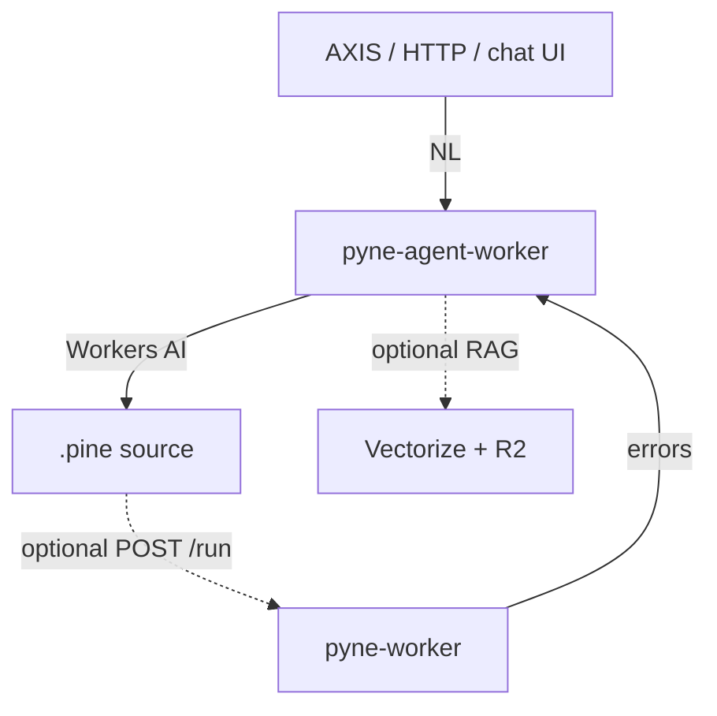

# Copyright (C) 2024-2026 jango_blockchained
#
# This file is part of pynescript.
#
# SPDX-License-Identifier: AGPL-3.0-or-later

---
title: "pyne-agent-worker"
description: "Natural-language PYNE Agent on Cloudflare Workers AI. Standalone chat, optional pyne-worker validate loop, AXIS plugin. Sister repo."
---

# pyne-agent-worker

## Abstract

**pyne-agent-worker** is the edge **authoring** host: natural language in, Pine source out. It is a **sister repository** — it does **not** live in this PYNE checkout.

| | |
| --- | --- |
| **Repo** | [hoox-sh/pyne-agent-worker](https://github.com/hoox-sh/pyne-agent-worker) |
| **Role** | Write scripts via chat (PYNE Agent) + optional RAG |
| **Runtime** | Cloudflare Workers (TypeScript) + Workers AI |
| **AXIS** | `GET /plugin/axis-pine-agent.js` |
| **In this repo?** | **No** |

You do **not** need [pyne-worker](/pyne/docs/pyne-worker), trade-worker, or the HOOX mesh to chat. The agent **writes** source. It does not import [PyneTS](/pyne/docs/pynets) and it does not run the bar-loop.

## Conceptual model

| Mode | Requirement | Behavior |
| --- | --- | --- |
| **Standalone** | AI binding (+ optional KB) | `POST /v1/chat` → Pine; validation skipped |
| **HOOX-enhanced** | + pyne-worker URL or service binding | generate → `POST /run` → fix retries |

`GET /health` reports `"mode": "standalone" | "hoox"`.

### Taxonomy

| Name | What it is |
| --- | --- |
| **PYNE** | Language SoT (this repo) |
| **[PyneTS](/pyne/docs/pynets)** | TypeScript **library** (`@hoox-sh/pynets`) — `parse` / `Runtime.run` |
| **[pyne-worker](/pyne/docs/pyne-worker)** | Python Cloudflare **evaluate** host |
| **pyne-agent-worker** | NL **authoring** host (this Worker) |

## Hard rule

This git tree **never** contains TradingView built-in Pine sources. Knowledge is operator-ingested into private R2 + Vectorize (`ingest:docs` / `ingest:corpus` / `ingest:builtins`). `scripts/legal-check.sh` refuses tracked `*.pine` on deploy.

## Relationship to PYNE

- PYNE remains the **evaluate** oracle. The agent **writes**.
- Optional validate uses the [evaluate contract](/pyne/docs/api/contract) against pyne-worker or the Pro API.
- AXIS install URL: `https://<pyne-agent-worker>/plugin/axis-pine-agent.js`

## Pages

- [Chat API](/pyne/docs/agent/chat)
- [Deploy](/pyne/docs/agent/deploy)

## See also

- [pyne-worker](/pyne/docs/pyne-worker)
- [PyneTS](/pyne/docs/pynets)
- [Evaluate contract](/pyne/docs/api/contract)
- [AXIS plugin](https://hoox.sh/axis/docs/plugins/pyne-agent)
- [Ecosystem](/pyne/docs/reference/ecosystem)
