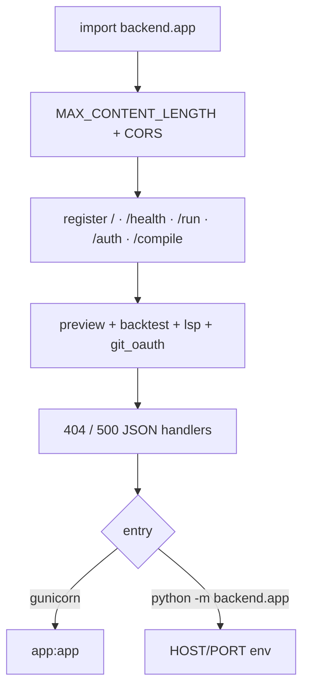

# Copyright (C) 2024-2026 jango_blockchained
#
# This file is part of pynescript.
#
# pynescript is free software: you can redistribute it and/or modify
# it under the terms of the GNU Affero General Public License as published by
# the Free Software Foundation, either version 3 of the License, or
# (at your option) any later version.
#
# pynescript is distributed in the hope that it will be useful,
# but WITHOUT ANY WARRANTY; without even the implied warranty of
# MERCHANTABILITY or FITNESS FOR A PARTICULAR PURPOSE.  See the
# GNU Affero General Public License for more details.
#
# You should have received a copy of the GNU Affero General Public License
# along with pynescript.  If not, see <https://www.gnu.org/licenses/>.
#
# SPDX-License-Identifier: AGPL-3.0-or-later

---
title: "App Lifecycle"
description: "Flask application setup: MAX_CONTENT_LENGTH, CORS policy, blueprints, error handlers, and process entry."
---

# App Lifecycle

## Abstract

`backend/app.py` constructs a single global `Flask` app, applies security-minded defaults (body size, CORS allowlist), registers free and Pro routes, and exposes a module `__main__` for local development. There is no multi-app factory pattern today — import `app` for WSGI (gunicorn) or run the module for the built-in server.

## Conceptual model



## Interface surface

### Process entry

```bash
make run
# equivalent
python -m backend.app
```

Environment:

| Variable | Default | Role |
| --- | --- | --- |
| `HOST` | `127.0.0.1` | Bind address (localhost-first for dev) |
| `PORT` | `5002` | Listen port |
| `ALLOWED_ORIGINS` | `https://pynescript.ai`, `https://app.pynescript.ai`, localhost regex | CORS origins (comma-separated; regex allowed). `*` / `any` opens all. Code **always appends** localhost, private-LAN, and product (`hoox.sh` / `pynescript.ai` / `pynescript-axis.pages.dev`) regexes unless the value is `*` |
| `API_KEY_STORE` | `/data/api_keys.json` | JSON key-store path (`auth.APIKeyStore` default) |
| `ADMIN_TOKEN` | unset | Fail-closed admin minting (see [auth](/pyne/docs/api/auth-and-keys)) |

`debug=False` always on the dev runner.

### Health

`GET /` and **`GET /health`** are the same handler. AXIS Settings probes `/health`. Payload includes compile-cache diagnostics:

```json
{
  "status": "healthy",
  "service": "pynescript-pro-api",
  "version": "1.0.0",
  "timestamp": 0,
  "websocket": true,
  "features": {
    "alerts": true,
    "alert_webhooks": true,
    "warm_compile": true,
    "default_run_mode": "auto"
  },
  "compile": {
    "has_numba": true,
    "disk_cache_enabled": true,
    "prewarm_enabled": true,
    "default_mode": "auto"
  },
  "endpoints": { "…": "…" }
}
```

`version` here is the **API service** label (`1.0.0`), not the `hoox-pyne` package version.

### Hard limits

- **`MAX_CONTENT_LENGTH = 5 * 1024 * 1024`** — reject oversized bodies before JSON parse fills memory (audit 2026-07-05 / S1).
- Free compute is optionally gated by `backend/middleware/free_limits.py` when `FREE_TIER_LIMITS` is truthy (default **off**): max bars (`FREE_MAX_BARS`, 5000), script chars (`FREE_MAX_SCRIPT_CHARS`, 256 KiB), per-IP rate (`FREE_RATE_LIMIT` / `FREE_RATE_WINDOW_SEC`, 60 / 60s), concurrency (`FREE_MAX_CONCURRENT`, 4). Chart/`mock` data sources only. Production compose sets `FREE_TIER_LIMITS=1`.
- CORS methods: `GET`, `POST`, `OPTIONS`, `HEAD`.
- Allow headers: `Content-Type`, `Authorization`, `X-Admin-Token`, `Accept`.
- `supports_credentials=False`.

Localhost regex used in the default origin list:

```text
^https?://(?:localhost|127\.0\.0\.1)(?::\d+)?$
```

**Free CORS prefixes** (`/`, `/health`, `/run`, `/compile`, `/lsp/`, `/ws/`) reflect the request `Origin` even when it is not in `ALLOWED_ORIGINS` so AXIS VPS UI → local pyne preflight succeeds.

Same-origin / no `Origin` header (curl, server-to-server) remains usable under flask-cors behavior.

### Blueprints

```python
app.register_blueprint(preview_bp)   # url_prefix=/preview
app.register_blueprint(backtest_bp)  # url_prefix=/backtest
app.register_blueprint(lsp_bp)       # url_prefix=/lsp
app.register_blueprint(git_oauth_bp) # /api/git/oauth/*
```

Preview + backtest live in `backend/api/preview.py`. Optional `flask-sock` registers `WS /ws/run` when installed.

### Error handlers

| Code | Body code | Message |
| --- | --- | --- |
| 404 | `NOT_FOUND` | `Endpoint {path} not found.` |
| 500 | `INTERNAL_ERROR` | `Internal server error.` |

Both return JSON with `status: "error"`.

## Internals

| Path | Role |
| --- | --- |
| `backend/app.py` | App object, free routes, auth routes, CORS, health |
| `backend/api/preview.py` | Pro preview + backtest blueprints |
| `backend/api/lsp_http.py` | Free AXIS LSP-HTTP |
| `backend/middleware/schemas.py` | Request validation for `/run*` and auth |
| `backend/middleware/free_limits.py` | Optional bar / script / rate / concurrency caps (`FREE_TIER_LIMITS`) |
| `backend/requirements.txt` | Flask, flask-cors, numpy, matplotlib, … |

Recommended production: gunicorn/uvicorn-class WSGI with multiple workers; for multi-worker key consistency prefer SQLite/Redis stores over the default in-memory/file singleton assumptions — see [auth](/pyne/docs/api/auth-and-keys).

## Invariants and edge cases

1. **Import side effects:** creating `app` configures CORS immediately from env.
2. **Body too large** → Flask 413 before route logic (not custom JSON).
3. **Unknown fields** on schema-validated routes → `UNKNOWN_FIELDS` 400 (`/run`, auth); preview routes currently use looser `get_json()` (schemas exist but are not always applied in handlers).
4. **Dev bind default is loopback** — set `HOST=0.0.0.0` only when intentional.

## Worked example — smoke test

```bash
curl -s http://127.0.0.1:5002/health | jq '.status, .features.default_run_mode'
# "healthy"
# "auto"
```

## Failure modes

| Symptom | Cause |
| --- | --- |
| Browser CORS errors | Origin not in `ALLOWED_ORIGINS` |
| 413 on large OHLCV | Exceeded 5 MB — downsample or paginate |
| Import errors for matplotlib | Missing backend deps — `pip install -r backend/requirements.txt` |

## See also

- [Auth and keys](/pyne/docs/api/auth-and-keys)
- [Run endpoint](/pyne/docs/api/endpoints/run)
- [Docker / CI](/pyne/docs/devops/docker)
