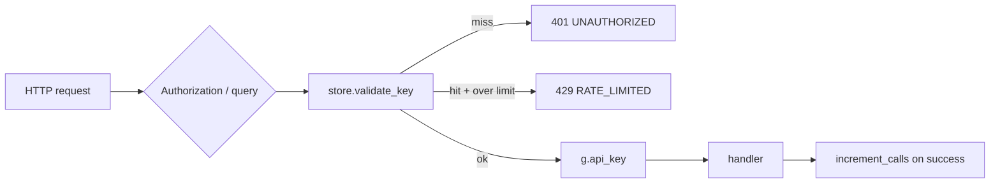

# Copyright (C) 2024-2026 jango_blockchained
#
# This file is part of pynescript.
#
# pynescript is free software: you can redistribute it and/or modify
# it under the terms of the GNU Affero General Public License as published by
# the Free Software Foundation, either version 3 of the License, or
# (at your option) any later version.
#
# pynescript is distributed in the hope that it will be useful,
# but WITHOUT ANY WARRANTY; without even the implied warranty of
# MERCHANTABILITY or FITNESS FOR A PARTICULAR PURPOSE.  See the
# GNU Affero General Public License for more details.
#
# You should have received a copy of the GNU Affero General Public License
# along with pynescript.  If not, see <https://www.gnu.org/licenses/>.
#
# SPDX-License-Identifier: AGPL-3.0-or-later

---
title: "Auth and Keys"
description: "API key model, tiers, require_api_key / track_usage decorators, JSON/SQLite/Redis stores, and admin create_key."
---

# Auth and Keys

## Abstract

Pro routes authenticate with a **raw API key** presented as `Authorization: Bearer …`, `Authorization: ApiKey …`, or `?api_key=`. Keys are minted as `pyn_` + url-safe secret, stored with a short `key_id` and SHA-256 hash metadata, and tracked against **monthly-ish call limits** by tier. Free `/run` does not require a key.

## Conceptual model



## Interface surface

### Tiers (`_TIER_LIMITS`)

| Tier | `calls_limit` |
| --- | --- |
| `free` | `0` (treated as unlimited in `is_rate_limited` — limit 0 means “no cap”) |
| `hobby` | 5 000 |
| `pro` | 50 000 |
| `team` | 200 000 |
| `enterprise` | `inf` |

`calls_remaining()` returns `inf` when limit is 0.

### Endpoints

#### `POST /auth/create_key`

Body schema `CREATE_KEY_SCHEMA`: optional `tier` (default `"hobby"`).

Response:

```json
{
  "status": "success",
  "api_key": "pyn_…",
  "key_id": "12hexchars",
  "tier": "hobby",
  "message": "Store this API key securely. It will not be shown again."
}
```

Decorated with `@require_admin_token`:

- Requires non-empty `ADMIN_TOKEN` env (unset → **403**, minting disabled)
- Client must send matching `X-Admin-Token` (or `Authorization: Bearer …` / `AdminToken …`)
- Comparison uses `hmac.compare_digest`

#### `GET /auth/usage`

`@require_api_key` — returns `key_id`, `tier`, and usage block (`calls_used`, `calls_limit`, `calls_remaining`, timestamps).

#### `POST /auth/validate`

Body: `{ "api_key": "…" }` — validates without incrementing usage. Returns tier info, `active`, `rate_limited`.

### Decorators

| Decorator | Behavior |
| --- | --- |
| `require_api_key` | Resolve key → 401 / 429 or set `g.api_key` |
| `track_usage` | Wraps `require_api_key`; increments calls when response status &lt; 400 (tuple responses) or always for bare Response |
| `require_admin_token` | Fail-closed admin gate (`ADMIN_TOKEN` + `X-Admin-Token`) |

### Client presentation

```bash
curl -H "Authorization: Bearer $API_KEY" \
  -H "Content-Type: application/json" \
  -d @body.json \
  http://127.0.0.1:5002/preview/chart
```

## Internals

### `APIKey` dataclass

Fields: `key_id`, `key_hash`, `tier`, `calls_used`, `calls_limit`, `created_at`, `last_used`.

Helpers: `is_active()` (always True today), `is_rate_limited()`, `get_tier_info()`, `increment_calls()`.

### Stores

| Module | Use |
| --- | --- |
| `middleware/auth.py` → `APIKeyStore` + `get_key_store()` | Facade; selects backend via `STORE_BACKEND` |
| `middleware/key_store_sqlite.py` | Hash-only rows, WAL, multi-worker friendly |
| `middleware/key_store_redis.py` | Hash-only Redis; multi-replica |

`get_key_store()` backends (`STORE_BACKEND`):

| Value | Persistence |
| --- | --- |
| `json` (default) | File at `API_KEY_STORE` (default `/data/api_keys.json`); **hash-only** object keys. Legacy files keyed by the raw `pyn_…` secret are migrated on load and the raw secret is dropped |
| `sqlite` | `API_KEY_STORE_SQLITE` (or `.db` beside JSON path); hash-only |
| `redis` | `REDIS_URL` required; hash-only |

Prod compose defaults to `sqlite` on `/data/api_keys.db` so gunicorn workers share state.

Key minting:

```text
raw_key = "pyn_" + secrets.token_urlsafe(32)
key_id  = sha256(raw_key).hexdigest()[:12]
key_hash = sha256(raw_key).hexdigest()
```

### Schemas

`CREATE_KEY_SCHEMA`, `VALIDATE_KEY_SCHEMA` in `middleware/schemas.py` — strict types, reject unknown fields.

## Invariants and edge cases

1. **`/run` is unauthenticated** — rate-limit at reverse proxy if exposed publicly.
2. **Limit 0 means unlimited**, not “zero calls” — free tier limit value is 0 with that semantics.
3. **Usage increments only after handler returns** — failed auth never bills; handler 4xx under `track_usage` skips increment when returned as `(response, status)`.
4. **Revocation** exists on the store API (`revoke_key`); no public HTTP revoke route in `app.py`.
5. **Admin minting is fail-closed** — unset `ADMIN_TOKEN` or wrong `X-Admin-Token` → 403.

## Worked example

```bash
# create (requires ADMIN_TOKEN env + matching header)
export ADMIN_TOKEN=change-me
curl -s -X POST http://127.0.0.1:5002/auth/create_key \
  -H "X-Admin-Token: $ADMIN_TOKEN" \
  -H 'Content-Type: application/json' \
  -d '{"tier":"hobby"}'

# validate
curl -s -X POST http://127.0.0.1:5002/auth/validate \
  -H 'Content-Type: application/json' \
  -d '{"api_key":"pyn_…"}'
```

## Failure modes

| Code | Meaning |
| --- | --- |
| `UNAUTHORIZED` | Missing/invalid key |
| `RATE_LIMITED` | `calls_used >= calls_limit` (finite limits) |
| `FORBIDDEN` | `ADMIN_TOKEN` unset or `X-Admin-Token` mismatch (fail-closed) |
| `INVALID_TIER` | create_key with unknown tier string |
| `INVALID_KEY` | validate endpoint miss |

## See also

- [App lifecycle](/pyne/docs/api/app-lifecycle)
- [Preview](/pyne/docs/api/endpoints/preview)
- [Security (DevOps)](/pyne/docs/devops/security)
