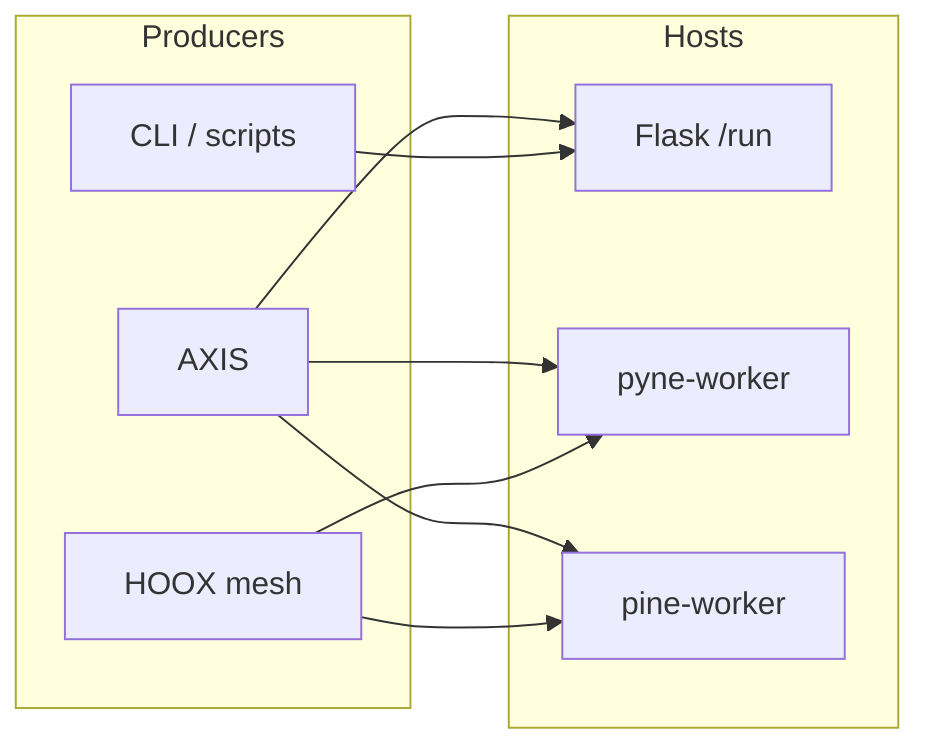

# Copyright (C) 2024-2026 jango_blockchained
#
# This file is part of pynescript.
#
# pynescript is free software: you can redistribute it and/or modify
# it under the terms of the GNU Affero General Public License as published by
# the Free Software Foundation, either version 3 of the License, or
# (at your option) any later version.
#
# pynescript is distributed in the hope that it will be useful,
# but WITHOUT ANY WARRANTY; without even the implied warranty of
# MERCHANTABILITY or FITNESS FOR A PARTICULAR PURPOSE.  See the
# GNU Affero General Public License for more details.
#
# You should have received a copy of the GNU Affero General Public License
# along with pynescript.  If not, see <https://www.gnu.org/licenses/>.
#
# SPDX-License-Identifier: AGPL-3.0-or-later

---
title: "Evaluate Contract"
description: "Shared request/response evaluate contract across Flask Pro API, pyne-worker, and pine-worker."
---

# Evaluate Contract

## Abstract

The **evaluate contract** is the JSON dialect that lets AXIS, HOOX, CLI tools, and edge workers call *any* PYNE-compatible host interchangeably. Flask `POST /run` is the reference implementation; Python **pyne-worker** and TypeScript **pine-worker** aim for the same fields even when transport (Worker `fetch`, queue, etc.) differs.

This page freezes the semantic envelope — not transport auth headers.

## Conceptual model



**Invariant:** given the same script + OHLCV + mode, hosts should agree on plot series and strategy events within known parity limits (see [numerical validation](/pyne/docs/reference/numerical-validation) and pine-worker testing).

## Interface surface

### Request (single evaluate)

| Field | Type | Required | Description |
| --- | --- | --- | --- |
| `script` | string | yes | Full Pine source |
| `data` | `Bar[]` | yes | Chronological OHLCV |
| `symbol` | string | no | Default `CHART` / host-specific |
| `mode` | `"interpret"` \| `"compile"` | no | Default interpret |
| `data_source` | string | no | Optional external history provider id |
| `data_options` | object | no | Provider configuration |

#### `Bar`

| Field | Type | Required | Notes |
| --- | --- | --- | --- |
| `time` | number | recommended | Unix ms preferred |
| `open` | number | yes | |
| `high` | number | yes | |
| `low` | number | yes | |
| `close` | number | yes | |
| `volume` | number | no | Default host-dependent |
| `bid` / `ask` | number | no | Runtime bid/ask hooks |

### Response (success)

| Field | Type | Description |
| --- | --- | --- |
| `status` | `"success"` | Flask sets this; workers may omit and use HTTP 200 only — **prefer including it** |
| `plots` | `(number\|null)[]` | Primary series (plot 0) |
| `series` | `Record<string, (number\|null)[]>` | Named multi-series |
| `plot_meta` | `Record<string, PlotMeta>` | Display metadata |
| `events` | `StrategyEvent[]` | Strategy / trade-like events |
| `drawings` | `Drawing[]` | line/label/box export |
| `alerts` | `AlertEvent[]` | `alert()` / true `alertcondition()` firings (interpret) |
| `alert_conditions` | object[] | optional condition evaluations |
| `alert_forward` | object | optional L2 webhook delivery summary |
| `count` | number | Bars evaluated |
| `script_id` | string | Stable hash prefix of source |
| `run_id` | string | Per-invocation id |
| `mode` | string | Echo effective mode |
| `data_source` | string | Flask echo of resolved source label |

#### `PlotMeta` (Flask)

```json
{ "title": "C", "color": "#2196F3", "linewidth": 1, "index": 0 }
```

#### `StrategyEvent` (minimum)

Hosts should preserve:

```json
{
  "type": "string",
  "bar_index": 0,
  "script_id": "…",
  "run_id": "…"
}
```

Additional fields follow evaluator `to_dict()` / TS port parity — treat unknown keys as forward-compatible.

#### `AlertEvent` (minimum)

```json
{
  "message": "string",
  "freq": "once_per_bar",
  "bar_index": 0,
  "time": 0,
  "source": "alert",
  "script_id": "…",
  "run_id": "…"
}
```

See [Alerts](/pyne/docs/runtime/alerts) for frequency rules and webhooks.

### Response (failure)

Flask `/run`:

```json
{
  "status": "error",
  "code": "EXECUTION_ERROR",
  "message": "Runtime Error at bar …"
}
```

Workers may use equivalent `{ error: string }` or HTTP 4xx/5xx with message body. Clients should accept:

1. Envelope `status === "error"` with `message`, or
2. Presence of top-level `error` string (raw `Runtime.run` shape).

### Batch evaluate (Flask extension)

`POST /run/batch`:

**Request:** `scripts: (string | {id, script})[]` (max 8) + shared `data` + same optional fields as single run.

**Response:**

```json
{
  "status": "success" | "partial",
  "results": [ /* per-script success or error object with id */ ],
  "count": 0,
  "ok": 0,
  "data_source": "chart"
}
```

Workers may implement batch as N single evaluates; AXIS should not assume batch exists on every host.

## Internals — reference mapping

| Contract field | Flask source |
| --- | --- |
| `plots` / `series` / `plot_meta` | `Runtime.run` packing loop |
| `events` | `evaluator._strategy_state.drain_events()` → `to_dict()` |
| `drawings` | `DrawingRegistry.export_for_api` |
| `alerts` | `export_alerts_from_evaluator` (interpret) |
| `alert_forward` | `backend/alert_forwarder.maybe_forward_run_alerts` |
| `script_id` | `sha256(source)[:16]` |
| `run_id` | `Runtime._run_id` |

Schema enforcement on Flask free tier: `RUN_SCHEMA` / `RUN_BATCH_SCHEMA` in `backend/middleware/schemas.py` (strict, reject extras). Webhook fields: `webhook_url`, `forward_alerts`, `alert_last_bar`, `alert_batch`.

Tests: `tests/test_backend.py` (`test_run_success`, `test_run_exports_alerts`, webhook cases), `tests/test_alert_forwarder.py`.

## Divergences to remember

| Surface | Divergence |
| --- | --- |
| Preview / backtest | Columnar `data` dict, not `Bar[]`; not the evaluate contract |
| Compile mode | Extra keys `object_mode`, `generated_code` may appear |
| Auth | Flask free `/run` open; workers may require HOOX mTLS / API gateways |
| Error codes | Flask uses `code` enums; workers should map to stable strings when possible |

## Invariants and edge cases

1. **Bar order is chronological ascending** — hosts do not sort for you.
2. **`na` / missing** appear as JSON `null` in series arrays.
3. **Duplicate plot titles** get suffixes (`_2`, …) on Flask; clients should key on returned map keys, not assumed titles.
4. **Idempotent script_id** for identical source text across hosts.
5. **run_id is not stable** across retries — use for log correlation only.
6. Parity is best-effort on floating edges; pin fixtures when testing hosts against each other.

## Worked example — host-agnostic client sketch

```typescript
type EvaluateRequest = {
  script: string;
  data: Array<{
    time: number;
    open: number;
    high: number;
    low: number;
    close: number;
    volume?: number;
  }>;
  symbol?: string;
  mode?: "interpret" | "compile";
};

type EvaluateSuccess = {
  plots: Array<number | null>;
  series: Record<string, Array<number | null>>;
  events: Array<Record<string, unknown>>;
  drawings: Array<Record<string, unknown>>;
  count: number;
  script_id: string;
  run_id: string;
  mode: string;
};
```

POST that body to Flask `/run` or the worker’s evaluate route; branch on `status` / `error`.

## Failure modes

| Client bug | Symptom |
| --- | --- |
| Sending columnar preview data to `/run` | Schema `data must be a list` |
| Assuming batch on worker | 404 / unknown field |
| Ignoring `series` and only reading `plots` | Multi-plot scripts look single-series |

## See also

- [Run endpoint](/pyne/docs/api/endpoints/run)
- [Runtime bridge](/pyne/docs/api/runtime-bridge)
- [pine-worker](/pyne/docs/pine-worker)
- [Pro API usage (end user)](/pyne/docs/enduser/guides/pro-api-usage)
- [Events](/pyne/docs/runtime/events)
